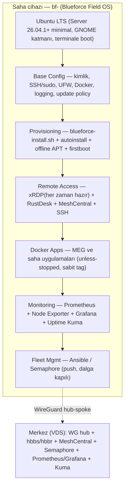
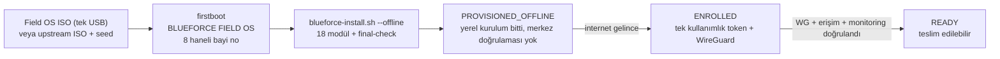

# Blueforce Field OS

> Ubuntu LTS tabanlı,
> 700 endüstriyel saha bilgisayarı için,
> offline kurulabilen,
> merkezden yönetilebilen,
> onaysız update yapmayan,
> çoklu uzak erişim kanallı
> **saha işletim sistemi standardı**.

%100 ücretsiz / self-hosted Linux filo mimarisi: başka bir DevOps mühendisinin sıfırdan kurabileceği doküman setinin ve çalışan iskeletin ana reposu. Dokümanlar Türkçedir; komut, dosya, servis ve terim adları İngilizce kalır.

## Field OS Nedir?

Blueforce Field OS, AdBlue saha otomasyonundaki ~700 Windows mini PC'yi lisans maliyeti olmayan, merkezi yönetilebilir ve kesintisiz çalışan bir Linux filosuna taşıyan **standarttır**. Üç katmanı vardır:

1. **Zemin (OS standardı)** — Ubuntu Server 26.04.1+ LTS minimal kurulum, maintain edilen GNOME katmanı, terminale boot (`multi-user.target`), `unattended-upgrades` kapalı.
2. **Provisioning (kurulum standardı)** — tek `blueforce-install.sh` kurucu + autoinstall/NoCloud + sürümlü offline APT snapshot + firstboot; hepsi tek USB `Blueforce-Field-OS-<version>-amd64.iso` içinde paketlenebilir (assisted: operatör disk onayı verir, otomatik disk silme yoktur).
3. **İşletme (filo standardı)** — WireGuard hub-spoke, 4 uzak erişim kanalı, Docker/MEG uygulamaları, Prometheus + Grafana + Uptime Kuma izleme, Ansible + Semaphore filo yönetimi ve onay kapılı güncelleme dalgaları (`LAB(2) → P1(5) → P2(20) → W1(50) → W2(100) → PROD(~523)`).

Öncelik sırası: **kesintisiz çalışma > veri kaybı yok > uzaktan erişim > bakım kolaylığı.**

## Katman Mimarisi



| Katman | İçerik | Kilit karar | Doküman |
|---|---|---|---|
| Ubuntu LTS | Ubuntu Server 26.04.1+ minimal, GNOME, `multi-user.target` | K-01, K-02, K-03 | [`03`](docs/03-UBUNTU-BASELINE.md) |
| Base Config | `BF-<no>`/`bf-<no>` kimliği, SSH (anahtar zorunlu), UFW, Docker politikası, journald/log rotasyonu, otomatik update yasağı | K-10, K-11, K-12, K-13, K-14 | [`02`](docs/02-DEVICE-NAMING-AND-INVENTORY.md), [`06`](docs/06-USERS-SSH-AND-PERMISSIONS.md), [`11`](docs/11-SECURITY-HARDENING.md), [`12`](docs/12-DOCKER-OPERATIONS.md), [`15`](docs/15-LOGGING.md) |
| Provisioning | `blueforce-install.sh` (18 modül, `--check`), autoinstall + NoCloud seed, offline APT repo, firstboot, Field OS ISO | K-09, K-15, K-16, K-20 | [`04`](docs/04-GOLDEN-IMAGE-AND-PROVISIONING.md), [`05`](docs/05-ONE-CLICK-INSTALLER.md), [`26`](docs/26-BLUEFORCE-FIELD-OS-ISO.md), [`27`](docs/27-OFFLINE-PROVISIONING.md) |
| Remote Access | xRDP (her zaman hazır) + RustDesk OSS self-hosted + MeshCentral + SSH-over-WireGuard = 4 kanal | K-04, K-05, K-22 | [`07`](docs/07-REMOTE-ACCESS.md), [`08`](docs/08-WIREGUARD-AND-NETWORK.md) |
| MEG | Windows'tan taşınan MEG uygulaması ve kabul kriterleri | K-19 | [`13`](docs/13-MEG-LINUX-ACCEPTANCE.md), [`28`](docs/28-WINDOWS-TO-LINUX-MIGRATION.md) |
| Docker Apps | Saha konteynerleri: `unless-stopped`, sabit tag, rotasyonlu log, `127.0.0.1` bind | K-10 | [`12`](docs/12-DOCKER-OPERATIONS.md) |
| Monitoring | Prometheus + Node Exporter + Grafana OSS (17 metrik) + Uptime Kuma "last seen" | K-07, K-14 | [`14`](docs/14-MONITORING-AND-HEALTH.md) |
| Fleet Mgmt | Ansible CLI (birincil) + Semaphore UI Community (operatör arayüzü), 15 standart işlem | K-06, K-11 | [`09`](docs/09-FLEET-MANAGEMENT.md), [`10`](docs/10-UPDATE-AND-ROLLBACK-POLICY.md) |

## Kurulum Akışı (özet)



1. **Medya** — F2B'den itibaren tek USB: `Blueforce-Field-OS-<version>-amd64.iso` (autoinstall + offline APT repo + firstboot içinde). Geri dönüş yolu: resmi Ubuntu Server ISO + NoCloud seed USB.
2. **Kurulum** — Autoinstall çalışır; **storage adımı operatör onayı bekler, otomatik disk silme yoktur** (`interactive-sections: [storage]`). İnternet yoksa kurulum yerel snapshot'tan tamamlanır.
3. **firstboot** — Terminal wizard 8 haneli bayi noyu alır, `blueforce-install.sh --offline` çağırır; sonuç `bf-status` ile görünür.
4. **Durum kapısı** — Kurulum sonucu `PROVISIONED_OFFLINE`'dır; `ENROLLED` tek kullanımlık token ile, `READY` ise merkezi WireGuard/erişim/monitoring doğrulamasıyla alınır. `READY` tek durum değildir, "kuruldu" demek değildir.
5. **Sürüm izi** — `bf-release` cihazın Field OS sürüm kimliğini `/etc/blueforce-release` (veya `/etc/blueforce/release-manifest.yaml`) üzerinden okur; skeleton manifest `UNAPPROVED_SKELETON` döner ve dağıtılabilir release sayılmaz.

### Medya tabanı sapması (kayıtlı, gizlenmemiş)

Kanonik baseline **Ubuntu Server 26.04.1+ LTS**'tir. Build host'ta SHA256'sı doğrulanmış tek kurulum medyası Ubuntu **Desktop** ISO olduğu için (build hiçbir şey indirmez), üretilen ilk ISO **Desktop tabanlıdır**:

| Konu | Durum |
|---|---|
| Hedef işletim sistemi | Değişmedi: `ubuntu-server` + `ubuntu-desktop-minimal` + GNOME, `multi-user.target` |
| Üretilen medya tabanı | `ubuntu-26.04.1-desktop-amd64.iso`, `base_flavor: desktop` |
| Kayıt yeri | `dist/1.0.0-manifest.yaml` → `baseline_deviation` (gerekçe, etki, gereken karar, `lab_required: true`) |
| Avantaj | GNOME zaten medyada; masaüstü katmanı için ek kurulum adımı gerekmez |
| Gereken karar | LAB için Desktop tabanını kabul et **veya** üretim öncesi Server ISO ile yeniden üret (`--upstream-iso` ile tek parametre) |

Boot kabulü (UEFI/Legacy/Secure Boot) ve air-gapped kurulum henüz doğrulanmadı; bu medya **release değil, LAB artefaktıdır** (`release_status: lab-artifact`).

## 700 Cihaz Özeti

| Konu | Özet |
|---|---|
| Cihaz sayısı | ~700 saha PC'si (bayi/istasyon yanında) |
| Cihaz kimliği | 8 haneli bayi no → Device ID `BF-<no>`, hostname `bf-<no>` (ör. `BF-12010193` / `bf-12010193`). Tüm sistemlerde aynı ID kullanılır. |
| Hedef OS | Ubuntu Server 26.04.1+ LTS + GNOME katmanı (`bf-gui-on/off` yalnız **yerel fiziksel** GUI'yi kontrol eder) |
| Üretilen medya tabanı | **Desktop flavour** (bkz. aşağıdaki sapma notu) — `dist/Blueforce-Field-OS-1.0.0-amd64.iso`, manifest `baseline_deviation` bloğu |
| Ağ | Turkcell modem arkası, CGNAT/NAT varsayımı; merkezle bağlantı WireGuard tüneli üzerinden |
| Uzaktan erişim | 4 kanal: RustDesk OSS self-hosted (hbbs/hbbr), SSH-over-WireGuard, xRDP + GNOME (WG arkasında, her zaman hazır), MeshCentral |
| Kurulum medyası | Tek USB Field OS ISO (assisted; otomatik disk silme yok); yedek yol upstream ISO + NoCloud seed USB |
| Durum modeli | `PROVISIONED_OFFLINE → ENROLLED → READY` (READY = merkezi kanıt) |
| Filo yönetimi | Ansible CLI + Semaphore UI Community (MIT, $0) |
| İzleme | Prometheus/Node Exporter/Grafana OSS + Uptime Kuma |
| Güncelleme politikası | **Onaysız update yasak** (apt, release upgrade, Docker image, MEG dahil). Rollout: LAB(2) → PILOT-1(5) → PILOT-2(20) → WAVE-1(50) → WAVE-2(100) → PRODUCTION |
| Masaüstü kararı | GNOME baseline (K-02); LAB'da GNOME vs XFCE A/B ölçümü yapılır, revizyon yalnız ölçüm verisiyle (K-23) |
| Doküman dili | Türkçe; komut, dosya, servis ve terim adları İngilizce kalır |

## Doküman Haritası (33 numaralı doküman + şablon)

Tüm numaralı dokümanlar `docs/` altındadır ve `docs/_TEMPLATE.md` şablonuna uyar (her dokümanda §1–§13 sırası ve en az bir Mermaid diyagramı vardır).

| No | Dosya | Konu |
|---|---|---|
| 00 | `00-MASTER-PLAN.md` | Genel plan, fazlar, kapsam |
| 01 | `01-ARCHITECTURE.md` | Uçtan uca mimari |
| 02 | `02-DEVICE-NAMING-AND-INVENTORY.md` | `BF-<no>` / `bf-<no>` isimlendirme ve envanter |
| 03 | `03-UBUNTU-BASELINE.md` | Ubuntu taban kurulum, GNOME, `bf-gui-*` |
| 04 | `04-GOLDEN-IMAGE-AND-PROVISIONING.md` | Golden image ve ilk kurulum |
| 05 | `05-ONE-CLICK-INSTALLER.md` | Tek-tık kurucu (`blueforce-install.sh`) |
| 06 | `06-USERS-SSH-AND-PERMISSIONS.md` | Kullanıcılar, SSH, yetkiler |
| 07 | `07-REMOTE-ACCESS.md` | RustDesk + SSH + RDP + MeshCentral erişim yolları |
| 08 | `08-WIREGUARD-AND-NETWORK.md` | WireGuard ve ağ |
| 09 | `09-FLEET-MANAGEMENT.md` | Ansible/Semaphore filo yönetimi |
| 10 | `10-UPDATE-AND-ROLLBACK-POLICY.md` | Güncelleme ve geri alma politikası |
| 11 | `11-SECURITY-HARDENING.md` | Güvenlik sertleştirme |
| 12 | `12-DOCKER-OPERATIONS.md` | Docker işletimi |
| 13 | `13-MEG-LINUX-ACCEPTANCE.md` | MEG Linux kabul kriterleri |
| 14 | `14-MONITORING-AND-HEALTH.md` | İzleme ve sağlık |
| 15 | `15-LOGGING.md` | Log toplama ve saklama |
| 16 | `16-POWER-LOSS-AND-AUTO-RECOVERY.md` | Elektrik kesintisi ve otomatik kurtarma |
| 17 | `17-BACKUP-RECOVERY-AND-REINSTALL.md` | Yedekleme, kurtarma, yeniden kurulum |
| 18 | `18-PILOT-AND-700-DEVICE-ROLLOUT.md` | Pilot ve 700 cihaz rollout |
| 19 | `19-TROUBLESHOOTING.md` | Sorun giderme |
| 20 | `20-FIELD-TECHNICIAN-RUNBOOK.md` | Saha teknisyeni runbook |
| 21 | `21-CENTRAL-ADMIN-RUNBOOK.md` | Merkezi yönetici runbook |
| 22 | `22-DOCUMENTATION-PLATFORM.md` | Doküman platformu (Docusaurus) |
| 23 | `23-SECURITY-AND-LICENSE-AUDIT.md` | Güvenlik ve lisans denetimi |
| 24 | `24-DECISION-LOG.md` | Karar günlüğü — **kilit kaynak** (K-01…K-24, kaynak URL + sürüm + tarih) |
| 25 | `25-IMPLEMENTATION-ROADMAP.md` | Uygulama yol haritası (F0…F6, F2A/F2B) |
| 26 | `26-BLUEFORCE-FIELD-OS-ISO.md` | Field OS ISO ve kurulum medyası |
| 27 | `27-OFFLINE-PROVISIONING.md` | Çevrimdışı provision ve durum kapısı |
| 28 | `28-WINDOWS-TO-LINUX-MIGRATION.md` | Windows yedekli geçiş ve geri dönüş |
| 29 | `29-DEVICE-ENROLLMENT.md` | Cihaz enrollment ve READY doğrulaması |
| 30 | `30-FIELD-OS-RELEASE-MANAGEMENT.md` | Field OS release, manifest ve rollback |
| 31 | `31-LEARNING-GUIDE.md` | Field OS öğrenme rehberi (LAB pratiği) |
| 32 | `32-REPOSITORY-AUDIT-AND-CONFLICTS.md` | Depo denetimi, çelişki raporu ve giderim durumu |

Şablon: `docs/_TEMPLATE.md` (siteye alınmaz). Karar günlüğü: `docs/24-DECISION-LOG.md`. Özet ve soru-cevap: `SUMMARY.md`.

## Repo Yapısı

```
.
├── README.md
├── SUMMARY.md                # Yönetici özeti, 37 soru-cevap, FREE bileşen listesi
├── IMPLEMENTATION-REPORT.md   # Uygulama raporu (ne yapıldı / hangi testler geçti / LAB bekleyenler)
├── docs/                     # 33 numaralı doküman (00–32) + _TEMPLATE.md
├── provisioning/             # Field OS medya üretimi
│   ├── autoinstall/          #   autoinstall.yaml + user-data + meta-data (interactive storage)
│   ├── iso/                  #   ISO doğrulama + build-blueforce-iso.sh (+ test-iso.sh)
│   ├── offline-repo/         #   offline APT repo üretici + paket manifest/pinleri
│   ├── firstboot/            #   bf-firstboot (+ systemd unit)
│   ├── enrollment/           #   enrollment request/response JSON şemaları
│   └── release/              #   immutable release manifesti
├── scripts/
│   ├── install/              # blueforce-install.sh + installer/modules/01..18
│   ├── diagnostics/          # bf-status, bf-diagnostics, bf-support-bundle, bf-enroll, bf-check-*, bf-release, bf-remote-status
│   ├── maintenance/          # bf-gui-on / bf-gui-off
│   ├── migration/windows/    # Windows envanter ve veri dışa aktarma (PowerShell)
│   └── recovery/             # kurtarma scriptleri
├── ansible/                  # inventory, 16 playbook, 4 rol (dalga grupları pilot_1/wave_1)
├── config/                   # ssh, wireguard, firewall, docker, systemd, ufw
├── monitoring/               # Prometheus + Grafana + Uptime Kuma config ve panoları
├── rustdesk/                 # hbbs/hbbr self-hosted config
├── docs-site/                # Docusaurus iskeleti (numaralı dokümanları senkronlar)
├── tests/                    # 7 doğrulama scripti + QEMU/LAB test planı
└── research/                 # kaynak doğrulama notları (URL + sürüm + tarih)
```

## Geliştirici ve Bakımcı

Kurulum komutları (geliştirme ortamı):

```bash
# 1) Doğrulama testleri (repo kökünde, hepsi mock/statik; gerçek cihaz gerekmez)
tests/run-all.sh                     # hepsini sırayla koşar, çıkış kodlarını toplar (önerilen)
tests/check-specs.sh                 # doküman seti, bölüm sırası, Mermaid, playbook/rol ve güvenlik sözleşmeleri
tests/check-provisioning-static.sh   # autoinstall/seed/ISO statik denetimleri
tests/check-offline-repo-static.sh   # offline APT pin/biçim sözleşmesi (UNPINNED sentinel yasağı)
tests/check-migration-static.sh      # Windows geçiş araçları: mutasyon/credential yok denetimi
tests/check-ansible-static.sh        # playbook dalga/kapsam kapıları, report-only update denetimi
tests/check-configs.sh               # YAML/JSON/bash sözdizimi
tests/test-field-os-lifecycle.sh     # durum makinesi + enrollment + release kapıları (mock)
tests/test-firstboot-static.sh       # firstboot wizard + installer bayrak sözleşmesi

# 2026-09-16 anlık görüntüsü: `tests/run-all.sh` → 8/8 PASS, exit code 0.
# Bu testler statiktir/mock'tur; gerçek ISO boot, gerçek Windows cihaz veya merkezi
# endpoint gerektirmez. LAB gerektiren maddeler IMPLEMENTATION-REPORT.md §7'dedir.

# ISO build (konteynerde çalıştırılabilir; xorriso gerekir)
# ./provisioning/iso/build-blueforce-iso.sh \
#   --upstream-iso /path/ubuntu-26.04.1-desktop-amd64.iso \
#   --checksum-file provisioning/iso/ubuntu-26.04.1-SHA256SUMS

# 2) Docusaurus sitesini yerelde derle
docs-site/sync-docs.sh && (cd docs-site && npm ci && npm run build)

# 3) Kurucu kuru koşu (mutasyonsuz)
sudo scripts/install/blueforce-install.sh --dealer-id 12010193 --check
```

Katkı kuralları (bu repo için bağlayıcı):

- **Doküman dili Türkçe**; komut/dosya/servis adları İngilizce. Yeni doküman eklerken `docs/_TEMPLATE.md` yapısını koru: `## 1.` … `## 13.` sırası zorunlu, ek bölümler `## Ek:` başlığıyla; her numaralı dokümanda en az bir Mermaid bloğu olmalı (bunları `tests/check-specs.sh` denetler).
- **Numaralandırma:** `docs/[0-9][0-9]-*.md`; mevcut numara yeniden kullanılmaz. Karar günlüğünde kararlar **append-only**'dir (K-01…K-24); var olan karar silinmez, yeni numara eklenir, değişiklik `24-DECISION-LOG.md` PR'ından yapılır.
- **Yetki sınırı:** Dokümanlar `docs/` içinden yazılır; `docs-site/` elle düzenlenmez (senkron scripti üretir, `_TEMPLATE.md` siteye alınmaz).
- **Secret yasağı:** Repoda, seed/ISO/manifest/support bundle içinde parola, private key, token veya cihaz-spesifik kimlik bulunmaz. Cihaz kimliği (`bf-<no>`) imajda değil, ilk açılışta enjekte edilir.
- **Güvenlik kilitleri (kod ve test seviyesinde):** `interactive-sections: [storage]` (otomatik disk silme yok), `unattended-upgrades` kapalı, `latest`/Watchtower yasak, `unless-stopped` zorunlu, Docker portları `127.0.0.1`'e bağlı, `bf-gui-off` xRDP'i asla durdurmaz. Bu sözleşmeleri bozan değişiklik testlerden geçemez.
- **Offline disiplini:** `blueforce-install.sh --offline` yalnız yerel `file:` APT kaynağını kullanır; uzak indirme yapmaz. Offline repo manifestlerinde somut `package=version` pinleri yoksa build kasıtlı olarak durur (`OFFLINE BLOCKED`) — pinleri onaylanmış paketlerle doldurmadan offline kurulum "tamam" sayılmaz.
- **Commit disiplini:** Bu çalışma ağacı bilinçli olarak commit edilmemiştir; değişiklikler review + release manifesti (K-18/K-24) üzerinden ilerler. Onaysız update yasağı yalnız cihazlar için değil, release hattı için de geçerlidir.

Maliyet kuralı:

- Hedef **%100 ücretsiz / self-hosted**'dir.
- Ücretli veya lisans kısıtlı her araç dokümanda açıkça işaretlenir ve **ücretsiz alternatifi** ile birlikte verilir.
- Varsayıma dayalı lisans kararı verilmez; resmi kaynak (resmi docs, GitHub, fiyat sayfası) URL + sürüm + tarih ile kaydedilir.
- Örnek: AnyDesk kararı resmi kaynaktan doğrulanmadan yazılmaz.

İsimlendirme örneği — bayi no `12010193` için:

- Device ID: `BF-12010193`, hostname: `bf-12010193`
- WireGuard peer adı, RustDesk ID etiketi, Ansible inventory adı, monitoring etiketi: hepsi aynı ID.

## Durum

| FAZ | İçerik | Durum |
|---|---|---|
| F0 | Windows + donanım keşfi | [ ] |
| F1 | Merkez altyapı | [ ] |
| F2A | Blueforce bootstrap stabilizasyon | [ ] |
| F2B | Assisted Offline Field ISO | [ ] |
| F3 | LAB (2 cihaz) | [ ] |
| F4 | P1-P2-W1-W2 dalgaları | [ ] |
| F5 | Production rollout (~523) | [ ] |
| F6 | Gerçek zero-touch PXE (ayrı FAZ) | [ ] |

Repo iskeleti ve uygulama katmanı hazırdır: 33 numaralı doküman, `blueforce-install.sh` + 18 modül, provisioning katmanı (ISO builder, autoinstall, offline-repo sözleşmesi, firstboot, enrollment, release), 21 Ansible playbook + 4 rol, config/monitoring/rustdesk dosyaları ve 8 doğrulama testi bu repodadır. **Field OS kurulum medyası üretilmiştir:** `dist/Blueforce-Field-OS-1.0.0-amd64.iso` (6 481 917 952 byte, SHA256 `cb0cc56f0442fbd1418e0d0f35521522f4ec9aa3f203779a67e96d587d431296`), El Torito BIOS+UEFI korunmuş, `interactive-sections: [storage]` ile operatör disk onayı zorunlu, kimlik/secret gömülü değil. Henüz **hiçbir şey sahaya sürülmedi**: gerçek offline paket deposu yok (pinler `UNPINNED`, `.deb` havuzu boş), merkezi enrollment endpoint'i yok, boot kabulü (UEFI/Legacy/Secure Boot), air-gapped kurulum ve LAB kanıtları alınmadı. Güncel durum, madde madde giderim kaydı ve açık işler [`docs/32`](docs/32-REPOSITORY-AUDIT-AND-CONFLICTS.md) ve [`IMPLEMENTATION-REPORT.md`](IMPLEMENTATION-REPORT.md) içindedir. Sıradaki adımlar [`docs/25`](docs/25-IMPLEMENTATION-ROADMAP.md) yol haritasındadır; sahaya çıkış için önce F2B (offline paket seti + boot kabulü) ve F3 (LAB) kapıları kapanmalıdır.
