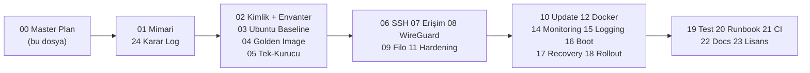

# 00 — Ana Plan (Master Plan)

> Kısa özet: 700 cihazlık Blueforce Linux filosunun uçtan uca planı: hangi doküman neyi kapsar, fazlar nasıl ilerler, tüm işler hangi kararlara dayanır. Projeye yeni katılan herkes önce bu dosyayı okur.

- Dosya: `docs/00-MASTER-PLAN.md`
- İlgili kararlar: `24-DECISION-LOG.md#K-01…K-14` (tüm fazlar bu kararlara dayanır)
- Durum: [x] Onaylı (Faz 2 kilidi)

---

## 1. Amaç

700 saha PC'sinin Ubuntu tabanlı standardize filoya dönüşümünü tek planda toplamak: kapsam, fazlar, doküman haritası ve başarı kriterleri. Parça işlerin (imaj, kurucu, ağ, filo, monitoring) birbirine nasıl bağlandığı bu dosyadan izlenir.

## 2. Kapsam

- Kapsam içi: faz planı (LAB → PİLOT → WAVE → PROD), doküman haritası (00…24), karar bağımlılıkları (K-01…K-14), dalga boyutları ve kapı kriterleri.
- Kapsam dışı: kurulum komutları (03/04/05), playbook ve metrik detayları (09/14), VDS kurulum adımları (07/08) — ilgili dokümanlara havale.

## 3. Kararlar

```text
KARAR:    Proje Faz 2'de kilitlenen 14 karara (K-01…K-14) göre yürütülür; karar değişikliği yalnızca 24-DECISION-LOG PR'ı ile yapılır.
GEREKÇE:  700 cihazda tutarlılığın tek dayanağı yazılı karardır; her doküman kararlara linklenir, varsayıma dayalı seçim bırakılmaz.
ALTERNATİF: Doküman başına bağımsız karar — çelişki ve tekrara yol açtığı için elendi.
RİSK:     Karar kilidi gelişmeyi yavaşlatabilir; azaltma: LAB/PİLOT bulguları PR ile hızlı işletilir.
MALİYET:  Ücretsiz (süreç kararı).
LİSANS:   Yok (yöntem kararı).
```

```text
KARAR:    Dağıtım dalgaları: LAB(2) → PİLOT-1(5) → PİLOT-2(20) → WAVE-1(50) → WAVE-2(100) → PROD (kalan ~523).
GEREKÇE:  Onaysız update yasağı (K-11) gereği her değişiklik küçük dalgada kanıtlanmadan büyüğe geçmez; blast-radius üstten sınırlanır.
ALTERNATİF: Tek seferde tüm filo — tek hatanın 700 cihaza yayılması nedeniyle elendi.
RİSK:     Dalga disiplini atlanırsa hata büyür; azaltma: Semaphore'da onay adımı + 10-UPDATE kapı kriterleri.
MALİYET:  Ücretsiz.
LİSANS:   Yok.
```

## 4. Neden Bu Karar?

Öncelik sırası (kesintisiz çalışma > veri kaybı yok > uzaktan erişim > bakım kolaylığı) planı şekillendirdi. Tüm kararlarda üç filtre uygulandı: (1) %100 ücretsiz/self-hosted, (2) sadelik (K8s, gereksiz agent/DB/cloud yok), (3) onaysız update yasağı. 700 ölçeğinde her küçük varsayılan filo-çapı arızaya dönüşür; fazlar bu çarpanı küçültür.

## 5. Alternatifler

| Alternatif | Artı | Eksi | Sonuç |
|---|---|---|---|
| Big-bang dağıtım | Hızlı | Tek hata = 700 cihaz arızası | Elendi |
| K8s-orkestrasyonlu saha | Esnek ölçek | 700 mini PC'de gereksiz yük | Elendi |
| Cloud-merkezli yönetim | Hızlı kurulum | Kota/lisans maliyeti, veri egemenliği | Elendi |

## 6. Avantajlar

- Tek kimlik (`BF-<no>`/`bf-<no>`) tüm katmanlarda join anahtarı — envanterden monitoring'e aynı ad.
- Her fazın giriş/çıkış kriteri yazılı; "hazır" demek ölçülebilir.
- Hiçbir faz ücretli lisansa dayanmaz (FREE sürümler baz).

## 7. Dezavantajlar

- Faz disiplini ilk kurulumu yavaşlatır (LAB+PİLOT ölçümleri beklenir).
- Merkez servis sayısı ilk kurulumda tek VDS'e sığsa da yük testinden geçmeli (sahibi: 25-ROADMAP).

## 8. Riskler

| Risk | Olasılık | Etki | Azaltma |
|---|---|---|---|
| Faz atlanarak sahaya çıkılması | Orta | Yüksek | Kapı kriterleri + Semaphore onay adımı |
| Merkez VDS kesintisi | Düşük | Yüksek | Hızlı yeniden kurulum + yedek VDS planı (17) |
| Heterojen donanımda imaj kırılması | Orta | Orta | Envanter taraması + LAB profil testi (04) |

## 9. Uygulama Planı

1. Faz 1 (Zemin): karar kilidi (24) + mimari (01) + bu plan — tamamlandı.
2. Faz 2 (İmaj+Kurucu): 02-03-04-05 dokümanları + `blueforce-install.sh` + LAB(2) imaj testi.
3. Faz 3 (Merkez): WireGuard hub → hbbs/hbbr → MeshCentral → Semaphore → Prometheus/Grafana/Kuma (07/08/09/14).
4. Faz 4 (PİLOT): P1(5)+P2(20) cihazda 7/24 sayaçlar (kopma, log hacmi, metrik kardinalitesi).
5. Faz 5 (WAVE+PROD): W1(50) → W2(100) → PROD (~523), her dalgada 10-UPDATE onay zinciri.

```bash
# kapı örneği: LAB'dan P1'e geçiş koşulu
./scripts/install/blueforce-install.sh --check  # exit 0 olmadan dalga büyümez
```

## 10. Test Planı

| Test | Beklenen sonuç | Ortam |
|---|---|---|
| Her dokümanın karar linkleri | Tüm karar blokları 24'teki K-no'ya bağlı | Repo CI (markdown-link-check) |
| LAB(2) uçtan uca akış | Erişim + boot + update zinciri çalışır | LAB(2) |
| Dalga kapı kriterleri | Kriter sağlanmadan sonraki dalga açılmaz | P1/P2/W1/W2 |

## 11. Rollback

1. Plan değişikliği 24-DECISION-LOG PR'ı ile yapılır; bağımlı dokümanlar aynı PR'da güncellenir.
2. Sahaya sürülmüş dalga hatalıysa 10-UPDATE rollback zinciri işletilir.
3. Son çare: karar öncesi imaj sürümüne dönüş (17-RECOVERY LEVEL 9).

## 12. Kontrol Listesi

- [ ] 14 kararın her biri ≥1 dokümana ve faza bağlı.
- [ ] Dalga boyutları tüm dokümanlarda tutarlı (2/5/20/50/100/~523).
- [ ] FREE sürüm kuralı tüm fazlarda korunuyor.
- [ ] `SUMMARY.md` Faz 4'te 27 soru → karar izlenebilirliğiyle üretilecek.

## 13. Açık Sorular

- [ ] Merkez servislerin tek VDS'e sığıp sığmadığı — LAB yük testi (sahibi: 25-ROADMAP).
- [ ] Faz takviminin bayi rollout kapasitesine göre netleşmesi (sahibi: 18-ROLLOUT).

---

## Ek: Doküman Haritası



| Doküman | Konu | Dayandığı karar |
|---|---|---|
| 01 | Sistem mimarisi | K-01…K-14 |
| 02 | Cihaz adlandırma + envanter | K-12 |
| 03 | Ubuntu baseline | K-01, K-02, K-03, K-11 |
| 04 | Golden image + provisioning | K-09 |
| 05 | Tek-tık kurucu | K-09, K-11, K-12 |
| 06–09 | SSH, erişim, WireGuard, filo | K-13, K-04, K-05, K-06 |
| 10–12 | Update, hardening, Docker | K-11, K-10 |
| 13–16 | MEG, monitoring, logging, boot | K-02, K-07, K-14, K-03 |
| 17–18 | Recovery, rollout | K-04, K-09 |
| 19–23 | Test, runbook, CI, docs, lisans | K-08 + tümü |
| 24 | Karar günlüğü | Kilit kaynak |
