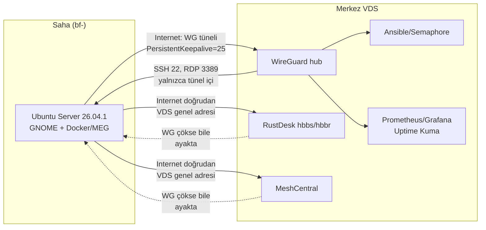
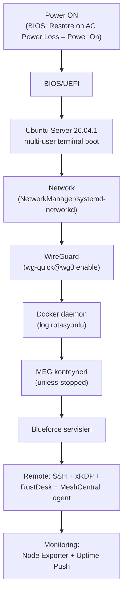
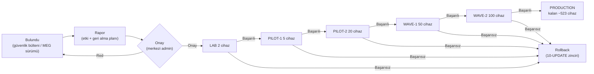

# 01 — Sistem Mimarisi

> Kısa özet: 700 saha cihazlı Blueforce filosunun uçtan uca mimarisi: saha PC'si, WireGuard ağı, 4 erişim kanalı, filo otomasyonu, monitoring ve update zinciri tek bakışta. Kararların görsel karşılığıdır.
>
> - Dosya: `docs/01-ARCHITECTURE.md`
> - İlgili kararlar: `24-DECISION-LOG.md#K-01…K-14` (tüm mimari bu kararlara dayanır)
> - Durum: [x] Onaylı (Faz 2 kilidi)

---

## 1. Amaç

Başka bir DevOps mühendisinin filoyu tek dosyadan anlayıp kurmaya başlayabilmesi: hangi bileşen nerede koşar, trafik nasıl akar, cihaz nasıl boot eder, update nasıl yayılır.

## 2. Kapsam

- Kapsam içi: saha cihazı katmanları, merkez (VDS) servisleri, ağ/erişim akışı, boot zinciri, update onay akışı.
- Kapsam dışı: kurulum komutları (03/04/05), playbook detayları (09), metrik listesi detayı (14) — ilgili dokümanlara havale.

## 3. Kararlar

```text
KARAR:    Filo mimarisi: saha = Ubuntu Server 26.04.1+ GNOME + Docker(MEG) + WireGuard spoke; merkez = WireGuard hub + RustDesk hbbs/hbbr + MeshCentral + Ansible/Semaphore + Prometheus/Grafana + Uptime Kuma (hepsi self-hosted, ücretsiz katman).
GEREKÇE:  24-DECISION-LOG K-01…K-08'in birleşimi; hareketli parça en aza indirildi (agent'sız filo, tek Go binary UI, tek konteyner uptime), iki WireGuard-bağımsız erişim kanalıyla tek-nokta körlüğü engellendi.
ALTERNATİF: K8s-tabanlı yönetim / Cloud-merkezli monitoring — sadelik kuralını bozduğu için elendi (bkz. 24 §4).
RİSK:     Merkez VDS tek fiziksel nokta; azaltma: yedekleme + hızlı yeniden kurulum (17-RECOVERY), kritik kanalların ayrı VDS'e taşınabilirliği.
MALİYET:  Ücretsiz (lisans $0; VDS kira bedeli altyapı maliyetidir).
LİSANS:   Bileşen lisansları için 24-DECISION-LOG Ek A'ya bakılır.
```

## 4. Neden Bu Karar?

Öncelik sırası (kesintisiz çalışma > veri kaybı yok > uzaktan erişim > bakım kolaylığı) mimariyi şekillendirdi: boot zinciri her katmanda otomatik toparlanır (systemd + `unless-stopped` + `wg-quick` enable), erişim 4 kanalla yedeklenir (ikisi WireGuard-bağımsız), update'ler onay zincirinden geçmeden sahaya inmez. Hiçbir katman ücretli lisansa dayanmaz.

## 5. Alternatifler

| Alternatif | Artı | Eksi | Sonuç |
|---|---|---|---|
| Tek kanal (yalnızca SSH) | En sade | Tünel çökerse körlük | Elendi |
| Cloud monitoring (Netdata Cloud vb.) | Hızlı kurulum | 5 node free kotası, 700 cihaz ücretli | Elendi |
| K8s-orkestrasyonlu saha | Ölçek esnekliği | 700 mini PC'de gereksiz yük | Elendi |

## 6. Avantajlar

- Tek kimlik (`BF-<no>`/`bf-<no>`) tüm katmanlarda join anahtarı — envanterden monitoring'e aynı ad.
- Her akış (erişim/boot/update) diyagramla sabit; runbook'lar bu diyagramlara prosedür yazar.

## 7. Dezavantajlar

- Merkez servis sayısı (hub + 2 erişim + fleet + 2 monitoring + docs) ilk kurulumda tek VDS'e sığsa da yük testinden geçmeli.
- Diyagramlar sözleşmedir: bileşen değişirse 3 Mermaid de aynı PR'da güncellenmeli.

## 8. Riskler

| Risk | Olasılık | Etki | Azaltma |
|---|---|---|---|
| Merkez VDS kesintisi | Düşük | Yüksek | Hızlı yeniden kurulum + yedek VDS planı (17) |
| Boot zincirinde race (Docker WG'den önce kalkar) | Orta | Orta | systemd bağımlılıkları + After= kuralları (16) |
| Onaysız update zinciri bypass eder | Düşük | Yüksek | K-11 kilitleri + Semaphore'da onay adımı (10) |

## 9. Uygulama Planı

1. Merkez VDS: WireGuard hub → hbbs/hbbr → MeshCentral → Semaphore → Prometheus/Grafana/Kuma sırasıyla kurulur.
2. Saha imajı: Ubuntu Server → GNOME → Docker → WireGuard spoke → RustDesk/MeshCentral agent → Node Exporter.
3. İlk 2 LAB cihazı bu mimariye göre uca eklenir, 3 akış (erişim/boot/update) testlenir.

```bash
# örnek: cihaz kimliği standardı (K-12)
hostnamectl set-hostname bf-12010193
```

## 10. Test Planı

| Test | Beklenen sonuç | Ortam |
|---|---|---|
| 3 Mermaid'deki her ok için bağlantı testi | Uçtan uca akış çalışır | LAB(2) |
| VDS down simülasyonu (hbbs kapalı) | SSH-over-WG + MeshCentral ayakta | P1(5) |
| Güç kesintisi simülasyonu | Boot zinciri sırayla toparlanır | LAB(2) |

## 11. Rollback

Mimari değişikliği 24-DECISION-LOG PR'ı ile yapılır; bu dosyanın diyagramları aynı PR'da güncellenir. Yanlış bileşen seçimi sahaya yayılmadan LAB'da geri alınır (10-UPDATE rollback zinciri).

## 12. Kontrol Listesi

- [ ] 3 Mermaid bloğu render oluyor (Docusaurus + GitHub preview).
- [ ] Her bileşen adının kararı 24'te var (K-01…K-14).
- [ ] `bf-<no>` / `BF-<no>` adlandırması diyagramlarda tutarlı.

## 13. Açık Sorular

- [ ] Merkez servislerin tek VDS'e sığıp sığmadığı — LAB yük testi (sahibi: 25-ROADMAP).
- [ ] Prometheus federasyonu gerekip gerekmediği — 700 node ölçümü (sahibi: 14-MONITORING).

---

## Ek: Mermaid — 1. Erişim ve yönetim akışı (Internet → WireGuard → SSH/RDP/Mgmt)



## Ek: Mermaid — 2. Power boot zinciri



## Ek: Mermaid — 3. Update onay akışı


