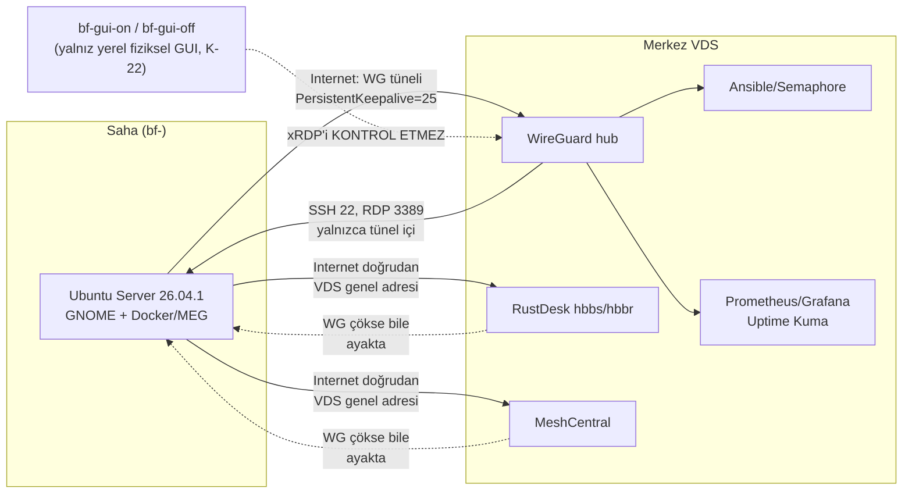
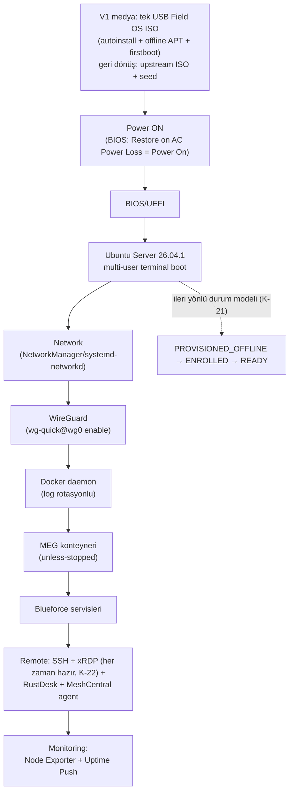
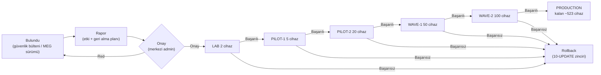

# 01 — Sistem Mimarisi

> Kısa özet: 700 saha cihazlı Blueforce filosunun uçtan uca mimarisi: saha PC'si, WireGuard ağı, 4 erişim kanalı, filo otomasyonu, monitoring ve update zinciri tek bakışta. Kararların görsel karşılığıdır. Bu turda mimari iki noktada kesinleşti: **V1 medyası tek USB Field OS ISO'dur** (autoinstall motoru + offline APT + firstboot; upstream ISO + NoCloud seed geri dönüş yolu — K-20) ve **xRDP her zaman hazırdır** (`bf-gui-*` yalnız yerel fiziksel GUI'yi kontrol eder — K-22).
>
> - Dosya: `docs/01-ARCHITECTURE.md`
> - İlgili kararlar: `24-DECISION-LOG.md#K-01…K-24` (tüm mimari bu kararlara dayanır; medya için `#K-20`, RDP/yerel GUI ayrımı için `#K-22`, durum modeli için `#K-21`, masaüstü ölçümü için `#K-23`)
> - Durum: [x] Onaylı (Faz 2 kilidi)

---

## 1. Amaç

Başka bir DevOps mühendisinin filoyu tek dosyadan anlayıp kurmaya başlayabilmesi: hangi bileşen nerede koşar, trafik nasıl akar, cihaz nasıl boot eder, update nasıl yayılır.

## 2. Kapsam

- Kapsam içi: saha cihazı katmanları, merkez (VDS) servisleri, ağ/erişim akışı, boot zinciri, update onay akışı.
- Kapsam dışı: kurulum komutları (03/04/05), playbook detayları (09), metrik listesi detayı (14) — ilgili dokümanlara havale.

## 3. Kararlar

```text
KARAR:    Filo mimarisi: saha = Ubuntu Server 26.04.1+ üzerinde GNOME katmanlı Blueforce Field OS + Docker(MEG) + WireGuard spoke; V1 medya = TEK USB Field OS ISO (medya kökünde autoinstall.yaml + offline APT repo + firstboot; otomatik disk silme yok), geri dönüş yolu = upstream Ubuntu ISO + NoCloud seed USB; merkez = WireGuard hub + RustDesk hbbs/hbbr + MeshCentral + Ansible/Semaphore + Prometheus/Grafana + Uptime Kuma (hepsi self-hosted, ücretsiz katman). xRDP servisi her zaman hazır (`bf-gui-*` yalnız yerel fiziksel GUI'yi yönetir); durum modeli tek yönlüdür: PROVISIONED_OFFLINE → ENROLLED → READY.
GEREKÇE:  K-01…K-24 kararlarının birleşimi; hareketli parça en aza indirildi (agent'sız filo, tek Go binary UI, tek konteyner uptime), iki WireGuard-bağımsız erişim kanalıyla tek-nokta körlüğü engellendi. Tek medya teknisyen hatasını azaltır, otomatik disk silme yasağı (interactive storage) veri kaybını önler; xRDP'nin `bf-gui-on`'dan bağımsız olması yerel GUI kapalı cihazda uzaktan kurtarmayı korur.
ALTERNATİF: K8s-tabanlı yönetim / Cloud-merkezli monitoring — sadelik kuralını bozduğu için elendi (bkz. 24 §4). İki medyalı kurulum (upstream ISO + seed) — tek-medya deneyimi olmadığı için V1 yolu olmaktan çıktı, geri dönüş yolu olarak kaldı (K-20).
RİSK:     Merkez VDS tek fiziksel nokta; azaltma: yedekleme + hızlı yeniden kurulum (17-RECOVERY), kritik kanalların ayrı VDS'e taşınabilirliği. Remaster medya boot zinciri kanıtlanmazsa assisted akış bloke olur; azaltma: iki medyalı geri dönüş yolu sıcak tutulur.
MALİYET:  Ücretsiz (lisans $0; VDS kira bedeli altyapı maliyetidir).
LİSANS:   Bileşen lisansları için 24-DECISION-LOG Ek A'ya bakılır.
```

> **Güncelleme (2026-09-16):** Bu bölümdeki "V1 medya = upstream ISO + ayrı NoCloud seed USB" ifadesi K-20 ile güncellendi (V1 = tek USB Field OS ISO; upstream + seed = geri dönüş yolu). §9'daki saha imajı akışı ve §12 kontrol listesi aynı PR'da hizalandı; diyagramlar bu kararlarla uyumludur.

## 4. Neden Bu Karar?

Öncelik sırası (kesintisiz çalışma > veri kaybı yok > uzaktan erişim > bakım kolaylığı) mimariyi şekillendirdi: boot zinciri her katmanda otomatik toparlanır (systemd + `unless-stopped` + `wg-quick` enable), erişim 4 kanalla yedeklenir (ikisi WireGuard-bağımsız), update'ler onay zincirinden geçmeden sahaya inmez. Hiçbir katman ücretli lisansa dayanmaz.

## 5. Alternatifler

| Alternatif | Artı | Eksi | Sonuç |
|---|---|---|---|
| Tek kanal (yalnızca SSH) | En sade | Tünel çökerse körlük | Elendi |
| Cloud monitoring (Netdata Cloud vb.) | Hızlı kurulum | 5 node free kotası, 700 cihaz ücretli | Elendi |
| K8s-orkestrasyonlu saha | Ölçek esnekliği | 700 mini PC'de gereksiz yük | Elendi |

## 6. Avantajlar

- Tek kimlik (`BF-<no>`/`bf-<no>`) tüm katmanlarda join anahtarı — envanterden monitoring'e aynı ad.
- Her akış (erişim/boot/update) diyagramla sabit; runbook'lar bu diyagramlara prosedür yazar.

## 7. Dezavantajlar

- Merkez servis sayısı (hub + 2 erişim + fleet + 2 monitoring + docs) ilk kurulumda tek VDS'e sığsa da yük testinden geçmeli.
- Diyagramlar sözleşmedir: bileşen değişirse 3 Mermaid de aynı PR'da güncellenmeli.

## 8. Riskler

| Risk | Olasılık | Etki | Azaltma |
|---|---|---|---|
| Merkez VDS kesintisi | Düşük | Yüksek | Hızlı yeniden kurulum + yedek VDS planı (17) |
| Boot zincirinde race (Docker WG'den önce kalkar) | Orta | Orta | systemd bağımlılıkları + After= kuralları (16) |
| Onaysız update zinciri bypass eder | Düşük | Yüksek | K-11 kilitleri + Semaphore'da onay adımı (10) |

## 9. Uygulama Planı

1. Merkez VDS: WireGuard hub → hbbs/hbbr → MeshCentral → Semaphore → Prometheus/Grafana/Kuma sırasıyla kurulur.
2. Saha imajı: Field OS V1 = tek USB Field OS ISO (autoinstall motoru + offline APT repo + firstboot; `interactive-sections: [storage]` ile diski operatör onaylar) → GNOME → Docker → WireGuard spoke → RustDesk/MeshCentral agent → Node Exporter; offline tamamlanırsa durum `PROVISIONED_OFFLINE`, yalnız enrollment ve merkezi kanal doğrulamasından sonra `READY` (26–29). Medya boot etmezse upstream ISO + NoCloud seed yolu devreye girer (K-20).
3. İlk 2 LAB cihazı bu mimariye göre uca eklenir; 3 akış (erişim/boot/update) + GNOME vs XFCE A/B ölçümü (K-23) testlenir.

```bash
# örnek: cihaz kimliği standardı (K-12)
hostnamectl set-hostname bf-12010193
```

## 10. Test Planı

| Test | Beklenen sonuç | Ortam |
|---|---|---|
| 3 Mermaid'deki her ok için bağlantı testi | Uçtan uca akış çalışır | LAB(2) |
| VDS down simülasyonu (hbbs kapalı) | SSH-over-WG + MeshCentral ayakta | P1(5) |
| Güç kesintisi simülasyonu | Boot zinciri sırayla toparlanır | LAB(2) |
| `bf-gui-off` sonrası erişim | xRDP her zaman hazır, uzaktan grafik kurtarma çalışır (K-22) | LAB(2) |
| Tek-USB Field OS ISO ile kurulum | Assisted kurulum, operatör disk onayı, `PROVISIONED_OFFLINE` (K-20) | LAB(2) UEFI+Legacy |

## 11. Rollback

Mimari değişikliği 24-DECISION-LOG PR'ı ile yapılır; bu dosyanın diyagramları aynı PR'da güncellenir. Yanlış bileşen seçimi sahaya yayılmadan LAB'da geri alınır (10-UPDATE rollback zinciri).

## 12. Kontrol Listesi

- [ ] 3 Mermaid bloğu render oluyor (Docusaurus + GitHub preview).
- [ ] Her bileşen adının kararı 24'te var (K-01…K-24).
- [ ] `bf-<no>` / `BF-<no>` adlandırması diyagramlarda tutarlı.
- [ ] Medya (tek USB Field OS ISO + geri dönüş yolu), RDP'nin her-zaman-hazır olması ve tek yönlü durum modeli diyagramlarla uyumlu (K-20/K-21/K-22).

## 13. Açık Sorular

- [ ] Merkez servislerin tek VDS'e sığıp sığmadığı — LAB yük testi (sahibi: 25-ROADMAP).
- [ ] Prometheus federasyonu gerekip gerekmediği — 700 node ölçümü (sahibi: 14-MONITORING).
- [ ] Field OS ISO boot zincirinin (UEFI/Legacy/Secure Boot) LAB kanıtı ve medya tabanı kararı (Desktop flavour) — F2B (sahibi: release yöneticisi) [K-20].

---

## Ek: Mermaid — 1. Erişim ve yönetim akışı (Internet → WireGuard → SSH/RDP/Mgmt)



## Ek: Mermaid — 2. Power boot zinciri



## Ek: Mermaid — 3. Update onay akışı


