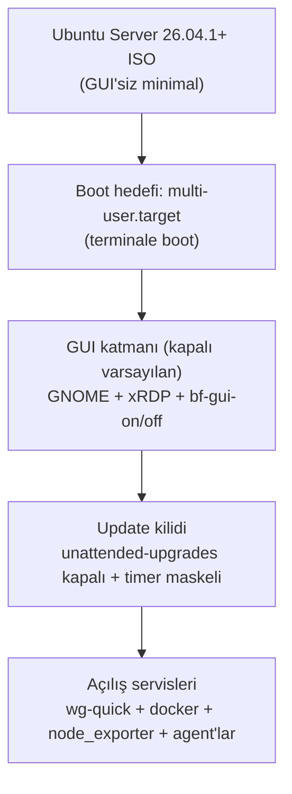

# 03 — Ubuntu Baseline

> Kısa özet: Saha PC'lerinin standart zemini: Ubuntu Server 26.04.1+ LTS minimal kurulum, GNOME sonradan eklenir, terminale boot edilir, `unattended-upgrades` kapalıdır. BIOS güç-kurtarma ayarı ve GUI aç/kapa anahtarları bu dosyadadır.

- Dosya: `docs/03-UBUNTU-BASELINE.md`
- İlgili kararlar: `24-DECISION-LOG.md#K-01` (OS/sürüm), `K-02` (GNOME), `K-03` (boot + bf-gui), `K-11` (otomatik update kapalı)
- Durum: [ ] Taslak

---

## 1. Amaç

Her saha PC'sinin aynı minimal zeminden başlamasını garanti etmek: hangi ISO, hangi masaüstü, hangi boot hedefi, hangi servisler açık/kapalı. Bu zemin 04'teki imajın ve 05'teki kurucunun varsayımıdır.

## 2. Kapsam

- Kapsam içi: ISO seçimi, BIOS güç-kurtarma ayarı, boot hedefi (multi-user), GUI katmanı (GNOME + xRDP + `bf-gui-*`), `unattended-upgrades` kapatma, açılışta koşan servis listesi.
- Kapsam dışı: imaj üretim yöntemi (04), kurucu modül detayları (05), WireGuard/SSH sertleştirme (06/08/11).

## 3. Kararlar

```text
KARAR:    Saha standardı Ubuntu Server 26.04.1+ LTS'tir (GUI'siz minimal kurulum; GNOME sonradan eklenir).
GEREKÇE:  26.04.1 LTS resmi indirme sayfasında yayında (kod adı Resolute Raccoon); Server ISO'su varsayılan olarak GUI kurmaz, minimal zemin + ihtiyaca göre GUI standart yoldur. Noktasürüm (.1+) baz alınır çünkü ilk .0 dalgasındaki kurulumcu hataları genelde .1'de toplanır.
ALTERNATİF: Ubuntu 24.04 LTS — 26.04 doğrulanamasaydı yedekti; doğrulandığı için yedekte bekler. Ubuntu Desktop 26.04 (6 GB RAM şartı) saha bütçesini zorladığı için elendi.
RİSK:     26.04.x noktasürümlerinde donanım sürücü farkı; azaltma: golden image LAB(2)'de her saha donanım profilinde test edilir.
MALİYET:  Ücretsiz.
LİSANS:   Ubuntu LTS ücretsiz (ESM kapsamına bel bağlanmaz) — https://releases.ubuntu.com/ (26.04.1, doğrulanma: 2026-09-15) + https://ubuntu.com/download/desktop (sistem gereksinimi, doğrulanma: 2026-09-15).
```

```text
KARAR:    Saha masaüstü ortamı GNOME'dur (Ubuntu Desktop standardı); XFCE elendi.
GEREKÇE:  Kullanıcı kararı + Ubuntu Desktop standardı: tanıdık modern masaüstü, teknisyen akışıyla birebir uyum.
ALTERNATİF: XFCE — hafif ve düşük kaynak tüketimine rağmen kullanıcı kararıyla elendi; yedekte tutulmaz.
RİSK:     xRDP+GNOME kombinasyonu ek ayar isteyebilir (uyarı: GNOME oturumu RDP'de ek yapılandırma gerektirebilir); azaltma: 13-MEG-LINUX-ACCEPTANCE testi GNOME üzerinde koşar, `bf-gui-*` LAB'da 26.04.1 imajında doğrulanmadan dondurulmaz.
MALİYET:  Ücretsiz.
LİSANS:   GNOME (GPL/LGPL bileşenler), ücretsiz — https://www.gnome.org/ (doğrulanma: 2026-09-15).
```

```text
KARAR:    Cihazlar terminale (multi-user) boot eder; grafik katman `bf-gui-on` / `bf-gui-off` ile systemd üzerinden açılıp kapatılır.
GEREKÇE:  xRDP mimarisi oturum yöneticisi (sesman) + systemd servis birimleri (`xrdp`, `xrdp-sesman`) üzerine kuruludur; GUI, display-manager + xRDP servisleri üzerinden yönetilebilir bir katman olarak modellenir. Varsayılan kapalı GUI = düşük RAM, düşük saldırı yüzeyi, öngörülebilir boot.
ALTERNATİF: Her zaman grafik boot — kaynak israfı ve 700 cihazda gereksiz hata yüzeyi nedeniyle elendi.
RİSK:     Kesin birim adları ve GNOME oturum başlatma satırı 26.04.1'e göre değişebilir; azaltma: LAB'da 26.04.1 imajında doğrulanmadan `bf-gui-*` dondurulmaz.
MALİYET:  Ücretsiz.
LİSANS:   xRDP Apache-2.0, ücretsiz — https://github.com/neutrinolabs/xrdp (v0.10.6.1, 2026-07-07; doğrulanma: 2026-09-15).
```

```text
KARAR:    Golden image'da `unattended-upgrades` kapatılır (`/etc/apt/apt.conf.d/20auto-upgrades` değerleri `0` + `apt-daily*.timer` maskeleme).
GEREKÇE:  `unattended-upgrades` Ubuntu Server'da varsayılan kurulu ve etkindir, günde bir kez çalışır; kapatılmazsa 700 cihaz ilk açılışta güncellemeye kalkar ("onaysız update yasak" ilkesi delinir).
ALTERNATİF: Otomatik security update'e izin verme — eşzamanlı indirme + onaysız değişim riski nedeniyle elendi.
RİSK:     Kapatma adımı imajda atlanırsa filo kendiliğinden güncellenir; azaltma: kurucu final-check + monitoring metriği.
MALİYET:  Ücretsiz.
LİSANS:   Yok (OS yapılandırması) — https://ubuntu.com/server/docs/how-to/software/automatic-updates/ (doğrulanma: 2026-09-15).
```

## 4. Neden Bu Karar?

Server minimal kurulum + sonradan GNOME (Ubuntu Desktop standardı, kullanıcı kararı). Terminale boot, 700 cihazın varsayılan durumunu en öngörülebilir hale getirir; grafik yalnızca bakım penceresinde açılır. Otomatik update'in kapatılması, update zincirinin (10-UPDATE) "onay olmadan değişim yok" ilkesinin teknik kilididir.

## 5. Alternatifler

| Alternatif | Artı | Eksi | Sonuç |
|---|---|---|---|
| Ubuntu 24.04 LTS | Olgun donanım desteği | Daha kısa destek penceresi | Yedek |
| Ubuntu Desktop 26.04 | Tek adımda GUI | 6 GB RAM şartı, şişkin zemin | Elendi |
| XFCE | Hafif, düşük kaynak | Kullanıcı kararıyla elendi (saha standardı GNOME) | Elendi |
| Her zaman grafik boot | Teknisyen rahatlığı | Kaynak israfı, geniş hata yüzeyi | Elendi |

## 6. Avantajlar

- Minimal zemin = küçük imaj, hızlı kurulum, az saldırı yüzeyi.
- Kapalı GUI varsayılanı = düşük RAM + öngörülebilir boot 700 cihazda çarpan etkisi yapar.
- Kapalı otomatik update = filo sürüm determinizmi.

## 7. Dezavantajlar

- GNOME oturum başlatma satırı ve display-manager birim adları 26.04.1'e göre LAB'da doğrulanmadan dondurulamaz.
- Teknisyen grafik istediğinde ek komut (`bf-gui-on`) gerekir — runbook'a işlenir.

## 8. Riskler

| Risk | Olasılık | Etki | Azaltma |
|---|---|---|---|
| 26.04.x sürücü farkı heterojen donanımda | Orta | Orta | LAB profil testi (04) |
| `bf-gui-*` birim adları 26.04.1'de farklı | Orta | Düşük | LAB doğrulaması, §13 açık soru |
| `unattended-upgrades` açık unutulur | Orta | Yüksek | final-check + monitoring metriği |

## 9. Uygulama Planı

1. BIOS ayarı (her saha PC'sinde, elektrik kesintisi sonrası otomatik açılış için):
   - `Restore on AC Power Loss = Power On` (üretici menüsünde `After Power Loss: Power On` / `AC Recovery: Power On` adlarıyla da geçer; teknisyen imaj öncesi menüden doğrular).
2. Ubuntu Server 26.04.1+ minimal kurulum (GUI seçilmez).
3. Boot hedefi terminale sabitlenir:

```bash
sudo systemctl set-default multi-user.target
systemctl get-default   # multi-user.target beklenir
```

4. GNOME + xRDP katmanı kurulur (kurucu 05 üzerinden):

```bash
sudo apt install -y ubuntu-desktop-minimal xrdp
sudo systemctl enable xrdp xrdp-sesman
# GNOME oturumu varsayılan yapılır (LAB'da 26.04.1'e göre doğrulanacak satır):
echo "gnome-session" > ~/.xsession
```

5. GUI aç/kapa anahtarları (kurucu tarafından `/usr/local/bin/` altına yazılır):

```bash
sudo bf-gui-on    # display-manager + xrdp/xrdp-sesman başlatılır, RDP oturumu açılır
sudo bf-gui-off   # grafik katman durdurulur, cihaz terminale döner
```

6. Otomatik update kapatılır:

```bash
# /etc/apt/apt.conf.d/20auto-upgrades içinde her iki değer 0:
# APT::Periodic::Update-Package-Lists "0";
# APT::Periodic::Unattended-Upgrade "0";
sudo systemctl mask apt-daily.timer apt-daily-upgrade.timer
```

7. Açılışta koşması beklenen servisler (final-check bunları denetler): `NetworkManager` (veya `systemd-networkd`), `wg-quick@wg0`, `docker`, `xrdp`+`xrdp-sesman` (yalnızca GUI-açık modda), `node_exporter`, RustDesk/MeshCentral agent, `bf-health-push.timer`.

## 10. Test Planı

| Test | Beklenen sonuç | Ortam |
|---|---|---|
| `get-default` | `multi-user.target` | LAB(2) |
| Güç kesintisi simülasyonu | BIOS ayarı ile cihaz kendiliğinden açılır | LAB(2) |
| `bf-gui-on/off` sonrası RDP | GNOME oturumu açılır/kapanır | LAB(2) |
| `20auto-upgrades` değerleri `0`, timer'lar maskeli | Otomatik apt çalışmaz | LAB(2) imaj denetimi |

## 11. Rollback

1. Yanlış boot hedefi: `sudo systemctl set-default multi-user.target` ile geri alınır.
2. Bozuk GNOME/xRDP katmanı: `bf-gui-off` + paket yeniden kurulumu; son çare imajdan yeniden kurulum (04).
3. Otomatik update yanlışlıkla açıldıysa §9 adım 6 yeniden uygulanır, `apt-daily*` timer durumu denetlenir.

## 12. Kontrol Listesi

- [ ] ISO sürümü 26.04.1+ (LAB'da `lsb_release -a` çıktısı kayıtlı).
- [ ] BIOS `Restore on AC Power Loss = Power On` her profilde doğrulandı.
- [ ] `get-default` = `multi-user.target`.
- [ ] `bf-gui-on/off` LAB 26.04.1 imajında test edildi.
- [ ] `unattended-upgrades` kapalı + timer'lar maskeli.

## 13. Açık Sorular

- [ ] GNOME oturum başlatma satırı + `bf-gui-*` kesin birim listesi — LAB 26.04.1 imajında (sahibi: Faz 3).
- [ ] `NetworkManager` vs `systemd-networkd` seçimi — netplan profiliyle birlikte LAB'da netleşecek (sahibi: Faz 3, 08 yazarı).

---

## Ek: Zemin Katmanları


