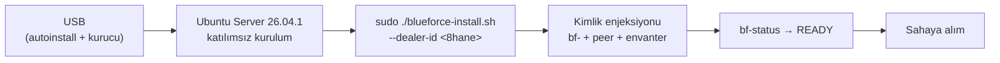

# 04 — Golden Image ve Provisioning

> Kısa özet: Saha imajının nasıl üretildiği ve cihaza nasıl basıldığı: autoinstall-tabanlı Ubuntu zemini + ilk açılışta kimlik enjeksiyonu. Hedef akış: USB → Ubuntu → tek script → bayi no → READY.

- Dosya: `docs/04-GOLDEN-IMAGE-AND-PROVISIONING.md`
- İlgili kararlar: `24-DECISION-LOG.md#K-09` (golden image yöntemi), `K-01` (OS), `K-11` (update kapalı), `K-12` (kimlik imajda değil, ilk boot'ta)
- Durum: [ ] Taslak

---

## 1. Amaç

Heterojen 700 saha PC'sinde aynı zemini tekrarlanabilir şekilde kurmak: imajın ne içerdiği, ne içermediği (cihaz kimliği), hangi araçla üretildiği ve sahada hangi akışla basıldığı.

## 2. Kapsam

- Kapsam içi: yöntem seçimi (karşılaştırma tablosu), imaj içeriği, autoinstall rolü, USB basım akışı, kimlik enjeksiyonu, LAB test matrisi.
- Kapsam dışı: kurucu modül detayları (05), BIOS ayarı detayı (03), rollout lojistiği (18-RECOVERY/18-ROLLOUT).

## 3. Kararlar

```text
KARAR:    Golden image = Ubuntu Server 26.04.1+ minimal + `unattended-upgrades` kapalı + `blueforce-install.sh` tek kurucu (bayi no → READY); imaj, preseed/autoinstall dosyasıyla üretilir, cihaz-spesifik kimlik (`bf-<no>`) imajda DEĞİL ilk açılışta verilir.
GEREKÇE:  Donanım heterojenliği bilinmediği için bit-kopya klon (Clonezilla) tek imajda kırılgandır; autoinstall + idempotent kurulum scripti her donanım profilinde aynı zemini kurar, kimlik ilk boot'ta enjekte edilir. Hedef akış: USB → Ubuntu → tek script → bayi no → READY.
ALTERNATİF: Clonezilla bit-kopya (hızlı ama donanım-fragil → yedek yöntem olarak tutulur); Packer/custom ISO (ek derleme hattı yükü → elendi); cloud-init (autoinstall'a göre saha-USB akışına daha az uygun → elendi).
RİSK:     İlk imaj heterojen donanımda sürücü eksiltebilir; azaltma: önce `bf-hardware-inventory.sh` taraması (18-ROLLOUT), LAB'da her profilde test.
MALİYET:  Ücretsiz.
LİSANS:   Ubuntu autoinstall/subiquity (ücretsiz, Ubuntu lisans seti içinde) — https://releases.ubuntu.com/26.04/ (doğrulanma: 2026-09-15). NOT: resmi autoinstall sözdizimi LAB çıktısıyla kesinleşir.
```

## 4. Neden Bu Karar?

Bit-kopya klon, kaynak makinenin sürücü setini dondurur; farklı anakart/ağ kartı olan sahada açılmayan cihaz üretir. Autoinstall her makinede donanıma göre kurulum yapar, ardından aynı kurucu script aynı zemini kurar — sonuç donanımdan bağımsız deterministik zemin + ilk boot'ta enjekte edilen benzersiz kimliktir. Custom ISO/Packer ek derleme hattı (imzalı ISO, build sunucusu, sürüm takibi) getirir; sadelik kuralını bozar.

## 5. Alternatifler

| Yöntem | Artı | Eksi | Sonuç |
|---|---|---|---|
| Ubuntu autoinstall (user-data) | Resmi yol, donanım-bağımsız, USB'den katılımsız | Sözdizimi LAB'da doğrulanmalı | **Seçildi** |
| Clonezilla bit-kopya | Çok hızlı klon, basit | Donanım-fragil, kimlik çakışması riski | Yedek yöntem |
| cloud-init (NoCloud USB) | Esnek ilk-boot yapılandırma | Saha-USB akışına autoinstall kadar uygun değil, ek katman | Elendi |
| Custom ISO (cubic/live-build) | Her şey gömülü tek ISO | Derleme hattı + imza + sürüm yükü | Elendi |
| Packer + QEMU build | Tekrarlanabilir build | Ek altyapı, öğrenme eğrisi, 700 PC için aşırı | Elendi |
| Ansible-only (kurulu OS üstüne) | İmaja gerek yok | Temel OS kurulumu yine manuel/USB gerektirir | Tamamlayıcı (kurucu sonrası filo) |

## 6. Avantajlar

- İmaj kimliksizdir: tek USB tüm sahada kullanılır, yanlış kimlikli cihaz çıkmaz.
- Kurucu idempotent olduğu için yarım kalan kurulum kaldığı yerden tamamlanır.
- Yedek yöntem (Clonezilla) hazırda bekler; autoinstall bir profilde takılırsa sahada blokaj olmaz.

## 7. Dezavantajlar

- Autoinstall sözdizimi Faz 1'de resmi-doğrulamalı değil; LAB çıktısı beklenir.
- İlk kurulum Clonezilla'ya göre daha yavaştır (paket kurulumu her cihazda tekrarlanır).

## 8. Riskler

| Risk | Olasılık | Etki | Azaltma |
|---|---|---|---|
| Heterojen donanımda sürücü eksikliği | Orta | Orta | Envanter taraması + LAB profil matrisi |
| Autoinstall sözdizimi sürüm farkı | Orta | Düşük | LAB 26.04.1 çıktısı dondurulur, dosyası repo'da sürümlenir |
| USB medyası bozuk/eskimiş | Düşük | Düşük | Çift USB + SHA256 doğrulama |

## 9. Uygulama Planı

1. İmaj içeriği (kimliksiz zemin):
   - Ubuntu Server 26.04.1+ minimal (GUI yok).
   - `unattended-upgrades` kapalı (03 §9 adım 6).
   - `blueforce-install.sh` + modüller USB'de `/opt/blueforce-installer/` altında (veya ilk boot'ta merkezi depodan çekilir — LAB'da netleşir).
   - Bootstrap SSH anahtarı (ilk Ansible run'ında rotasyon, K-13).
2. Saha akışı (hedef: teknisyen başına <15 dk aktif iş):

```text
USB tak → Ubuntu Server kur (autoinstall, katılımsız)
  → ilk açılışta: sudo ./blueforce-install.sh --dealer-id <8hane>
  → script bitince: bf-status → READY
  → USB çıkar, cihaz sahaya alınır
```

```bash
# sahada tek komut (kimlik ilk kez burada verilir)
sudo ./blueforce-install.sh --dealer-id 12010193
```

3. Kimlik enjeksiyonu ilk boot'ta olur: hostname + WireGuard peer + envanter kaydı kurucu tarafından yazılır; imajda hiçbir `bf-<no>` artığı bulunmaz (final-check denetler).
4. LAB test matrisi: envanterde çıkan her donanım profili × (kurulum + güç-kesintisi + `bf-gui-on/off` + final-check) — matris dolmadan WAVE açılmaz.

## 10. Test Planı

| Test | Beklenen sonuç | Ortam |
|---|---|---|
| Aynı USB ile 2 farklı donanım profili | İkisi de READY | LAB(2) |
| İmajda kimlik artığı taraması (`bf-*`, peer key) | Hiçbir cihaz-spesifik değer yok | LAB(2) |
| Yarım kesilen kurulumun tekrarı | İkinci koşu tamamlar, exit 0 | LAB(2) |
| Clonezilla yedek yöntemi | Autoinstall takılan profilde READY | LAB(2) |

## 11. Rollback

1. Bozuk imaj: önceki USB sürümüne dönüş (USB'ler sürüm etiketli saklanır).
2. Kurulum sonrası hata: kurucu idempotent yeniden koşar; düzelmezse 17-RECOVERY LEVEL 9 (imajdan temiz kurulum).
3. Autoinstall dosyası hatalıysa düzeltme repo PR'ı ile sürümlenir, SHA256 yeniden yayımlanır.

## 12. Kontrol Listesi

- [ ] Autoinstall dosyası repo'da sürümlü + LAB çıktısıyla doğrulanmış.
- [ ] USB SHA256 değeri yayımlanmış ve sahada doğrulanıyor.
- [ ] İmajda kimlik artığı yok (otomatik tarama).
- [ ] Her donanım profili LAB matrisinde READY almış.
- [ ] Clonezilla yedek prosedürü yazılı ve test edilmiş.

## 13. Açık Sorular

- [ ] Kurucu USB'de mi taşınacak, ilk boot'ta merkezden mi çekilecek (saha interneti varsayımı) (sahibi: Faz 3).
- [ ] Autoinstall kesin direktif seti — LAB 26.04.1 çıktısı (sahibi: Faz 3, bu dosyanın yazarı).
- [ ] USB hazırlama standardı (Ventoy vs dd vs Balena) (sahibi: Faz 3).

---

## Ek: Provisioning Akışı


