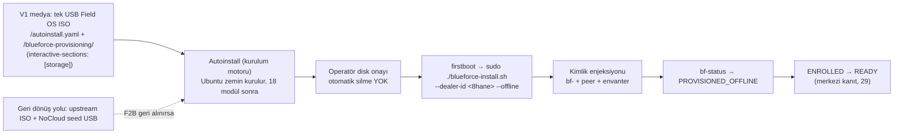

# 04 — Golden Image ve Provisioning

> Kısa özet: Saha imajının nasıl üretildiği ve cihaza nasıl basıldığı: autoinstall **kurulum motorudur**, Blueforce Field OS ISO ise **paketleme** yöntemidir — ikisi rakip değil, birlikte kullanılır (K-20). V1 medyası tek USB Field OS ISO'dur (autoinstall.yaml + offline APT + firstboot medya kökünde); upstream ISO + NoCloud seed USB geri dönüş yoludur. `interactive-sections: [storage]` korunur, otomatik disk silme yoktur. Offline tamamlanma durumu `PROVISIONED_OFFLINE`'dır; `READY` merkezi enrollment ve bağımsız kanıt sonrasındadır.

- Dosya: `docs/04-GOLDEN-IMAGE-AND-PROVISIONING.md`
- İlgili kararlar: `24-DECISION-LOG.md#K-09` (golden image yöntemi), `K-01` (OS), `K-11` (update kapalı), `K-12` (kimlik imajda değil, ilk boot'ta), `K-20` (medya stratejisi), `K-21` (durum modeli)
- Durum: [ ] Taslak

---

## 1. Amaç

Heterojen 700 saha PC'sinde aynı zemini tekrarlanabilir şekilde kurmak: imajın ne içerdiği, ne içermediği (cihaz kimliği), hangi araçla üretildiği ve sahada hangi akışla basıldığı.

## 2. Kapsam

- Kapsam içi: yöntem seçimi (karşılaştırma tablosu), imaj içeriği, autoinstall rolü, USB basım akışı, kimlik enjeksiyonu, LAB test matrisi.
- Kapsam dışı: kurucu modül detayları (05), BIOS ayarı detayı (03), rollout lojistiği (18-RECOVERY/18-ROLLOUT).

## 3. Kararlar

```text
KARAR:    Golden image = kimliksiz Blueforce Field OS zemini: Ubuntu Server 26.04.1+ minimal + `unattended-upgrades` kapalı + `blueforce-install.sh`. Autoinstall kurulum MOTORUDUR ve Blueforce Field OS ISO PAKETLEME/DAĞITIM yöntemidir; ikisi rakip değildir, birlikte kullanılır. V1 medyası TEK USB `Blueforce-Field-OS-<version>-amd64.iso`'dur: ISO kökünde `autoinstall.yaml` + offline APT repo + firstboot bulunur. Güvenlik için autoinstall'da `interactive-sections: [storage]` KORUNUR — otomatik disk silme YOKTUR, diski operatör seçip onaylar. Resmi upstream ISO + ayrı NoCloud seed USB, V1'in tek yolu değil geri dönüş/fallback yoludur ve her zaman sıcak tutulur. Cihaz-spesifik kimlik (`bf-<no>`), token veya secret imajda DEĞİL, firstboot/enrollment aşamasında verilir.
GEREKÇE:  Donanım heterojenliği bilinmediği için bit-kopya klon (Clonezilla) tek imajda kırılgandır; autoinstall + idempotent kurulum scripti her donanım profilinde aynı zemini kurar, kimlik ilk boot'ta enjekte edilir. Subiquity resmi referansı autoinstall yapılandırmasını `/autoinstall.yaml` yolundan okur ("irrespective of how it was provided"), yani ISO köküne konan dosya desteklenir; `interactive-sections` resmi olarak desteklenir ve `apt.fallback` varsayılanı `offline-install`'dır. Böylece tek-USB deneyimi ile "otomatik disk silme yok" şartı aynı anda sağlanır: ISO autoinstall'ı başlatır, teknisyen yalnız disk adımını onaylar. Hedef akış: USB → Ubuntu → tek script → bayi no → READY (READY yalnız merkezi kanıtla).
ALTERNATİF: Clonezilla bit-kopya (hızlı ama donanım-fragil → yedek yöntem olarak tutulur); Packer + QEMU derleme hattı (ek altyapı, öğrenme eğrisi, 700 PC için aşırı → elendi); cloud-init/NoCloud (autoinstall'ın tamamlayıcısıdır, ayrı seed USB ile geri dönüş yoludur — elenmedi); yalnız upstream ISO + seed (tek-medya deneyimi yok → V1'in tek yolu olmaktan çıktı, geri dönüş yolu olarak kalır); otomatik disk wipe'lı unattended (veri kaybı riski → yasak, F6 kapsamı).
RİSK:     İlk imaj heterojen donanımda sürücü eksiltebilir; azaltma: önce `bf-hardware-inventory.sh` taraması (18-ROLLOUT), LAB'da her profilde test. Remaster boot zinciri (UEFI/Legacy/Secure Boot) kanıtlanmazsa saha USB'si açılmayabilir; azaltma: F2B çıkış kriteri = tek-USB assisted kurulumun iki LAB cihazında kanıtı.
MALİYET:  Ücretsiz.
LİSANS:   Ubuntu autoinstall/subiquity — https://canonical-subiquity.readthedocs-hosted.com/en/latest/reference/autoinstall-reference.html (interactive-sections, `/autoinstall.yaml`, `apt.fallback`; doğrulama: 2026-09-16, HTTP 200) + https://releases.ubuntu.com/26.04/ (doğrulanma: 2026-09-15). NOT: 26.04.1'e özgü kesin direktifler LAB çıktısıyla kesinleşir.
```

> **Güncelleme (2026-09-16, K-20/K-21):** Bu bölümdeki "V1'de resmi upstream ISO + ayrı NoCloud seed USB kullanılır" ve "custom Field ISO ertelendi" ifadeleri geçersizdir. Kanonik karar: **autoinstall motor, Field OS ISO paketleme; V1 medyası tek USB Field OS ISO, upstream ISO + seed geri dönüş yolu.** Ayrıntı: `24-DECISION-LOG.md#K-20`; gerçek üretilmiş artefakt ve doğrulama kaydı: `docs/26-BLUEFORCE-FIELD-OS-ISO.md`.

## 4. Neden Bu Karar?

Bit-kopya klon, kaynak makinenin sürücü setini dondurur; farklı anakart/ağ kartı olan sahada açılmayan cihaz üretir. Autoinstall her makinede donanıma göre kurulum yapar, ardından aynı kurucu script aynı zemini kurar — sonuç donanımdan bağımsız deterministik zemin + ilk boot'ta enjekte edilen benzersiz kimliktir. **Custom ISO ile autoinstall rakip değildir:** ISO, aynı autoinstall motorunu + offline APT repo'yu + firstboot'u tek medyada paketler; bu yüzden "custom ISO'yu eledik" demek yanlıştır (K-20). Elenen şey ayrı bir Packer/QEMU derleme hattı kurmaktır; repo içindeki `provisioning/iso/build-blueforce-iso.sh` bu işi mevcut xorriso/zorunlu araçlarla yapar ve boot zincirini LAB kabulüne bağlar.

## 5. Alternatifler

| Yöntem | Artı | Eksi | Sonuç |
|---|---|---|---|
| Ubuntu autoinstall (user-data) | Resmi yol, donanım-bağımsız, USB'den katılımsız | Sözdizimi LAB'da doğrulanmalı | **Seçildi (kurulum motoru)** |
| Clonezilla bit-kopya | Çok hızlı klon, basit | Donanım-fragil, kimlik çakışması riski | Yedek yöntem |
| cloud-init / NoCloud seed USB | Autoinstall'i tamamlar, seed değişimi kolay | 26.04 söz dizimi/medya LABEL davranışı LAB'da doğrulanmalı | Geri dönüş yolu (tek medya değil) |
| Tek USB Field OS ISO (remaster) | Tek medya, offline APT + firstboot içinde | UEFI/Legacy/Secure Boot LAB kabulü gerekir | **V1 medyası (F2B)** |
| Packer + QEMU build | Tekrarlanabilir build | Ek altyapı, öğrenme eğrisi, 700 PC için aşırı | Elendi |
| Ansible-only (kurulu OS üstüne) | İmaja gerek yok | Temel OS kurulumu yine manuel/USB gerektirir | Tamamlayıcı (kurucu sonrası filo) |

> **Faz eşleşmesi (K-20 / 25-ROADMAP):** Tek-USB Field OS ISO işi **F2B — Assisted Offline Field ISO**'dadır; `F6` yalnız PXE / tam unattended / uzaktan provisioning içindir (otomatik disk yapılandırması orada, onay kapısıyla). Bu dosyadaki eski "LAB artefact / F6" ifadesi F2B olarak düzeltilmiştir.

## 6. Avantajlar

- İmaj kimliksizdir: tek USB tüm sahada kullanılır, yanlış kimlikli cihaz çıkmaz.
- Kurucu idempotent olduğu için yarım kalan kurulum kaldığı yerden tamamlanır.
- Yedek yöntem (Clonezilla) hazırda bekler; autoinstall bir profilde takılırsa sahada blokaj olmaz.

## 7. Dezavantajlar

- Autoinstall sözdizimi Faz 1'de resmi-doğrulamalı değil; LAB çıktısı beklenir.
- İlk kurulum Clonezilla'ya göre daha yavaştır (paket kurulumu her cihazda tekrarlanır).

## 8. Riskler

| Risk | Olasılık | Etki | Azaltma |
|---|---|---|---|
| Heterojen donanımda sürücü eksikliği | Orta | Orta | Envanter taraması + LAB profil matrisi |
| Autoinstall sözdizimi sürüm farkı | Orta | Düşük | LAB 26.04.1 çıktısı dondurulur, dosyası repo'da sürümlenir |
| USB medyası bozuk/eskimiş | Düşük | Düşük | Çift USB + SHA256 doğrulama |
| Remaster Field OS ISO boot etmez (UEFI/Legacy/Secure Boot) | Orta | Yüksek | F2B çıkış kapısı: tek-USB assisted kurulum iki LAB cihazında kanıtlanır; kanıt yoksa upstream ISO + seed yolu sıcak tutulur (K-20) |
| Medya tabanı sapması (LAB ISO'su Ubuntu Desktop flavour ile üretildi) | Yüksek (mevcut durum) | Orta | Sapma gizlenmez: `dist/1.0.0-manifest.yaml` içinde `base_flavor: desktop` + `baseline_deviation` bloğu; işletim öncesi Server ISO ile yeniden build veya Desktop tabanının kabulü (26 §6) |

## 9. Uygulama Planı

1. İmaj içeriği (kimliksiz zemin):
   - Ubuntu Server 26.04.1+ minimal (GUI yok). **Not (sapma):** LAB'da üretilen `dist/Blueforce-Field-OS-1.0.0-amd64.iso` base flavour'ı `desktop`'tur (build host'ta checksum'ı doğrulanmış tek kurulum medyası Desktop ISO'ydu); GNOME katmanı Desktop medyasıyla geldiği için ek kurulum adımı gerekmez. Server tabanlı medya `--upstream-iso` ile aynı builder'dan çıkar; üretim öncesi Server ISO ile yeniden build ya da Desktop tabanının kabulü kararı 26 §6 ve §13'tedir.
   - `unattended-upgrades` kapalı (03 §9 adım 6).
   - `blueforce-install.sh` + modüller medyada `/blueforce-provisioning/` altında (ISO'da `firstboot/`, `autoinstall/`, `offline-repo/`, `release/`; kurulu sistemde `/opt/blueforce-installer/`) — LAB'da netleşir.
   - Bootstrap SSH anahtarı (ilk Ansible run'ında rotasyon, K-13).
2. Saha akışı (hedef: teknisyen başına &lt;15 dk aktif iş):

```text
USB (Field OS ISO) tak → autoinstall başlar (Ubuntu kurulumu katılımsız ilerler)
  → installer ekranında SADECE disk adımı operatör onayı bekler (interactive-sections: [storage]; otomatik disk silme yok)
  → ilk açılışta: firstboot 8 haneli bayi no sorar → sudo ./blueforce-install.sh --dealer-id <8hane> (--offline)
  → script bitince: bf-status → PROVISIONED_OFFLINE
  → USB çıkar; merkezi enrollment tamamlanana kadar cihaz READY değildir
```

```bash
# sahada tek komut (kimlik ilk kez burada verilir)
sudo ./blueforce-install.sh --dealer-id 12010193
```

3. Kimlik enjeksiyonu ilk boot'ta olur: hostname + WireGuard peer + envanter kaydı kurucu tarafından yazılır; imajda hiçbir `bf-<no>` artığı bulunmaz (final-check denetler).
4. LAB test matrisi: envanterde çıkan her donanım profili × (kurulum + güç-kesintisi + `bf-gui-on/off` + final-check) — matris dolmadan WAVE açılmaz.

## 10. Test Planı

| Test | Beklenen sonuç | Ortam |
|---|---|---|
| Aynı USB (Field OS ISO) ile 2 farklı donanım profili | İkisi de PROVISIONED_OFFLINE | LAB(2) |
| Tek-USB assisted kurulumda disk adımı | Operatör onayı beklenir, disk kendiliğinden silinmez (K-20) | LAB(2) UEFI+Legacy |
| İmajda kimlik artığı taraması (`bf-*`, peer key, token, parola) | Hiçbir cihaz-spesifik değer/secret yok | LAB(2) + build CI |
| ISO checksum doğrulaması | `dist/*.iso.sha256` ile eşleşir | LAB(2)/CI |
| Yarım kesilen kurulumun tekrarı | İkinci koşu tamamlar, exit 0 | LAB(2) |
| Clonezilla yedek yöntemi | Autoinstall takılan profilde PROVISIONED_OFFLINE | LAB(2) |
| Geri dönüş yolu (upstream ISO + NoCloud seed) | Aynı zemini kurar; F2B geri alınırsa sıcak yol çalışır | LAB(2) |

## 11. Rollback

1. Bozuk imaj: önceki USB sürümüne dönüş (USB'ler sürüm etiketli saklanır).
2. Kurulum sonrası hata: kurucu idempotent yeniden koşar; düzelmezse 17-RECOVERY LEVEL 9 (imajdan temiz kurulum).
3. Autoinstall dosyası hatalıysa düzeltme repo PR'ı ile sürümlenir, SHA256 yeniden yayımlanır.
4. Field OS ISO boot etmezse (F2B) derhal upstream ISO + son onaylı NoCloud seed USB yoluna dönülür (bu yol her zaman sıcak tutulur, K-20).

## 12. Kontrol Listesi

- [ ] Autoinstall dosyası repo'da sürümlü + LAB çıktısıyla doğrulanmış.
- [ ] USB SHA256 değeri yayımlanmış ve sahada doğrulanıyor.
- [ ] İmajda kimlik artığı yok (otomatik tarama).
- [ ] Her donanım profili LAB matrisinde READY almış.
- [ ] Clonezilla yedek prosedürü yazılı ve test edilmiş.
- [ ] Tek-USB medyada `interactive-sections: [storage]` korunmuş ve disk otomatik silinmiyor (K-20).
- [ ] F2B/F6 ayrımı doğru anlatılmış: assisted medya F2B, PXE/tam unattended F6 (25-ROADMAP).
- [ ] Medya tabanı sapması (Desktop flavour) kayda geçmiş ve işletim öncesi karar verilmiş (26 §6).

## 13. Açık Sorular

- [ ] Kurucu USB'de mi taşınacak, ilk boot'ta merkezden mi çekilecek (saha interneti varsayımı) (sahibi: Faz 3).
- [ ] Autoinstall kesin direktif seti — LAB 26.04.1 çıktısı (sahibi: Faz 3, bu dosyanın yazarı).
- [ ] USB hazırlama standardı (Ventoy vs dd vs Balena) (sahibi: Faz 3).
- [ ] Offline APT repo'nun medyaya gömülmesi (bugün `offline_repo_status: not-included`, pinler `UNPINNED`) — F2B (sahibi: release yöneticisi) [K-20].
- [ ] Medya tabanı: Desktop flavour kabul mü, Server ISO ile yeniden build mi — F2B çıkış kapısı (sahibi: release yöneticisi) [K-01/K-20].

---

## Ek: Provisioning Akışı


