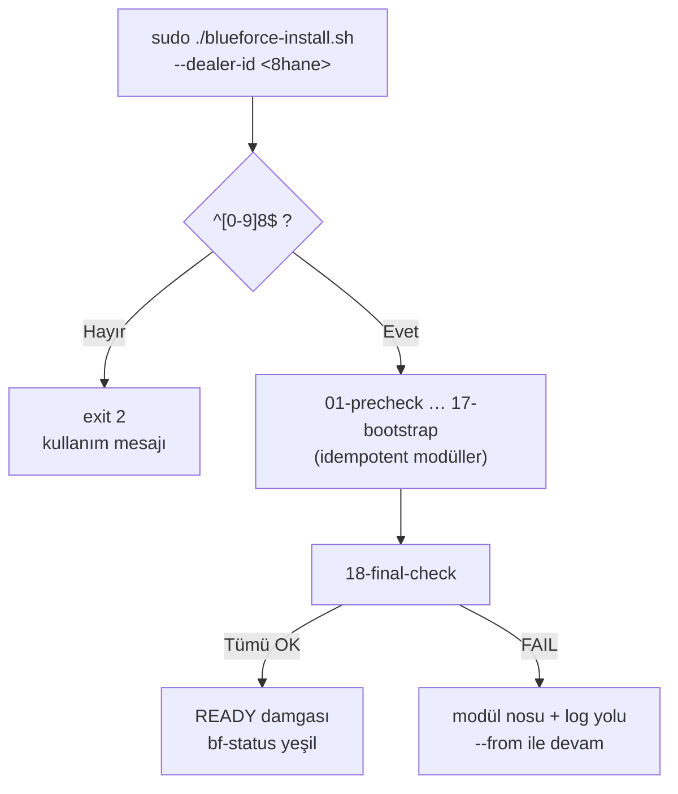

# 05 — Tek-Tık Kurucu (One-Click Installer)

> Kısa özet: Sahada tek komutla cihazı READY yapan `blueforce-install.sh`: bayi no doğrulaması, 18 modül, idempotent yeniden-koşu ve final-check kapısı. Teknisyenin çalıştırdığı tek şeydir.

- Dosya: `docs/05-ONE-CLICK-INSTALLER.md`
- İlgili kararlar: `24-DECISION-LOG.md#K-09` (tek kurucu), `K-11` (update kapalı), `K-12` (kimlik formatı), `K-03` (bf-gui), `K-10` (Docker disiplini)
- Durum: [ ] Taslak

---

## 1. Amaç

Saha teknisyeninin uzmanlık gerektirmeden cihazı standarda getirmesi: tek komut, tek girdi (bayi no), net sonuç (READY / hata + log yolu). Yarım kalan veya hatalı kurulumun güvenli tekrarı.

## 2. Kapsam

- Kapsam içi: komut arayüzü, bayi-no doğrulama, 18 modül listesi ve sırası, idempotency kuralları, log/bundle çıktısı, çıkış kodları.
- Kapsam dışı: modül iç kodları (repo `scripts/install/`), imaj üretim yöntemi (04), filo-side yapılandırma (09).

## 3. Kararlar

```text
KARAR:    Saha kurulumu tek giriş noktasıdır: `sudo ./blueforce-install.sh --dealer-id <8hane>`; bayi no `^[0-9]{8}$` ile doğrulanır, uymayan girdi kurucuyu başlatmaz.
GEREKÇE:  Tek komut teknisyen hatasını en aza indirir; format kapısı yanlış kimliğin 9 sisteme yayılmasını baştan engeller (K-12).
ALTERNATİF: Çok scriptli kurulum (ağ.sh, gui.sh, …) — sıra hatası ve atlanan adım riski nedeniyle elendi.
RİSK:     Tek dosya büyüdükçe bakımı zorlaşır; azaltma: 18 bağımsız modül + ana orkestratör ayrımı.
MALİYET:  Ücretsiz.
LİSANS:   Yok (şirket içi script).
```

```text
KARAR:    Kurucu 18 modülden oluşur (`01-precheck` … `18-final-check`); her modül idempotenttir — yeniden koşu güvenli ve kaldığı yerden tamamlayıcıdır.
GEREKÇE:  Saha elektriği/kesintisi yarım kurulum üretir; idempotency olmadan her kesinti temiz-kurulum demektir. Final-check kapısı (modül 18) exit 0 vermeden cihaz kurulu sayılmaz; offline akışta sonuç `PROVISIONED_OFFLINE`, token sonrası `ENROLLED`, yalnız merkezi kanallar doğrulanınca `READY` olur (27/29).
ALTERNATİF: Tek seferlik (non-idempotent) script — kesinti durumunda belirsiz ara durum nedeniyle elendi.
RİSK:     Modülün idempotent yazılmaması (çift kayıt, çift key); azaltma: §10'daki çift-koşu testi her modül için zorunlu.
MALİYET:  Ücretsiz.
LİSANS:   Yok.
```

## 4. Neden Bu Karar?

700 cihaz × teknisyen başına değişen beceri = kurulumun "tek komut + tek soru" olması şarttır. 18 modül, her kararın (update-kapalı, Docker-disiplini, GUI-anahtarı, kimlik, servisler) ayrı denetlenebilir adımdır; modül numarası log satırında görünür, arıza hangi adımda kaldıysa oradan devam edilir.

## 5. Alternatifler

| Alternatif | Artı | Eksi | Sonuç |
|---|---|---|---|
| Çok scriptli kurulum | Küçük dosyalar | Sıra/atlama hatası | Elendi |
| Non-idempotent tek script | Daha basit kod | Kesintide temiz-kurulum zorunluluğu | Elendi |
| İnteraktif sihirbaz (çok sorulu) | Esnek | Teknisyen hatası, otomasyona kapalı | Elendi |

## 6. Avantajlar

- Tek komut = eğitim maliyeti minimum, runbook tek sayfa.
- Idempotency = kesinti korkusu yok, "bir daha koş" her sorunun ilk cevabı.
- Final-check = READY iddiası ölçülebilir, dalga kapılarına bağlanır.

## 7. Dezavantajlar

- 18 modülün her biri için idempotency testi yazma maliyeti.
- Tek giriş noktası, modül-atlama (debug) ihtiyacında `--from/--only` bayraklarını zorunlu kılar.

## 8. Riskler

| Risk | Olasılık | Etki | Azaltma |
|---|---|---|---|
| Modül idempotent değil (çift kayıt) | Orta | Orta | Çift-koşu testi (§10) + code review kuralı |
| Teknisyen yanlış no girer | Orta | Orta | Format kapısı + onay ekranı (`BF-xxxx, onaylıyor musunuz?`) |
| Kurucu yarıda kesilir, cihaz ara durumda sahaya alınır | Düşük | Yüksek | Final-check exit 0 olmadan READY yok; `bf-status` bunu gösterir |

## 9. Uygulama Planı

1. Komut arayüzü:

```bash
sudo ./blueforce-install.sh --dealer-id 12010193 [--from 07] [--only 18-final-check] [--check]
# --check: değişiklik yapmadan denetim (final-check + modül durumları)
# --from: belirtilen modülden devam et | --only: tek modül koş
```

2. Bayi-no doğrulama: `^[0-9]{8}$`; uymazsa exit 2 + kullanım mesajı. Geçerse onay ekranı (`BF-12010193` + hostname `bf-12010193` gösterilir).
3. 18 modül (sıra sözleşmedir, yeri `scripts/install/`):

| # | Modül | İşlev (dayandığı karar) |
|---|---|---|
| 01 | `01-precheck` | OS sürümü (26.04.1+), disk/RAM minimumu, root yetkisi, internet kontrolü |
| 02 | `02-dealer-id` | No doğrulama + hostname `bf-<no>` atama (K-12) |
| 03 | `03-base-packages` | Temel paketler + `unattended-upgrades` kapatma (K-11) |
| 04 | `04-gnome` | GNOME kurulumu (K-02) |
| 05 | `05-xrdp` | xRDP + sesman + `bf-gui-on/off` yazımı (K-03) |
| 06 | `06-ssh-hardening` | `blueforce` kullanıcısı, key-auth, root/password kapalı (K-13) |
| 07 | `07-wireguard` | Spoke config, peer `bf-<no>`, keepalive 25, `wg-quick@wg0` enable (K-05) |
| 08 | `08-docker` | Docker CE + `unless-stopped` + log rotasyonu + localhost-bind (K-10) |
| 09 | `09-meg` | MEG konteyneri (sabit tag, `latest` yok) (K-10) |
| 10 | `10-rustdesk` | RustDesk istemci + VDS adresi + `BF-<no>` etiketi (K-04) |
| 11 | `11-meshcentral` | MeshCentral agent + `BF-<no>` adı (K-04) |
| 12 | `12-monitoring` | Node Exporter + textfile + Uptime Push (K-07) |
| 13 | `13-firewall` | UFW profili (SSH/RDP yalnızca WG) (K-05) |
| 14 | `14-inventory` | `bf-hardware-inventory.sh` koşusu, JSON+MD üretimi (02) |
| 15 | `15-logging` | journald + Docker rotasyon + `bf-status/bf-diagnostics` (K-14) |
| 16 | `16-boot` | multi-user default + BIOS notu + servis enable denetimi (K-03) |
| 17 | `17-ansible-bootstrap` | Bootstrap SSH key + ilk pull/Ansible kaydı (K-06/K-13) |
| 18 | `18-final-check` | Tüm kapılar: kimlik, servisler, update-kapalı, Docker politikası, READY damgası |

4. Idempotency kuralları (her modül için zorunlu):
   - Varlık kontrolü önce (`id blueforce`, `dpkg -l`, `systemctl is-enabled`): varsa atla, yoksa kur.
   - Dosya yazımları atomik (tmp + rename) ve tekrarlanabilir (aynı girdi → aynı çıktı).
   - Anahtar/secret üretimi bir kez (`/var/lib/blueforce/.modül-done` damgası); `--force` olmadan yeniden üretilmez.
   - Her modül `/var/log/blueforce-install.log` dosyasına `MODÜL-NO + OK/SKIP/FAIL` satırı yazar.
5. Çıkış kodları: `0` READY, `1` modül hatası (no logda), `2` argüman/format hatası.

## 10. Test Planı

| Test | Beklenen sonuç | Ortam |
|---|---|---|
| Geçersiz no (7/9 hane, harf, boş) | exit 2, kurulum başlamaz | LAB(2) |
| Her modülün çift-koşusu | İkinci koşu exit 0, durum değişmez (diff boş) | LAB(2) |
| Elektrik-kesintisi simülasyonu (modül 09 ortasında kill) | `--from 09` ile tamamlanır, final exit 0 | LAB(2) |
| `18-final-check` tüm kapıları | Eksik adımda FAIL + modül nosu, READY yok | LAB(2) |
| `--check` kuru koşusu | Değişiklik yapmaz, rapor üretir | P1(5) |

## 11. Rollback

1. Modül hatası: logdaki modül nosundan `--from <no>` ile devam edilir.
2. Yanlış no: doğru no ile tam yeniden koşu (idempotent, kimlik modülü üzerine yazar).
3. Düzelmeyen cihaz: 17-RECOVERY LEVEL 9 (temiz imaj + kurucu).

## 12. Kontrol Listesi

- [ ] 18 modül dosyası `scripts/install/` altında numaralı ve çalışır durumda.
- [ ] Her modülde varlık-kontrolü + damga + log satırı var.
- [ ] Format regex'i 02 ile aynı (`^[0-9]{8}$`).
- [ ] `18-final-check` K-10/K-11 kapılarını denetliyor (unless-stopped, latest yok, update kapalı).
- [ ] `--check/--from/--only` bayrakları çalışıyor.

## 13. Açık Sorular

- [ ] Kurucu USB'de mi, merkezden `curl` ile mi alınacak (saha interneti varsayımı) (sahibi: Faz 3, 04 yazarı ile ortak).
- [ ] MEG sabit tag'inin kim tarafından, hangi onay ile güncelleneceği (sahibi: 10-UPDATE / 12-DOCKER yazarları).

---

## Ek: Kurucu Akış


