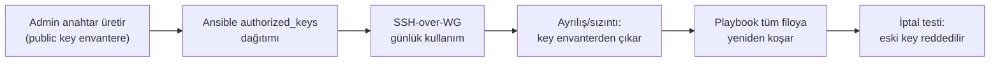

# 06 — Kullanıcılar, SSH ve Yetkiler

> Kısa özet: Saha cihazlarındaki kullanıcı modeli (`blueforce` bakım kullanıcısı), SSH kimlik doğrulama mimarisi (anahtar zorunlu, password kapalı, root kapalı) ve tek private key riskine karşı per-admin anahtar + SSH CA hedefi. 700 cihazda güvenli ve iptal edilebilir erişimin sözleşmesidir.

- Dosya: `docs/06-USERS-SSH-AND-PERMISSIONS.md`
- İlgili kararlar: `24-DECISION-LOG.md#K-13` (SSH mimarisi), `K-05` (SSH yalnızca WireGuard arkası), `K-12` (cihaz kimliği)
- Durum: [ ] Taslak

---

## 1. Amaç

700 saha cihazına kimlerin, hangi kullanıcıyla, nasıl bağlanacağını sabitlemek: tek bakım kullanıcısı, anahtar-zorunlu SSH, kapalı root/password, sızıntıda blast-radius'u sınırlayan anahtar dağıtım modeli.

## 2. Kapsam

- Kapsam içi: `blueforce` kullanıcısı, servis kullanıcıları, sudo politikası, `sshd_config` kilitleri, per-admin anahtar dağıtımı (Ansible), anahtar iptal prosedürü, SSH CA hedefi.
- Kapsam dışı: WireGuard tünel kurulumu (08), Ansible playbook detayları (09), UFW/firewall kuralları (11).

## 3. Kararlar

```text
KARAR:    Saha cihazlarında tek insan bakım kullanıcısı `blueforce`'tur; servisler ayrı systemsız-login kullanıcılarla çalışır, sudo kontrollüdür.
GEREKÇE:  Tek bakım kimliği = 9 sistemde (02-NAMING, WireGuard, Ansible, monitoring) join anahtarı; servislerin ayrı kullanıcıyla çalışması bir servisin ele geçirilmesinin bakım yetkisine sıçramasını engeller.
ALTERNATİF: Kişi başına ayrı login — 700 cihaz × N teknisyen authorized_keys kaosu nedeniyle elendi; ayrım SSH anahtarı seviyesinde (per-admin key) yapılır, kullanıcı seviyesinde değil.
RİSK:     Tek kullanıcı adı hedefli saldırıya odaklanır; azaltma: password kapalı + yalnızca WireGuard arayüzünden SSH (08).
MALİYET:  Ücretsiz.
LİSANS:   OpenSSH (BSD-lisanslı), ücretsiz.
```

```text
KARAR:    Root SSH girişi kapalıdır (`PermitRootLogin no`); password ile SSH kapalıdır (`PasswordAuthentication no`); anahtar zorunludur (`PubkeyAuthentication yes`).
GEREKÇE:  Kaba-kuvvet yüzeyi root+password ikilisinden gelir; ikisi de kapatılınca uzaktan giriş yalnızca dağıtılmış anahtarlarla mümkündür. Root yetkisi yalnızca `sudo` ile, denetim izi bırakarak alınır.
ALTERNATİF: Password auth açık tutma — 700 internete çıkabilen cihazda kaba-kuvvet + zayıf parola riski nedeniyle elendi.
RİSK:     Anahtarını kaybeden admin erişemez; azaltma: bootstrap anahtarı + acil erişim prosedürü (§9) + RustDesk/MeshCentral yedek kanalı (07).
MALİYET:  Ücretsiz.
LİSANS:   OpenSSH (BSD-lisanslı), ücretsiz.
```

```text
KARAR:    700 cihaza tek private key YAYILMAZ — her adminin kendi anahtar çifti vardır; cihazlardaki `authorized_keys` Ansible ile merkezi dağıtılır; uzun vadede SSH CA (sertifika tabanlı giriş) hedeflenir.
GEREKÇE:  Tek private key'in sızıntı blast-radius'u 700 cihazdır; per-admin anahtar + merkezi dağıtım, sızıntıyı tek anahtarın iptali + tek Ansible run'ına indirger. SSH CA hedefi anahtar dağıtım gecikmesini ortadan kaldırır (kısa ömürlü sertifika).
ALTERNATİF: Tek paylaşılan private key — basit ama 700 cihazlık blast-radius nedeniyle elendi.
RİSK:     Anahtar dağıtım gecikmesi yeni cihazda erişimsizlik; azaltma: golden image'da bootstrap anahtarı + ilk Ansible run'ında rotasyon (04-GOLDEN-IMAGE).
MALİYET:  Ücretsiz.
LİSANS:   OpenSSH (BSD-lisanslı), ücretsiz.
```

## 4. Neden Bu Karar?

Savunma katmanları üst üste biner: (1) SSH yalnızca WireGuard arayüzüne bağlıdır (08), internetten port 22 görünmez; (2) o dar kapıda bile password/root kapalıdır; (3) anahtarlar kişi bazlıdır, çalınan tek anahtar tek komutla iptal edilir. Tek paylaşılan key, 700 cihazda "bir sızıntı = filo kaybı" demektir; bu risk, per-admin anahtarın getirdiği küçük dağıtım yükünden ağır basar.

## 5. Alternatifler

| Alternatif | Artı | Eksi | Sonuç |
|---|---|---|---|
| Tek paylaşılan private key | Dağıtım çok basit | 700 cihazlık blast-radius | Elendi |
| Password auth açık | Acil girişte kolay | Kaba-kuvvet yüzeyi | Elendi |
| Kişi başına ayrı login | Denetimde ad bazlı iz | 700 cihazda kullanıcı kaosu | Elendi |
| SSH CA (hemen) | En temiz iptal/rotasyon | Kurulum + Faz 1 yükü | Hedef (ileride) |

## 6. Avantajlar

- Sızıntıda iptal tek Ansible run'ı ile filoya yayılır.
- Root'un doğrudan girişi olmadığı için tüm yetkili işlem `sudo` log'unda iz bırakır.
- Servis/servis-dışı ayrımı, MEG veya agent zafiyetinin bakım yetkisine sıçramasını engeller.

## 7. Dezavantajlar

- Yeni admin için anahtar üret + dağıt + test döngüsü gerekir (runbook'a işlenir).
- SSH CA kurulana kadar `authorized_keys` dağıtım gecikmesi yaşanabilir (bootstrap anahtarı ile kapatılır).

## 8. Riskler

| Risk | Olasılık | Etki | Azaltma |
|---|---|---|---|
| Tek private key sızıntısı (yasak ihlali) | Düşük | Yüksek (700 cihaz) | Politika + denetim (§12); sızıntıda tüm filo rotasyonu (17-RECOVERY) |
| Admin anahtar kaybı | Orta | Düşük | Bootstrap anahtarı kasada; acil erişim prosedürü (§9) |
| `authorized_keys` senkron kayması | Orta | Orta | Ansible run sonunda `ssh -i` doğrulama testi (09) |
| SSH CA'ye hiç geçilememesi | Orta | Düşük | Per-admin model CA'sız da sürdürülebilir; CA Faz-sonrası hedef |

## 9. Uygulama Planı

1. Golden image: `blueforce` kullanıcısı + bootstrap `authorized_keys` + kilitli `sshd_config` ile gelir (04).
2. Her admin kendi anahtar çiftini üretir, public key merkez envantere işlenir.
3. Ansible `users/ssh` rolü `authorized_keys`'i dağıtır, bootstrap anahtarını ilk run'da rotasyona sokar (09).
4. Sızıntı/ayrılışta ilgili public key envanterden çıkarılır, playbook tüm filoya koşar.
5. Faz-sonrası: SSH CA kurulumu değerlendirilir (CA private key merkezde, host sertifikaları ilk boot'ta).

```bash
# örnek: sshd kilitleri (hedef durum)
grep -E '^(PermitRootLogin|PasswordAuthentication|PubkeyAuthentication)' /etc/ssh/sshd_config
# beklenen: PermitRootLogin no / PasswordAuthentication no / PubkeyAuthentication yes

# örnek: acil erişim testi (merkezden, WireGuard üzerinden)
ssh -i ~/.ssh/admin-emirhan -o BatchMode=yes blueforce@10.8.0.15 echo OK
```

## 10. Test Planı

| Test | Beklenen sonuç | Ortam |
|---|---|---|
| `ssh root@<wg-ip>` | Red (Permission denied) | LAB(2) |
| Parola ile giriş denemesi | Red | LAB(2) |
| Geçerli admin anahtarı ile giriş | Başarılı | LAB(2) |
| İptal edilen anahtar ile giriş | Red (dağıtım sonrası) | LAB(2) |
| `sudo -l` çıktısı | Yalnızca tanımlı komutlar | LAB(2) |

## 11. Rollback

1. Hatalı `sshd_config` dağıtımında önceki sürüm Ansible ile geri basılır (`sshd -t` doğrulamalı).
2. Yanlışlıkla silinen geçerli anahtar, bootstrap anahtarı veya yedek kanaldan (RustDesk/MeshCentral, 07) girilip geri eklenir.
3. Son çare: cihaz 17-RECOVERY prosedürüyle yeniden imajlanır.

## 12. Kontrol Listesi

- [ ] `PermitRootLogin no`, `PasswordAuthentication no` tüm saha cihazlarında doğrulandı.
- [ ] Hiçbir cihazda paylaşılan/ortak private key yok (denetim scripti 11'de).
- [ ] Her admin anahtarı envanterde kayıtlı, ayrılanlarınki çıkarılmış.
- [ ] Bootstrap anahtarı fiziksel kasada + erişim log'lu.
- [ ] SSH yalnızca WireGuard arayüzünde dinliyor (08 ile birlikte test).

## 13. Açık Sorular

- [ ] SSH CA için zaman çizelgesi ve CA altyapısı (sahibi: Faz-sonrası plan, 25-ROADMAP).
- [ ] `sudo` komut beyaz listesinin kesin içeriği — LAB'da bakım akışlarıyla netleşecek (sahibi: 11-SECURITY yazarı).

---

## Ek: Mermaid — anahtar yaşam döngüsü


