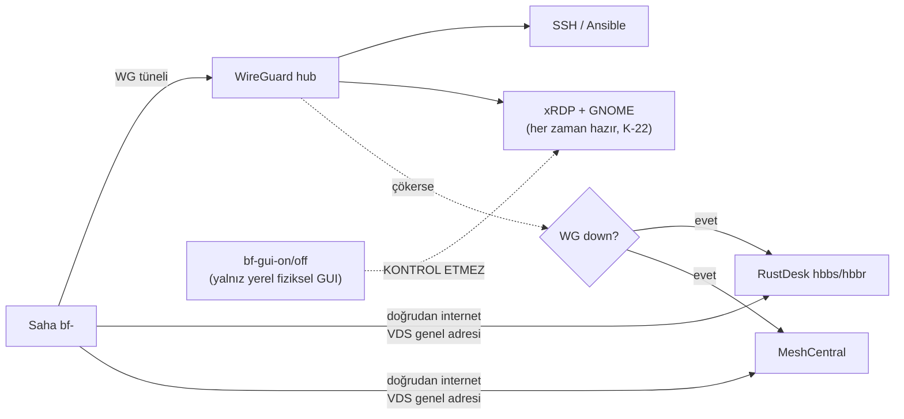

# 07 — Uzaktan Erişim (4 Kanal)

> Kısa özet: Saha cihazlarına 4 bağımsız erişim kanalı: SSH-over-WireGuard, xRDP + GNOME (service her zaman hazır — K-22), RustDesk OSS self-hosted (birincil grafik), MeshCentral self-hosted (ikincil yönetim). `bf-gui-on`/`bf-gui-off` yalnız **yerel fiziksel** GUI'yi kontrol eder, RDP'yi değil: **GUI kapalı ≠ RDP kapalı**. AnyDesk ücretsiz zorunlu mimarinin parçası DEĞİLDİR (ticari lisans şartı); yalnız `scripts/install/optional/anydesk/` altında lisans onayına bağlı opsiyonel modül vardır.

- Dosya: `docs/07-REMOTE-ACCESS.md`
- İlgili kararlar: `24-DECISION-LOG.md#K-04` (4 kanal + AnyDesk hükmü), `K-22` (RDP her zaman hazır; `bf-gui-*` yalnız yerel GUI), `K-03` (boot + bf-gui), `K-05` (WireGuard arkası), `K-02`/`K-23` (GNOME saha standardı + LAB A/B ölçümü)
- Durum: [ ] Taslak

---

## 1. Amaç

WireGuard çökse bile sahaya erişimi sürdürecek yedekli uzak-erişim mimarisini sabitlemek: hangi kanal ne için kullanılır, hangisi hangi arızada ayakta kalır, AnyDesk neden yoktur.

## 2. Kapsam

- Kapsam içi: 4 kanalın rolü/kurulumu/boot davranışı, WG-çöküşü analizi, AnyDesk hükmü + opsiyonel modül notu, kanal seçim matrisi.
- Kapsam dışı: WireGuard tünel kurulumu (08), SSH anahtar politikası (06), filo otomasyonu (09).

## 3. Kararlar

```text
KARAR:    Dört erişim kanalı: (1) SSH-over-WireGuard (yönetim/otomasyon), (2) xRDP + GNOME (grafik bakım), (3) RustDesk OSS self-hosted hbbs/hbbr (birincil grafik uzak erişim, WireGuard-bağımsız), (4) MeshCentral self-hosted (ikincil yönetim: terminal/dosya/envanter, WireGuard-bağımsız). AnyDesk mimariden ÇIKARILDI.
GEREKÇE:  RustDesk OSS sınırsız istemci, kendi ID+röle altyapısı, E2E şifreli oturum, dosya transferi ve katılımsız erişimi ücretsiz verir; istemcide VDS genel adresi kullanıldığında WireGuard çökse bile kanal ayakta kalır. MeshCentral Apache-2.0 ile ikinci bağımsız düzlemi sağlar. AnyDesk ücretsiz sürümü yalnızca kişisel kullanımı kapsar; 700 kurumsal cihaz ticari kullanımdır ve lisanssız kullanım ihlal olur.
ALTERNATİF: AnyDesk (lisans maliyeti + kapalı kaynak + self-hosted yalnızca en üst planda → elendi; yalnızca müşteri sahasında zaten lisanslıysa opsiyonel installer modülü). Tailscale/ZeroTier (freemium, merkezi kimlik → elendi).
RİSK:     İki VDS-bağımlı kanalın tek ortak noktası VDS + genel internet; azaltma: hbbs/hbbr + MeshCentral health monitörü (Uptime Kuma) + yedek VDS planı 17-RECOVERY'de.
MALİYET:  Ücretsiz (kendi VDS'i üzerinde; VDS kira bedeli hariç — altyapı maliyeti, lisans değil).
LİSANS:   RustDesk istemci+sunucu AGPL-3.0 (1.4.9 / 1.1.16) — https://rustdesk.com/docs/en/self-host/rustdesk-server-oss/ + https://rustdesk.com/docs/en/self-host/client-deployment/ (doğrulanma: 2026-09-15); MeshCentral Apache-2.0 (1.2.5) — https://github.com/Ylianst/MeshCentral (doğrulanma: 2026-09-15); AnyDesk hükmü — https://support.anydesk.com/docs/anydesk-licenses.md (doğrulanma: 2026-09-15) + https://anydesk.com/en/pricing.
```

```text
KARAR:    RDP kanalı HER ZAMAN HAZIRDIR: `xrdp` ve `xrdp-sesman` multi-user seviyesinde sürekli enable ve active kalır; RDP `bf-gui-on` komutuna bağlı DEĞİLDİR. `bf-gui-on` / `bf-gui-off` yalnız YEREL FİZİKSEL grafik katmanını (display-manager: gdm3/gdm/sddm/lightdm + default target) kontrol eder ve `bf-gui-off` xRDP servislerini asla durdurmaz/disable etmez. xRDP GNOME oturumu üzerinden grafik bakım verir ve yalnızca WireGuard arkasında dinler (internete açık RDP portu yoktur).
GEREKÇE:  xRDP systemd servis birimleri (`xrdp`, `xrdp-sesman`) üzerinden yönetilen bir katmandır; servisi sürekli hazır tutmak, yerel GUI kapalı saha cihazında uzaktan grafik kurtarma kanalını korur (sahaya gitme oranını düşürür). WG-arkası dinleme RDP'yi internet taramasından gizler, yerel GUI'nin kapalı kalması RAM'i ve hata yüzeyini korur. Depodaki kod bu ayrımı uygular: `08-rdp` modülü xrdp+xrdp-sesman'ın enable VE active olmasını, default target'ın multi-user kalmasını doğrular; `15-power-loss` boot zinciri de xRDP'i her zaman ready varsayar.
ALTERNATİF: RDP'yi `bf-gui-on`'a bağlamak — GUI kapalı saha cihazında uzaktan grafik kurtarma kaybolur → reddedildi. RDP'yi doğrudan internete açma — tarama + kaba-kuvvet riski nedeniyle elendi.
RİSK:     Kesin birim adları ve GNOME oturum satırı 26.04.1'de değişebilir; azaltma: LAB doğrulaması olmadan `bf-gui-*` dondurulmaz (03). `bf-gui-off` içine xRDP'i durduran bir satır girmesi sözleşme ihlalidir (`tests/check-specs.sh` zorunlu tutar).
MALİYET:  Ücretsiz.
LİSANS:   xRDP Apache-2.0, ücretsiz — https://github.com/neutrinolabs/xrdp (v0.10.6.1, 2026-07-07; doğrulanma: 2026-09-15; yeniden doğrulama: 2026-09-16, HTTP 200). GNOME GPL/LGPL — https://www.gnome.org/ (doğrulama: 2026-09-16, HTTP 200).
```

> **Güncelleme (2026-09-16, K-22):** Bu bölümdeki eski "GUI varsayılan kapalıdır, bakım penceresinde `bf-gui-on` ile açılır → RDP" anlatımı RDP'yi `bf-gui-on`'a bağlı gösteriyordu ve yanlıştı. Doğru ayrım: **RDP servisi her zaman hazır; `bf-gui-*` yalnız yerel fiziksel GUI'yi açar/kapatır.** Ayrıntı ve kod kanıtı: `24-DECISION-LOG.md#K-22`, `docs/03-UBUNTU-BASELINE.md` §9.

```text
KARAR:    Dört kanalın agent/servisleri boot'ta otomatik başlar (systemd enable): `wg-quick@wg0`, RustDesk katılımsız servis, MeshCentral agent, `xrdp`/`xrdp-sesman` (yerel GUI kapalı olsa da her zaman enable/ready). RustDesk'in Ubuntu 26.04.1 headless/katılımsız kesin davranışı LAB ile doğrulanmadan dondurulmaz.
GEREKÇE:  Elektrik kesintisi sonrası cihaz açılınca VPN + yedek kanallar kendiliğinden gelir; 16-POWER-LOSS boot zincirinin varsayımıdır.
ALTERNATİF: Manuel başlatma — 700 dokunulmaz cihazda her kesintide saha ziyareti demek → elendi.
RİSK:     Boot race (agent ağdan önce kalkar); azaltma: systemd `After=network-online.target` + yeniden deneme, LAB güç-kesinti testiyle doğrulanır.
MALİYET:  Ücretsiz.
LİSANS:   Yok (OS yapılandırması).
```

## 4. Neden Bu Karar?

Tek tünel körlüğü engellenir: SSH ve RDP WireGuard'a bağımlıdır (güvenlik için), RustDesk ve MeshCentral ise VDS genel adresine doğrudan çıkar (erişilebilirlik için). RustDesk birincil grafiktir çünkü katılımsız erişim + dosya transferini OSS'te verir; MeshCentral ikinci düzlemdir çünkü terminal/dosya/envanter sunar ve RustDesk arızasında devreye girer. RDP'nin servis seviyesinde sürekli hazır olması (K-22) üçüncü bir sigortadır: yerel GUI kapalı bir cihazda bile teknisyen WG üzerinden GNOME oturumu açabilir; bu yüzden `bf-gui-off` xRDP'i asla durdurmaz. AnyDesk'in ücretsiz katmanı ticari kullanımı kapsamadığı için 700 cihazda lisans ihlali doğurur — bu hukuki risk teknik kolaylığa ağır basar ve AnyDesk ücretsiz/zorunlu mimarinin parçası değildir.

## 5. Alternatifler

| Alternatif | Artı | Eksi | Sonuç |
|---|---|---|---|
| AnyDesk (ücretsiz) | Tanınmış, kolay | Ticari kullanımda lisans ihlali; zorunlu mimarinin parçası değil | Elendi |
| AnyDesk (lisanslı) | Kurumsal destek | 700 cihaz lisans bedeli + kapalı kaynak; ücretsiz mimariye girmez | Opsiyonel modül (bkz. §9) |
| Tailscale/ZeroTier | Kolay mesh | Freemium, merkezi kimlik | Elendi |
| Tek kanal (yalnızca SSH) | En sade | Tünel çökerse körlük | Elendi |
| VNC doğrudan | Basit | Şifresiz/zayıf varyantlar, WG-dışı risk | Elendi |

## 6. Avantajlar

- WireGuard çökse bile 2 kanal (RustDesk, MeshCentral) ayakta — filo kör kalmaz.
- Tüm kanallar ücretsiz/self-hosted; veri üçüncü parti buluta çıkmaz.
- Kanal başına rol ayrımı (otomasyon / grafik bakım / grafik erişim / envanter) runbook'ları sadeleştirir.

## 7. Dezavantajlar

- 4 kanal = 4 agent/servis bakımı, 4 izleme hedefi (14-MONITORING'e yük).
- RustDesk + MeshCentral aynı VDS'teyse ortak arıza noktası (yedek VDS planı gerekir).
- Teknisyenin hangi kanalı ne zaman kullanacağı eğitim gerektirir (kanal matrisi §9).

## 8. Riskler

| Risk | Olasılık | Etki | Azaltma |
|---|---|---|---|
| WireGuard çöküşü (istemci/saha tarafı) | Orta | Orta | RustDesk/MeshCentral bağımsız kanallar (§9 analizi) |
| VDS kesintisi (hbbs+hbbr+MeshCentral) | Düşük | Yüksek | Health monitörü + yedek VDS planı (17) |
| RustDesk ID çakışması / key sızıntısı | Düşük | Orta | Self-hosted key, `bf-<no>` etiketi, key rotasyon prosedürü |
| xRDP + GNOME ek ayar ihtiyacı (26.04.1) | Orta | Orta | LAB'da `bf-gui-*` doğrulaması (03); A/B ölçümünde "RDP güvenilirliği" metriği (K-23) |
| `bf-gui-off` yanlış kurgulanır, xRDP durur → uzaktan kurtarma kaybı | Düşük | Yüksek | `tests/check-specs.sh` bf-gui-off içinde `systemctl stop/disable xrdp*` görürse testi düşürür; 08-rdp check'i active xrdp ister (K-22) |
| Lisanssız AnyDesk sahaya sızar | Düşük | Orta | Modül yalnız `ANYDESK_LICENSE_CONFIRMED=true` ile çalışır ve kendisi hiçbir şey kurmaz; lisans kaydı cihaz dışında tutulur (K-04) |

## 9. Uygulama Planı

1. Merkez VDS: `hbbs`/`hbbr` (`--net=host` önerilir) + MeshCentral kurulumu, health monitörü (Uptime Kuma) bağlanır.
2. Golden image / Field OS medyası: RustDesk istemcisi (self-hosted key + VDS adresi gömülü) + MeshCentral agent + xRDP kurulu gelir; dördü de systemd enable. `xrdp`/`xrdp-sesman` her zaman enable+active kalır (K-22); `bf-gui-off` bunlara dokunmaz.
3. Cihaz kimliği (`bf-<no>`, 02) RustDesk etiketi + MeshCentral adı + Ansible inventory adı olarak aynı yazılır.
4. Opsiyonel AnyDesk modülü (zorunlu mimarinin parçası DEĞİLDİR): depoda tek yeri `scripts/install/optional/anydesk/install-anydesk.sh`. Modül yalnızca `ANYDESK_LICENSE_CONFIRMED=true` verildiğinde devam eder ve **kasıtlı olarak hiçbir şey indirmez/kurmaz**; lisanslı paket kurumun kendi kontrollü sürecinden gelir, cihaz istisnası Blueforce installer'ının dışında kayda geçer. Lisanssız cihaza kurulmaz.

```bash
# örnek: kanal durum denetimi (saha cihazında)
systemctl is-active wg-quick@wg0 xrdp xrdp-sesman rustdesk meshcentral 2>/dev/null
ss -tlnp | grep -E ':(22|3389)'   # yalnızca WG arayüzünde dinlemeli
# yerel GUI kapalıyken de RDP çalışmalı (K-22):
sudo bf-gui-off && systemctl is-active xrdp xrdp-sesman   # ikisi de "active" dönmeli
```

### Kanal seçim matrisi

| Durum | Kullanılacak kanal |
|---|---|
| Normal bakım (komut/config) | SSH-over-WireGuard |
| Grafik bakım (teknisyen) | xRDP + GNOME (WG üzerinden; **yerel GUI kapalı olsa da çalışır**, K-22) |
| WireGuard çöktü, grafik lazım | RustDesk OSS (birincil yedek) |
| WireGuard + RustDesk çöktü | MeshCentral terminal/dosya |
| Otomasyon (filo) | Ansible-over-SSH (09), kanal değil araç |
| Sahada yerel fiziksel ekran gerekiyor | `bf-gui-on` (yalnız yerel GUI; RDP'yi etkilemez) |

### WG çökerse RustDesk analizi

RustDesk istemcisi tünele değil VDS genel adresine (`hbbs`/`hbbr` portları) doğrudan internetten çıkar; WireGuard arayüzü down olsa bile `eth0/wlan0` üzerinden röle/ID sunucusuna ulaşır. Bu bağımsızlığın iki önkoşulu vardır: (1) saha interneti ayaktadır (elektrik + ISS), (2) VDS ayaktadır. İkisi de varsa teknisyen RustDesk'ten girip `wg-quick@wg0`'ı onarır — yani RustDesk hem yedek kanal hem WG kurtarma aracıdır. Tek ortak arıza: saha internet kesintisi (o zaman hiçbir uzaktan kanal çalışmaz, 16/17 prosedürleri) veya VDS kesintisi (o zaman MeshCentral da gider; yedek VDS planı 17'de).

## 10. Test Planı

| Test | Beklenen sonuç | Ortam |
|---|---|---|
| 4 kanalın normal durumda erişilebilirliği | Tümü OK | LAB(2) |
| `bf-gui-off` sonrası RDP oturumu | `xrdp`/`xrdp-sesman` active kalır, GNOME oturumu WG üzerinden açılır (K-22) | LAB(2) |
| `wg-quick@wg0` stop → RustDesk oturumu | Bağlantı kurulur | LAB(2) |
| WG down + RustDesk kapalı → MeshCentral terminal | Komut çalışır | P1(5) |
| Güç kesintisi → 4 kanalın otomatik dönüşü | Tümü 5 dk içinde OK | LAB(2) |
| RDP portu internetten tarama | Kapalı (yalnızca WG) | LAB(2) |
| Lisanssız AnyDesk denemesi | Modül kurulum yapmaz, `ANYDESK_LICENSE_CONFIRMED` yoksa durur | LAB(2) |

## 11. Rollback

1. Arızalı kanalın önceki agent sürümüne dönüşü 10-UPDATE dalga zinciriyle yapılır.
2. RustDesk key değişikliğinde eski key geçiş süresi boyunca tutulur, sonra iptal edilir.
3. Son çare: kanal agent'ı kaldırılıp kalan 3 kanalla işletim sürdürülür (17-RECOVERY).

## 12. Kontrol Listesi

- [ ] hbbs/hbbr + MeshCentral VDS'te ayakta, Uptime Kuma izliyor.
- [ ] 4 servisin tamamı boot-enable, güç-kesinti testinden geçti.
- [ ] SSH/RDP yalnızca WG arayüzünde dinliyor.
- [ ] `bf-gui-off` sonrası `xrdp` + `xrdp-sesman` hâlâ active (K-22 kanıtı kayıtlı).
- [ ] RustDesk etiketleri `bf-<no>` ile eşleşiyor.
- [ ] AnyDesk hiçbir lisanssız cihaza kurulu değil; modül yalnız `scripts/install/optional/anydesk/` altında ve lisans onayı kapısıyla.

## 13. Açık Sorular

- [ ] hbbs/hbbr ile MeshCentral aynı VDS'te mi, ayrı mı — yük testiyle karar (sahibi: 25-ROADMAP).
- [ ] RustDesk self-hosted key rotasyon sıklığı (sahibi: 11-SECURITY yazarı).
- [ ] GNOME vs XFCE A/B ölçümünde "RDP güvenilirliği" ve "login screen erişimi" metriklerinin ölçüm yöntemi (sahibi: platform ekibi) [K-23].
- [ ] RustDesk headless/katılımsız servis davranışının reboot sonrası kanıtı (her iki masaüstü kolunda) (sahibi: platform ekibi) [K-23].

---

## Ek: Mermaid — kanal bağımsızlığı ve RDP'nin GUI'den ayrılması


