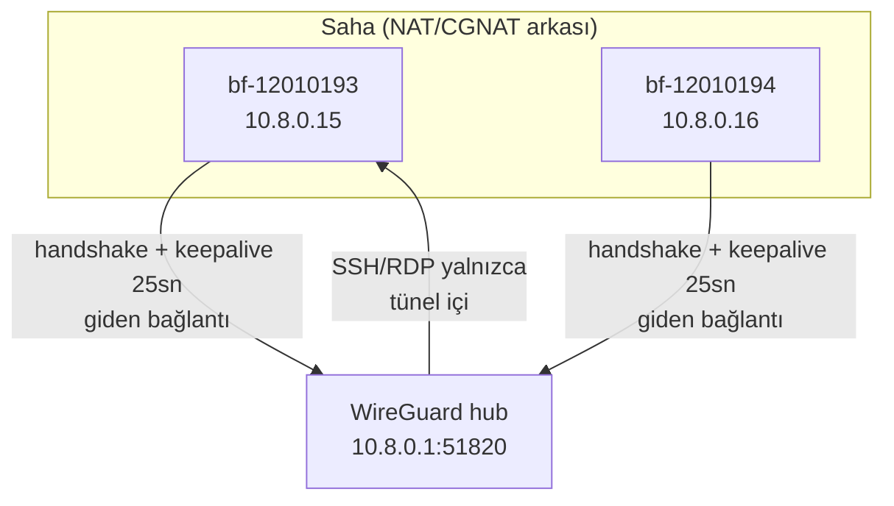

# 08 — WireGuard Ağı ve Network

> Kısa özet: Hub-spoke WireGuard topolojisi: merkez hub, her saha cihazı `bf-<8hane>` peer'ı, `PersistentKeepalive = 25`, boot'ta otomatik tünel. SSH/RDP yalnızca tünel içinden erişilir; saha internetindeki Turkcell paket bitimi/dönüşü etkileri bu dosyadadır.

- Dosya: `docs/08-WIREGUARD-AND-NETWORK.md`
- İlgili kararlar: `24-DECISION-LOG.md#K-05` (hub-spoke + keepalive + otomatik reconnect), `K-12` (peer adı = cihaz kimliği), `K-04` (WG çökerse yedek kanallar)
- Durum: [ ] Taslak

---

## 1. Amaç

700 cihazlık VPN topolojisini, peer adlandırma sözleşmesini, NAT arkasında tüneli ayakta tutan keepalive değerini ve saha interneti (Turkcell mobil veri) gerçekleriyle başa çıkma planını sabitlemek.

## 2. Kapsam

- Kapsam içi: hub-spoke topoloji, peer = bayi ID eşleşmesi, keepalive, `wg-quick@wg0` otostart, subnet/IP planı, SSH/RDP'nin WG-arkası kuralı, Turkcell paket bitimi/dönüşü notu.
- Kapsam dışı: SSH anahtar politikası (06), RustDesk/MeshCentral kurulumu (07), firewall detayları (11).

## 3. Kararlar

```text
KARAR:    Hub-spoke WireGuard: merkez sunucu hub, her saha cihazı spoke (peer adı = `bf-<8hane>`); istemcide `PersistentKeepalive = 25` + `wg-quick@wg0` systemd enable; RDP/SSH dış dünyaya kapalı, yalnızca WireGuard arkasında.
GEREKÇE:  Resmi QuickStart NAT arkasındaki eş için 25 sn keepalive'i "geniş güvenlik-duvarı yelpazesiyle çalışan makul aralık" olarak verir; `wg-quick@.service` Ubuntu paketinden gelir, enable = açılışta otomatik VPN. Elektrik kesintisi sonrası cihaz açılınca VPN kendiliğinden gelir.
ALTERNATİF: Keepalive kapalı / agresif 10 sn — kapalı NAT eşlemesini düşürür, agresif değer saha verisi olmadan yazılmaz; PİLOT-1 kopma sayacına göre ayarlanır.
RİSK:     Turkcell CGNAT davranışı resmi kaynaktan doğrulanamaz (operatör bilgisi); azaltma: PİLOT-1'de 7/24 kopma sayacı, aralık saha verisiyle ayarlanır.
MALİYET:  Ücretsiz.
LİSANS:   WireGuard OSS (Ubuntu paketi `wireguard-tools 1.0.20250521-1ubuntu1`) — https://www.wireguard.com/quickstart/ + https://packages.ubuntu.com/resolute/wireguard-tools (doğrulanma: 2026-09-15).
```

```text
KARAR:    Her WireGuard peer adı cihaz kimliğine eşittir (`bf-<8hane>` = hostname = Ansible inventory adı = monitoring etiketi); hub tarafında peer başına sabit tünel IP'si atanır.
GEREKÇE:  Tek kimlik (K-12) 9 sistemde join anahtarıdır; peer adı farklı olsaydı WG log'undan cihaz bulmak manuel eşleştirme gerektirirdi. Sabit IP = envanterde `bf-<no> → 10.x` haritası, runbook ve monitoring sorguları deterministik olur.
ALTERNATİF: Rastgele peer adı / dinamik IP — okunamaz, izlenemez → elendi.
RİSK:     Bayi no değişirse peer yeniden adlandırılmalı; azaltma: 02-NAMING yeniden-no prosedürü.
MALİYET:  Ücretsiz.
LİSANS:   Yok (isimlendirme standardı).
```

## 4. Neden Bu Karar?

Saha cihazları NAT/CGNAT arkasındadır; merkez onlara ulaşamaz, onlar merkeze çıkar. Hub-spoke bu gerçeğe uyar: spoke keepalive ile NAT eşlemesini canlı tutar, hub yalnızca dinler. 25 sn, resmi dokümanın "makul aralık" değeridir — saha ölçümü olmadan daha agresif yazmak veri israfı, kapatmak kopma demektir. Peer = bayi ID kuralı, 700 peer'lı hub config'ini insan tarafından okunabilir tutar.

## 5. Alternatifler

| Alternatif | Artı | Eksi | Sonuç |
|---|---|---|---|
| Keepalive kapalı | Az trafik | NAT eşlemesi düşer, tünel ölür | Elendi |
| Keepalive 10 sn | Daha canlı eşleme | Saha verisi olmadan veri israfı | Yedek (PİLOT-1 verisine göre) |
| Full-mesh | Spoke'lar arası doğrudan | 700 cihazda key/config patlaması | Elendi |
| Tailscale/ZeroTier | Kolay | Freemium, merkezi kimlik | Elendi (K-04) |

## 6. Avantajlar

- Kernel-seviyesi VPN: düşük CPU, düşük gecikme, mini PC dostu.
- Otostart: elektrik kesintisi sonrası teknisyen müdahalesi gerekmez.
- Sabit IP + peer adı = monitoring ve Ansible'da doğrudan adresleme.

## 7. Dezavantajlar

- Hub tek darboğaz: 700 eşin handshake + trafiği tek VDS'ten geçer (yük testi gerekir).
- CGNAT davranışları (özellikle mobil) resmi kaynaktan doğrulanamaz; ayar saha verisine bağımlıdır.
- Peer ekleme/çıkarma merkez config'inde yapılır; otomasyonsuz 700 peer yönetilemez (09'a bağımlılık).

## 8. Riskler

| Risk | Olasılık | Etki | Azaltma |
|---|---|---|---|
| Turkcell CGNAT NAT eşlemesini erken düşürür | Orta | Orta | PİLOT-1 7/24 kopma sayacı; aralık saha verisiyle ayarlanır |
| Turkcell paket bitimi → veri durur | Orta | Yüksek | Paket izleme + bitim alarmı (bkz. §9); kota-dostu keepalive |
| Hub VDS darboğazı (700 eş) | Orta | Yüksek | Yük testi + peer başına trafik limiti; gerekirse 2. hub |
| Peer private key sızıntısı | Düşük | Orta | Peer bazlı iptal (tek peer silinir, filo etkilenmez) |

## 9. Uygulama Planı

1. Merkez hub kurulur, subnet planı dondurulur (ör. `10.8.0.0/16`, hub `10.8.0.1`, cihazlara sabit `/32`).
2. Her cihaz için peer üretilir: adı `bf-<8hane>`, tünel IP'si envanter haritasından.
3. İstemci config'i (`/etc/wireguard/wg0.conf`): hub endpoint + `PersistentKeepalive = 25` + `wg-quick@wg0 enable`.
4. Peer ekleme/çıkarma Ansible rolüyle yapılır (09); hub config'i Git'te sürümlenir.
5. PİLOT-1'de kopma sayacı koşar (handshake yaşı metriği 14'te), keepalive saha verisiyle ayarlanır.

```bash
# örnek: istemci konfigürasyonu (değerler envanterden gelir)
# /etc/wireguard/wg0.conf
# [Interface] PrivateKey = <cihaz-özel> / Address = 10.8.0.15/32
# [Peer] PublicKey = <hub-genel> / Endpoint = <hub>:51820
# PersistentKeepalive = 25 / AllowedIPs = 10.8.0.0/16

sudo systemctl enable --now wg-quick@wg0
sudo wg show wg0 latest-handshakes   # kopma sayacı girdisi
```

### Turkcell paket bitimi / dönüşü notu

Saha bağlantısı Turkcell mobil veri ise iki gerçek vardır: (1) hat CGNAT arkasındadır — merkez cihaza ulaşamaz, keepalive'lı giden tünel zorunludur; (2) kota bitiminde veri durur veya hız düşer — tünel sessizce ölür, cihaz "çevrimdışı" görünür ama arıza değildir. Önlemler: kota-dostu keepalive (25 sn varsayılan, PİLOT verisiyle ayarlanır; gereksiz agresif değer kotayı eritir), paket bitimine Uptime Kuma "last seen" alarmı + sorumlu bayiye bildirim akışı (14), kota dönüşünde tünelin kendiliğinden toparlanması (`wg-quick` + keepalive yeniden handshake eder, ek işlem gerekmez). Paket yenileme/dönüş prosedürü (hat sahibi, yenileme adımı) 18-ROLLOUT runbook'una yazılır — bu dosya yalnızca teknik davranışı sabitler.

## 10. Test Planı

| Test | Beklenen sonuç | Ortam |
|---|---|---|
| Boot sonrası `wg show` handshake | 3 dk içinde güncel handshake | LAB(2) |
| NAT arkasında 24 saat tünel | Kopma yok (sayaç temiz) | P1(5) |
| Kota simülasyonu (veri kes) → geri ver | Tünel kendiliğinden toparlanır | LAB(2) |
| SSH/RDP internetten tarama | Kapalı; yalnızca `10.8.0.0/16` içinden açık | LAB(2) |
| 700 eş yük projeksiyonu | Hub CPU/bant genişliği sınırlar içinde | Yük testi |

## 11. Rollback

1. Hatalı hub config'i Git'teki önceki sürüme döndürülür, `systemctl reload wg-quick@wg0`.
2. Keepalive değişikliği sorun çıkarırsa önceki değere Ansible ile toplu dönüş (10-UPDATE dalga sırası).
3. Son çare: WG down iken RustDesk/MeshCentral (07) ile cihaza girilip config elle düzeltilir.

## 12. Kontrol Listesi

- [ ] Peer adları `bf-<8hane>` ile birebir, envanterle eşleşiyor.
- [ ] Tüm istemcilerde `PersistentKeepalive = 25` (veya PİLOT-onaylı değer).
- [ ] `wg-quick@wg0` tüm sahada enable.
- [ ] SSH/RDP yalnızca WG arayüzünde dinliyor.
- [ ] PİLOT-1 kopma sayacı koşuyor, sonuç 24-DECISION-LOG'a işlenecek.

## 13. Açık Sorular

- [ ] Keepalive'ın PİLOT-1 verisine göre 25 sn'de kalıp kalmayacağı (sahibi: 08 yazarı, P1 sonrası).
- [ ] Hub'un 700 eşi tek VDS'te taşıyıp taşımayacağı — yük testi (sahibi: 25-ROADMAP).
- [ ] Turkcell kota/bitim prosedürünün işletme sahibi (sahibi: 18-ROLLOUT yazarı).

---

## Ek: Mermaid — hub-spoke + keepalive


