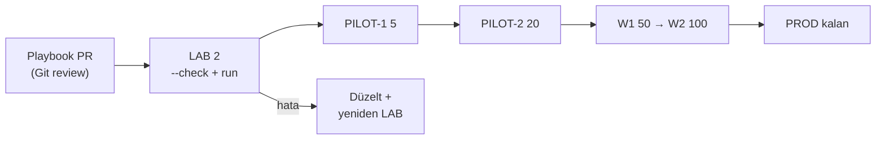

# 09 — Filo Yönetimi (Ansible + Semaphore)

> Kısa özet: 700 cihazın otomasyonu Ansible CLI (agent'sız, SSH) ile yapılır; operatör arayüzü Semaphore UI Community'dir (self-hosted, MIT). 15 standart işlem, tek/grup/pilot/tüm-filo hedefleme ve Semaphore Community sınırları bu dosyadadır.

- Dosya: `docs/09-FLEET-MANAGEMENT.md`
- İlgili kararlar: `24-DECISION-LOG.md#K-06` (Ansible + Semaphore Community), `K-13` (SSH anahtar dağıtımı), `K-12` (inventory adı = `bf-<no>`), `K-11` (dalgalı yayılım)
- Durum: [ ] Taslak

---

## 1. Amaç

700 cihaza komut/config güncellemesini güvenli, tekrarlanabilir ve onaylı yaymanın yolunu sabitlemek: hangi araç, hangi 15 standart işlem, hangi hedefleme seviyeleri, Community sürümünün sınırlarında nasıl çalışılır.

## 2. Kapsam

- Kapsam içi: Ansible rolü/inventory düzeni, 15 standart işlem, hedefleme seviyeleri (tek/grup/pilot/tüm-filo), Semaphore kurulumu + Community sınırları, Semaphore-down yedeği.
- Kapsam dışı: monitoring (14), update onay zinciri detayı (10), SSH anahtar politikası (06).

## 3. Kararlar

```text
KARAR:    Birincil filo otomasyonu Ansible CLI (SSH, agent'sız); operatör arayüzü Semaphore UI Community (self-hosted, MIT). Hiçbir playbook Pro/Enterprise özelliğine bağlanmaz.
GEREKÇE:  En düşük hareketli parça (SSH + YAML + tek Go binary); 700 cihazda ek agent/master/K8s maliyeti yok. Community ücretsizliği resmi fiyat sayfasıyla kanıtlı ("$0, free forever"); Pro en fazla 500 managed node desteklediği için 700 cihazda ücretli yol zaten kapalı.
ALTERNATİF: AWX (K8s yükü + release'ler refactoring nedeniyle duraklatıldı → elendi); Salt (minion agent + master PKI → elendi); Rudder Community (relay/Enterprise modülleri + öğrenme eğrisi → elendi); MeshCentral (erişim aracı, filo otomasyonu değil → bu rolde elendi).
RİSK:     Semaphore tek nokta arızası → Ansible CLI bağımsız çalışır (UI çökse filo durmaz). Community'de OIDC/2FA/Vault yok → Semaphore yalnızca WireGuard arkasında, erişim VPN + SSH anahtarı ile; gizliler yerleşik şifreli Key Store'da.
MALİYET:  Ücretsiz (kendi VDS'i üzerinde).
LİSANS:   Ansible GPL-3.0 — https://github.com/ansible/ansible; Semaphore Community MIT — https://github.com/semaphoreui/semaphore + https://semaphoreui.com/pricing (doğrulanma: 2026-09-15).
```

```text
KARAR:    Tüm filo işlemleri 15 standart işlemden biri olarak Semaphore task şablonu + Ansible playbook/rolüyle tanımlanır; serbest komut yalnızca acil kır cam prosedürüyle koşar.
GEREKÇE:  15 sabit işlem = denetlenebilir, test edilebilir, rollback'i tanımlı yüzey; serbest komut 700 cihazda yazım hatasını filo arızasına çevirir.
ALTERNATİF: Serbest ad-hoc komut serbestliği — insan hatası blast-radius'u nedeniyle elendi.
RİSK:     16. ihtiyaçta şablon dışı kalma; azaltma: yeni işlem teklifi PR ile 15 listesine eklenir (§13).
MALİYET:  Ücretsiz.
LİSANS:   Yok (operasyon standardı).
```

```text
KARAR:    Hedefleme 4 seviyelidir: tek cihaz → grup → pilot dalga → tüm filo; tüm-filoya çıkış yalnızca pilot dalga başarısından sonra, onay adımlı Semaphore pipeline ile yapılır.
GEREKÇE:  10-UPDATE dalga zincirinin (LAB/P1/P2/W1/W2/PROD) filo-operasyon karşılığıdır; playbook hatası LAB(2)'de yakalanır, 700 cihaza yayılmaz.
ALTERNATİF: Doğrudan tüm-filo çalıştırma — tek hatanın 700 katı etki nedeniyle elendi.
RİSK:     Yanlış grup etiketi yanlış hedefe koşar; azaltma: `--limit` + `--check` kuru koşu zorunlu ön adım.
MALİYET:  Ücretsiz.
LİSANS:   Yok (operasyon standardı).
```

## 4. Neden Bu Karar?

700 cihazda ajanlı mimariler (Salt minion, Rudder agent, AWX+K8s) her cihaza bir ek yük ve merkeze bir ek servis bindirir. Ansible'da ajan yoktur: SSH varsa filo vardır. Semaphore, CLI bilgisi olmayan operatörün (saha sorumlusu) güvenli düğmelere basmasını sağlar; CLI ise Semaphore çöktüğünde bağımsız yedektir. Pro sürüm 500 node ile sınırlı olduğundan 700 cihazda zaten kullanılamaz — Community sınırı bir eksik değil, mimari sabittir.

## 5. Alternatifler

| Alternatif | Artı | Eksi | Sonuç |
|---|---|---|---|
| AWX | Güçlü UI, RBAC | K8s zorunlu, release'ler duraklatıldı | Elendi |
| Salt | Ölçeklenir | Minion agent + master PKI | Elendi |
| Rudder Community | Politika motoru | Relay/Enterprise modülleri, öğrenme eğrisi | Elendi |
| Semaphore Pro | Ek özellikler | 500 node limiti (700'e yetmez) + ücret | Elendi |
| MeshCentral (filo rolü) | Zaten kurulu | Toplu config/rollback disiplini yok | Bu rolde elendi |

## 6. Avantajlar

- Agent'sız: saha imajına ek yük yok, yeni cihaz envantere girer girmez yönetilir.
- Semaphore down olsa filo durmaz (Ansible CLI bağımsız).
- 15 sabit işlem + 4 hedefleme seviyesi = hata yüzeyi küçük, denetim izi tam.

## 7. Dezavantajlar

- Community'de OIDC/2FA/Vault yok — erişim disiplini (WG-arkası + Key Store) manuel korunmalı.
- Eşzamanlı 700 SSH bağlantısı Semaphore/Ansible fork ayar + hub bant genişliği ister (yük testi §13).
- Windows-odaklı teknisyen için YAML/playbook eşiği (Semaphore düğmeleriyle kapatılır).

## 8. Riskler

| Risk | Olasılık | Etki | Azaltma |
|---|---|---|---|
| Playbook hatası filoya yayılır | Orta | Yüksek | Dalgalı yayılım + `--check` kuru koşu + LAB zorunluluğu |
| Semaphore çöker | Düşük | Orta | Ansible CLI bağımsız çalışır (K-06) |
| Community'de kimlik disiplini bozulur | Orta | Yüksek | WG-arkası erişim + per-admin SSH key + Key Store; denetim (§12) |
| 700 eşzamanlı SSH hub'ı yorar | Orta | Orta | Fork/batch limitleri + dalga yayılımı; yük testi |

## 9. Uygulama Planı

1. Merkez: Semaphore Community (tek binary, WG-arkası) + Ansible CLI + Git-sürümlü playbook deposu kurulur.
2. Inventory: `bf-<no>` adları, grup etiketleri (bölge/pilot-dalga/donanım-profili), `ansible_user=blueforce`, per-admin key (06).
3. 15 standart işlem playbook/rol + Semaphore task şablonu olarak yazılır, LAB(2)'de test edilir.
4. Hedefleme boru hattı: tek → grup → pilot → tüm-filo; son adıma onay kapısı konur.
5. Semaphore-down tatbikatı: CLI ile aynı playbook'un koştuğu kanıtlanır (10-Test).

```bash
# örnek: kuru koşu + sınırlı hedef (zorunlu ön adım)
ansible-playbook -i inventory/prod.yml playbooks/bf-gui-off.yml --limit 'pilot1' --check
ansible-playbook -i inventory/prod.yml playbooks/bf-gui-off.yml --limit 'pilot1'

# örnek: tek cihaz teşhisi
ansible -i inventory/prod.yml 'bf-12010193' -m ping
```

### 15 standart işlem

| # | İşlem | Playbook/rol (ad) |
|---|---|---|
| 1 | ping (erişilebilirlik yoklaması) | `bf-ping.yml` |
| 2 | status (bf-status çıktısı toplama) | `bf-status.yml` |
| 3 | diagnostics (bf-diagnostics + bundle) | `bf-diagnostics.yml` |
| 4 | gui-on (grafik katmanı aç) | `bf-gui-on.yml` |
| 5 | gui-off (grafik katmanı kapat) | `bf-gui-off.yml` |
| 6 | reboot (kontrollü yeniden başlatma) | `bf-reboot.yml` |
| 7 | shutdown (kontrollü kapatma) | `bf-shutdown.yml` |
| 8 | ssh-keys (authorized_keys dağıtım/rotasyon) | `bf-ssh-keys.yml` |
| 9 | wg-rekey (WireGuard peer anahtar yenileme) | `bf-wg-rekey.yml` |
| 10 | docker-restart (MEG konteyner yeniden başlatma) | `bf-docker-restart.yml` |
| 11 | docker-update (sabit tag'e onaylı imaj geçişi) | `bf-docker-update.yml` |
| 12 | apt-update (onaylı paket güncellemesi, dalgalı) | `bf-apt-update.yml` |
| 13 | config-push (dosya/şablon dağıtımı) | `bf-config-push.yml` |
| 14 | log-collect (journald/destek paketi toplama) | `bf-log-collect.yml` |
| 15 | decommission (envanter + peer + key temizliği) | `bf-decommission.yml` |

### Hedefleme seviyeleri

| Seviye | Hedef | Onay |
|---|---|---|
| Tek | `bf-<no>` (arıza/teşhis) | Gerekmez (loglanır) |
| Grup | bölge / donanım profili etiketi | Grup sorumlusu |
| Pilot | P1(5) → P2(20) dalgaları | Merkezi admin |
| Tüm-filo | kalan cihazlar (W1/W2/PROD sırasıyla) | Merkezi admin + değişiklik kaydı (10) |

### Semaphore Community sınırları (çalışma kuralları)

- OIDC/SSO yok → kullanıcılar Semaphore yerel hesabı, erişim yalnızca WireGuard arkasından.
- 2FA yok → parola politikası + VPN zorunluluğu bu açığı kapatır; admin hesapları envanterde kayıtlı.
- Harici Vault entegrasyonu yok → gizliler Semaphore yerleşik şifreli Key Store'da; prod secret'ları playbook'a gömülmez.
- Global Runner / yüksek eşzamanlılık sınırları → 700 node yük testi yapılır; gerekirse runner sayısı + fork/batch ayarlanır (§13 açık soru).
- Hiçbir iş akışı Pro özelliğine bağlanmaz (Community'de çalışmayan şablon yazılmaz).

## 10. Test Planı

| Test | Beklenen sonuç | Ortam |
|---|---|---|
| 15 işlemin her biri LAB(2)'de | Başarılı + log'lu | LAB(2) |
| `--check` kuru koşu, değişimsiz playbook | "changed=0" | LAB(2) |
| Yanlış `--limit` denemesi | Onay kapısında durur / hedef dışı etkilenmez | LAB(2) |
| Semaphore kapalı → CLI run | Playbook başarıyla koşar | LAB(2) |
| Pilot dalga → tüm-filo boru hattı | Onay adımları çalışır | P1(5) |

## 11. Rollback

1. Her işlemin geri alma adımı playbook'ta tanımlıdır (config-push önceki sürümü basar, docker-update önceki tag'e döner).
2. Yayılım ortasında arıza: dalga durdurulur, etkilenmiş dalga 10-UPDATE rollback zinciriyle geri alınır.
3. Semaphore veritabanı bozulursa playbook deposu (Git) + inventory'den CLI ile işletim sürer; Semaphore yeniden kurulur.

## 12. Kontrol Listesi

- [ ] 15 işlemin playbook + Semaphore şablonu LAB-onaylı.
- [ ] Inventory adları `bf-<no>`, grup etiketleri güncel.
- [ ] `--check` ön adımı tüm şablonlarda zorunlu.
- [ ] Semaphore yalnızca WG arkasından erişilebilir.
- [ ] CLI yedeği tatbikatla kanıtlandı.
- [ ] Hiçbir şablon Pro/Enterprise özelliği kullanmıyor.

## 13. Açık Sorular

- [ ] Semaphore Global Runner sayısı + eşzamanlılık (fork/batch) — 700 node yük testi (sahibi: 25-ROADMAP).
- [ ] 16. standart işlem teklifi süreci (PR şablonu) (sahibi: 09 yazarı).
- [ ] Inventory kaynak gerçeği (statik dosya mı, API mi) (sahibi: 02-NAMING yazarı).

---

## Ek: Mermaid — dalgalı yayılım


