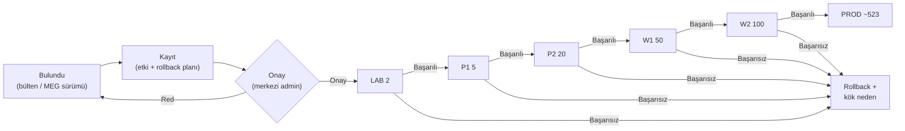

# 10 — Update ve Rollback Politikası

> Kısa özet: Sahaya onaysız update yasaktır: `unattended-upgrades` kapalıdır, her değişiklik LAB(2) → P1(5) → P2(20) → W1(50) → W2(100) → PROD dalgalarından ve merkezi onaydan geçer. Her dalganın geri alma planı yayından önce tanımlıdır.

- Dosya: `docs/10-UPDATE-AND-ROLLBACK-POLICY.md`
- İlgili kararlar: `24-DECISION-LOG.md#K-11` (otomatik update yasağı + dalgalar), `K-10` (`latest`/Watchtower yasakları), `K-09` (imaj bağı)
- Durum: [ ] Taslak

---

## 1. Amaç

700 cihazda "kendiliğinden değişen hiçbir şey olmasın" ilkesini teknik ve prosedürel kilitlerle garanti etmek: otomatik updater'ların kapatılması, onay zinciri, dalga planı ve rollback sözleşmesi.

## 2. Kapsam

- Kapsam içi: onaysız update yasağı, `unattended-upgrades` kapatma, dalga tanımı ve geçiş kriterleri, onay rolleri, rollback zinciri.
- Kapsam dışı: playbook yazım detayları (09), imaj üretim adımları (04), Docker tag disiplini detayı (12).

## 3. Kararlar

```text
KARAR:    Golden image'da `unattended-upgrades` kapatılır (`/etc/apt/apt.conf.d/20auto-upgrades` değerleri `0` + `apt-daily*.timer` maskeleme); tüm güncellemeler LAB→PİLOT→WAVE→PROD onay zincirinden geçer (dalgalar: LAB(2)/P1(5)/P2(20)/W1(50)/W2(100)/PROD).
GEREKÇE:  `unattended-upgrades` Ubuntu Server'da varsayılan kurulu ve etkindir, günde bir kez çalışır; kapatılmazsa 700 cihaz ilk açılışta güncellemeye kalkar ("onaysız update yasak" ilkesi delinir). Kaçan timer makine açılışında hemen tetiklenir (`Persistent=true` davranışı) — saha PC'leri sık kapanan makinelerdir.
ALTERNATİF: Otomatik security update'e izin verme — 700 cihazda eşzamanlı indirme + onaysız değişim riski nedeniyle elendi; security update'ler öncelik işaretli onaylı dalga ile çıkar.
RİSK:     Kapatma adımı imajda atlanırsa filo kendiliğinden güncellenir; azaltma: `blueforce-install.sh` final-check + monitoring'de `Unattended-Upgrade` durumu metriği.
MALİYET:  Ücretsiz.
LİSANS:   Yok (işletim sistemi yapılandırması) — https://ubuntu.com/server/docs/how-to/software/automatic-updates/ + https://manpages.ubuntu.com/manpages/resolute/en/man8/unattended-upgrade.8.html (doğrulanma: 2026-09-15).
```

```text
KARAR:    Onaysız update yasaktır: sahaya inen her değişiklik (OS paketi, Docker imajı, config, agent sürümü) değişiklik kaydı + merkezi admin onayı + dalga planı olmadan uygulanmaz; `latest` etiketi ve Watchtower gibi otomatik updater'lar yasaktır.
GEREKÇE:  700 ölçeğinde her "küçük varsayılan" (günlük otomatik update, hareketli etiket, otomatik imaj çekme) filo-çapı arızaya dönüşür; determinizm yalnızca sabit sürüm + onaylı yayılımla korunur.
ALTERNATİF: Güvenlik güncellemelerine otomatik izin — eşzamanlı indirme fırtınası + onaysız değişim riski nedeniyle elendi; acil güvenlik yaması "hızlandırılmış dalga" prosedürüyle (aynı zincir, kısaltılmış bekleme) çıkar.
RİSK:     Onay kuyruğu kritik yamayı geciktirir; azaltma: security dalgasına öncelik SLA'sı (§9).
MALİYET:  Ücretsiz.
LİSANS:   Yok (politika) — Docker yasak dayanağı için 12-DOCKER ve K-10'a bakılır.
```

```text
KARAR:    Rollback her yayının parçasıdır: dalgaya çıkmadan önce geri alma adımı (önceki paket sürümü / önceki imaj tag'i / önceki config) tanımlanır ve LAB'da geri dönüş testi yapılır; başarısız dalga bir sonrakine geçmez, etkilenmiş dalga geri alınır.
GEREKÇE:  Geri alması test edilmemiş yayın, 700 cihazda tek yönlü kapıdır; LAB'da kanıtlanan rollback, PROD'da gece yarısı kurtarma prosedürüne dönüşür.
ALTERNATİF: "Gerekirse bakarız" yaklaşımı — arıza anında doğaçlama riski nedeniyle elendi.
RİSK:     Geri alma adımı da bozuk çıkabilir; azaltma: son çare 17-RECOVERY yeniden-imaj prosedürü.
MALİYET:  Ücretsiz.
LİSANS:   Yok (operasyon standardı).
```

## 4. Neden Bu Karar?

Üç yasak tek ilkeden doğar: `unattended-upgrades` (işletim sistemi kendi kendine değişmesin), `latest` (hangi sürümün koştuğu her cihazda aynı bilinsin), Watchtower (hiçbir daemon izinsiz imaj çekmesin). Dalgalar (2 → 5 → 20 → 50 → 100 → ~523) hatanın blast-radius'unu geometrik olarak sınırlar: LAB'da yakalanan hata 2 cihazı etkiler, PROD'a sızan hata ancak 5 dalga kapısından geçmiş demektir.

## 5. Alternatifler

| Alternatif | Artı | Eksi | Sonuç |
|---|---|---|---|
| Otomatik security update | Hızlı yama | Eşzamanlı indirme + onaysız değişim | Elendi (hızlandırılmış dalga ile karşılanır) |
| Doğrudan tüm-filo yayın | Hızlı | Tek hatanın 700 katı | Elendi |
| Watchtower ile oto-imaj | Eforsuz güncellik | Politika ihlali + upstream arşivli | Elendi (K-10) |
| `latest` etiketi | Kolay | Determinizm kaybı | Elendi (K-10) |

## 6. Avantajlar

- Filo sürüm determinizmi: her cihazın ne koşturduğu envanterde bilinir.
- Hata erken dalgada yakalanır; PROD'a ulaşan değişiklik 5 kez kanıtlanmıştır.
- Acil yama da aynı zincirden geçer — hız, disiplinsizlikle değil kısaltılmış beklemeyle kazanılır.

## 7. Dezavantajlar

- Yayın döngüsü yavaştır (özellikle PROD'a tam yayılım günler sürebilir).
- Onay kuyruğu ve dalga beklemeleri operasyonel disiplin ister.
- Her yayın için rollback testi yazma maliyeti.

## 8. Riskler

| Risk | Olasılık | Etki | Azaltma |
|---|---|---|---|
| `unattended-upgrades` imajda açık unutulur | Orta | Yüksek | install.sh final-check + monitoring metriği (K-11) |
| Onay kuyruğu kritik yamayı geciktirir | Orta | Yüksek | Security dalgasına öncelik SLA'sı (§9) |
| Dalga atlama ("acil" bahanesiyle) | Orta | Yüksek | Semaphore onay kapısı + değişiklik kaydı zorunluluğu |
| Rollback adımı da bozuk | Düşük | Yüksek | LAB geri-dönüş testi + 17-RECOVERY son çare |

## 9. Uygulama Planı

1. Golden image: `20auto-upgrades` değerleri `0`, `apt-daily*.timer` maskeli, final-check'te doğrulamalı (04).
2. Değişiklik kaydı açılır: kapsam (paket/imaj/config), etkilenen sürümler, geri alma adımı, dalga takvimi.
3. Merkezi admin onaylar; yayın Semaphore pipeline ile dalga sırasına girer (09).
4. Her dalgada sağlık kapısı: monitoring (14) + `bf-status` örneklemesi temizse sonraki dalga açılır.
5. Başarısız dalga: yayılım durdurulur, etkilenmiş dalga rollback zinciriyle geri alınır, kök neden kayda işlenir.

```bash
# örnek: otomatik update kilit denetimi (saha cihazında)
cat /etc/apt/apt.conf.d/20auto-upgrades   # iki değer de 0 olmalı
systemctl status apt-daily.timer apt-daily-upgrade.timer  # maskeli/inactive
```

### Dalga tanımı ve geçiş kriterleri

| Dalga | Büyüklük | Geçiş kriteri (sonraki dalgaya) |
|---|---|---|
| LAB | 2 cihaz | Fonksiyonel test + rollback testi geçti |
| P1 (PİLOT-1) | 5 cihaz | 24–48 saat sorunsuz + metrikler temiz |
| P2 (PİLOT-2) | 20 cihaz | 48–72 saat sorunsuz + saha geri bildirimi |
| W1 (WAVE-1) | 50 cihaz | Sağlık kapısı + onay yenileme |
| W2 (WAVE-2) | 100 cihaz | Sağlık kapısı + onay yenileme |
| PROD | kalan ~523 cihaz | W2 temizliği + final onay |

### Security yaması öncelik SLA'sı

Kritik güvenlik bülteninde aynı zincir kısaltılmış beklemeyle koşar (LAB saatler içinde, P1 aynı gün); bekleme kısaltılır, kapılar kaldırılmaz — onay ve rollback testi security dalgasında da zorunludur.

## 10. Test Planı

| Test | Beklenen sonuç | Ortam |
|---|---|---|
| `20auto-upgrades` değerleri + timer durumu | `0` / maskeli, 24 saatte otomatik apt yok | LAB(2) imaj denetimi |
| Kuru yayın (tüm dalgalar `--check`) | Değişim öngörüsü kayıtla eşleşir | LAB(2) |
| LAB rollback testi | Önceki sürüme dönüş + servis ayakta | LAB(2) |
| P1 48 saat gözlem | Metrik anomalisi yok | P1(5) |
| Dalga-durdurma tatbikatı | Yayılım durur, P1 geri alınır | P1(5) |

## 11. Rollback

1. Etkilenmiş dalga, değişiklik kaydındaki geri alma adımıyla önceki sürüme döndürülür (paket downgrade / önceki imaj tag'i / önceki config).
2. Geri alma sonrası sağlık kapısı (monitoring + `bf-status`) doğrulanır, kayda işlenir.
3. Geri alma da başarısızsa: cihaz 17-RECOVERY prosedürüyle önceki golden image'a döndürülür (LEVEL 9 son çare).
4. Kök neden bulunmadan yayına devam edilmez; zincir başa (LAB) sarar.

## 12. Kontrol Listesi

- [ ] `unattended-upgrades` tüm sahada kapalı (monitoring metriğiyle sürekli denetim).
- [ ] `latest`/`Watchtower` hiçbir saha cihazında yok (12 ile birlikte denetim).
- [ ] Her yayının değişiklik kaydı + onayı + rollback adımı var.
- [ ] Dalga kapıları atlanmadan işletildi (Semaphore log'uyla kanıtlı).
- [ ] Security SLA'sı runbook'ta yazılı, sorumlusu belli.

## 13. Açık Sorular

- [ ] Dalga bekleme sürelerinin (24–72 saat) PİLOT verisine göre kalibrasyonu (sahibi: 10 yazarı, P2 sonrası).
- [ ] Paket/imaj aynası (yerel mirror) gerekip gerekmediği — 700 cihazın eşzamanlı indirme yükü (sahibi: 25-ROADMAP).

---

## Ek: Mermaid — update onay akışı


