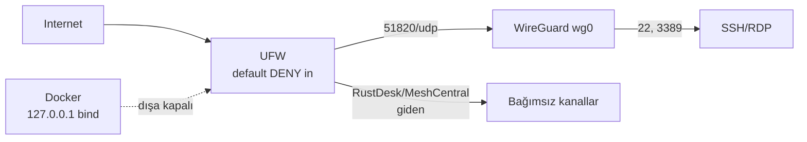

# 11 — Güvenlik Sertleştirme (Security Hardening)

> Kısa özet: saha cihazının güvenlik tabanı: UFW default DENY, WireGuard arayüz izinleri, Docker-UFW bypass çözümü, SSH sertleştirme. Teknik ekip ve denetim içindir.
>
> - Dosya: `docs/11-SECURITY-HARDENING.md`
> - İlgili kararlar: `24-DECISION-LOG.md#K-05`, `#K-10`, `#K-13`
> - Durum: [ ] Taslak

---

## 1. Amaç

700 saha cihazında varsayılan-kapalı ağ + en az ayrıcalık ilkesiyle saldırı yüzeyini küçültmek; Docker'ın UFW'yi baypas etme davranışını standart çözüme bağlamak.

## 2. Kapsam

- Kapsam içi: UFW politikası, WireGuard arayüz kuralları, Docker bypass çözümü, SSH/userspace sertleştirme, denetim komutları.
- Kapsam dışı: WireGuard kurulum detayı (08), Docker işletimi (12), kullanıcı/anahtar dağıtımı (06).

## 3. Kararlar

```text
KARAR:    UFW varsayılan politika: incoming DENY, outgoing ALLOW; izinler tek tek açılır.
GEREKÇE:  Varsayılan-kapalı, unutulan portu dışa kapatır; 700 cihazda en güvenli varsayılan budur.
ALTERNATİF: Varsayılan ALLOW + kara liste — unutulan servis dışa açılır, elendi.
RİSK:     Kural unutulursa meşru trafik kesilir; azaltma: LAB'da kural seti test edilir, bf-status denetler.
MALİYET:  Ücretsiz.
LİSANS:   UFW (Ubuntu paketi, GPL bileşenler) — https://manpages.ubuntu.com/manpages/resolute/en/man8/ufw.8.html (doğrulanma: 2026-09-15).
```

```text
KARAR:    SSH (22) ve RDP (3389) yalnızca WireGuard arayüzünden (`wg0`) kabul edilir; herkese açık internete kapalıdır.
GEREKÇE:  K-05 gereği yönetim düzlemi tünel arkasındadır; dış taramada port görünmez.
ALTERNATİF: İnternete açık SSH + fail2ban — kaba-kuvvet yüzeyini gereksiz büyütür, elendi.
RİSK:     WireGuard çökerse SSH erişimi kesilir; azaltma: RustDesk/MeshCentral bağımsız kanallar (K-04).
MALİYET:  Ücretsiz.
LİSANS:   Yok (yapılandırma).
```

```text
KARAR:    Docker-UFW bypass sorununun çözümü: yayımlanan tüm saha portları `127.0.0.1`'e bağlanır; `iptables:false` varsayılan çözüm değildir.
GEREKÇE:  Docker, yayımlanan portlarda UFW kurallarını baypas eder (resmi belgeli); localhost-bind, servisi dış arayüzden görünmez kılar, erişim WireGuard üzerinden olur.
ALTERNATİF: `iptables:false` — resmi doküman "çoğu kullanıcı için uygun değil" diye uyarır; yedek seçenek olarak tutulur.
RİSK:     Yanlış bind ile port dışa açılır; azaltma: `docker ps` + `ss -tlnp` denetimi imaj final-check'te.
MALİYET:  Ücretsiz (Docker CE).
LİSANS:   Docker CE ücretsiz — https://docs.docker.com/engine/network/packet-filtering-firewalls/ (doğrulanma: 2026-09-15).
```

```text
KARAR:    SSH sertleştirme: `blueforce` bakım kullanıcısı + anahtar zorunlu, password auth kapalı, root SSH kapalı (K-13 uygulanır).
GEREKÇE:  Kaba-kuvvet ve tek-key blast-radius riskini kapatır.
ALTERNATİF: Password auth — saldırı yüzeyi nedeniyle elendi.
RİSK:     Anahtar kaybı erişimsizlik; azaltma: per-admin anahtar + Ansible ile merkezi dağıtım.
MALİYET:  Ücretsiz.
LİSANS:   OpenSSH (BSD-lisanslı), ücretsiz.
```

## 4. Neden Bu Karar?

Üç filtre: (1) varsayılan-kapalı (UFW DENY + WG-arkası yönetim), (2) Docker gerçeğine uyum (bypass inkâr edilmez, localhost-bind ile etkisizleştirilir), (3) ücretsiz katman (ek güvenlik ürünü yok).

## 5. Alternatifler

| Alternatif | Artı | Eksi | Sonuç |
|---|---|---|---|
| Varsayılan ALLOW + kara liste | Kolay | Unutulan port dışa açılır | Elendi |
| İnternete açık SSH + fail2ban | Basit | Kaba-kuvvet yüzeyi | Elendi |
| `iptables:false` | Bypass'ı kökten keser | Docker ağ işlevlerini bozar, resmi uyarı var | Yedek |
| Ücretli EDR/host güvenlik ajanı | Merkezi konsol | Lisans maliyeti, sadelik ihlali | Elendi |

## 6. Avantajlar

- Tek standart kural seti 700 cihaza aynen uygulanır; denetimi Ansible ile otomatik.
- Docker bypass'ı mimari düzeyde çözülür, kural-dışı port açığı kalmaz.

## 7. Dezavantajlar

- localhost-bind, konteyner portunu doğrudan LAN'dan kullanılamaz kılar (erişim WG üzerinden olur — bilinçli tercih).
- UFW kural değişikliği hatalı playbook ile filoya yayılabilir; önce LAB(2).

## 8. Riskler

| Risk | Olasılık | Etki | Azaltma |
|---|---|---|---|
| Bypass yüzünden MEG portu dışa açılır | Orta | Yüksek | localhost-bind + final-check denetimi |
| Kural hatası WG trafiğini keser | Düşük | Yüksek | LAB testi + `ufw --dry-run` + konsol erişimi |
| Semaphore Community'de 2FA yok | Orta | Orta | Semaphore yalnızca WG arkasında |

## 9. Uygulama Planı

1. UFW varsayılanları ve taban kuralları uygulanır.
2. WireGuard arayüzüne SSH/RDP izni, dış dünyaya ret yazılır.
3. Docker portları `127.0.0.1` bind ile doğrulanır.
4. SSH sertleştirme (`PasswordAuthentication no`, `PermitRootLogin no`) uygulanır.

```bash
# UFW taban politikası
ufw default deny incoming
ufw default allow outgoing
ufw allow in on wg0 to any port 22 proto tcp
ufw allow in on wg0 to any port 3389 proto tcp
ufw allow 51820/udp
ufw enable

# durum denetimi
ufw status verbose
ss -tlnp | grep -v '127\.0\.0\.1'
```

```bash
# SSH sertleştirme denetimi
sshd -T | grep -Ei 'passwordauthentication|permitrootlogin'
```

## 10. Test Planı

| Test | Beklenen sonuç | Ortam |
|---|---|---|
| `ufw status verbose` | default DENY incoming | LAB(2) |
| Dış taramada 22/3389 | Kapalı (filtreli) | P1(5) |
| `ss -tlnp` bind denetimi | `0.0.0.0` bind yok | LAB(2) |
| Password ile SSH denemesi | Red | LAB(2) |
| WG down iken dış SSH | Bağlantı yok | P1(5) |

## 11. Rollback

1. Hatalı kuralda önceki UFW profili geri yüklenir (`ufw reset` + bilinen-iyi kural seti Ansible'dan).
2. SSH kilitlenmesinde konsol/RustDesk üzerinden düzeltilir.
3. Son çare: golden image yeniden kurulumu (17-RECOVERY).

## 12. Kontrol Listesi

- [ ] `ufw default deny incoming` tüm sahada aktif.
- [ ] 22/3389 yalnızca `wg0` üzerinden erişilebilir.
- [ ] Docker `0.0.0.0` bind yok.
- [ ] `PasswordAuthentication no`, `PermitRootLogin no` doğrulandı.

## 13. Açık Sorular

- [ ] WireGuard port numarası standardı (51820 varsayılan mı?) — 08 yazarı + LAB (sahibi: Faz 3).
- [ ] Ek UFW log seviyesi/rate-limit değerleri — PİLOT ölçümü (sahibi: 11 yazarı).

---

## Ek: Mermaid — Güvenlik katmanları


