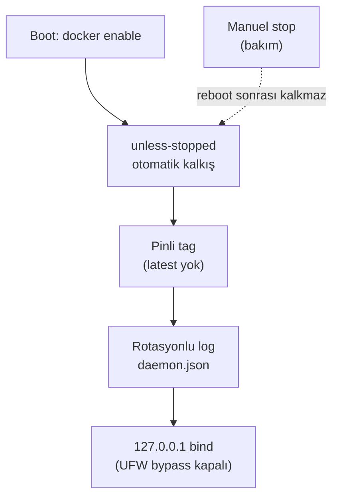

# 12 — Docker Operasyonları

> Kısa özet: saha Docker disiplini: otostart, `unless-stopped`, pinli imaj, `latest` yasağı, log rotasyonu, Watchtower yok. Konteyner işleten teknik ekip içindir.
>
> - Dosya: `docs/12-DOCKER-OPERATIONS.md`
> - İlgili kararlar: `24-DECISION-LOG.md#K-10`
> - Durum: [ ] Taslak

---

## 1. Amaç

Elektrik kesintisi sonrası konteynerlerin kendiliğinden ve doğru sürümle ayağa kalkması; disiplinsiz imaj/log davranışının 700 cihazda filo arızasına dönüşmesini engellemek.

## 2. Kapsam

- Kapsam içi: restart politikası, imaj pinleme, `latest`/Watchtower yasakları, log rotasyonu, port bind kuralı, otostart denetimi.
- Kapsam dışı: MEG kabul testleri (13), log içerik politikası (15), boot zinciri systemd sırası (16).

## 3. Kararlar

```text
KARAR:    Tüm saha konteynerlerinde restart politikası `unless-stopped` kullanılır; Docker daemon açılışta otomatik başlar.
GEREKÇE:  `unless-stopped`, teknisyenin bakım için durdurduğunu reboot sonrası sürpriz çalıştırmaz; elektrik kesintisi "manuel stop" sayılmadığı için kurtarma aynen çalışır. Daemon enable olmadan otostart anlamsızdır.
ALTERNATİF: `always` — bakım-stop'u reboot'ta deler, elendi. `on-failure`/`no` — kesinti kurtarması sağlamaz, elendi.
RİSK:     Yanlış politikayla kritik konteyner kalkmaz; azaltma: `docker inspect` final-check'te.
MALİYET:  Ücretsiz (Docker CE).
LİSANS:   Docker CE ücretsiz — https://docs.docker.com/engine/containers/start-containers-automatically/ (doğrulanma: 2026-09-15).
```

```text
KARAR:    `latest` etiketi yasaktır; her imaj sabit tag ile pinlenir (örn. `meg:1.2.3`); digest pinleme (`@sha256`) PİLOT-2'de değerlendirilir.
GEREKÇE:  Hareketli `latest` 700 cihazda determinizmi bozar; "onaysız update yasak" ilkesi sabit tag gerektirir.
ALTERNATİF: `latest` + periyodik pull — onaysız değişim riski, elendi.
RİSK:     Tag yeniden yazılırsa (mutable tag) pinleme delinir; azaltma: PİLOT-2'de digest kararı.
MALİYET:  Ücretsiz.
LİSANS:   Yok (operasyon politikası).
```

```text
KARAR:    Watchtower (veya eşdeğeri otomatik güncelleyici) sahada yasaktır ve kurulmaz.
GEREKÇE:  Hem "onaysız update yasak" ilkesini ihlal eder hem upstream'de arşivlenmiştir.
ALTERNATİF: Programlı otomatik pull — politika ihlali, elendi.
RİSK:     Manuel update gecikmesi; azaltma: 10-UPDATE dalga zinciri.
MALİYET:  Ücretsiz.
LİSANS:   Watchtower arşiv durumu — https://github.com/containrrr/watchtower (doğrulanma: 2026-09-15).
```

```text
KARAR:    Log rotasyonu `daemon.json`'da zorunludur (`json-file`: `max-size` + `max-file`); rotasyonsuz log ile cihaz sahaya çıkmaz.
GEREKÇE:  Docker varsayılan `json-file` logu rotasyon yapmaz; dolan disk = kilitlenen cihaz (700 katı etki).
ALTERNATİF: Rotasyonsuz + periyodik manuel temizlik — unutulur, elendi.
RİSK:     Değerler MEG hacmine göre yanlışsa log kaybolur veya disk dolar; azaltma: PİLOT'ta hacim ölçülür, değer sabitlenir.
MALİYET:  Ücretsiz.
LİSANS:   Docker CE ücretsiz — https://docs.docker.com/engine/logging/configure/ (doğrulanma: 2026-09-15).
```

```text
KARAR:    Yayımlanan portlar `127.0.0.1`'e bağlanır (UFW bypass'a karşı); kural 11-HARDENING ile birlikte denetlenir.
GEREKÇE:  Docker yayımlanan portlarda UFW'yi baypas eder (resmi belgeli); localhost-bind dışa açılmayı kapatır.
ALTERNATİF: `iptables:false` — resmi uyarı nedeniyle varsayılan değil, yedek.
RİSK:     Hatalı compose ile `0.0.0.0` bind; azaltma: final-check'te `ss -tlnp` denetimi.
MALİYET:  Ücretsiz.
LİSANS:   Docker CE ücretsiz — https://docs.docker.com/engine/network/packet-filtering-firewalls/ (doğrulanma: 2026-09-15).
```

## 4. Neden Bu Karar?

Tek ilke — öngörülebilir filo: cihaz neyle kapandıysa onunla açılır (unless-stopped), hangi sürüm onaylandıysa o çalışır (pinli tag), disk logla dolmaz (rotasyon), hiçbir şey kendiliğinden güncellenmez (Watchtower yok).

## 5. Alternatifler

| Alternatif | Artı | Eksi | Sonuç |
|---|---|---|---|
| `always` | Her koşulda ayakta | Bakım davranışını bozar | Elendi |
| `latest` serbest | Kolay pull | Determinizm yok | Elendi |
| Watchtower | Otomatik güncellik | Politika ihlali + arşivli | Elendi |
| `iptables:false` (varsayılan) | Bypass'ı keser | Resmi "çoğu kullanıcı için uygun değil" uyarısı | Yedek |

## 6. Avantajlar

- Kesinti kurtarma ile bakım öngörülebilirliği aynı politikada birleşir.
- Deterministik sürüm + rotasyonlu log = uzaktan tanı güvenilirliği.

## 7. Dezavantajlar

- Sabit tag disiplini update prosedürüne yük bindirir (10-UPDATE ile işletilir).
- Rotasyon değerleri PİLOT ölçümüne kadar kesinleşmez.

## 8. Riskler

| Risk | Olasılık | Etki | Azaltma |
|---|---|---|---|
| `max-size/max-file` yanlış ayar | Orta | Orta | PİLOT hacim ölçümü |
| Mutable tag yeniden yazımı | Düşük | Yüksek | Digest pinleme değerlendirmesi (PİLOT-2) |
| Daemon enable unutulur | Düşük | Yüksek | install.sh final-check |

## 9. Uygulama Planı

1. `daemon.json` yazılır (log rotasyonu), daemon enable edilir.
2. Compose dosyalarında restart + sabit tag + localhost bind uygulanır.
3. Final-check ile `docker inspect` / `ss` denetimi yapılır.

```bash
# daemon.json (örnek — boyut değerleri PİLOT ölçümüyle kesinleşir)
cat /etc/docker/daemon.json
# {"log-driver":"json-file","log-opts":{"max-size":"10m","max-file":"3"}}

systemctl enable --now docker

# compose parçası (örnek)
# ports: ["127.0.0.1:8080:8080"]
# restart: unless-stopped
# image: meg:1.2.3  # latest YASAK
```

```bash
# denetim
docker inspect --format '{{.HostConfig.RestartPolicy.Name}} {{.Config.Image}}' $(docker ps -aq)
docker info --format '{{json .LoggingDriver}}'
ss -tlnp | grep -v '127\.0\.0\.1'
```

## 10. Test Planı

| Test | Beklenen sonuç | Ortam |
|---|---|---|
| `docker inspect` restart | `unless-stopped` tamamında | LAB(2) |
| İmaj tag denetimi | `latest` yok, sabit tag var | LAB(2) |
| Güç kesintisi simülasyonu | Konteynerler otomatik kalkar | LAB(2) |
| Manuel stop + reboot | Durdurulan kalkmaz | LAB(2) |
| Log boyutu denetimi | `max-size/max-file` aşımı yok | P1(5) |

## 11. Rollback

1. Yanlış imajda önceki pinli tag'e dönüş (`docker compose pull/pull + up -d` onaylı sürümle).
2. Bozuk daemon.json'da bilinen-iyi dosya + `systemctl restart docker`.
3. Son çare: 10-UPDATE rollback zinciri.

## 12. Kontrol Listesi

- [ ] `systemctl is-enabled docker` → enabled.
- [ ] Tüm saha konteynerleri `unless-stopped`.
- [ ] `latest` yok, sabit tag var.
- [ ] Watchtower kurulu değil.
- [ ] `daemon.json` rotasyon aktif.
- [ ] `0.0.0.0` bind yok.

## 13. Açık Sorular

- [ ] `max-size/max-file` kesin değerleri — PİLOT hacim ölçümü (sahibi: 12 yazarı).
- [ ] Digest pinleme (`@sha256`) kararı — PİLOT-2 (sahibi: 12 yazarı).

---

## Ek: Mermaid — Konteyner yaşam döngüsü


