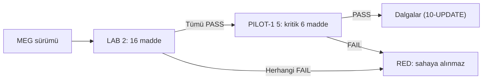

# 13 — MEG Linux Kabul Kriterleri (Acceptance)

> Kısa özet: MEG'in saha Linux'unda çalışır sayılması için 16 maddelik kabul listesi; paket içyapısı varsayılmaz, yalnızca gözlenebilir davranış test edilir. Kabul ekibi ve LAB sorumlusu içindir.
>
> - Dosya: `docs/13-MEG-LINUX-ACCEPTANCE.md`
> - İlgili kararlar: `24-DECISION-LOG.md#K-02`, `#K-10`, `#K-14`
> - Durum: [ ] Taslak

---

## 1. Amaç

"Çalışıyor" iddiasını denetlenebilir eşiğe bağlamak: MEG sürümü, GNOME + Docker zemininde 16 maddeyi geçmeden PİLOT dalgasına alınmaz.

## 2. Kapsam

- Kapsam içi: kurulum/çalışma/sağlık/log/kurtarma gözlemleri (16 madde).
- Kapsam dışı: MEG paket içyapısı, kaynak kodu, lisans koşulları (varsayılmaz; satıcı dokümanına havale).

## 3. Kararlar

```text
KARAR:    MEG kabulü 16 maddelik davranış listesidir; paket detayı varsayılmaz, her madde PASS/FAIL ile kapatılır.
GEREKÇE:  İçyapı varsayımı her satıcı sürümünde kırılır; gözlenebilir davranış (kurulur, kalkar, yanıt verir, log üretir, kurtarır) sürümler arası sabittir.
ALTERNATİF: Paket-içi dosya yolu kontrolü — satıcı değişikliğinde test çöp olur, elendi.
RİSK:     Davranış testleri içsel bozulmayı geç fark eder; azaltma: metrik + log izleme (14/15) tamamlayıcıdır.
MALİYET:  Ücretsiz (test emeği).
LİSANS:   Yok (kabul prosedürü).
```

```text
KARAR:    Kabul GNOME + `unless-stopped` + pinli tag zemininde koşar; `latest` ile kabul geçersizdir.
GEREKÇE:  K-02/K-10 zemini dışında geçen test saha gerçeğini temsil etmez.
ALTERNATİF: XFCE/latest zeminde kabul — saha dışı, elendi.
RİSK:     Yok (zemin standardı 03/12'de kilitli).
MALİYET:  Ücretsiz.
LİSANS:   Yok.
```

## 4. Neden Bu Karar?

MEG satıcı bağımlılığının en kırılgan noktasıdır; kabul listesi satıcının ne dağıttığına değil cihazın ne gösterdiğine bakar. Böylece sürüm değişse bile liste yaşar.

## 5. Alternatifler

| Alternatif | Artı | Eksi | Sonuç |
|---|---|---|---|
| Paket-içi yol kontrolü | Hızlı | Sürümde kırılır | Elendi |
| Tek "açılıyor mu" testi | Çok kolay | Kurtarma/log körlüğü | Elendi |
| Satıcı beyanıyla kabul | Emeksiz | Doğrulanmamış | Elendi |

## 6. Avantajlar

- 16 madde tek sayfada denetlenir; LAB(2) sonucu PİLOT kapısı olur.
- Satıcı sürümü değişse liste değişmez.

## 7. Dezavantajlar

- Liste, MEG işlevsel doğruluğunu (iş mantığı) test etmez; yalnızca platform uyumunu test eder.
- 16 maddenin tamamı her sürümde yeniden koşulmalıdır.

## 8. Riskler

| Risk | Olasılık | Etki | Azaltma |
|---|---|---|---|
| GNOME grafik bağımlılığı/ek ayar eksik | Orta | Yüksek | Madde 9–10 erken yakalar |
| Log hacmi diski doldurur | Orta | Orta | Madde 12 + 12-DOCKER rotasyonu |
| Kesinti sonrası MEG kalkmaz | Düşük | Yüksek | Madde 13–14 |

## 9. Uygulama Planı

Kabul, LAB(2) cihazında pinli tag ile koşar; her madde PASS/FAIL işlenir, sonuç kabul tutanağına yazılır.

```bash
# kabul öncesi zemin denetimi
docker inspect --format '{{.HostConfig.RestartPolicy.Name}} {{.Config.Image}}' <meg-container>
systemctl is-enabled docker
ufw status verbose
```

### MEG ACCEPTANCE — 16 madde

| # | Madde | Nasıl bakılır | PASS eşiği |
|---|---|---|---|
| 1 | Kurulum tamamlanır | Onaylı prosedürle kurulum uca kadar gider | Hatasız tamamlanır |
| 2 | Sabit sürüm kimliği | Sürüm/etiket sorgulanır | `latest` yok, sürüm okunur ve tutanakla eşleşir |
| 3 | Konteyner/servis ayakta | `docker ps` / servis durumu | Çalışıyor (restart döngüsü yok) |
| 4 | Restart politikası | `docker inspect` | `unless-stopped` |
| 5 | Port bind | `ss -tlnp` | Dışa açık `0.0.0.0` bind yok |
| 6 | Sağlık yanıtı | Sağlık endpoint'i/komutu (varsa) veya süreç canlılığı | Yanıt veriyor / süreç yaşıyor |
| 7 | Temel işlev duman testi | Tanımlı en küçük iş akışı uçtan uca | Hatasız tamamlanır |
| 8 | Yeniden başlatmada toparlanma | Konteyner restart edilir | ≤ tanımlı sürede sağlığa döner |
| 9 | GNOME uyumu | GNOME oturumunda grafik gereksinim (varsa) açılır | Görüntü/oturum hatasız |
| 10 | RDP üzerinden erişim | xRDP + GNOME ile uzaktan oturum | Oturum açılır, kritik hata yok |
| 11 | Log üretimi | Log çıktısı gözlenir | Tanımlı olaylar logda görülür |
| 12 | Log rotasyonu altında çalışma | Rotasyon aktifken 24 saat çalışma | Disk taşması yok, log kaybı kritik değil |
| 13 | Güç kesintisi kurtarması | Güç kesintisi simülasyonu | Boot sonrası kendiliğinden sağlığa döner |
| 14 | WireGuard yokluğunda çalışma | WG down edilir | Yerel işlev sürer (bağımlılık varsa tutanağa yazılır) |
| 15 | Monitoring görünürlüğü | Prometheus/Grafana + Kuma | Cihaz ve MEG sağlığı panoda görünür |
| 16 | Destek paketi üretimi | `bf-support-bundle` çalıştırılır | Secret sızdırmadan paket üretilir |

## 10. Test Planı

| Test | Beklenen sonuç | Ortam |
|---|---|---|
| 16 maddenin tamamı LAB(2)'de | Tümü PASS | LAB(2) |
| Başarısız maddede sürüm reddi | PİLOT'a alınmaz, satıcıya iade | LAB(2) |
| PASS sürümün P1(5) tekrarı | 1,3,6,8,13,15 yeniden PASS | P1(5) |

## 11. Rollback

1. Kabulü geçemeyen sürüm sahaya sürülmez; önceki kabul görmüş pinli tag sahada kalır.
2. Yanlışlıkla sürülen sürüm 10-UPDATE rollback zinciriyle geri alınır.

## 12. Kontrol Listesi

- [ ] 16 maddenin PASS/FAIL kaydı tutanakta var.
- [ ] Sürüm kimliği tutanakla eşleşiyor.
- [ ] `latest` kullanılmadı.
- [ ] Başarısız madde varsa PİLOT onayı verilmedi.

## 13. Açık Sorular

- [ ] Madde 8/13 için süre eşiği (örn. ≤5 dk) — PİLOT ölçümüyle sabitlenecek (sahibi: 13 yazarı).
- [ ] Madde 7 duman testinin kapsamı — MEG işlev sahibiyle tanımlanacak (sahibi: Faz 3).

---

## Ek: Mermaid — Kabul kapısı


