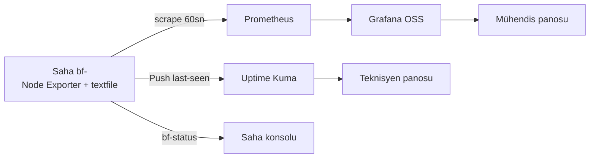

# 14 — İzleme ve Sağlık (Monitoring & Health)

> Kısa özet: 17 metrik + Prometheus/Node Exporter/Grafana OSS + Uptime Kuma + `bf-status`/`bf-diagnostics`/`bf-support-bundle` sözleşmeleri. Monitoring operatörü ve saha teknisyeni içindir.
>
> - Dosya: `docs/14-MONITORING-AND-HEALTH.md`
> - İlgili kararlar: `24-DECISION-LOG.md#K-07`, `#K-14`
> - Durum: [ ] Taslak

---

## 1. Amaç

700 cihazda "hangisi ölü, hangisi hasta, hangisi sağlıklı" sorusuna iki perdede cevap: mühendis için metrik (Prometheus), teknisyen için UP/DOWN + last-seen (Uptime Kuma).

## 2. Kapsam

- Kapsam içi: 17 metrik listesi, Prometheus/Node Exporter/Grafana OSS/Uptime Kuma rolleri, scrape/retention ilkeleri, 3 saha komutu sözleşmesi.
- Kapsam dışı: log içerik politikası (15), alarm bildirim hedefleri detayı (kurulum dokümanına havale), merkez donanım siparişi.

## 3. Kararlar

```text
KARAR:    Birincil metrik yığını Prometheus + Node Exporter + Grafana OSS'tir; 17 metriğin tamamı burada toplanır.
GEREKÇE:  17 metriğin tamamı yalnızca bu yığında ücretsiz ve kotasız toplanır (WireGuard/Docker/MEG sağlığı textfile collector ile).
ALTERNATİF: Netdata Cloud — Free 5 node kotası 700 cihazda ücrete düşer, elendi. Yalnızca Kuma — metrik körlüğü, elendi.
RİSK:     700 node kardinalite/saklama yükü; azaltma: 60 sn scrape, 30–90 gün retention, `BF-<no>` etiket şeması.
MALİYET:  Ücretsiz.
LİSANS:   Prometheus/Node Exporter Apache-2.0 — https://github.com/prometheus/prometheus + https://prometheus.io/docs/guides/node-exporter/ (2026-09-15); Grafana OSS AGPL-3.0 — https://grafana.com/oss/ (2026-09-15).
```

```text
KARAR:    Tamamlayıcı olarak Uptime Kuma: saha-teknisyeni dostu UP/DOWN panosu + Push "last seen" + bildirimler.
GEREKÇE:  Metrik bilmeyen teknisyene en basit çevrimdışı alarmını verir (20 sn aralık, 90+ bildirim servisi, tek konteyner).
ALTERNATİF: Yalnızca Grafana alarmı — teknisyen için karmaşık, elendi.
RİSK:     Kuma metrik vermez; azaltma: Prometheus ile birlikte koşar, rol çakışması yok.
MALİYET:  Ücretsiz.
LİSANS:   Uptime Kuma MIT — https://github.com/louislam/uptime-kuma (2026-09-15).
```

```text
KARAR:    Özel metrikler (WireGuard handshake, Docker, MEG) Node Exporter textfile collector `.prom` dosyalarıyla verilir.
GEREKÇE:  Standart Prometheus yolu; özel exporter yazma yükü yok.
ALTERNATİF: Özel exporter geliştirme — bakım yükü, elendi.
RİSK:     `.prom` yazım hatası scrape'i bozar; azaltma: cron/systemd timer çıktısı atomik yazılır.
MALİYET:  Ücretsiz.
LİSANS:   Node Exporter Apache-2.0 — https://github.com/prometheus/node_exporter (2026-09-15).
```

```text
KARAR:    Saha sağlık sözleşmeleri: `bf-status` (hızlı bakış), `bf-diagnostics` (derin tanı), `bf-support-bundle` (secret sızdırmaz paket).
GEREKÇE:  700 dokunulmaz cihazda logsuz metrik kör, metriksiz log sağırdır; bundle secret dışlama kuralıyla güvenli uzaktan tanı sağlar.
ALTERNATİF: Harici log platformu (Loki/ELK) ilk fazda — ek servis yükü, elendi (Faz-sonrası hedef).
RİSK:     Bundle'a secret kaçması; azaltma: dışlama listesi + üreticide maskeleme testi.
MALİYET:  Ücretsiz.
LİSANS:   systemd-journald / textfile (Apache-2.0) — https://github.com/prometheus/node_exporter (2026-09-15).
```

## 4. Neden Bu Karar?

İki kullanıcı, iki hız: mühendis kök nedeni metrikten bulur, teknisyen kesintiyi Kuma'dan görür. Scrape 60 sn + retention 30–90 gün, 700 node'da merkez yükünü taşınabilir tutar.

## 5. Alternatifler

| Alternatif | Artı | Eksi | Sonuç |
|---|---|---|---|
| Yalnızca Uptime Kuma | Çok kolay | Metrik körlüğü | Elendi |
| Netdata Cloud | Zengin agent | Free 5 node kotası | Elendi |
| Netdata Parent self-hosted | Zengin | Merkezi tasarım yükü + kota riski | Elendi |
| Loki/ELK ilk fazda | Güçlü log | Ek servis yükü, sadelik ihlali | Faz-sonrasına ertelendi |

## 6. Avantajlar

- Tamamı ücretsiz ve kotasız; 700 cihaz lisans duvarına çarpmaz.
- Tek kimlik (`BF-<no>`) metrikten loga join anahtarıdır.

## 7. Dezavantajlar

- Prometheus 700 node işletme bilgisi ister; retention LAB ölçümü olmadan donanım siparişi verilmemeli.
- Kuma + Prometheus çift kurulum merkezde iki servis demektir.

## 8. Riskler

| Risk | Olasılık | Etki | Azaltma |
|---|---|---|---|
| Kardinalite patlaması | Orta | Orta | 60 sn scrape, etiket disiplini, federasyon hedefi |
| Retention şişmesi | Orta | Orta | 30–90 gün, PİLOT hacim ölçümü |
| Bundle secret sızıntısı | Düşük | Yüksek | Dışlama listesi + maskeleme testi |

## 9. Uygulama Planı

1. Merkez: Prometheus + Grafana OSS + Uptime Kuma kurulur.
2. Saha: Node Exporter + textfile cron/timer + Kuma Push kurulur.
3. Etiket şeması `device_id="BF-<no>"` tüm metriklerde uygulanır.
4. `bf-status` / `bf-diagnostics` / `bf-support-bundle` sahaya dağıtılır. `bf-status`, yaşam döngüsü durumunu açık gösterir: offline kurulum `PROVISIONED_OFFLINE`, token sonrası `ENROLLED`, Prometheus/Kuma + WireGuard + erişim doğrulanınca `READY` (27/29).

```bash
# saha: Node Exporter + textfile dizini (örnek)
systemctl enable --now node_exporter
ls /var/lib/node_exporter/textfile/  # *.prom buraya atomik yazılır

# WireGuard handshake örneği (üretici script özeti)
# wg show wg0 latest-handshakes > /var/lib/node_exporter/textfile/wireguard.prom.tmp \
#   && mv .../wireguard.prom.tmp .../wireguard.prom
```

### 17 metrik listesi

| # | Metrik | Kaynak | Ne için |
|---|---|---|---|
| 1 | `up` | Prometheus scrape | Cihaz scrape edilebilir mi (ölü/diri) |
| 2 | `node_cpu_seconds_total` | Node Exporter | CPU yükü |
| 3 | `node_memory_MemAvailable_bytes` | Node Exporter | RAM baskısı |
| 4 | `node_filesystem_avail_bytes` | Node Exporter | Disk dolumu |
| 5 | `node_load1/5/15` | Node Exporter | Yük ortalaması |
| 6 | `node_network_receive/transmit_bytes_total` | Node Exporter | Ağ trafiği |
| 7 | `node_systemd_unit_state` | Node Exporter (systemd) | Kritik servis ayakta mı |
| 8 | `node_timex_offset_seconds` | Node Exporter | Saat kayması (TLS/WG için kritik) |
| 9 | `node_boot_time_seconds` | Node Exporter | Beklenmedik reboot tespiti |
| 10 | `wireguard_last_handshake_seconds` | textfile | Tünel canlılığı (stale = kopuk) |
| 11 | `wireguard_transfer_bytes` | textfile | Tünel trafiği |
| 12 | `docker_container_running` | textfile | MEG/yan konteyner ayakta mı |
| 13 | `docker_container_restart_count` | textfile | Crash-loop tespiti |
| 14 | `meg_up` | textfile | MEG sağlığı (kabul madde 6 ile aynı kaynaktan) |
| 15 | `meg_last_success_timestamp` | textfile | MEG iş yapıyor mu (stale = takılı) |
| 16 | `unattended_upgrade_active` | textfile | K-11 kilidi delinmiş mi (1 = ihlal) |
| 17 | `kuma_push_last_seen` | Uptime Kuma Push | Teknisyen "last seen" görünümü |

Scrape: 60 sn. Retention: 30–90 gün (LAB ölçümüyle kesinleşir).

## 10. Test Planı

| Test | Beklenen sonuç | Ortam |
|---|---|---|
| Scrape + 17 metrik | Grafana panosu dolu | P1(5) |
| WG down simülasyonu | Metrik 10 stale + Kuma DOWN | P1(5) |
| Konteyner kill | Metrik 12/13 alarm | LAB(2) |
| `unattended-upgrade` açma | Metrik 16 = 1 alarm | LAB(2) |
| Kuma Push kesintisi | last-seen bayatlar | P1(5) |

## 11. Rollback

1. Bozuk exporter/push, önceki sürüme Ansible ile geri alınır.
2. Prometheus config hatasında önceki config + `promtool check config` ile dönüş.
3. Son çare: monitoring'siz işletim (erişim kanalları bağımsızdır — 01).

## 12. Kontrol Listesi

- [ ] 17 metriğin tamamı Grafana'da görünüyor.
- [ ] Kuma UP/DOWN + Push last-seen çalışıyor.
- [ ] Etiket şeması `BF-<no>` tutarlı.
- [ ] Scrape 60 sn, retention 30–90 gün aralığında.

### `bf-status` örnek çıktısı (16 satır sözleşmesi)

```text
BF-12010193  2026-09-15 12:00 +03  OK
uptime: 6d 4h 12m | load: 0.31 0.28 0.22
cpu: 8% | mem: 1.1/3.8G (29%) | disk /: 9.2/28G (33%)
net: wg0 UP, handshake 12s ago | rx 41M tx 18M
docker: daemon UP | meg:1.2.3 running 6d (restarts 0)
meg: UP, last success 40s ago
systemd: docker OK | wg-quick@wg0 OK | xrdp OFF | node_exporter OK
unattended-upgrades: DISABLED (timer masked)
ufw: active, default DENY in | 22/3389 wg0-only
gui: OFF (multi-user) | rdp sessions: 0
kuma push: OK 30s ago | prometheus scrape: OK 45s ago
rustdesk: online | meshcentral: online
boot: 2026-09-09 07:48 (power-loss recovery OK)
alerts: 0 critical, 1 warning (disk trend)
next: support bundle: bf-support-bundle
```

`bf-diagnostics`: yukarıdakinin detaylı sürümü (servis log kuyrukları + `ss` + `df -i` + textfile içerikleri). `bf-support-bundle`: aynı paketin tarball'ı; WireGuard private key, RustDesk şifresi, SSH private key ve `authorized_keys` dışı secret'lar ASLA pakete girmez (üretici maskeleme testinden geçer).

## 13. Açık Sorular

- [ ] Prometheus retention/kardinalite hesabı (700 × 60 sn) — LAB ölçümü (sahibi: 14 yazarı).
- [ ] Bildirim hedefleri (SMS/e-posta/webhook) — merkez kurulumunda netleşecek (sahibi: Faz 3).
- [ ] Federasyon gerekip gerekmediği — 700 node ölçümü (sahibi: 14 yazarı).

---

## Ek: Mermaid — Metrik akışı


