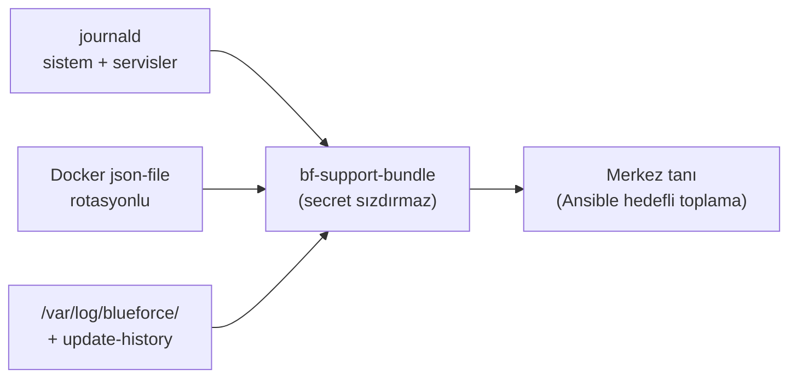

# 15 — Loglama (Logging)

> Kısa özet: 7 log kaynağı (journald/Docker/RustDesk/WG/MEG/Blueforce/installer/update-history) için yer, rotasyon ve saklama limitleri. Tanı koyan mühendis ve denetçi içindir.
>
> - Dosya: `docs/15-LOGGING.md`
> - İlgili kararlar: `24-DECISION-LOG.md#K-10`, `#K-14`
> - Durum: [ ] Taslak

---

## 1. Amaç

Disk doldurmayan ama tanı koydurmaya yeten log disiplini: her kaynağın nerede tutulduğu, ne kadar büyüyebileceği ve ne zaman silineceği bellidir.

## 2. Kapsam

- Kapsam içi: 7 kaynağın konumu + rotasyon + saklama limiti; secret maskeleme kuralı.
- Kapsam dışı: metrik tanımları (14), merkezi log platformu (Faz-sonrası hedef), log içeriklerinin iş anlamı.

## 3. Kararlar

```text
KARAR:    journald kalıcı + boyut sınırlı tutulur (`SystemMaxUse`/`MaxFileSec` ile); sınırsız journal yasaktır.
GEREKÇE:  Sınırsız journal saha diskini sessizce doldurur; sınırlı journal boot sonrası tanıya yetecek kadar geçmişi korur.
ALTERNATİF: Volatil journal (RAM'de) — reboot sonrası tanı kaybolur, elendi.
RİSK:     Limit küçükse kesinti kök nedeni silinir; azaltma: PİLOT hacim ölçümü.
MALİYET:  Ücretsiz.
LİSANS:   systemd-journald (LGPL bileşenler), ücretsiz.
```

```text
KARAR:    Docker `json-file` rotasyonu (`max-size`/`max-file`) tüm saha konteynerlerinde zorunludur (K-10).
GEREKÇE:  Rotasyonsuz Docker logu disk doldurur = kilitlenen cihaz.
ALTERNATİF: Rotasyonsuz + manuel temizlik — unutulur, elendi.
RİSK:     Değerler MEG hacmine göre ayarlanmazsa kayıp/taşma; azaltma: PİLOT ölçümü (12 ile ortak).
MALİYET:  Ücretsiz.
LİSANS:   Docker CE ücretsiz — https://docs.docker.com/engine/logging/configure/ (doğrulanma: 2026-09-15).
```

```text
KARAR:    Harici log platformu (Loki/ELK) ilk fazda kurulmaz; Faz-sonrası hedef olarak izlenir.
GEREKÇE:  Ek servis yükü sadelik kuralını bozar; 7 kaynak + bundle ilk faz tanısı için yeterlidir.
ALTERNATİF: İlk fazda merkezi log — merkez yükü + işletme maliyeti, ertelendi.
RİSK:     Filo-çapı log araması ilk fazda yoktur; azaltma: Ansible ile hedefli log toplama.
MALİYET:  Ücretsiz (erteleme).
LİSANS:   Yok.
```

## 4. Neden Bu Karar?

700 cihaz × sınırsız log = 700 dolu disk. Her kaynağa tavan konur; tavanlar PİLOT'ta ölçülen gerçek hacimle sabitlenir. Merkezi platform yokluğunda tanı, cihaz-üzeri komutlar + hedefli toplama ile yapılır.

## 5. Alternatifler

| Alternatif | Artı | Eksi | Sonuç |
|---|---|---|---|
| Sınırsız journal | Kayıpsız geçmiş | Disk taşması | Elendi |
| Volatil journal | Disk dostu | Reboot sonrası körlük | Elendi |
| İlk fazda Loki/ELK | Merkezi arama | Servis yükü | Ertelendi |
| Rotasyonsuz Docker log | Sıfır ayar | Kilitlenen cihaz | Elendi |

## 6. Avantajlar

- Tanı için yeterli geçmiş, disk için güvenli tavan aynı tabloda.
- 7 kaynak standardı `bf-support-bundle` ile birebir eşleşir.

## 7. Dezavantajlar

- Merkezi arama yok; filo-çapı örüntü avı Ansible hedefli toplamayla sınırlı.
- Limitler PİLOT ölçümüne kadar taslak değerlerdir.

## 8. Riskler

| Risk | Olasılık | Etki | Azaltma |
|---|---|---|---|
| Limit küçük → kök neden silinir | Orta | Orta | PİLOT hacim ölçümü + kritik olayda bundle |
| MEG log patlaması | Orta | Yüksek | Rotasyon + metrik 13 alarmı |
| Secret loga yazılır | Düşük | Yüksek | Maskeleme kuralı + bundle dışlama listesi |

## 9. Uygulama Planı

1. journald limitleri yazılır, kalıcı depolama açılır.
2. `daemon.json` rotasyonu uygulanır (12 ile ortak).
3. Uygulama log dizinleri + logrotate kurulur.
4. Update-history append-only tutulur.

```bash
# journald (taslak değerler — PİLOT ölçümüyle kesinleşir)
# /etc/systemd/journald.conf.d/blueforce.conf
# [Journal]
# Storage=persistent
# SystemMaxUse=500M
# MaxFileSec=14day
systemctl restart systemd-journald
journalctl --disk-usage

# Docker rotasyon denetimi (12 ile ortak)
cat /etc/docker/daemon.json
```

### 7 kaynak — yer ve limit tablosu

| # | Kaynak | Yer | Rotasyon/limit (taslak) |
|---|---|---|---|
| 1 | journald (sistem + servisler) | `/var/log/journal/` | `SystemMaxUse=500M`, `MaxFileSec=14day` |
| 2 | Docker konteyner logları | `json-file` (daemon.json) | `max-size=10m`, `max-file=3` (PİLOT ile kesinleşir) |
| 3 | RustDesk istemci | `~/.config/RustDesk/logs/` + journald | 50M tavan, 14 gün (istemci varsayılanını aşmayacak şekilde) |
| 4 | WireGuard | journald (`wg-quick@wg0`) + textfile sayaç | journald limitine tabi; handshake sayacı metrikte (14) |
| 5 | MEG | Konteyner logu (json-file) + varsa `/var/log/meg/` | Docker rotasyonuna tabi; dosya logu varsa logrotate 7×10M |
| 6 | Blueforce servisleri | journald + `/var/log/blueforce/` | logrotate 7×10M, 30 gün |
| 7 | installer + update-history | `/var/log/blueforce/install.log`, `/var/log/blueforce/update-history.log` | Append-only, rotasyonsuz saklanır (denetim izi); 50M üstünde arşivlenir, silinmez |

Secret kuralı: private key, parola, token loga ve bundle'a ASLA yazılmaz; tanı için gereken kimlik yalnızca `BF-<no>` etiketidir.

## 10. Test Planı

| Test | Beklenen sonuç | Ortam |
|---|---|---|
| `journalctl --disk-usage` | Tavan altında | LAB(2) |
| 7 gün çalışma sonrası disk | Taşma yok | P1(5) |
| Logrotate kuru çalıştırma | Hatasız döner | LAB(2) |
| Bundle secret taraması | Secret yok | LAB(2) |
| update-history append | Silinmemiş, sıralı | LAB(2) |

## 11. Rollback

1. Hatalı journald/logrotate config'de önceki dosya geri yüklenir, servis restart edilir.
2. Aşırı agresif rotasyonda limit genişletilir, PİLOT ölçümü yenilenir.

## 12. Kontrol Listesi

- [ ] journald kalıcı + tavanlı.
- [ ] Docker rotasyonu aktif (12 ile ortak denetim).
- [ ] 7 kaynağın tamamı bundle'a dahil veya bilerek hariç.
- [ ] Secret taraması temiz.
- [ ] update-history append-only.

## 13. Açık Sorular

- [ ] journald/Docker/MEG kesin limitleri — PİLOT hacim ölçümü (sahibi: 15 yazarı, 12 ile ortak).
- [ ] Merkezi log platformu (Loki) Faz-sonrası eşiği — 700 node ölçümü (sahibi: 14 yazarı).

---

## Ek: Mermaid — Log akışı


