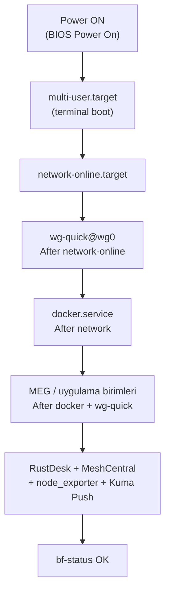

# 16 — Elektrik Kesintisi ve Otomatik Kurtarma

> Kısa özet: güç geldikten sonra cihazın dokunulmadan işe dönmesi: BIOS ayarı, boot zinciri, systemd bağımlılıkları, kurtarma doğrulaması. Saha ve LAB ekibi içindir.
>
> - Dosya: `docs/16-POWER-LOSS-AND-AUTO-RECOVERY.md`
> - İlgili kararlar: `24-DECISION-LOG.md#K-03`, `#K-05`, `#K-10`
> - Durum: [ ] Taslak

---

## 1. Amaç

Elektrik kesintisini sıradan olay haline getirmek: güç gelir, cihaz açılır, VPN kurulur, konteynerler kalkar, MEG işe döner — teknisyen dokunmaz.

## 2. Kapsam

- Kapsam içi: BIOS güç ayarı, boot hedefi, systemd sıralaması ve bağımlılıkları, kurtarma testi.
- Kapsam dışı: UPS yatırımı, veri yedekleme (17), update rollback (10).

## 3. Kararlar

```text
KARAR:    BIOS "Restore on AC Power Loss = Power On" tüm sahada standarttır; cihaz terminale (multi-user) boot eder.
GEREKÇE:  Güç gelince açılmayan cihaz kurtarma zincirine hiç giremez; terminal boot en düşük kaynakla en öngörülebilir zemindir (K-03).
ALTERNATİF: Grafik boot / manuel açma — kaynak israfı + saha ziyareti, elendi.
RİSK:     Heterojen BIOS menülerinde ayar adı farklı olabilir; azaltma: donanım profil başına LAB kaydı.
MALİYET:  Ücretsiz.
LİSANS:   Yok (donanım ayarı).
```

```text
KARAR:    Boot zinciri systemd bağımlılıklarıyla sıralanır: network → `wg-quick@wg0` → `docker.service` → MEG/uygulama birimleri → remote/monitoring ajanları.
GEREKÇE:  Sırasız boot race üretir (Docker WG'den önce kalkar, MEG ağ bulamaz); `After=`/`Wants=` zinciri her açılışta aynı sırayı garanti eder.
ALTERNATİF: Bağımlılıksız "hepsi enable" — açılışta rastgele sıra, elendi.
RİSK:     Birim adları 26.04.1'e göre değişebilir; azaltma: LAB imajında doğrulanmadan dondurulmaz (K-03 riski).
MALİYET:  Ücretsiz.
LİSANS:   Yok (systemd yapılandırması).
```

```text
KARAR:    Kurtarma `unless-stopped` + `wg-quick enable` + daemon enable üzerine kurulur; kesinti "manuel stop" sayılmaz.
GEREKÇE:  K-10 gereği kesinti sonrası konteynerler kendiliğinden kalkar; K-05 gereği VPN kendiliğinden gelir. Ek kurtarma servisi gerekmez.
ALTERNATİF: Özel kurtarma scripti/cron — hareketli parça artar, elendi.
RİSK:     Yanlışlıkla stop edilen kritik konteyner kalkmaz (tasarlanan davranış); azaltma: `bf-status` ile görünürlük.
MALİYET:  Ücretsiz.
LİSANS:   Docker CE ücretsiz — https://docs.docker.com/engine/containers/start-containers-automatically/ (doğrulanma: 2026-09-15).
```

## 4. Neden Bu Karar?

Kurtarma, ek yazılımla değil sıralamayla çözülür: her katman bir öncekinin hazır olduğuna bakarak kalkar. Sadelik kuralı burada en literally uygulanır — zincirde özel bileşen yok.

## 5. Alternatifler

| Alternatif | Artı | Eksi | Sonuç |
|---|---|---|---|
| UPS ile kesintiyi önleme | Kesinti yaşanmaz | 700 cihazda donanım maliyeti | Saha kararına bırakıldı (bu dokümanın dışı) |
| Özel kurtarma servisi | Esnek | Ek bakım yükü | Elendi |
| Grafik boot | Teknisyene tanıdık | Kaynak + hata yüzeyi | Elendi |

## 6. Avantajlar

- Kurtarma testi tek komutla tekrarlanır (fişi çek / reboot); sonuç deterministiktir.
- Zincirdeki her halka standart systemd mekanizmasıdır, özel bilgi gerektirmez.

## 7. Dezavantajlar

- Uzun kesintide saat kayması olabilir; NTP senkronu zincire dahildir ama ilk WG handshake gecikebilir.
- Bozuk diskte (kirli filesystem) boot fsck'e takılabilir; journal + ext4 varsayılanı bu riski küçültür.

## 8. Riskler

| Risk | Olasılık | Etki | Azaltma |
|---|---|---|---|
| Boot race (sıra bozuk) | Orta | Orta | `After=` zinciri + LAB güç testi |
| BIOS ayarı profilde yok | Düşük | Yüksek | Profil başına LAB kaydı |
| Saat kaymasıyla WG/TLS gecikmesi | Orta | Düşük | NTP bekleme + handshake metriği (14) |

## 9. Uygulama Planı

1. BIOS güç ayarı profillere işlenir.
2. Boot hedefi multi-user yapılır; GUI kapalı standarttır.
3. systemd bağımlılıkları yazılır, enable zinciri kurulur.
4. Güç kesintisi simülasyonuyla doğrulanır.

```bash
# boot hedefi (terminal standart)
systemctl set-default multi-user.target
systemctl get-default

# enable zinciri
systemctl enable wg-quick@wg0 docker node_exporter
# MEG/uygulama birimleri docker sonrası kalkar:
# /etc/systemd/system/meg-app.service.d/override.conf
# [Unit]
# After=docker.service wg-quick@wg0.service network-online.target
# Wants=network-online.target
# [Install]
# WantedBy=multi-user.target

# zincir denetimi
systemd-analyze critical-chain docker.service
systemd-analyze critical-chain wg-quick@wg0.service
```

```bash
# kurtarma doğrulaması (güç testi sonrası)
uptime -s
systemctl is-active wg-quick@wg0 docker
docker ps --format '{{.Names}} {{.Status}}'
bf-status
```

## 10. Test Planı

| Test | Beklenen sonuç | Ortam |
|---|---|---|
| Fiş çekme simülasyonu (güç kesintisi) | Müdahalesiz tam zincir kalkar | LAB(2) |
| Reboot sonrası sıra | network → WG → Docker → MEG | LAB(2) |
| Manuel stop + reboot | Durdurulan kalkmaz (tasarlanan) | LAB(2) |
| 10 ardışık güç döngüsü | 10/10 kurtarma | P1(5) |
| WG handshake süresi | Metrik 10 makul aralıkta tazelenir | P1(5) |

## 11. Rollback

1. Bozuk bağımlılıkta override dosyası kaldırılır, daemon-reload + reboot ile önceki sıra geri gelir.
2. Boot hedefine takılmada konsoldan `systemctl set-default` düzeltilir.
3. Son çare: golden image yeniden kurulumu (17-RECOVERY LEVEL 9).

## 12. Kontrol Listesi

- [ ] BIOS güç ayarı profilde kayıtlı.
- [ ] Boot hedefi multi-user.
- [ ] `wg-quick@wg0`, `docker`, ajanlar enable.
- [ ] `After=` zinciri dosyada ve LAB'da doğrulandı.
- [ ] Güç testi 10/10 geçti (P1).

## 13. Açık Sorular

- [ ] Kesin birim adları + GNOME oturum satırı — LAB 26.04.1 imajı (sahibi: Faz 3, 03/04 yazarları).
- [ ] NTP bekleme süresi eşiği — P1 ölçümü (sahibi: 16 yazarı).

---

## Ek: Mermaid — Boot zinciri ve systemd bağımlılıkları


