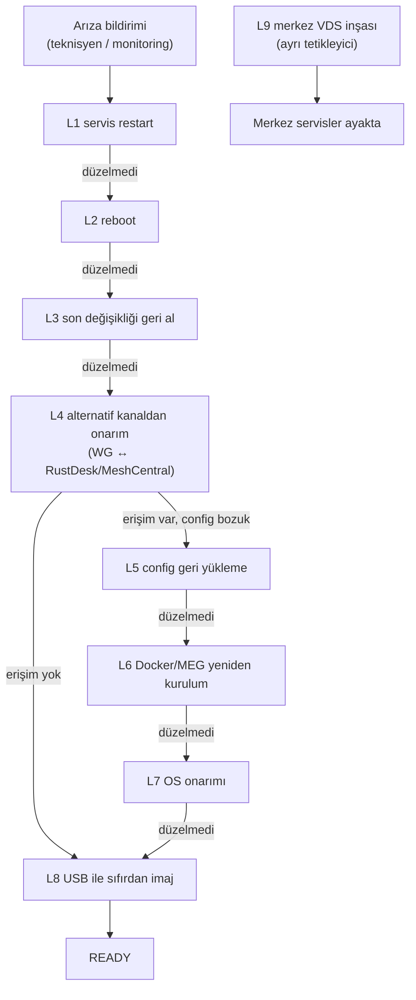

# 17 — Yedekleme, Kurtarma ve Yeniden Kurulum (Backup, Recovery & Reinstall)

> Kısa özet: 9 seviyeli kurtarma merdiveni (LEVEL 1…9): servis yeniden başlatmadan merkez VDS'in sıfırdan inşasına kadar her seviyede merkezi prosedür + saha/yerel prosedür. Saha teknisyeni ve merkezi admin için ortak başvuru noktasıdır.

- Dosya: `docs/17-BACKUP-RECOVERY-AND-REINSTALL.md`
- İlgili kararlar: `24-DECISION-LOG.md#K-04` (kanal bağımsızlığı), `#K-05` (WireGuard), `#K-06` (Ansible/Semaphore), `#K-09` (golden image), `#K-10` (unless-stopped), `#K-11` (onaysız update yasağı), `#K-12` (cihaz kimliği), `#K-14` (support bundle)
- Durum: [ ] Taslak

---

## 1. Amaç

700 cihazlı filoda her arızanın boyuna uygun, önceden tanımlı bir kurtarma yolu olması. Küçük arıza küçük müdahaleyle (servis restart), büyük arıza büyük müdahaleyle (yeniden imaj) çözülür; teknisyen "ne yapsam?" diye doğaçlama yapmaz, LEVEL tablosuna bakar.

## 2. Kapsam

- Kapsam içi: saha cihazı LEVEL 1…8 kurtarma, merkez VDS yedeği ve yeniden inşası (LEVEL 9), her seviyede merkezi (uzaktan) + yerel (sahada) prosedür, yedeklenecek veri listesi, yedek sıklığı.
- Kapsam dışı: update dalgalarının onay akışı (10-UPDATE), MEG uygulama verisi yedeği detayı (13-MEG-ACCEPTANCE'a havale), elektrik kesintisi sonrası otomatik toparlanma zinciri (16-POWER-LOSS).

## 3. Kararlar

```text
KARAR:    Kurtarma 9 seviyeli merdivenle işletilir: L1 servis restart → L2 reboot → L3 son değişikliği geri alma → L4 WireGuard/RustDesk/MeshCentral kanalıyla uzaktan onarım → L5 yedekten config geri yükleme → L6 Docker/MEG yeniden kurulum → L7 OS onarımı → L8 USB ile sıfırdan imaj → L9 merkez VDS yeniden inşası.
GEREKÇE:  Merdiven, en ucuz müdahaleyi önce dener; gereksiz yeniden imaj (veri kaybı + teknisyen saati) ve gereksiz VDS müdahalesi önlenir. Her seviyenin "merkezi" ve "yerel" kolu vardır, erişim durumuna göre yol seçilir.
ALTERNATİF: Tek "USB ile sıfırla" prosedürü — her arızada saha ziyareti gerektirir, 700 cihazda sürdürülemez; elendi.
RİSK:     Yanlış seviye seçimi (L8 gerekirken L1'de oyalanma); azaltma: her seviyede "bir üst seviyeye geç" kriteri yazılıdır.
MALİYET:  Ücretsiz (yerleşik araçlar + Ansible).
LİSANS:   Yok (işletim prosedürü; araç lisansları 24-DECISION-LOG Ek A).
```

```text
KARAR:    Merkez VDS'ler dosya-seviyesi yedek + IaC (Ansible playbook + compose dosyaları Git'te) ile kurtarılır; blok-imaj yedeği zorunlu değildir.
GEREKÇE:  Servislerin tamamı kodla yeniden kurulabilir durumda tutulur (playbook/compose Git'te); veri (envanter DB, Prometheus verisi, Semaphore DB) dosya yedeğiyle alınır. Blok imaj hem pahalı hem VDS sağlayıcıya bağımlıdır.
ALTERNATİF: Sağlayıcı snapshot'ına bel bağlama — taşınabilir değil, ikinci VDS'e geçemez; yedek yöntem olarak tutulur, birincil yapılmaz.
RİSK:     Git'teki IaC ile gerçek VDS drift eder; azaltma: üç ayda bir "boş VDS'e sıfırdan kur" tatbikatı (L9 testi).
MALİYET:  Ücretsiz (VDS kira + varsa snapshot ücreti hariç).
LİSANS:   Yok.
```

```text
KARAR:    Saha cihazında kullanıcı verisi yedeği alınmaz; cihaz "değiştirilebilir" (disposable) sayılır — kimlik (`bf-<no>`) + config merkezden yeniden basılır.
GEREKÇE:  Tek kimlik standardı (K-12) sayesinde cihazın tüm kişiliği merkezde tanımlıdır; yeniden imaj + kimlik enjeksiyonu cihazı eşdeğerine döndürür. 700 cihazda tek tek veri yedeği işletilemez.
ALTERNATİF: Cihaz-başı tam yedek — bant genişliği ve operasyon yükü nedeniyle elendi.
RİSK:     MEG yerel verisi kaybolur; azaltma: MEG verisi gerekiyorsa merkezi yedek hedefi 13-MEG-ACCEPTANCE'ta tanımlanır, teknisyen L8 öncesi uyarılır.
MALİYET:  Ücretsiz.
LİSANS:   Yok.
```

## 4. Neden Bu Karar?

Kurtarma merdiveni üç ilkeye dayanır: (1) erişim varsa sahaya gidilmez — 4 erişim kanalından (K-04) en az biri ayaktaysa onarım uzaktan yapılır; (2) config kodludur — IaC Git'te olduğu sürece merkez de saha da yeniden üretilebilir; (3) cihaz disposable'dır — veri cihazda değil merkezde yaşar. LEVEL 9 (merkez inşası) bu yüzden dosya yedeği + playbook ikilisine dayanır, pahalı imaj altyapısına değil.

## 5. Alternatifler

| Alternatif | Artı | Eksi | Sonuç |
|---|---|---|---|
| Tek-seviye "sıfırla" | Basit anlatım | Her arızada saha ziyareti, veri kaybı | Elendi |
| Sağlayıcı snapshot birincil | Hızlı geri dönüş | Taşınabilir değil, sağlayıcı kilidi | Yedek |
| Cihaz-başı tam yedek (Borg/restic per-node) | Veri korunur | 700 cihazda bant/işletme yükü | Elendi (MEG verisi ayrı ele alınır) |
| Clonezilla ile bit-kopya geri yükleme | Hızlı | Donanım-fragil (K-09) | Yedek yöntem |

## 6. Avantajlar

- Her arızada "hangi seviye" sorusunun cevabı tabloda hazır; teknisyen doğaçlama yapmaz.
- Merkezi kol sayesinde çoğu arıza saha ziyaretsiz çözülür.
- L9 tatbikatı merkezin gerçekten yeniden kurulabildiğini kanıtlar (kağıt üstünde kalmaz).

## 7. Dezavantajlar

- Merdiven disiplini eğitim ister; acemi teknisyen L1'i atlayıp doğrudan L8'e koşabilir.
- IaC drift'i (Git ≠ gerçek) L9'u yavaşlatır; periyodik tatbikat şarttır.

## 8. Riskler

| Risk | Olasılık | Etki | Azaltma |
|---|---|---|---|
| Yanlış seviye seçimi, arızayı büyütür | Orta | Orta | Her seviyede "yükseltme kriteri" + runbook yönlendirmesi (20/21) |
| Yedek alınmıyor ama alınıyor sanılıyor | Orta | Yüksek | Yedek doğrulama job'ı + Uptime Kuma/Prometheus alarmı |
| L8'de bayi no yanlış girilir, kimlik çakışır | Düşük | Yüksek | 02-NAMING benzersizlik kontrolü + kurucu script onayı |
| Merkez yedeği şifresiz saklanır | Düşük | Yüksek | Yedek şifreleme + erişim yalnızca merkezi admin (21) |

## 9. Uygulama Planı

### LEVEL tablosu (her seviyede Merkezi + Yerel kol)

| LEVEL | Ad | Merkezi prosedür (uzaktan) | Yerel prosedür (sahada) | Üst seviyeye geç kriteri |
|---|---|---|---|---|
| L1 | Servis restart | Ansible/Semaphore ile `systemctl restart` (Docker, xrdp, wg-quick, agent) | `sudo systemctl restart <servis>` | Servis 2 restartta ayağa kalkmıyorsa → L2 |
| L2 | Reboot | `reboot` (Semaphore job veya SSH); boot zinciri izlenir (16) | Güç düğmesi / fiş-çek-tak (tek sefer) | Boot sonrası aynı arıza sürüyorsa → L3 |
| L3 | Son değişikliği geri alma | 10-UPDATE rollback zinciri (önceki config/imaj) | Teknisyen değişikliği yaptıysa manuel geri alma (20) | Geri alma sonrası düzelmiyorsa → L4 |
| L4 | Alternatif kanaldan onarım | WG çöktüyse RustDesk/MeshCentral ile bağlan, WG config'ini düzelt; tersi durumda SSH-over-WG ile agent düzelt | Teknisyen telefonla merkezden komut alır, uygular | Hiçbir kanaldan erişilemiyorsa → L5/L8 hazırlığı |
| L5 | Config geri yükleme | Ansible ile bilinen-iyi config'i bas (sshd, wg0, daemon.json, exporter) | USB'deki `config/` klasöründen kopyalama (kurucu medyasında) | Config doğru ama servis kalkmıyorsa → L6 |
| L6 | Docker/MEG yeniden kurulum | Playbook ile Docker + MEG stack yeniden kurulumu | `blueforce-install.sh --only-docker-meg` (varsa) | İmaj bozulmuş görünüyorsa → L7/L8 |
| L7 | OS onarımı | Kırık paket/çekirdek onarımı (`apt --fix-broken`, eski çekirdekle boot) | Recovery mod + teknisyen adımları (20) | Kök dosya sistemi hasarlıysa → L8 |
| L8 | USB ile sıfırdan imaj | Merkez L8 kararı verir, teknisyeni yönlendirir (21) | USB → Ubuntu → `blueforce-install.sh` → bayi no → READY (20) | Cihaz donanımsal arızalıysa → donanım değişimi; donanım sağlamsa L8 son duraktır |
| L9 | Merkez VDS yeniden inşası | Boş VDS'e playbook/compose + dosya yedeğiyle kurulum; DNS/kimlikler güncellenir | — (teknisyen işi değil) | — |

### Yedeklenecekler ve sıklık

1. Merkez dosya yedeği (günlük, otomatik): Ansible inventory + `host_vars`/`group_vars`, WireGuard anahtarları (şifreli), Semaphore DB dump, Prometheus config + kurallar, Grafana dashboard JSON'ları, compose dosyaları, RustDesk keypair, MeshCentral config/DB.
2. IaC Git deposu (her değişiklikte commit+push): playbook'lar, roller, compose'lar, autoinstall/preseed, `blueforce-install.sh`.
3. Yedek doğrulama (aylık): en yeni yedeğin açılabilirliği + kritik dosya hash kontrolü; sonuç monitoring'e işlenir.

```bash
# örnek: saha cihazı hızlı durum (L1 öncesi tanı)
bf-status
# örnek: tanılama paketi (secret sızdırmaz)
bf-support-bundle --out /tmp/bf-12010193-bundle.tar.gz
# örnek: merkezden tek cihazda servis restart (Ansible)
ansible-playbook playbooks/restart.yml --limit bf-12010193
```

## 10. Test Planı

| Test | Beklenen sonuç | Ortam |
|---|---|---|
| L1→L2 merdiven tatbikatı (servis kill) | L1 çözer, kayıt düşer | LAB(2) |
| WG config bozma → L4 (RustDesk ile onarım) | Tünel uzaktan onarılır | P1(5) |
| L8 tam yeniden imaj + bayi no | READY < hedef süre | LAB(2) |
| L9 boş VDS'e sıfırdan kurulum tatbikatı | Tüm servisler ayağa kalkar | İzole VDS |
| Yedekten geri yükleme (Semaphore DB) | İş geçmişi ve envanter döner | Merkez test |

## 11. Rollback

1. Kurtarma müdahalesi arızayı büyütürse bir üst LEVEL'e geçilir, geri dönülmez (merdiven tek yönlüdür).
2. L3 geri alması yanlışsa 10-UPDATE zincirindeki önceki-önceki sürüme geçilir.
3. L9 inşası başarısızsa eski VDS (kapatılmadıysa) ayakta tutulur; DNS geri alınır.

## 12. Kontrol Listesi

- [ ] L1…L9 tablosu 20 (teknisyen) ve 21 (merkez) runbook'larına linkli.
- [ ] Yedek listesi + sıklığı merkezde job'a bağlı, doğrulaması alarmlı.
- [ ] IaC deposu güncel; son L9 tatbikat tarihi yazılı.
- [ ] `bf-support-bundle` secret dışlama kuralı testli (K-14).

## 13. Açık Sorular

- [ ] Yedek saklama süresi ve şifreleme anahtarının kasası (sahibi: merkezi admin, 21).
- [ ] MEG yerel veri yedeği gerekli mi — 13-MEG kararı bekleniyor (sahibi: Faz 3).
- [ ] L9 tatbikat periyodu (öneri: 3 ay) onayı (sahibi: 25-ROADMAP).

---

## Ek: Mermaid — kurtarma merdiveni


