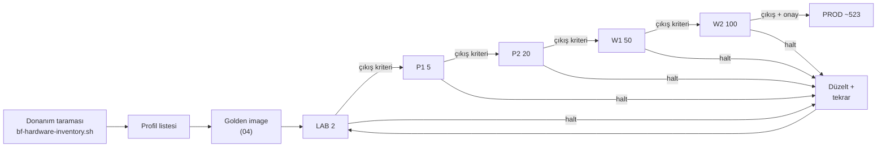

# 18 — Pilot ve 700 Cihaz Yayılımı (Pilot & Rollout)

> Kısa özet: Yayılımın ilk adımı `bf-hardware-inventory.sh` donanım taramasıdır; imaj dondurulmadan önce saha heterojenliği ölçülür. Sonra LAB(2) → P1(5) → P2(20) → W1(50) → W2(100) → PROD dalgaları, her dalgada giriş/çıkış kriteriyle ilerler.

- Dosya: `docs/18-PILOT-AND-700-DEVICE-ROLLOUT.md`
- İlgili kararlar: `24-DECISION-LOG.md#K-01` (donanım profili), `#K-09` (önce envanter, sonra imaj), `#K-11` (dalga zinciri), `#K-12` (cihaz kimliği)
- Durum: [ ] Taslak

---

## 1. Amaç

700 cihazı "bir gecede" değil, ölçülebilir dalgalarla üretime almak. Her dalga bir öncekinin kanıtı üzerine kurulur; bir dalga batarsa filo değil, o dalga etkilenir.

## 2. Kapsam

- Kapsam içi: donanım envanter taraması, dalga tanımı ve sayıları, her dalganın giriş/çıkış kriterleri, dalga başına izlenecek metrikler, durdurma (halt) kuralları.
- Kapsam dışı: update'lerin dalga zinciri (10-UPDATE — aynı dalga isimlerini kullanır ama tetikleyici farklıdır), tek cihaz kurulum adımları (20-FIELD-RUNBOOK).

## 3. Kararlar

```text
KARAR:    İmaj dondurulmadan ÖNCE `bf-hardware-inventory.sh` ile saha donanım taraması yapılır; CPU/RAM/disk/NIC/GPU profilleri çıkarılmadan golden image dondurulmaz.
GEREKÇE:  K-09'un en büyük riski heterojen donanımda sürücü eksiğidir; tarama olmadan üretilen tek imaj sahada rastgele kırılır. Profil listesi LAB test matrisini belirler.
ALTERNATİF: Taramasız "standart PC varsayımı" — ilk dalgada sürpriz donanımla çakışır; elendi.
RİSK:     Tarama örneklemi yanlı olur (kolay ulaşılan bayiler); azaltma: bölge başına kota + en az %10 örneklem hedefi.
MALİYET:  Ücretsiz (script + Ansible).
LİSANS:   Yok.
```

```text
KARAR:    Dalgalar: LAB(2) → P1/PILOT-1(5) → P2/PILOT-2(20) → W1/WAVE-1(50) → W2/WAVE-2(100) → PROD (kalan ~523). Hiçbir dalga, önceki dalganın çıkış kriterini sağlamadan başlamaz.
GEREKÇE:  K-11'in onay zinciri; üstel büyüme (2→5→20→50→100→523) riski kademeli taşır, her adımda gözetim süresi vardır.
ALTERNATİF: Tek seferde toplu kurulum — geri dönüşü olmayan filo-çapı hata riski; elendi.
RİSK:     Takvim baskısıyla kriter atlanır; azaltma: dalga geçişi merkezi admin onayı gerektirir (21), Semaphore'da kapı adımı.
MALİYET:  Ücretsiz.
LİSANS:   Yok.
```

## 4. Neden Bu Karar?

Önce ölç (envanter), sonra dondur (imaj), sonra büyüt (dalgalar). Bu sıra, 700 cihazda "bilinmeyen donanım" ve "bilinmeyen ölçek" risklerini birbirinden ayırır: donanım riski LAB'da, ölçek riski dalgalarda eritilir. Dalga sayıları (2/5/20/50/100) hem K-11'deki update zinciriyle aynıdır hem de teknisyen kapasitesine uyar (erken dalgalar az cihazla çok öğrenme).

## 5. Alternatifler

| Alternatif | Artı | Eksi | Sonuç |
|---|---|---|---|
| Taramasız imaj | Hızlı başlangıç | Sahada sürücü sürprizi | Elendi |
| Tek dalga (big-bang) | Hızlı | Filo-çapı geri dönüşsüz hata | Elendi |
| Daha fazla küçük dalga (10+) | Çok güvenli | Takvim ve teknisyen yorgunluğu | Elendi (6 dalga yeterli) |

## 6. Avantajlar

- Her dalga, sonraki dalganın eğitim verisidir (süre, hata tipi, destek yükü ölçülür).
- Durdurma kuralları sayesinde kötü imaj 5 cihazdan öteye geçemez.
- Envanter taraması aynı zamanda 02-INVENTORY'nin veri kaynağıdır (iki iş bir taş).

## 7. Dezavantajlar

- Dalgalar takvimi uzatır; yönetim "neden hepsi birden değil" diye sorar (bu doküman cevaptır).
- Erken dalga bayileri pilot yükü taşır; iletişim ve destek planı gerekir.

## 8. Riskler

| Risk | Olasılık | Etki | Azaltma |
|---|---|---|---|
| Envanter örneklemi yanlı | Orta | Yüksek | Bölge kotası + %10 hedefi |
| Kriter atlanarak dalga atlama | Orta | Yüksek | Merkezi admin onayı zorunlu (21) |
| Pilot bayilerde destek yığılması | Orta | Orta | Dalga başına teknisyen kapasite planı (25) |
| Donanım profili imajı kırar (yeni parti PC) | Orta | Orta | Her yeni donanım partisi LAB'a girer |

## 9. Uygulama Planı

### FAZ 0 — Donanım taraması (her şeyden önce)

1. `bf-hardware-inventory.sh` mevcut/örnek cihazlarda çalıştırılır (CPU, RAM, disk, NIC, GPU, BIOS modu, mevcut OS).
2. Çıktılar merkezde toplanır, donanım profilleri çıkarılır (örn. Profil-A: i3/4GB/120GB, Profil-B: i5/8GB/256GB…).
3. Profil listesi 04-GOLDEN-IMAGE'a girer; LAB test matrisi = her profilden ≥1 cihaz.
4. Profil başına sürücü notu düşülür (Wi-Fi çipi, ekran kartı, yazıcı).

```bash
# örnek: envanter taraması (sahada veya Ansible ile)
sudo ./bf-hardware-inventory.sh --out /tmp/inv-$(hostname).json
# örnek: merkezde toplama
ansible all -m fetch -a "src=/tmp/inv-{{ inventory_hostname }}.json dest=inventory/hw/ flat=yes"
```

### Dalga planı

| Dalga | Cihaz | Amaç | Gözetim süresi | Çıkış kriteri (hepsi şart) |
|---|---|---|---|---|
| LAB | 2 | İmaj + 3 akış doğrulama (erişim/boot/update) | 1 hafta | 3 akış yeşil, support-bundle temiz, rollback denendi |
| P1 (PILOT-1) | 5 | Gerçek saha + WG kopma sayacı + teknisyen akışı | 2 hafta | Kopma sayacı toplandı, teknisyen USB→READY'yi desteksiz yaptı, kritik hata yok |
| P2 (PILOT-2) | 20 | Ölçek provası + digest pinleme değerlendirmesi + destek yükü ölçümü | 2–3 hafta | Cihaz-başı kurulum süresi hedefte, destek bileti/cihaz eşiği altında, monitoring 17 metrik dolu |
| W1 (WAVE-1) | 50 | Bölge-ölçeği yayılım, envanter disiplini | 3 hafta | Envanter %100 eşleşiyor, halt kuralı tetiklenmedi |
| W2 (WAVE-2) | 100 | Üretim-öncesi son prova, paralel ekip çalışması | 3–4 hafta | İki ekip paralel kurulum yapabiliyor, geri alma zinciri canlı denendi |
| PROD | ~523 | Kalan filo | planlı | W2 çıkış kriterleri + yönetim onayı |

### Halt (durdurma) kuralları

1. Dalga içinde aynı kök-nedenle ≥2 kritik arıza → dalga durur, 17-RECOVERY L3 işletilir.
2. Monitoring'de dalga cihazlarının >%10'u 24 saatte çevrimdışı → yayılım durur, ağ/VPN incelenir.
3. Teknisyen kurulum süresi hedefin 2× üstünde → eğitim/runbook (20) revize edilmeden devam edilmez.

## 10. Test Planı

| Test | Beklenen sonuç | Ortam |
|---|---|---|
| Envanter scripti 3 farklı donanımda | Profil JSON'u eksiksiz | LAB + örnek saha |
| LAB 3-akış testi | Erişim + boot + update yeşil | LAB(2) |
| P1 kopma sayacı 7/24 | Keepalive ayarı için veri | P1(5) |
| Dalga geçiş kapısı (Semaphore) | Onaysız geçiş engellenir | Merkez test |

## 11. Rollback

1. Dalga içi arızada etkilenen cihazlar 17-RECOVERY merdiveniyle (L3/L8) önceki-iyi duruma alınır.
2. İmaj-köklü arızada dalga durdurulur, imaj revize edilir, dalga baştan başlar (ilerideki dalgalar etkilenmez).
3. PROD'da imaj sorunu çıkarsa 10-UPDATE rollback zinciri işletilir.

## 12. Kontrol Listesi

- [ ] Envanter taraması tamam, profil listesi 04'e işlendi.
- [ ] Her dalganın giriş/çıkış kriteri + gözetim süresi yazılı ve onaylı.
- [ ] Halt kuralları 21 (merkez) runbook'una işlendi.
- [ ] Dalga cihaz listeleri envanterde (`BF-<no>`) ayrıldı.

## 13. Açık Sorular

- [ ] Örneklem hedefi (%10) ve bölge kotaları onayı (sahibi: merkezi admin).
- [ ] Pilot bayi seçimi + iletişim planı (sahibi: 25-ROADMAP).
- [ ] Cihaz-başı kurulum süresi hedefi (öneri P2'de ölçülüp sabitlenecek).

---

## Ek: Mermaid — dalga akışı


