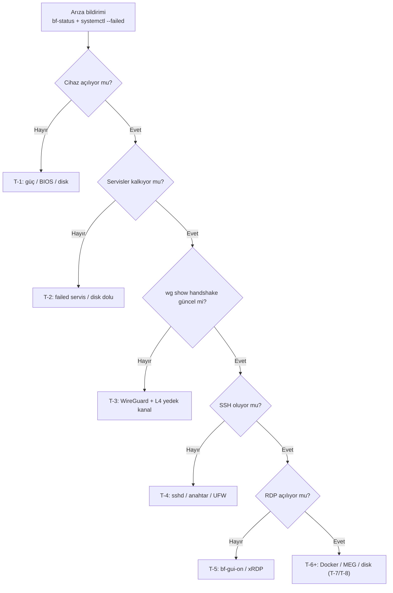

# 19 — Sorun Giderme (Troubleshooting)

> Kısa özet: Sahada ve merkezde en sık görülen arızaların belirti → neden → komut → çözüm tablosu. 17-RECOVERY "hangi seviye" sorusunu, bu doküman "o seviyede hangi komut" sorusunu cevaplar.

- Dosya: `docs/19-TROUBLESHOOTING.md`
- İlgili kararlar: `24-DECISION-LOG.md#K-03` (xRDP/GUI), `#K-04` (erişim kanalları), `#K-05` (WireGuard), `#K-10` (Docker), `#K-14` (`bf-status`, support-bundle)
- Durum: [ ] Taslak

---

## 1. Amaç

Tekrar eden arızalarda teşhisi hızlandırmak: belirtiyi bulan teknisyen/admin, tabloya bakıp ilk komutu 30 saniyede çalıştırır. Her girdide "ne zaman üst seviyeye çık" notu vardır.

## 2. Kapsam

- Kapsam içi: boot, ağ/VPN, SSH, RDP/GUI, RustDesk, MeshCentral, Docker/MEG, disk, monitoring belirti tabloları.
- Kapsam dışı: seviye kararları (17), adım-adım kurulum (20), merkez onay akışı (21).

## 3. Kararlar

```text
KARAR:    Her arıza girdisi aynı formatta yazılır: Belirti → Olası nedenler (olasılık sırasıyla) → Tanı komutları → Çözüm → Yükseltme kriteri.
GEREKÇE:  Standart format, acemi teknisyenin bile doğru sırayla (tanıdan önce çözüm yok) ilerlemesini sağlar; her çözüm denenebilir komutla verilir.
ALTERNATİF: Serbest-anlatım sorun listesi — komutlar dağınık kalır, otomasyona çevrilemez; elendi.
RİSK:     Tablo eskirse yanlış yönlendirir; azaltma: her PİLOT dalgası sonrası tablo gözden geçirilir.
MALİYET:  Ücretsiz.
LİSANS:   Yok.
```

## 4. Neden Bu Karar?

Sorun giderme, kurtarma merdiveninin (17) "içini" doldurur: 17 hangi LEVEL, 19 o LEVEL'de hangi komut. Olasılık sırası önemlidir — en yaygın neden önce yazılır, teknisyen zamanı boşa harcanmaz. Yükseltme kriteri her girdinin sigortasıdır (inatla aynı komutu tekrarlamak yasak).

## 5. Alternatifler

| Alternatif | Artı | Eksi | Sonuç |
|---|---|---|---|
| Harici bilgi tabanı (Wiki araması) | Aranabilir | Çevrimdışı sahada erişilemez, Git akışı yok | Elendi (22'de Docusaurus içinde bu dosya zaten aranabilir) |
| Her arıza için ayrı sayfa | Detaylı | 700 cihazda 100 sayfa yönetilemez | Elendi (gerekirse Ek'e taşınır) |

## 6. Avantajlar

- Tek dosya, çevrimdışı da okunur (USB'de veya basılı).
- Komutlar kopyala-yapıştırılabilir; açıklamalar Türkçe, komut adları İngilizce orijinal.

## 7. Dezavantajlar

- 26.04.1'e özgü çıktı farkları LAB'da güncellenmelidir (kesin servis adları, log yolları).
- MEG'e özgü arızalar 13-MEG-ACCEPTANCE'tan beslenmelidir; bu dosya iskelettir.

## 8. Riskler

| Risk | Olasılık | Etki | Azaltma |
|---|---|---|---|
| Eski komut (servis adı değişti) | Orta | Orta | LAB'da her komut çalıştırılıp doğrulanır |
| Secret'lı komut geçmişe düşer | Düşük | Yüksek | Support-bundle kuralı (K-14); komutlarda secret yazılmaz |

## 9. Uygulama Planı

Önce genel tanı (her arızada ilk 60 saniye):

```bash
bf-status
systemctl --failed
ip -brief addr; ip route show default
wg show wg0 2>&1 | head -20
docker ps --format 'table {{.Names}}\t{{.Status}}\t{{.RestartPolicy}}'
df -h / /var/lib/docker | cat
```

### T-1 — Cihaz açılmıyor / ekranda hiçbir şey yok

| # | Neden (olasılık sırası) | Tanı | Çözüm |
|---|---|---|---|
| 1 | Elektrik yok / BIOS güç ayarı | Priz, adaptör, güç LED'i | BIOS "Restore on AC Power Loss = Power On" (16) |
| 2 | Monitör/kablo | Başka kablo/ekran dene | Değiştir |
| 3 | Disk ölmüş | BIOS diski görmüyor | Donanım değişimi → L8 yeni diskte |

Yükseltme: donanım sağlamsa ama OS açılmıyorsa T-2'ye geç.

### T-2 — Boot terminale düşmüyor / servisler kalkmıyor

| # | Neden | Tanı | Çözüm |
|---|---|---|---|
| 1 | Failed servis var | `systemctl --failed`, `journalctl -xb -p err` | İlgili servis girdisine git (T-3…T-6) |
| 2 | Disk dolu | `df -h /` | Docker log temizliği + rotasyon kontrolü (T-7) |
| 3 | Bozuk çekirdek/paket | `dpkg --audit`, `apt --fix-broken install` | 17-L7; olmazsa L8 |

### T-3 — WireGuard tüneli yok (`wg show` boş / handshake eski)

| # | Neden | Tanı | Çözüm |
|---|---|---|---|
| 1 | Servis inaktif | `systemctl status wg-quick@wg0` | `sudo systemctl enable --now wg-quick@wg0` |
| 2 | Anahtar/config hatası | `journalctl -u wg-quick@wg0 --no-pager`, `wg show wg0 latest-handshakes` | Config'i merkezden yeniden bas (17-L5); peer adı `bf-<no>` mi kontrol et |
| 3 | Saha interneti yok / CGNAT | `ping -c3 8.8.8.8`, modem arayüzü | Yerel ağ düzeltilir; kopma sayacı not edilir (P1 görevi) |
| 4 | Merkez hub down | Başka cihazdan hub'a bak | 17-L9 kolu işletilir |

Yükseltme: WG kalkmıyorsa RustDesk/MeshCentral ile devam (17-L4); onlar de yoksa saha ziyareti.

### T-4 — SSH bağlanmıyor (WG ayaktayken)

| # | Neden | Tanı | Çözüm |
|---|---|---|---|
| 1 | sshd down / anahtar eşleşmiyor | `systemctl status ssh`, `ssh -vvv blueforce@bf-<no>` | Anahtarı merkezden yeniden dağıt (K-13); password denemesi YOK |
| 2 | Yanlış IP/hostname | `ip -brief addr`, envanter karşılaştır | 02-NAMING'e göre düzelt |
| 3 | Güvenlik duvarı | `sudo ufw status`, `ss -tlnp` | 11-HARDENING standardına döndür |

### T-5 — RDP açılmıyor / siyah ekran / hemen kopuyor

| # | Neden | Tanı | Çözüm |
|---|---|---|---|
| 1 | GUI katmanı kapalı | `systemctl status display-manager xrdp xrdp-sesman` | `bf-gui-on`, tekrar dene |
| 2 | Oturum çakışması (yerel + RDP aynı kullanıcı) | `who`, `loginctl list-sessions` | Ayrı kullanıcı/oturum; eski oturumu kapat |
| 3 | xRDP config bozulmuş | `journalctl -u xrdp --no-pager` | Bilinen-iyi config'i bas (17-L5) |

### T-6 — RustDesk bağlanmıyor

| # | Neden | Tanı | Çözüm |
|---|---|---|---|
| 1 | İstemci servis/uygulama kapalı | RustDesk durumu, ID görünüyor mu | Servisi başlat; ID+röle adresi merkez değerlerle aynı mı |
| 2 | Key uyuşmazlığı | İstemci key vs hbbs key | Merkezi key'i yeniden bas (07-REMOTE-ACCESS) |
| 3 | hbbs/hbbr down | Merkezden konteyner/servis durumu | Merkez tarafını ayağa kaldır; health monitörü (Kuma) ne diyor |

### T-7 — Docker/MEG kalkmıyor veya sürekli restart

| # | Neden | Tanı | Çözüm |
|---|---|---|---|
| 1 | Restart loop (config/entrypoint) | `docker ps`, `docker logs --tail 100 <ad>` | Config düzelt + `docker compose up -d` (17-L6) |
| 2 | Disk dolu (rotasyonsuz log) | `df -h /var/lib/docker`, `du -sh /var/lib/docker/containers/*` | `daemon.json` rotasyonu uygula; taşan logu buda |
| 3 | `latest` çekilmiş / sürüm kaymış | `docker images`, compose tag kontrolü | Sabit tag'e döndür (K-10); Watchtower varsa kaldır |
| 4 | Port çakışması / UFW bypass | `ss -tlnp`, `docker port <ad>` | `127.0.0.1`-bind standardına döndür (K-10) |

### T-8 — Disk doluyor

| # | Neden | Tanı | Çözüm |
|---|---|---|---|
| 1 | Docker json-file logları | `du -sh /var/lib/docker/containers/*` | Rotasyon + budama, `docker system prune` (dikkatli) |
| 2 | journald şişmiş | `journalctl --disk-usage` | `SystemMaxUse` limiti + `journalctl --vacuum-size=` |
| 3 | Prometheus retention (merkez) | `df -h`, retention ayarı | 30–90 gün bandına çek (K-07) |

### T-9 — Monitoring'de cihaz gri/kayıp

| # | Neden | Tanı | Çözüm |
|---|---|---|---|
| 1 | Node Exporter down | `systemctl status node_exporter`, hedef scrape logu | Servisi başlat; textfile dizin izni |
| 2 | Uptime Push gelmiyor | Kuma "last seen" | Cihaz interneti + push job'ı (T-3'e dön) |
| 3 | Etiket yanlış (`BF-<no>`) | Prometheus target etiketleri | Envanterle eşitle (02) |

## 10. Test Planı

| Test | Beklenen sonuç | Ortam |
|---|---|---|
| Her T girdisindeki ilk tanı komutu LAB'da çalışır | Komut + örnek çıktı bu dosyada | LAB(2) |
| WG-kill → T-3 → L4 onarım tatbikatı | < hedef sürede tünel döner | P1(5) |
| Disk-doldur simülasyonu → T-8 | Alarm + temizlik çalışır | LAB(2) |

## 11. Rollback

Yanlış çözüm uygulandıysa 17-L3 (son değişikliği geri alma) işletilir; tanı komutlarının kendisi read-only'dir, rollback gerektirmez.

## 12. Kontrol Listesi

- [ ] Her girdide Yükseltme kriteri var.
- [ ] Komutların tamamı LAB 26.04.1 imajında denendi.
- [ ] Hiçbir girdide secret/şifre yazılmıyor.
- [ ] MEG'e özgü satırlar 13 ile çapraz linkli.

## 13. Açık Sorular

- [ ] Kesin `bf-gui-*` birim adları + GNOME oturum satırı — LAB çıktısı (sahibi: Faz 3).
- [ ] MEG log hacmi ölçümü → T-8 eşikleri (sahibi: 12-DOCKER yazarı).
- [ ] Turkcell CGNAT tanı notları — P1 verisi (sahibi: 08-WIREGUARD yazarı).

---

## Ek: Triyaj Akışı (hangi T girdisi?)


