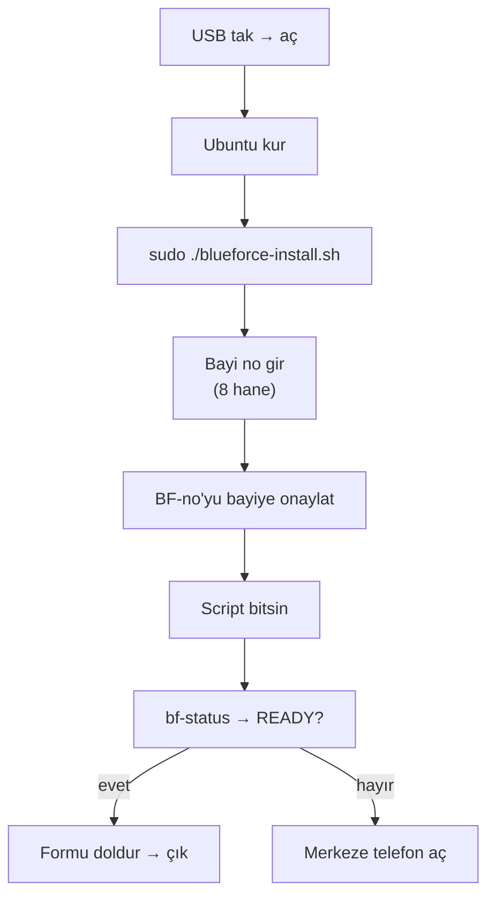

# 20 — Saha Teknisyeni Runbook

> Kısa özet: Sahada cihaz başına giden teknisyenin el kitabı. Tek akış: USB'yi tak → kur → bayi numarasını gir → READY'yi gör → çık. Komut ezberi istenmez; her adımda "ne göreceksin, ne yazacaksın" vardır.

- Dosya: `docs/20-FIELD-TECHNICIAN-RUNBOOK.md`
- İlgili kararlar: `24-DECISION-LOG.md#K-09` (USB → script → bayi no → READY), `#K-12` (bayi no → `BF-<no>`), `#K-14` (`bf-status`, support-bundle)
- Durum: [ ] Taslak

---

## 1. Amaç

Teknisyenin sahada tek başına, telefonsuz bile cihazı READY hale getirmesi. Bu dosya "neden" anlatmaz, "ne yap" söyler. Neden merak eden 01'e bakar.

## 2. Kapsam

- Kapsam içi: USB ile sıfır kurulum, bayi no girişi, READY kontrolü, arızalı cihazda ilk 3 hareket, merkeze ne zaman telefon açılacağı.
- Kapsam dışı: merkez onayları (21), arıza teşhis tablosu detayı (19 — sadece yönlendirme), update dalgaları (10).

## 3. Kararlar

```text
KARAR:    Teknisyen akışı 4 adımdır: USB → kur → bayi no → READY. Teknisyen hostname, IP, anahtar, config dosyası ile uğraşmaz; hepsini `blueforce-install.sh` yapar.
GEREKÇE:  K-09'un hedef akışı; insan hatası en çok elle config'de olur. Teknisyenin tek manuel girdisi 8 haneli bayi numarasıdır (K-12).
ALTERNATİF: Teknisyene tam Linux eğitimi + manuel kurulum — 700 cihazda standardizasyon bozulur; elendi.
RİSK:     Script USB'si eski sürüm kalır; azaltma: USB etiketinde sürüm + merkezden "şu sürümden eski USB'yi kullanma" duyurusu.
MALİYET:  Ücretsiz.
LİSANS:   Yok.
```

## 4. Neden Bu Karar?

Teknisyenin işi "bilgisayarcılık" değil "bayi cihazını çalışır teslim etmek"tir. Karar, teknisyenin dikkatini tek kritik noktaya toplar: bayi numarasını doğru girmek. Geri kalan her şey script + merkez otomasyonudur. Bu yüzden bu dosya kısa cümlelerle, emir kipiyle yazılır.

## 5. Alternatifler

| Alternatif | Artı | Eksi | Sonuç |
|---|---|---|---|
| Detaylı Linux kılavuzu | Bilgili teknisyen | Uzun, hata açık, herkes okumaz | Elendi |
| Merkezden uzaktan kurulum (teknisyensiz) | Saha maliyeti yok | İlk kurulumda cihazda internet/VPN yok | Elendi (ilk kurulum sahada) |

## 6. Avantajlar

- Yeni teknisyen 1 saatlik eğitimle sahaya çıkar.
- Her cihaz aynı adımla kurulur; "ustalık farkı" kapanır.

## 7. Dezavantajlar

- Script'in yapmadığını teknisyen de yapamaz; olağandışı durumda merkeze bağımlıdır (bilerek böyle).
- USB medyası fiziksel lojistik ister (sürüm takibi).

## 8. Riskler

| Risk | Olasılık | Etki | Azaltma |
|---|---|---|---|
| Bayi no yanlış girilir | Orta | Yüksek | Script ekranda `BF-<no>`'yu gösterir, teknisyen bayiye onaylatır |
| Eski USB ile kurulum | Orta | Orta | USB sürüm etiketi + kurucu açılışta sürümü söyler |
| READY görülmeden sahadan çıkılır | Düşük | Yüksek | Kontrol listesi imzalanmadan iş kapanmaz |

## 9. Uygulama Planı

### A. Sıfır kurulum (yeni cihaz) — 4 adım

**ADIM 1 — USB'yi tak, bilgisayarı aç.**

1. Kurulum USB'sini tak.
2. Bilgisayarı aç, USB'den başlat (açılışta genelde F12/F8/F2 — ekranda yazar).
3. Ubuntu kurulum ekranı gelene kadar bekle.

> Göreceğin: Ubuntu kurulum ekranı. Bunu görmüyorsan: USB tam takılı mı, BIOS boot sırası USB mi? Olmazsa merkeze telefon aç.

**ADIM 2 — Ubuntu'yu kur.**

1. Ekrandaki kurulumu varsayılanlarla tamamla (dil: Türkçe, disk: tamamını kullan).
2. Kurulum bitince USB'yi çıkarma, bilgisayarı yeniden başlat.

**ADIM 3 — Kurucu scripti çalıştır, bayi numarasını gir.**

1. Terminali aç, şunu yaz:

```bash
sudo ./blueforce-install.sh
```

2. Script senden **8 haneli bayi numarasını** ister. Faturadaki/sistemdeki numarayı yaz, Enter'a bas. Örnek: `12010193`.
3. Script ekranda şunu gösterecek:

```text
Device ID: BF-12010193
Hostname:  bf-12010193
```

4. Numarayı bayiye sesli onaylat: "Cihaz numaranız BF-12010193, doğru mu?" Yanlışsa scriptten çık, tekrar çalıştır.

**ADIM 4 — READY'yi gör, çık.**

1. Script bitene kadar bekle (kapatma, fişi çekme).
2. Sonunda şunu çalıştır:

```bash
bf-status
```

3. Offline medya ile kurulumda önce **PROVISIONED_OFFLINE** görmen normaldir; bu durumda cihaz READY değildir. İnternet geldiğinde merkezden tek-kullanımlık enrollment token iste ve 29'daki adımı uygula.
4. Token sonrası **ENROLLED** görünür; WireGuard, remote ve monitoring merkezi doğrulaması bitince **READY** görmelisin.
5. READY sonrası kontrol listesini doldur (§12), sahadan çık.

### B. Arızalı cihaza gittin — ilk 3 hareket

1. `bf-status` çalıştır. Kırmızı satır hangisi? Not al.
2. Bilgisayarı bir kez yeniden başlat. Düzelirse READY'yi gör, çık.
3. Düzelmezse support paketini al, merkeze gönder:

```bash
bf-support-bundle --out /tmp/bf-<bayi-no>-bundle.tar.gz
```

Paketi merkeze ilet (telefonla nasıl göndereceğin söylenir), merkez sana söylemeden başka komut çalıştırma.

### C. Merkeze telefon açma kuralları

Hemen ara: READY alamıyorsan, aynı arıza 2 cihazda üst üste çıktıysa, donanım kırık/yanık kokusu varsa, bayi numarasından emin değilsen.
Arama: cihaz başında ol, `BF-<no>`'yu ve `bf-status` çıktısını hazır tut.

## 10. Test Planı

| Test | Beklenen sonuç | Ortam |
|---|---|---|
| Sıfır teknisyen 4 adımı desteksiz yapar | READY < hedef süre | LAB(2) |
| Yanlış bayi no girilir | Script uyarır, kuruluma devam etmez | LAB(2) |
| Elektrik kesintisi simülasyonu sonrası `bf-status` | READY döner | LAB(2) |

## 11. Rollback

Teknisyen rollback yapmaz. Kurulum yarıda kesildiyse: baştan başla (ADIM 1). İkinci denemede de olmazsa merkeze telefon aç — merkez 17-RECOVERY'den seviyeyi seçer.

## 12. Kontrol Listesi

- [ ] USB sürümü güncel (etiket + merkez duyurusu eşleşiyor).
- [ ] `BF-<no>` bayiye onaylatıldı.
- [ ] `bf-status` → READY görüldü.
- [ ] Cihaz fişe + internete bağlı bırakıldı.
- [ ] İş formu dolduruldu (bayi no, tarih, teknisyen adı).

## 13. Açık Sorular

- [ ] Kurulum USB'sinin dağıtım/sürüm takip yöntemi (sahibi: merkezi admin, 21).
- [ ] İş formu kağıt mı mobil mi (sahibi: 25-ROADMAP).
- [ ] Hedef kurulum süresi (öneri: P2'de ölçülecek).

---

## Ek: Mermaid — teknisyen akışı


