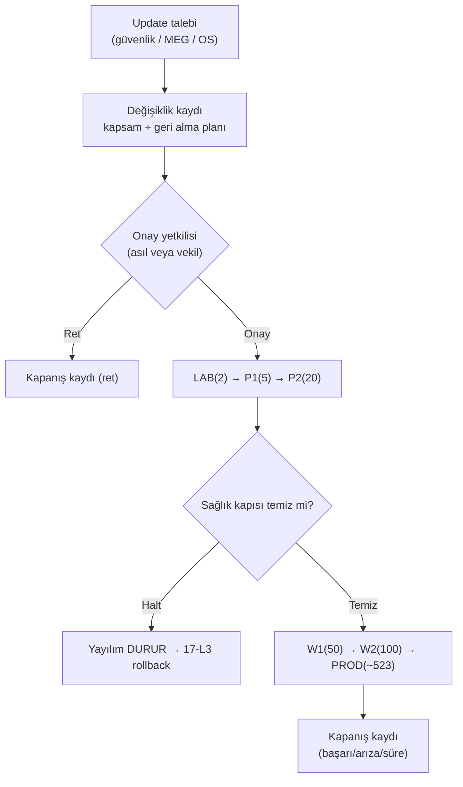

# 21 — Merkezi Yönetici Runbook

> Kısa özet: Merkezdeki yöneticinin el kitabı: hangi işlemi kim onaylar, update'i kim başlatır, dalga kapıları nasıl açılır, teknisyen ne zaman sahaya sürülür. Yetki ve sıra bu dosyadadır.

- Dosya: `docs/21-CENTRAL-ADMIN-RUNBOOK.md`
- İlgili kararlar: `24-DECISION-LOG.md#K-06` (Ansible/Semaphore), `#K-11` (onay zinciri + dalgalar), `#K-13` (anahtar dağıtımı)
- Durum: [ ] Taslak

---

## 1. Amaç

Merkezde "kim, neyi, hangi sırayla yapar" sorusunu kapatmak. Update'i kim başlatır, dalgayı kim onaylar, acil durumda kim karar verir — hepsi burada yazar, kriz anında aranmaz.

## 2. Kapsam

- Kapsam içi: rol ve onay yetkileri, update başlatma akışı, dalga kapı prosedürü, anahtar/erişim yönetimi, acil durum yetkisi, günlük/haftalık rutinler.
- Kapsam dışı: tek cihaz kurulum adımları (20), komut-seviyesi teşhis (19), kurtarma seviye tablosu (17 — buradan çağrılır).

## 3. Kararlar

```text
KARAR:    Update'i yalnızca merkezi yönetici başlatır; teknisyen, bayi veya otomatik zamanlayıcı update tetikleyemez. Her dalga geçişi açık onay (Semaphore kapı adımı + kayıt) gerektirir.
GEREKÇE:  K-11 "onaysız update yasak" ilkesinin operasyonel karşılığıdır; tek başlatma noktası = denetlenebilirlik. Otomatik tetikleyici olmaması, zamanlanmış sürprizleri engeller.
ALTERNATİF: Takvimli otomatik dalga başlatma — onay kaydı zayıflar, arızada "kim başlattı" belirsizleşir; elendi.
RİSK:     Yönetici izindeyken update kilitlenir; azaltma: en az 2 onay yetkilisi tanımlanır (asıl + vekil).
MALİYET:  Ücretsiz.
LİSANS:   Yok.
```

```text
KARAR:    Acil güvenlik update'inde dalga sırası atlanamaz ama gözetim süreleri kısaltılabilir; kısaltma kararı ve gerekçesi kayda geçirilir.
GEREKÇE:  Sıra atlamak (LAB'ı geçmeden PROD'a çıkmak) filo-çapı riskidir; süre kısaltmak ise bilinçli hızlandırmadır. Kayıt, sonradan denetimi sağlar.
ALTERNATİF: Acilde direkt PROD — geri dönüşü olmayan hata riski; elendi.
RİSK:     "Acil" etiketi suistimal edilir; azaltma: acil tanımı (CVSS eşiği / aktif sömürü) 10-UPDATE'ta yazılıdır.
MALİYET:  Ücretsiz.
LİSANS:   Yok.
```

## 4. Neden Bu Karar?

700 cihazda en tehlikeli cümle "ben başlattım sandım"dır. Başlatma yetkisini tek role toplamak, hem hatayı hem suçu önler: hata olursa kayıttan bulunur, suçlama olursa kayıt konuşur. Vekil kuralı, tek kişiye bağımlılığı kaldırır.

## 5. Alternatifler

| Alternatif | Artı | Eksi | Sonuç |
|---|---|---|---|
| Herkes update başlatabilir | Hızlı | Onaysız yayılım, denetimsizlik | Elendi |
| Tam otomatik pipeline | Eforsuz | Politika ihlali (K-11) | Elendi |
| Tek onay yetkilisi | Net | İzin/hastalıkta kilit | Elendi (asıl+vekil) |

## 6. Avantajlar

- Her update'in "kim başlattı, kim onayladı, ne zaman" kaydı vardır.
- Acil durumda bile sıra korunur; hız, sıranın içinde ayarlanır.

## 7. Dezavantajlar

- Onay adımı update'i yavaşlatır (bilerek; hız 25-ROADMAP'ta acil yoluyla dengelenir).
- Semaphore kapı adımı atlanırsa politika kağıtta kalır — teknik zorunluluk şarttır.

## 8. Riskler

| Risk | Olasılık | Etki | Azaltma |
|---|---|---|---|
| Kapı adımı bypass edilir (CLI'dan direkt run) | Orta | Yüksek | Semaphore dışı prod run'ı yasaktır; denetim logu izlenir |
| İki yetkili de ulaşılamaz | Düşük | Orta | Acil iletişim zinciri + önceden tanımlı duraklatma (devam etme, durdur) |
| Anahtar sızıntısı | Düşük | Yüksek | Per-admin anahtar iptali + rotasyon (K-13) |

## 9. Uygulama Planı

### Roller

| Rol | Kim | Yetkisi |
|---|---|---|
| Onay yetkilisi (asıl + vekil) | İsimle tanımlanır | Dalga başlatma/onay, acil kısaltma kararı, L8/L9 kararı |
| Operatör | Merkez ekibi | Onaylanmış job'u çalıştırma, monitoring izleme, teknisyen yönlendirme |
| Teknisyen | Saha ekibi | 20'deki akış; update/dalga başlatamaz |
| İzleyici (read-only) | Yönetim | Panoları görür, işlem yapamaz |

### Standart update akışı (yönetici gözüyle)

1. Update talebi gelir (güvenlik bülteni / MEG sürümü / OS yaması) → etki + geri alma planı raporlanır.
2. Onay yetkilisi LAB'ı başlatır: Semaphore'da job + kayıt.
3. LAB çıkış kriteri tuttuysa P1 → P2 → W1 → W2 → PROD, her kapıda açık onay.
4. Herhangi bir dalgada halt kuralı (18) tetiklenirse: yayılım DURUR, 17-L3 işletilir, kök neden bulunmadan kapı açılmaz.
5. PROD bitiminde kapanış kaydı (başarı/arıza sayısı, süre).

```bash
# örnek: onaylı dalga run (operatör, onay sonrası)
ansible-playbook playbooks/update.yml --limit wave_p1
# örnek: kapı kontrolü — onaysız PROD engeli (ilke; teknik karşılığı Semaphore'da)
# PROD limiti yalnızca "prod-onay" etiketli job ile koşar
```

### Anahtar ve erişim yönetimi

1. Yeni admin: anahtarı üretilir, `authorized_keys`'e Ansible ile dağıtılır (K-13); eski/ayrılan adminin anahtarı aynı yolla kaldırılır.
2. Paylaşılan tek private key YOKTUR; böyle bir dosya görülürse olay kaydı açılır.
3. Semaphore yalnızca WireGuard arkasından erişilir; gizliler yerleşik şifreli Key Store'dadır (K-06).

### Günlük / haftalık rutinler

- Günlük (operatör, 10 dk): Uptime Kuma UP/DOWN, Prometheus `up` == 0 listesi, gece reboot olanlar, yedek job durumu.
- Haftalık (yönetici, 30 dk): dalga takvimi, açık halt'lar, anahtar/envanter uyumsuzlukları, `PROVISIONED_OFFLINE`/`ENROLLED` bekleyen cihaz kuyruğu, release manifest/rollback kanıtı ve L9 tatbikat sayacı (27/29/30).

## 10. Test Planı

| Test | Beklenen sonuç | Ortam |
|---|---|---|
| Onaysız PROD run denemesi | Engellenir + log düşer | Merkez test |
| Semaphore kapalıyken Ansible CLI run | Onaylı iş CLI'dan koşar (K-06) | LAB(2) |
| Vekil ile dalga onayı | Kayıtta vekil adı görünür | Merkez test |

## 11. Rollback

1. Hatalı dalga: 17-L3 + 10-UPDATE rollback zinciri; kapı bir sonraki dalgaya kapatılır.
2. Hatalı onay: aynı yetkili (veya vekil) durdurma kararı verir; "devam" kararı verilemez, yalnızca "dur + geri al".

## 12. Kontrol Listesi

- [ ] Asıl + vekil isimle tanımlı ve iletişim bilgileri güncel.
- [ ] Semaphore'da PROD kapı adımı teknik olarak zorunlu.
- [ ] Her dalga onayı kayıtlı (kim, ne zaman, hangi sürüm).
- [ ] Ayrılan personelin anahtarı kaldırıldı.

## 13. Açık Sorular

- [ ] Acil tanımı eşikleri (CVSS/aktif sömürü) — 10-UPDATE ile ortak onay (sahibi: yönetici).
- [ ] Kapanış raporu formatı ve saklama süresi (sahibi: 25-ROADMAP).
- [ ] Read-only yönetim panosu kapsamı (sahibi: 14-MONITORING yazarı).

---

## Ek: Update Onay Akışı (yönetici gözüyle)


