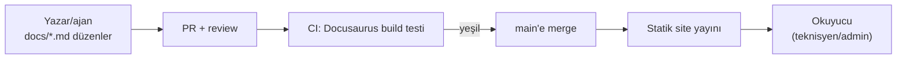

# 22 — Dokümantasyon Platformu (Documentation Platform)

> Kısa özet: Teknik dokümanların yazıldığı, sürümlendiği ve yayınlandığı platform kararı: Docusaurus önerilir. `docs/*.md` tek kaynaktır; site derlemesi CI'da yapılır; AI ajanları Markdown'u doğrudan günceller.

- Dosya: `docs/22-DOCUMENTATION-PLATFORM.md`
- İlgili kararlar: `24-DECISION-LOG.md#K-08` (Docusaurus, MkDocs yedekte)
- Durum: [ ] Taslak

---

## 1. Amaç

27 dokümanın (00…25 + şablon) hem ham Markdown olarak Git'te hem de aranabilir site olarak yayınlanmasını sağlamak; "doküman nerede, güncel mi, kim değiştirdi" sorularını kapatmak.

## 2. Kapsam

- Kapsam içi: platform seçimi, `docs/` ↔ site ilişkisi, yazım-derleme-yayın akışı, sürümleme ve dil politikası.
- Kapsam dışı: doküman içerikleri (00…21, 23…25), CI komut detayı (25-ROADMAP'a havale).

## 3. Kararlar

```text
KARAR:    Dokümantasyon platformu Docusaurus'tur; kaynak `docs-site/` iskeleti + `docs/*.md` tek-kaynak; site derlemesi CI'da yapılır.
GEREKÇE:  "AI-güncelleme" kriterini yalnızca Git-yerleşik Markdown çözer: ajan `.md`'yi doğrudan yazar, değişiklik PR'dan geçer, geçmiş Git'tedir. Docusaurus yerleşik sürümleme + yerleşik i18n + MDX (Mermaid dahil) verir; derleme maliyeti alternatifleriyle eşdeğerdir.
ALTERNATİF: MkDocs + Material — eşdeğer sadelikte güçlü ikinci; Docusaurus hattı sorun çıkarırsa geçiş maliyeti düşük (kaynak yine düz Markdown) → yedekte tutulur. Wiki.js (DB+servis yükü) ve TriliumNext (tek kullanıcı) elendi.
RİSK:     Node derleme hattı bozulabilir; azaltma: kilitli bağımlılıklar + CI derleme testi; derleme bozulsa bile `docs/*.md` ham haliyle okunur.
MALİYET:  Ücretsiz (self-hosted/statik yayın).
LİSANS:   Docusaurus MIT — https://github.com/facebook/docusaurus + https://docusaurus.io/docs/markdown-features/diagrams (doğrulanma: 2026-09-15).
```

```text
KARAR:    Yayınlanan sitenin kaynağı ile Git'teki `docs/*.md` arasında elle kopyalama yapılmaz; senkronizasyon tek yönlüdür (Git → site).
GEREKÇE:  Çift-kaynak, güncel-olmayan site üretir; tek kaynak + CI derlemesi "sitedeki her satırın Git karşılığı var" garantisi verir.
ALTERNATİF: Wiki'de düzenle, Git'e aktar — yön tersine döner, PR disiplini ölür; elendi.
RİSK:     CI bozulursa site eskir; azaltma: CI rozeti + derleme testi her PR'da koşar.
MALİYET:  Ücretsiz.
LİSANS:   Yok.
```

## 4. Neden Bu Karar?

Üç filtre (24 §4) burada da uygulandı: (1) ücretsiz — Docusaurus MIT, barındırma statik; (2) sadelik — DB'li wiki (Wiki.js) bir servis daha demektir, reddedildi; tek-kullanıcı bilgi tabanı (TriliumNext) ekip akışını taşımaz; (3) AI-uyumluluk — ajan düz Markdown'u yazar ve review'a sunar; bu, DB-içi editörde mümkün değildir. MkDocs'a karşı Docusaurus'u ayıran, sonradan eklenti aramadan gelen sürümleme + i18n'dir (700 cihazlık filonun dokümanı yıllarca yaşar, sürüm gerekir).

## 5. Alternatifler

| Alternatif | Artı | Eksi | Sonuç |
|---|---|---|---|
| MkDocs + Material | Sade, hızlı, güçlü ikinci | Sürümleme/i18n eklentiyle | Yedek |
| Wiki.js | Güçlü editör, yetkilendirme | DB+servis yükü, Git akışı dolaylı | Elendi |
| TriliumNext | Hafif, kişisel | Ekip review akışı yok | Elendi |
| Yalnızca GitHub/GitLab render | Sıfır kurulum | Sürümleme/arama/zengin tema yok | Elendi (ham okuma zaten var) |

## 6. Avantajlar

- Derleme bozulsa bile dokümanlar kaybolmaz (`docs/*.md` her zaman okunur).
- Mermaid diyagramları (01'deki 3 akış) sitede ve PR önizlemede render olur.
- Sürümleme sayesinde "PİLOT'taki prosedür neydi" sorusu cevaplanabilir.

## 7. Dezavantajlar

- Node derleme hattı bakım ister (kilit dosyası + periyodik güncelleme).
- Editör eşiği wiki'ye göre yüksektir (PR açmak gerekir) — teknik ekip için kabul edilebilir.

## 8. Riskler

| Risk | Olasılık | Etki | Azaltma |
|---|---|---|---|
| Derleme hattı bozulur, site eskir | Orta | Düşük (kaynak okunur) | CI derleme testi + kilitli bağımlılık |
| Doküman-Git senkronu bozulur (elle site editi) | Düşük | Orta | Siteye yazma yetkisi yalnızca CI'da |
| İçerik eskir (prosedür değişti, doküman kalmış) | Orta | Yüksek | Her PR'da "ilgili doküman güncellendi mi" kontrolü |

## 9. Uygulama Planı

1. `docs-site/` iskeleti kurulur (Docusaurus init), `docs/*.md` siteye kaynak olarak bağlanır.
2. CI job'ı: her PR'da derleme testi (`build`); `main`'e merge'de statik yayın.
3. Yazım kuralı: yeni/degisen prosedür → önce `.md`, sonra PR; site editi yasak.
4. Sürümleme: ilk PROD dalgasında `v1` kesilir; sonraki imaj değişiklikleri yeni sürümle etiketlenir.

```bash
# örnek: yerelde önizleme (komut adları İngilizce orijinal, açıklama Türkçe)
cd docs-site
npm install
npm run build
npm run serve
```

## 10. Test Planı

| Test | Beklenen sonuç | Ortam |
|---|---|---|
| CI derleme testi (bozuk link/Mermaid) | Hatalı PR kırmızıya düşer | CI |
| `docs/*.md` ham okunabilirlik | Git arayüzünde tablolar/diyagramlar anlaşılır | Git web |
| Sürüm kesme (`v1`) | Eski prosedüre sürüm menüsünden erişilir | Yayınlanan site |

## 11. Rollback

1. Bozuk site yayını: önceki CI çıktısına (statik) dönülür; kaynak `.md` etkilenmez.
2. Platform değişikliği (Docusaurus → MkDocs): kaynak `.md` taşındığı için içerik kaybı olmaz; yalnızca `docs-site/` yeniden yazılır.

## 12. Kontrol Listesi

- [ ] `docs-site/` derleniyor, 3 Mermaid (01) render oluyor.
- [ ] CI'da derleme testi her PR'da koşuyor.
- [ ] Siteye elle yazma kapalı (yalnızca CI yayınlıyor).
- [ ] Şablon (`_TEMPLATE.md`) ile yeni doküman açma akışı denendi.

## 13. Açık Sorular

- [ ] Statik sitenin barındırılacağı yer (merkez VDS / iç ağ) (sahibi: 25-ROADMAP).
- [ ] İlk sürüm (`v1`) kesme tarihi — PROD dalgasına bağlı (sahibi: merkezi admin, 21).
- [ ] Türkçe dışına çeviri ihtiyacı (i18n açılacak mı) (sahibi: yönetim).

---

## Ek: Mermaid — doküman akışı


