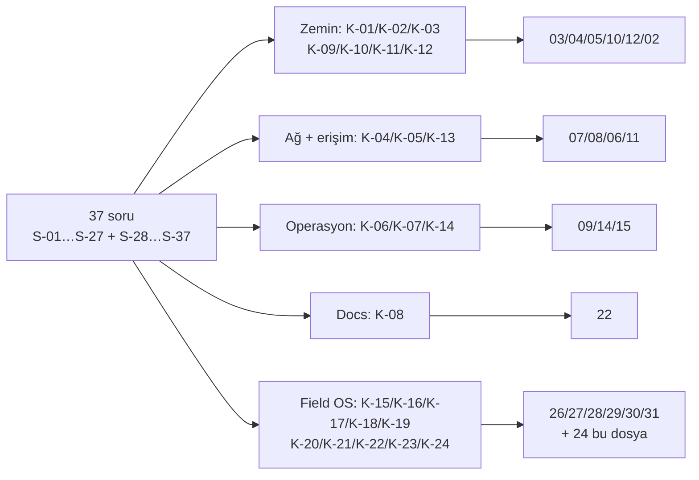

# 24 — Karar Günlüğü (Decision Log)

> Kısa özet: Blueforce 700 cihaz Linux filosunun tüm nihai mimari kararları tek tabloda; her karar KARAR/GEREKÇE/ALTERNATİF/RİSK/MALİYET/LİSANS bloğu + resmi kaynak URL ile. Diğer numaralı dokümanların başvurduğu kilit dosyadır (K-01…K-24).
>
> - Dosya: `docs/24-DECISION-LOG.md`
> - İlgili kararlar: bu dosyanın kendisi kilit kaynaktır; `01-ARCHITECTURE.md` bu kararları diyagramlaştırır.
> - Durum: [x] Onaylı (Faz 2 kilidi; değişiklik bu dosyadan PR ile yapılır)
> - Kural: tüm kararlarda FREE sürümler baz alınır; Pro/Enterprise zorunlu mimariye girmez.
> - Doğrulama günü: 2026-09-15 (tüm URL'ler bu tarihte HTTP 200 ile çekildi). İkinci doğrulama turu: 2026-09-16 (Subiquity autoinstall referansı + GNOME/XFCE/xrdp/NoCloud URL'leri yeniden HTTP 200 ile doğrulandı); ayrıntı `research/` dosyalarında.
> - Numaralandırma kuralı: **append-only**. Mevcut K-01…K-19 silinmez/yeniden numaralanmaz (başka dokümanlar `#K-16`, `#K-17`, `#K-18`, `#K-19` başlıklarına link verir); yeni kararlar bir sonraki boş numaradan eklenir. Bu turda eklenen: K-20…K-24.

---

## 1. Amaç

27 izlenebilirlik sorusunun (bkz. §13 ve Ek B) her birinin hangi karara dayandığını tek yerden göstermek; kararsız veya varsayıma dayalı seçim bırakmamak.

## 2. Kapsam

- Kapsam içi: OS/GUI/boot, 4 erişim kanalı (RDP her-zaman-hazır ayrımı dahil), WireGuard, fleet, monitoring, docs, golden image, Docker, cihaz kimliği, update dalgaları, Field OS ISO/medya stratejisi, offline provisioning, enrollment/durum modeli, release + Field OS sürüm kimliği ve Windows geçişi — aşağıdaki K-01…K-24 kararları.
- Kapsam dışı: script kodları, VDS kurulum komutları, gerçek cihaz test sonuçları (Faz 3+ işi; ilgili dokümanlara havale edilir).

## 3. Kararlar

### K-01 — Baz işletim sistemi ve sürüm

```text
KARAR:    Saha standardı Ubuntu Server 26.04.1+ LTS'tir (GUI'siz minimal kurulum; GNOME sonradan eklenir).
GEREKÇE:  26.04.1 LTS resmi indirme sayfasında yayında (kod adı Resolute Raccoon); Server ISO'su varsayılan olarak GUI kurmaz, minimal zemin + ihtiyaca göre GUI standart yoldur. Noktasürüm (.1+) baz alınır çünkü ilk .0 dalgasındaki kurulumcu hataları genelde .1'de toplanır (LAB imaj testiyle kesinleşir).
ALTERNATİF: Ubuntu 24.04 LTS — 26.04 doğrulanamasaydı yedekti; doğrulandığı için yedekte bekler. Ubuntu Desktop 26.04 (6 GB RAM şartı) saha bütçesini zorladığı için elendi.
RİSK:     26.04.x noktasürümlerinde donanım sürücü farkı; azaltma: golden image LAB(2)'de her saha donanım profilinde test edilir.
MALİYET:  Ücretsiz.
LİSANS:   Ubuntu LTS ücretsiz (açık kaynak bileşenler; ESM kapsamına bel bağlanmaz) — https://releases.ubuntu.com/ (26.04.1, doğrulanma: 2026-09-15) + https://ubuntu.com/download/desktop (sistem gereksinimi, doğrulanma: 2026-09-15).
```

### K-02 — Masaüstü ortamı (GNOME)

```text
KARAR:    Saha masaüstü ortamı GNOME'dur (Ubuntu Desktop standardı); XFCE elendi.
GEREKÇE:  Kullanıcı kararı + Ubuntu Desktop standardı: tanıdık modern masaüstü, teknisyen akışıyla birebir uyum.
ALTERNATİF: XFCE — hafif ve düşük kaynak tüketimine rağmen kullanıcı kararıyla elendi; ancak K-23 uyarınca LAB A/B ölçümü için yedekte tutulur (ölçüm sonucu bu kararı revize edebilir; saha standardı ölçüm bitene kadar GNOME kalır).
RİSK:     xRDP+GNOME kombinasyonu ek ayar isteyebilir (uyarı: GNOME oturumu RDP'de ek yapılandırma gerektirebilir); azaltma: 13-MEG-LINUX-ACCEPTANCE testi GNOME üzerinde koşar, `bf-gui-*` LAB'da 26.04.1 imajında doğrulanmadan dondurulmaz.
MALİYET:  Ücretsiz.
LİSANS:   GNOME (GPL/LGPL bileşenler), ücretsiz — https://www.gnome.org/ (doğrulanma: 2026-09-15; yeniden doğrulama: 2026-09-16, HTTP 200).
```

> **Güncelleme (2026-09-16):** K-02 geçerli kalır; yalnız **K-23** ile ölçüme bağlanır. Saha standardı GNOME'dur; XFCE saha standardı değildir, LAB A/B ölçüm adayıdır. İki karar çelişmez: baseline = GNOME, revizyon kapısı = LAB verisi.

### K-03 — Boot davranışı ve GUI aç/kapa

```text
KARAR:    Cihazlar terminale (multi-user) boot eder; grafik katman `bf-gui-on` / `bf-gui-off` ile systemd üzerinden açılıp kapatılır.
GEREKÇE:  xRDP mimarisi oturum yöneticisi (sesman) + systemd servis birimleri (`xrdp`, `xrdp-sesman`) üzerine kuruludur; GUI, display-manager + xRDP servisleri üzerinden yönetilebilir bir katman olarak modellenir. Varsayılan kapalı GUI = düşük RAM, düşük saldırı yüzeyi, öngörülebilir boot.
ALTERNATİF: Her zaman grafik boot — kaynak israfı ve 700 cihazda gereksiz hata yüzeyi nedeniyle elendi.
RİSK:     Kesin birim adları ve GNOME oturum başlatma satırı 26.04.1'e göre değişebilir; azaltma: LAB'da 26.04.1 imajında doğrulanmadan `bf-gui-*` dondurulmaz.
MALİYET:  Ücretsiz.
LİSANS:   xRDP Apache-2.0, ücretsiz — https://github.com/neutrinolabs/xrdp (v0.10.6.1, 2026-07-07; doğrulanma: 2026-09-15).
```

> **Güncelleme (2026-09-16):** `bf-gui-on` / `bf-gui-off` yalnız **yerel fiziksel** grafik katmanı (display-manager + default target) yönetir; `xrdp`/`xrdp-sesman` her zaman enable/active kalır ve RDP bu anahtarlara bağlı değildir — ayrıntı ve kanıt: **K-22**.

### K-04 — Uzaktan erişim kanalları (4 kanal)

```text
KARAR:    Dört erişim kanalı: (1) SSH-over-WireGuard (yönetim/otomasyon), (2) xRDP + GNOME (grafik bakım), (3) RustDesk OSS self-hosted hbbs/hbbr (birincil grafik uzak erişim, WireGuard-bağımsız), (4) MeshCentral self-hosted (ikincil yönetim: terminal/dosya/envanter, WireGuard-bağımsız). AnyDesk mimariden ÇIKARILDI.
GEREKÇE:  RustDesk OSS sınırsız istemci, kendi ID+röle altyapısı, E2E şifreli oturum, dosya transferi ve katılımsız erişimi ücretsiz verir; istemcide VDS genel adresi kullanıldığında WireGuard çökse bile kanal ayakta kalır. MeshCentral Apache-2.0 ile ikinci bağımsız düzlemi sağlar. AnyDesk ücretsiz sürümü yalnızca kişisel kullanımı kapsar; 700 kurumsal cihaz ticari kullanımdır ve lisanssız kullanım ihlal olur (en az Advanced planı gerekirdi).
ALTERNATİF: AnyDesk (lisans maliyeti + kapalı kaynak + self-hosted yalnızca en üst planda → elendi; yalnızca müşteri sahasında zaten lisanslıysa opsiyonel installer modülü). Tailscale/ZeroTier (freemium, merkezi kimlik → elendi).
RİSK:     İki VDS-bağımlı kanalın tek ortak noktası VDS + genel internet; azaltma: hbbs/hbbr `--net=host` + health monitörü (Uptime Kuma) + yedek VDS planı 17-RECOVERY'de.
MALİYET:  Ücretsiz (kendi VDS'i üzerinde; VDS kira bedeli hariç — altyapı maliyeti, lisans değil).
LİSANS:   RustDesk istemci+sunucu AGPL-3.0 (1.4.9 / 1.1.16) — https://rustdesk.com/docs/en/self-host/rustdesk-server-oss/ + https://rustdesk.com/docs/en/self-host/client-deployment/ (doğrulanma: 2026-09-15); MeshCentral Apache-2.0 (1.2.5) — https://github.com/Ylianst/MeshCentral (doğrulanma: 2026-09-15); AnyDesk hükmü — https://support.anydesk.com/docs/anydesk-licenses.md (doğrulanma: 2026-09-15) + https://anydesk.com/en/pricing.
```

### K-05 — WireGuard modeli

```text
KARAR:    Hub-spoke WireGuard: merkez sunucu hub, her saha cihazı spoke (peer adı = `bf-<8hane>`); istemcide `PersistentKeepalive = 25` + `wg-quick@wg0` systemd enable; RDP/SSH dış dünyaya kapalı, yalnızca WireGuard arkasında.
GEREKÇE:  Resmi QuickStart NAT arkasındaki eş için 25 sn keepalive'i "geniş güvenlik-duvarı yelpazesiyle çalışan makul aralık" olarak verir; `wg-quick@.service` Ubuntu paketinden gelir, enable = açılışta otomatik VPN. Elektrik kesintisi sonrası cihaz açılınca VPN kendiliğinden gelir.
ALTERNATİF: Keepalive kapalı / agresif 10 sn — kapalı NAT eşlemesini düşürür, agresif değer saha verisi olmadan yazılmaz; PİLOT-1 kopma sayacına göre ayarlanır.
RİSK:     Turkcell CGNAT davranışı resmi kaynaktan doğrulanamaz (operatör bilgisi); azaltma: PİLOT-1'de 7/24 kopma sayacı, aralık saha verisiyle ayarlanır.
MALİYET:  Ücretsiz.
LİSANS:   WireGuard OSS (Ubuntu paketi `wireguard-tools 1.0.20250521-1ubuntu1`) — https://www.wireguard.com/quickstart/ + https://packages.ubuntu.com/resolute/wireguard-tools (doğrulanma: 2026-09-15).
```

### K-06 — Filo yönetimi

```text
KARAR:    Birincil filo otomasyonu Ansible CLI (SSH, agent'sız); operatör arayüzü Semaphore UI Community (self-hosted, MIT). Hiçbir playbook Pro/Enterprise özelliğine bağlanmaz.
GEREKÇE:  En düşük hareketli parça (SSH + YAML + tek Go binary); 700 cihazda ek agent/master/K8s maliyeti yok. Community ücretsizliği resmi fiyat sayfasıyla kanıtlı ("$0, free forever"); Pro en fazla 500 managed node desteklediği için 700 cihazda ücretli yol zaten kapalı.
ALTERNATİF: AWX (K8s yükü + release'ler refactoring nedeniyle duraklatıldı → elendi); Salt (minion agent + master PKI → elendi); Rudder Community (relay/Enterprise modülleri + öğrenme eğrisi → elendi); MeshCentral (erişim aracı, filo otomasyonu değil → bu rolde elendi).
RİSK:     Semaphore tek nokta arızası → Ansible CLI bağımsız çalışır (UI çökse filo durmaz). Community'de OIDC/2FA/Vault yok → Semaphore yalnızca WireGuard arkasında, erişim VPN + SSH anahtarı ile; gizliler yerleşik şifreli Key Store'da.
MALİYET:  Ücretsiz (kendi VDS'i üzerinde).
LİSANS:   Ansible GPL-3.0 — https://github.com/ansible/ansible; Semaphore Community MIT — https://github.com/semaphoreui/semaphore + https://semaphoreui.com/pricing (doğrulanma: 2026-09-15).
```

### K-07 — Monitoring

```text
KARAR:    Birincil Prometheus + Node Exporter + Grafana OSS (17 metriğin tamamı); tamamlayıcı Uptime Kuma (saha-teknisyeni dostu UP/DOWN panosu + Push "last seen" + bildirimler). Netdata elendi.
GEREKÇE:  17 metriğin tamamı yalnızca Prometheus yığınında ücretsiz ve kotasız toplanır (WireGuard handshake, Docker, MEG sağlığı textfile collector ile). Netdata Cloud Free 5 node kotası 700 cihazda ücrete düşer. Uptime Kuma metrik vermez ama en basit çevrimdışı alarmını verir (20 sn aralık, 90+ bildirim servisi, tek konteyner).
ALTERNATİF: Yalnızca Uptime Kuma (metrik körlüğü → elendi); Netdata self-hosted Parent (merkezi tasarım yükü + kota riski → elendi).
RİSK:     700 node'da saklama/kardinalite; azaltma: scrape 60 sn, retention 30–90 gün, etiket şeması `BF-<no>` standardında, federasyon/fazlı rollout.
MALİYET:  Ücretsiz.
LİSANS:   Prometheus/Node Exporter Apache-2.0 — https://github.com/prometheus/prometheus + https://prometheus.io/docs/guides/node-exporter/; Grafana OSS AGPL-3.0 (değişikliksiz self-host) — https://grafana.com/oss/; Uptime Kuma MIT — https://github.com/louislam/uptime-kuma (doğrulanma: 2026-09-15).
```

### K-08 — Doküman platformu

```text
KARAR:    Docusaurus (`docs-site/` iskeleti; `docs/*.md` tek kaynak, site derlemesi CI'da).
GEREKÇE:  "AI-güncelleme" kriterini yalnızca Git-yerleşik Markdown çözer (ajan `.md`'yi doğrudan yazar, review PR'dan geçer). Wiki.js'nin DB+servis yükü sadelik kuralını bozar; TriliumNext tek-kullanıcı bilgi tabanıdır. MkDocs'a karşı Docusaurus: yerleşik sürümleme + yerleşik i18n + MDX; derleme maliyeti eşdeğerdir.
ALTERNATİF: MkDocs + Material (eşdeğer sadelikte güçlü ikinci; Docusaurus derleme hattı sorun çıkarırsa geçiş maliyeti düşük çünkü kaynak yine düz Markdown — yedekte tutulur). Wiki.js (DB yükü → elendi). TriliumNext (ekip akışı yok → elendi).
RİSK:     Node derleme hattı bozulabilir; azaltma: kilitli bağımlılıklar + CI derleme testi; derleme bozulsa bile `docs/*.md` ham haliyle okunur.
MALİYET:  Ücretsiz.
LİSANS:   Docusaurus MIT — https://github.com/facebook/docusaurus + https://docusaurus.io/docs/markdown-features/diagrams (doğrulanma: 2026-09-15).
```

### K-09 — Golden image yöntemi

```text
KARAR:    Golden image = Ubuntu Server 26.04.1+ minimal + `unattended-upgrades` kapalı + `blueforce-install.sh` tek kurucu (bayi no → READY); imaj, preseed/autoinstall dosyasıyla üretilir, cihaz-spesifik kimlik (`bf-<no>`) imajda DEĞİL ilk açılışta verilir.
GEREKÇE:  Donanım heterojenliği bilinmediği için bit-kopya klon (Clonezilla) tek imajda kırılgandır; autoinstall + idempotent kurulum scripti her donanım profilinde aynı zemini kurar, kimlik ilk boot'ta enjekte edilir. Hedef akış: USB → Ubuntu → tek script → bayi no → READY.
ALTERNATİF: Clonezilla bit-kopya (hızlı ama donanım-fragil → yedek yöntem olarak tutulur); Packer/custom ISO (ek derleme hattı yükü → elendi); cloud-init (autoinstall'a göre saha-USB akışına daha az uygun → elendi).
RİSK:     İlk imaj heterojen donanımda sürücü eksiltebilir; azaltma: önce `bf-hardware-inventory.sh` taraması (18-ROLLOUT), LAB'da her profilde test.
MALİYET:  Ücretsiz.
LİSANS:   Ubuntu autoinstall/subiquity (ücretsiz, Ubuntu lisans seti içinde) — https://releases.ubuntu.com/26.04/ (doğrulanma: 2026-09-15). NOT: Faz 1'de resmi autoinstall sözdizimi ayrıca doğrulanmadı; kesin direktifler 04-GOLDEN-IMAGE'da LAB çıktısıyla yazılır.
```

### K-15 — Blueforce Field OS kurulum medyası

```text
KARAR:    Blueforce Field OS = Ubuntu Server 26.04.1+ LTS üzerinde GNOME katmanı; V1 kurulum medyası resmi upstream ISO + ayrı NoCloud seed USB'dir. Autoinstall ve custom Field ISO tamamlayıcıdır; custom ISO yalnız LAB build artefact'ı olarak ele alınır.
GEREKÇE:  Upstream ISO + seed, cihaz-spesifik veriyi medyadan ayırır ve remaster boot riskini V1'den uzak tutar. Custom ISO dağıtım kolaylığı sağlayabilir ancak UEFI/Legacy/Secure Boot davranışı kanıtlanmadan standart değildir.
ALTERNATİF: Yalnız custom remaster ISO — doğrulanmamış boot zinciri nedeniyle V1 için elendi; custom build gelecekte tamamlayıcıdır.
RİSK:     26.04 autoinstall veya remaster davranışı değişir; azaltma: her release'te checksum + LAB matrisi.
MALİYET:  Ücretsiz.
LİSANS:   Ubuntu Server — https://ubuntu.com/download/server ; Subiquity — https://canonical-subiquity.readthedocs-hosted.com/en/latest/ ; NoCloud — https://cloudinit.readthedocs.io/en/latest/reference/datasources/nocloud.html (26.04 kesin davranışı LAB gerektirir).
```

### K-16 — Assisted offline provisioning durumu

```text
KARAR:    İnternetsiz assisted provisioning imzalı/sürümlü ISO, seed ve offline APT snapshot ile yapılır; başarılı yerel sonuç yalnız PROVISIONED_OFFLINE'dır.
GEREKÇE:  Saha bağlantısı yokken kurulum tamamlanabilir, ancak merkezi kimlik/kanal doğrulaması olmadan READY iddiası güvenli değildir.
ALTERNATİF: İnternet gelene kadar kurmamak — saha blokajı nedeniyle elendi; rastgele .deb taşıma — bağımlılık/sürüm belirsizliği nedeniyle elendi.
RİSK:     Eski snapshot veya medya secret taşıması; azaltma: manifest/checksum, medya secret taraması, sürüm son kullanma tarihi.
MALİYET:  Ücretsiz.
LİSANS:   APT — https://manpages.ubuntu.com/manpages/noble/en/man8/apt.8.html ; dpkg — https://manpages.ubuntu.com/manpages/noble/en/man1/dpkg.1.html (26.04 offline akışı LAB gerektirir).
```

### K-17 — Cihaz enrollment ve READY kapısı

```text
KARAR:    PROVISIONED_OFFLINE cihaz, BF-<no>'ya bağlı kısa ömürlü tek-kullanımlık token ile ENROLLED olur; yalnız WireGuard, merkezi erişim ve monitoring kanalları doğrulanınca READY olur.
GEREKÇE:  Token cihaz kimliğini bağlar, fakat bağlantı/health kanıtı değildir. Ayrı durumlar yanlış teslimi ve ortak bootstrap secret riskini önler.
ALTERNATİF: Kalıcı ortak token — sızıntı blast-radius'u filo geneli olduğu için elendi; manuel kayıt — denetim zayıf olduğu için elendi.
RİSK:     Token çalınması/yanlış kullanım; azaltma: TTL, atomik tek kullanım, cihaz bağlama, iptal ve audit kaydı.
MALİYET:  Ücretsiz.
LİSANS:   OpenSSH — https://www.openssh.com/ ; WireGuard — https://www.wireguard.com/ ; token API kurum içi uygulama ve LAB doğrulamasıdır.
```

### K-18 — Field OS release ve rollback yönetimi

```text
KARAR:    Field OS release'i immutable manifestli bir artefact setidir: upstream ISO referansı, seed, offline APT snapshot, installer/Ansible commit'i, uygulama sürümleri ve checksum'lar birlikte sürümlenir; rollback önceki onaylı release'e döner.
GEREKÇE:  OS sürümü tek başına davranışı açıklamaz; release manifesti tekrarlanabilir kurulum, denetim ve gerçek rollback hedefi sağlar.
ALTERNATİF: latest/yalnız Git branch — artefact bileşimi ve rollback hedefi belirsiz olduğu için elendi.
RİSK:     Eksik artefact veya test edilmemiş rollback; azaltma: manifest kapısı, checksum/imza ve LAB rollback kanıtı.
MALİYET:  Ücretsiz.
LİSANS:   Git — https://git-scm.com/doc ; Ubuntu releases — https://releases.ubuntu.com/ ; Docker image sürümleme — https://docs.docker.com/reference/cli/docker/image/pull/.
```

### K-19 — Windows'tan Linux'e geçiş

```text
KARAR:    Her Windows saha cihazında önce envanter + hash doğrulanmış geri dönüş imajı alınır, sonra temiz Field OS kurulumu ve kabul yapılır; V1'de yerinde dönüşüm ve dual-boot yoktur.
GEREKÇE:  Temiz kurulum drift'i azaltır; geri dönüş imajı uygulama/periferik kabulü başarısız olduğunda kanıtlı çıkış verir.
ALTERNATİF: Yerinde dönüşüm veya dual-boot — disk/bootloader karmaşıklığı ve destek yükü nedeniyle elendi.
RİSK:     Gizli iş/veri bağımlılığı; azaltma: iş sahibi onayı, image restore provası ve 13-MEG kabul kapısı.
MALİYET:  Ücretsiz araçlar kullanılabilir; image depolama altyapı maliyetidir.
LİSANS:   Ubuntu — https://ubuntu.com/download/server ; Clonezilla — https://clonezilla.org/ ; Windows lisans/uygulama durumu kurum tarafından doğrulanır.
```

> **2026-09-16 turu — yeni kararlar (K-20…K-24).** Aşağıdaki bloklar bu turda eklendi. Numaralar append-only'dir: K-16 (offline provisioning durumu), K-17 (enrollment), K-18 (release), K-19 (Windows geçişi) **silinmedi/yeniden numaralanmadı**; `docs/27`, `docs/29`, `docs/30` ve `docs/28` bu başlıklara link verir. İstenen konularla eşleşme: "medya stratejisi güncellemesi" → K-20; "durum modeli" → K-21 (K-16/K-17 ile birlikte okunur); "RDP her zaman hazır" → K-22; "GNOME vs XFCE A/B ölçümü" → K-23; "Field OS sürüm yönetimi" → K-24 (K-18 ile birlikte okunur).

### K-20 — Medya stratejisi: autoinstall kurulum motoru, Blueforce Field OS ISO paketleme yöntemidir

```text
KARAR:    Autoinstall kurulum MOTORUDUR; Blueforce Field OS ISO ise PAKETLEME/DAĞITIM yöntemidir. İkisi rakip değildir, birlikte kullanılır: Field OS ISO içinde autoinstall + offline APT repo + firstboot bulunur. Güvenlik için autoinstall'da `interactive-sections: [storage]` KORUNUR — otomatik disk silme YOKTUR (operatör disk onayı verir). Teslim sırası: F2B'de assisted tek-USB Field OS ISO üretilir; upstream ISO + NoCloud seed USB geri dönüş yoludur. K-15 geçersiz kılınmaz, yedek yol olarak korunur.
GEREKÇE:  Subiquity resmi referansı: autoinstall yapılandırması `/autoinstall.yaml` yolunda okunur ("irrespective of how it was provided") → ISO köküne konan autoinstall dosyası desteklenir. `interactive-sections` resmi olarak desteklenir ("A list of configuration keys to still show in the user interface"). `storage` bölümü resmi olarak "can be interactive: true" işaretlidir ve varsayılanı tek-disk sistemde lvm layout'tur; yani storage interactive bırakılmazsa kurulum en büyük diski kendiliğinden bölümler. Bu yüzden tek-USB deneyimi ile "otomatik disk silme yok" güvenlik şartı AYNI ANDA sağlanır: ISO autoinstall'ı başlatır, teknisyen yalnız disk adımını onaylar. Ayrıca `apt.fallback` varsayılanı `offline-install` ("revert to an offline installation") olduğu için internetsiz kurulum tasarım gereği çalışır.
ALTERNATİF: Yalnız upstream ISO + NoCloud seed USB (tek medya deneyimi yok; prompt hedefi karşılanmaz → V1'in tek yolu olmaktan çıkar, yedek/geri dönüş yolu olarak kalır); Yalnız custom remaster ISO (UEFI/Legacy/Secure Boot boot zinciri LAB'da kanıtlanmadan sahaya çıkar → reddedildi); otomatik disk wipe'lı unattended (veri kaybı riski → yasak, F6 kapsamı).
RİSK:     Remaster boot zinciri (UEFI/Legacy/Secure Boot) LAB'da kanıtlanmazsa saha USB'si açılmayabilir; azaltma: F2B çıkış kriteri = tek USB assisted kurulumun iki LAB cihazında kanıtı; kanıt yoksa F3 başlamaz ve upstream ISO + seed yolu sıcak tutulur.
MALİYET:  Ücretsiz.
LİSANS:   Subiquity autoinstall — https://canonical-subiquity.readthedocs-hosted.com/en/latest/reference/autoinstall-reference.html (interactive-sections; `/autoinstall.yaml` yolu; `apt.fallback` default `offline-install`; `storage` "can be interactive: true" — doğrulama: 2026-09-16, HTTP 200); cloud-init NoCloud — https://cloudinit.readthedocs.io/en/latest/reference/datasources/nocloud.html (doğrulama: 2026-09-16); Ubuntu Server ISO — https://ubuntu.com/download/server.
```

### K-21 — Cihaz durum modeli (tek kaynak): PROVISIONED_OFFLINE → ENROLLED → READY

```text
KARAR:    Cihaz yaşam döngüsü ÜÇ durumdur ve tek kaynağı `/var/lib/blueforce/state.json` + `bf-enrollment-status` çıktısıdır: PROVISIONED_OFFLINE (offline kurulum bitti, merkez doğrulaması yok) → ENROLLED (tek kullanımlık token tüketildi, WireGuard atomik kuruldu) → READY (merkezi monitoring/remote/management kanıtı + yerel WG/xRDP/RustDesk kontrolleri). READY TEK DURUM DEĞİLDİR: "işletim sistemi kuruldu" READY değildir, "token alındı" READY değildir. K-16 ve K-17 bu modelin parçalarıdır; K-21 ikisini tek sözleşmede sabitler.
GEREKÇE:  Kod ve testler aynı sözleşmeyi uygular: `blueforce-install.sh --offline` başarıyla biterse state.json'a `phase=PROVISIONED_OFFLINE`, `enrollment_status=PENDING`, `fleet_status=PENDING` yazar; `bf-enrollment-status` yalnız bu üç durumu geçerli sayar (aksi halde `INVALID`/`PENDING` + exit≠0); `bf-enroll` yalnız PROVISIONED_OFFLINE/ENROLLED fazından enrollment kabul eder; `--offline` olmadan bu damga yazılmaz. `bf-check-ready` kalıcı READY değerini okumaz, güncel handshake ve merkez kanıtını bağımsız denetler; kanıt eksikse fail-closed kalır.
ALTERNATİF: İkili model (kuruldu/kurulmadı) — "merkezce güvenildi" farkını görünmez kılar ve yanlış teslim üretir → elendi; READY'yi installer çıkış kodu yapmak — ağ/merkez kanıtı olmadan READY iddiası doğurur → reddedildi.
RİSK:     Merkez kanıt alanları (`central_verification`) `pending` kalırsa cihaz ENROLLED'da bekler ve teslim gecikir; azaltma: enrollment yanıt sözleşmesi zorunlu alanları (29), fail-closed READY kapısı, 24/72 saat gözlem penceresi (IMPLEMENTATION-REPORT §9).
MALİYET:  Ücretsiz.
LİSANS:   systemd/journald (LGPL bileşenler) — https://www.freedesktop.org/software/systemd/man/latest/systemctl.html ; token API kurum içi uygulamadır (27/29).
```

### K-22 — RDP her zaman hazır; `bf-gui-on` / `bf-gui-off` yalnız yerel fiziksel GUI'yi kontrol eder

```text
KARAR:    `xrdp` ve `xrdp-sesman` multi-user seviyesinde HER ZAMAN enable ve active kalır; RDP kanalı `bf-gui-on` komutuna bağlı DEĞİLDİR. `bf-gui-on` / `bf-gui-off` yalnız YEREL FİZİKSEL grafik katmanını (display-manager: gdm3/gdm/sddm/lightdm + default target) kontrol eder. `bf-gui-off` xRDP servislerini asla durdurmaz veya disable etmez. Başka bir deyişle: GUI kapalı ≠ RDP kapalı.
GEREKÇE:  Depodaki kod bu ayrımı uygular: `08-rdp` modülü xrdp+xrdp-sesman'ın enable VE active olmasını, default target'ın multi-user kalmasını doğrular; `bf-gui-off` yalnız display-manager'ı durdurur ve "xRDP stays enabled and active so remote recovery is available" sözleşmesini taşır; `tests/check-specs.sh` bf-gui-off içinde `systemctl stop/disable xrdp*` görürse testi bilinçli olarak düşürür ve 08-rdp check'i active xrdp ister; `16-POWER-LOSS` boot zinciri de xrdp'in her zaman ready olduğunu varsayar. Bu ayrım 700 cihazda yerel GUI kapalıyken de uzaktan kurtarma kanalını korur.
ALTERNATİF: RDP'yi `bf-gui-on`'a bağlamak — GUI kapalı saha cihazında uzaktan grafik kurtarma kaybolur (sahaya gitme oranı artar) → reddedildi; her zaman grafik boot — kaynak israfı ve geniş hata yüzeyi (K-03) → elendi.
RİSK:     GNOME oturumu RDP üzerinden ek yapılandırma isteyebilir; azaltma: 13-MEG kabulü GNOME üzerinde koşar; LAB'da 26.04.1 imajında xRDP+GNOME ve bf-gui-* doğrulanmadan dondurulmaz.
MALİYET:  Ücretsiz.
LİSANS:   xRDP Apache-2.0 (v0.10.6.1) — https://github.com/neutrinolabs/xrdp (doğrulama: 2026-09-16, HTTP 200); GNOME GPL/LGPL — https://www.gnome.org/ (doğrulama: 2026-09-16, HTTP 200).
```

### K-23 — GNOME saha standardı kalır; LAB'da GNOME vs XFCE A/B ölçümü yapılır

```text
KARAR:    Saha masaüstü ortamı GNOME'dur (K-02 yürürlükte kalır, geçersiz kılınmaz). Buna ek olarak LAB'da GNOME vs XFCE A/B ölçümü yapılacak ve karar ölçüm sonucuna bağlanacaktır. Ölçüm seti sabittir: (1) RAM tüketimi, (2) CPU tüketimi, (3) boot süresi, (4) RDP güvenilirliği, (5) RustDesk'in reboot sonrası davranışı, (6) login screen erişimi, (7) dummy display davranışı, (8) 24 saat ve 72 saat stabilite. RustDesk headless ZORUNLU şartı her iki kolda da aynen korunur. Ölçüm sonucu K-02'yi revize edebilir; veri gelmeden revizyon yapılmaz.
GEREKÇE:  GNOME kullanıcı kararıdır; ancak saha koşulları (RDP oturumu + headless RustDesk + düşük RAM'li mini PC'ler) ölçülmeden "tek doğru masaüstü" iddiası kanıtsız kalır. A/B ölçümü kararı kanıta bağlar: baseline GNOME olarak sabit kalır, XFCE yalnız ölçüm adayıdır. Bu yazım K-02 ile çelişmez — K-02 sahada geçerli olan karardır, K-23 onu ölçüm kapısına bağlayan revizyon mekanizmasıdır.
ALTERNATİF: XFCE'yi doğrudan saha standardı yapmak — kullanıcı kararı dışı ve kanıtsız → elendi; XFCE'yi tamamen kapatmak — PİLOT'ta kanıtsız revizyon talebi doğurur ve ölçüm şansı kaybolur → elendi.
RİSK:     A/B ölçümü LAB zamanı ve iki masaüstü bakım yükü getirir; azaltma: ölçüm seti ve süreleri (24/72 saat) sabittir, sonuç tek tabloda tutulur ve LAB release kaydına bağlanır; XFCE kolu saha medyasına girmez.
MALİYET:  Ücretsiz.
LİSANS:   GNOME GPL/LGPL — https://www.gnome.org/ ; XFCE GPL — https://xfce.org/ (her ikisi de doğrulama: 2026-09-16, HTTP 200; XFCE yalnız LAB ölçüm adayıdır, saha standardı değildir).
```

### K-24 — Field OS sürüm kimliği: `/etc/blueforce-release` + `bf-release`

```text
KARAR:    Cihazın Field OS sürüm kimliği tek komutla okunur: `bf-release` (kaynak sırası: `BF_RELEASE_MANIFEST` → `/etc/blueforce/release-manifest.yaml` → legacy `/etc/blueforce-release` → repo içi `provisioning/release/manifest.yaml`). Manifest `status: skeleton` ise komut sürümü **UNAPPROVED_SKELETON** olarak raporlar ve sıfırdan farklı döner; skeleton release DAĞITILABİLİR release sayılmaz. Sürüm kimliği, K-18'deki immutable release manifestiyle (ISO referansı, seed, offline APT snapshot, installer/Ansible commit'i, checksum'lar) eşleşmek zorundadır. `/etc/blueforce-release` nonsecret bir cihaz-üstü kimlik dosyasıdır: token, private key veya parola içermez.
GEREKÇE:  Sahada "hangi Field OS sürümü çalışıyor?" sorusu secret sızdırmadan, tek komutla ve denetlenebilir biçimde yanıtlanmalıdır. Depodaki davranış bunu uygular: `17-healthcheck` kurulumda `provisioning/release/manifest.yaml` dosyasını `/etc/blueforce/release-manifest.yaml` olarak kurar; `bf-release` YAML ve legacy KEY=VALUE biçimini okuyabilir, okunamayan/`skeleton` manifestte exit≠0 verir ve `tests/check-specs.sh` bu ret davranışını (`UNAPPROVED_SKELETON`) zorunlu tutar. Böylece sahte/iskelet sürüm kimliği cihazda "release var" izlenimi üretemez.
ALTERNATİF: Yalnız `git tag` — sahada checkout yoktur, cihaz kendi sürümünü okuyamaz → elendi; yalnız `lsb_release`/`os-release` — yalnız Ubuntu tabanını gösterir, Field OS katmanını ve release bileşimini göstermez → elendi.
RİSK:     AÇIK KONU: `/etc/blueforce-release` bugün yalnız OKUMA yoludur (legacy biçim için uyumluluk var) ve onu yazan bir release pipeline adımı depoda yok; bu dosya yazılmazsa cihaz kimliği `/etc/blueforce/release-manifest.yaml`'a (kurulum anındaki iskelet manifest) düşer ve `bf-release` UNAPPROVED_SKELETON döner. Azaltma: gerçek release üretildiğinde manifestin status'u `released` olacak ve yazma adımı 30-FIELD-OS-RELEASE-MANAGEMENT sahibi tarafından eklenmelidir.
MALİYET:  Ücretsiz.
LİSANS:   Git — https://git-scm.com/doc ; Ubuntu releases — https://releases.ubuntu.com/ ; Docker image sürümleme — https://docs.docker.com/reference/cli/docker/image/pull/ .
```

### K-10 — Docker restart politikası ve imaj disiplini

```text
KARAR:    Tüm saha konteynerlerinde restart politikası `unless-stopped`; `latest` etiketi yasak (sabit tag zorunlu); Watchtower yok; log rotasyonu (`max-size`/`max-file`) daemon.json'da zorunlu; yayımlanan portlar `127.0.0.1`'e bağlanır (UFW bypass'a karşı).
GEREKÇE:  `unless-stopped`, `always`'in aksine teknisyenin bakım için durdurduğu konteyneri reboot sonrası sürpriz kalkıştan korur; elektrik kesintisi kurtarması aynen çalışır (kesinti "manuel stop" sayılmaz). Hareketli `latest` etiketi 700 cihazda determinizmi bozar ("onaysız update yasak" politikası). Watchtower hem politikayı ihlal eder (otomatik updater) hem upstream'de arşivlenmiştir. Docker varsayılan `json-file` logu rotasyon yapmaz → dolan disk = kilitlenen cihaz. Docker yayımlanan portlarda UFW'yi baypas eder (resmi belgeli) → localhost-bind + WireGuard üzerinden erişim.
ALTERNATİF: `always` (öngörülemez bakım davranışı → elendi); `iptables:false` (resmi doküman "çoğu kullanıcı için uygun değil" diye uyarır → varsayılan çözüm değil); digest pinleme (`@sha256`) PİLOT-2'de değerlendirilecek ek sıkılık adımı.
RİSK:     `max-size/max-file` değerleri MEG log hacmine göre ayarlanmazsa ya disk dolar ya log kaybolur; azaltma: PİLOT'ta hacim ölçülür, 12-DOCKER'da sabitlenir.
MALİYET:  Ücretsiz (Docker CE).
LİSANS:   Docker CE ücretsiz (Business/Scout mimaride yok) — https://docs.docker.com/engine/containers/start-containers-automatically/ + https://docs.docker.com/engine/logging/configure/ + https://docs.docker.com/engine/network/packet-filtering-firewalls/ (doğrulanma: 2026-09-15); Watchtower arşiv durumu — https://github.com/containrrr/watchtower (doğrulanma: 2026-09-15).
```

### K-11 — Otomatik güncelleme yasağı

```text
KARAR:    Golden image'da `unattended-upgrades` kapatılır (`/etc/apt/apt.conf.d/20auto-upgrades` değerleri `0` + `apt-daily*.timer` maskeleme); tüm güncellemeler LAB→PİLOT→WAVE→PROD onay zincirinden geçer (dalgalar: LAB(2)/P1(5)/P2(20)/W1(50)/W2(100)/PROD).
GEREKÇE:  `unattended-upgrades` Ubuntu Server'da varsayılan kurulu ve etkindir, günde bir kez çalışır; kapatılmazsa 700 cihaz ilk açılışta güncellemeye kalkar ("onaysız update yasak" ilkesi delinir). Kaçan timer makine açılışında hemen tetiklenir (`Persistent=true` davranışı) — saha PC'leri sık kapanan makinelerdir.
ALTERNATİF: Otomatik security update'e izin verme — 700 cihazda eşzamanlı indirme + onaysız değişim riski nedeniyle elendi; security update'ler öncelik işaretli onaylı dalga ile çıkar.
RİSK:     Kapatma adımı imajda atlanırsa filo kendiliğinden güncellenir; azaltma: `blueforce-install.sh` final-check + monitoring'de `Unattended-Upgrade` durumu metriği.
MALİYET:  Ücretsiz.
LİSANS:   Yok (işletim sistemi yapılandırması) — https://ubuntu.com/server/docs/how-to/software/automatic-updates/ + https://manpages.ubuntu.com/manpages/resolute/en/man8/unattended-upgrade.8.html (doğrulanma: 2026-09-15).
```

### K-12 — Cihaz kimliği standardı

```text
KARAR:    8 haneli bayi no → Device ID `BF-<no>` (büyük), hostname `bf-<no>` (küçük); WireGuard peer adı, RustDesk etiketi, Ansible inventory adı, monitoring etiketi hepsi aynı ID'yi kullanır. Örnek: `BF-12010193` / `bf-12010193`.
GEREKÇE:  Tek kimlik = 9 sistemde (DNS/hostname, WireGuard, RustDesk, MeshCentral, Ansible, Prometheus, log, envanter, runbook) join anahtarı; büyük/küçük ayrımı insan-makine karışıklığını önler (insan `BF-`, makine `bf-`).
ALTERNATİF: Rastgele UUID / MAC-tabanlı ad — saha teknisyeni için okunamaz, bayi eşleşmesi manuel olur → elendi.
RİSK:     Bayi no değişirse kimlik çakışması; azaltma: 02-NAMING'de yeniden-no prosedürü + envanter benzersizlik kontrolü.
MALİYET:  Ücretsiz.
LİSANS:   Yok (isimlendirme standardı).
```

### K-13 — SSH kimlik doğrulama mimarisi

```text
KARAR:    `blueforce` bakım kullanıcısı + anahtar zorunlu (password SSH kapalı, root SSH kapalı); 700 cihaza tek private key YAYILMAZ — admin başına anahtar + cihazlarda `authorized_keys` merkezi dağıtımı (Ansible), uzun vadede SSH CA hedefi.
GEREKÇE:  Tek private key'in sızıntı blast-radius'u 700 cihazdır; per-admin anahtar + merkezi dağıtım sızıntıyı tek anahtarın iptaline indirger. Servisler ayrı system user ile çalışır, sudo kontrollüdür.
ALTERNATİF: Tek paylaşılan private key (basit ama 700 cihazlık blast-radius → elendi); password auth (kaba-kuvvet yüzeyi → elendi).
RİSK:     Anahtar dağıtım gecikmesi yeni cihazda erişimsizlik; azaltma: golden image'da bootstrap anahtarı + ilk Ansible run'ında rotasyon.
MALİYET:  Ücretsiz.
LİSANS:   OpenSSH (BSD-lisanslı), ücretsiz.
```

### K-14 — Log ve sağlık disiplini

```text
KARAR:    Birincil metrik/monitoring K-07; log tarafında journald + Docker `json-file` rotasyonlu + textfile `.prom` (WireGuard handshake, Docker, MEG) + `bf-status` / `bf-diagnostics` / `bf-support-bundle` (secret sızdırmaz) sözleşmeleri.
GEREKÇE:  700 dokunulmaz cihazda logsuz metrik kör, metriksiz log sağırdır; textfile collector özel metriklerin (WireGuard/MEG) standart Prometheus yoludur. Support-bundle secret dışlama kuralıyla güvenli uzaktan tanı sağlar.
ALTERNATİF: Harici log platformu (Loki/ELK) ilk fazda — ek servis yükü, sadelik kuralını bozar → Faz-sonrası hedef olarak 15-LOGGING'e not edilir.
RİSK:     Log hacmi retention'ı şişirir; azaltma: PİLOT'ta hacim ölçümü + limitler 15-LOGGING'de.
MALİYET:  Ücretsiz.
LİSANS:   systemd-journald / Node Exporter textfile (Apache-2.0) — https://github.com/prometheus/node_exporter (doğrulanma: 2026-09-15).
```

---

## 4. Neden Bu Karar?

Tüm kararlarda aynı üç filtre uygulandı: (1) %100 ücretsiz/self-hosted — resmi URL + sürüm + tarih olmadan lisans iddiası yazılmadı; (2) sadelik — Kubernetes, microservice, gereksiz agent/DB/cloud önerisi reddedildi (AWX'in K8s zorunluluğu, Salt master PKI, Wiki.js DB yükü, harici log platformu); (3) onaysız update yasağı — unattended-upgrades, `latest`, Watchtower aynı ilkeden elendi. 700 ölçeğinde her "küçük varsayılan" (günlük otomatik update, rotasyonsuz log, UFW bypass) filo-çapı arızaya dönüşür; kararlar bu çarpanı küçültür.

## 5. Alternatifler

| Alternatif | Artı | Eksi | Sonuç |
|---|---|---|---|
| Ubuntu 24.04 LTS | Olgun donanım desteği | 26.04 doğrulandı, daha kısa destek penceresi | Yedek |
| XFCE | Hafif, düşük kaynak | Kullanıcı kararıyla saha standardı olmadı (GNOME baseline) | LAB A/B ölçüm adayı (K-23) |
| AnyDesk | Tanınmış, kolay | Ticari lisans zorunlu (700 cihaz), kapalı kaynak | Elendi |
| Tailscale/ZeroTier | Kolay mesh | Freemium, merkezi kimlik | Elendi |
| AWX | Güçlü UI | K8s zorunlu, release'ler duraklatıldı | Elendi |
| Salt / Rudder | Ölçeklenir | Agent+master/relay yükü, öğrenme eğrisi | Elendi |
| Netdata Cloud | Zengin agent | Free 5 node kotası, 700 cihaz ücretli | Elendi |
| Yalnızca Uptime Kuma | Çok kolay | Metrik körlüğü | Elendi |
| Wiki.js | Güçlü editör | DB+servis yükü, Git akışı dolaylı | Elendi |
| MkDocs + Material | Eşdeğer sade | Sürümleme/i18n eklentiyle | Yedek (güçlü ikinci) |
| TriliumNext | Hafif | Tek kullanıcı, ekip akışı yok | Elendi |
| Clonezilla bit-kopya | Hızlı klon | Donanım-fragil | Yedek yöntem |
| Docker `always` | Her koşulda ayakta | Bakım-stop'u reboot'ta deler | Elendi |
| Watchtower | Otomatik imaj | Politika ihlali + arşivlenmiş upstream | Elendi |
| Tek paylaşılan SSH key | Basit | 700 cihazlık blast-radius | Elendi |

## 6. Avantajlar

- 24 kararın tamamı ücretsiz katmanda kanıtlı; zorunlu mimaride lisans bedeli yok.
- Her kararın resmi kaynak URL'si + sürümü + doğrulama tarihi var; varsayıma dayalı karar yok (belirsizler LAB/PİLOT'a havale edildi).
- 4 erişim kanalından ikisi WireGuard-bağımsız; tek tünel arızası filoyu kör etmez.
- Tek-USB Field OS medyası (K-20) ile tek-medya deneyimi sağlanırken otomatik disk silme yasağı (interactive storage) korunur.

## 7. Dezavantajlar

- K-09 (golden image) Faz 1'de tam resmi-doğrulamalı değil; autoinstall sözdizimi LAB çıktısına bağımlı.
- Semaphore Community'de OIDC/2FA/Vault yokluğu operasyonel disiplinle (VPN-arkası + Key Store) kapatılıyor; bu disiplin bozulursa güvenlik açığı doğar.
- Prometheus 700 node işletme bilgisi ister; retention/kardinalite LAB'da ölçülmeden donanım siparişi verilmemeli.
- K-20 ile tek-USB Field OS ISO hedeflenir, fakat remaster boot zinciri LAB'da kanıtlanana kadar saha medyası upstream ISO + seed olarak kalır (ikili medya geçiş dönemi).
- K-24 açık konusu: `/etc/blueforce-release` dosyasını yazan release pipeline adımı henüz yok; cihaz sürüm kimliği iskelet manifest'e düşerse `bf-release` UNAPPROVED_SKELETON döner.

## 8. Riskler

| Risk | Olasılık | Etki | Azaltma |
|---|---|---|---|
| `unattended-upgrades` imajda açık unutulur | Orta | Yüksek (filo kendiliğinden güncellenir) | install.sh final-check + monitoring metriği (K-11) |
| Docker UFW bypass ile MEG portu dışa açılır | Orta | Yüksek | localhost-bind standardı + 11-HARDENING denetimi (K-10) |
| Semaphore çöker, filo yönetimsiz kalır | Düşük | Orta | Ansible CLI bağımsız çalışır (K-06) |
| 26.04.x sürücü farkı heterojen donanımda | Orta | Orta | LAB'da profil başına imaj testi (K-01/K-09) |
| Tek VDS iki bağımsız kanalı da barındırırsa ortak arıza | Düşük | Yüksek | hbbs/hbbr + MeshCentral ayrı VDS veya yedek planı (K-04) |
| 700 node Prometheus kardinalite patlaması | Orta | Orta | 60 sn scrape, 30–90 gün retention, `BF-<no>` etiket şeması (K-07) |
| Remaster Field OS ISO boot etmez (UEFI/Legacy/Secure Boot) | Orta | Yüksek | F2B çıkış kapısı: 2 LAB cihazında assisted kurulum kanıtı; aksi halde F3 başlamaz, upstream ISO + seed yolu sıcak (K-20) |
| Skeleton manifest ile "release var" izlenimi | Düşük | Orta | `bf-release` skeleton manifestte exit≠0 (UNAPPROVED_SKELETON); check-specs bu davranışı zorunlu tutar (K-24) |
| GNOME/XFCE kararı kanıtsız revize edilir | Düşük | Orta | A/B ölçüm seti sabit; revizyon yalnız LAB verisiyle ve PR ile (K-23) |

## 9. Uygulama Planı

1. Golden image'a K-01/K-02/K-03/K-10/K-11 uygulanır (04-GOLDEN-IMAGE).
2. WireGuard hub + ilk peer'lar K-05'e göre kurulur (08-WIREGUARD).
3. hbbs/hbbr + MeshCentral VDS'leri K-04'e göre ayağa kaldırılır (07-REMOTE-ACCESS).
4. Ansible + Semaphore K-06'ya göre kurulur; ilk playbook LAB(2)'de koşar (09-FLEET).
5. Prometheus + Uptime Kuma K-07'ye göre kurulur; 17 metrik LAB'da doğrulanır (14-MONITORING).
6. Update zinciri K-11 dalgalarıyla işletilir (10-UPDATE).

```bash
# örnek: cihaz kimliği standardı (K-12)
hostnamectl set-hostname bf-12010193
```

## 10. Test Planı

| Test | Beklenen sonuç | Ortam |
|---|---|---|
| `20auto-upgrades` değerleri `0`, timer'lar maskeli | Otomatik apt çalışmaz | LAB(2) imaj denetimi |
| `bf-gui-on/off` sonrası RDP oturumu | GNOME oturumu açılır/kapanır | LAB(2) |
| WireGuard down iken RustDesk oturumu | Bağlantı kurulur (bağımsız kanal) | P1(5) |
| `docker inspect` restart politikası | `unless-stopped` tüm saha konteynerlerinde | LAB(2) |
| Semaphore kapalı iken Ansible CLI run | Playbook başarıyla koşar | LAB(2) |
| Scrape + 17 metrik + Uptime Push | Grafana + Kuma panoları dolu | P1(5) |
| `bf-gui-off` sonrası RDP oturumu | xRDP active kalır, GNOME oturumu açılır (K-22) | LAB(2) |
| `bf-release` çıktısı (skeleton manifest) | `UNAPPROVED_SKELETON` + exit≠0; sahte sürüm gösterilmez (K-24) | LAB(2) |
| Tek-USB Field OS ISO assisted kurulum | Autoinstall başlar, storage adımı operatör onayı bekler, disk kendiliğinden silinmez (K-20) | LAB(2) UEFI+Legacy |
| GNOME vs XFCE A/B ölçümü | 8 metrik tablosu dolar; karar LAB verisiyle verilir (K-23) | LAB(2) |

## 11. Rollback

1. Yanlış karar tespitinde bu dosya PR ile düzeltilir; bağımlı dokümanlar (01, 03, 07, 08, 09, 12, 14) aynı PR'da güncellenir.
2. İmaj-kritik karar (K-01/K-11) geri alınırsa golden image yeniden üretilir, sahaya sürülmüş dalga 10-UPDATE rollback zinciriyle geri alınır.
3. Son çare: karar öncesi imaj sürümüne dönüş (17-RECOVERY LEVEL 9).

## 12. Kontrol Listesi

- [ ] 24 kararın her birinde KARAR/GEREKÇE/ALTERNATİF/RİSK/MALİYET/LİSANS + kaynak URL var.
- [ ] Ücretli hiçbir araç zorunlu mimaride değil; AnyDesk hükmü resmi URL'li.
- [ ] `unattended-upgrades`, `latest`, Watchtower yasakları üç dosyada da tutarlı (03/10/12).
- [ ] Ek B'deki 27 sorunun her biri ≥1 karara bağlı (boş hücre yok).
- [ ] Ek B'ye eklenen S-28…S-37 (Field OS soruları) da ≥1 karara bağlı.
- [ ] RDP/durum modeli/medya/GNOME ölçümü/sürüm kimliği konularında ikinci tur kararları (K-20…K-24) ile K-02/K-03/K-15/K-16/K-17/K-18 arasında çelişki yok.

## 13. Açık Sorular

- [ ] GNOME oturum başlatma satırı + `bf-gui-*` kesin birim listesi — LAB 26.04.1 imajında (sahibi: Faz 3, 03/04 yazarları).
- [ ] MEG log hacmine göre `max-size/max-file` kesin değerleri — PİLOT ölçümü (sahibi: 12-DOCKER yazarı).
- [ ] Turkcell NAT kopma sayacı + keepalive ayarı — P1 7/24 sayaç (sahibi: 08-WIREGUARD yazarı).
- [ ] Digest pinleme (`@sha256`) kararı — PİLOT-2 değerlendirmesi (sahibi: 12-DOCKER yazarı).
- [ ] Prometheus retention/kardinalite hesabı (700 × 60 sn) — LAB ölçümü (sahibi: 14-MONITORING yazarı).
- [ ] Semaphore Global Runner sayısı + eşzamanlılık — 700 node yük testi (sahibi: 09-FLEET yazarı).
- [ ] GNOME vs XFCE A/B ölçüm seti ve sonuç tablosu (8 metrik, 24/72 saat) — LAB 2 cihaz (sahibi: platform ekibi + 03 yazarı) [K-23].
- [ ] F2B tek-USB Field OS ISO: iso builder'ın gerçek üretime geçirilmesi + UEFI/Legacy/Secure Boot LAB matrisi — LAB (sahibi: provisioning/release yöneticisi) [K-20].
- [ ] Offline APT repo somut paket pinleri (base-packages/remote-access/docker manifestleri) — LAB (sahibi: release yöneticisi) [K-20/K-16].
- [ ] `/etc/blueforce-release` yazma adımının release pipeline'a eklenmesi — 30 release yönetimi (sahibi: release yöneticisi) [K-24].

---

## Ek A: Kaynak Tablosu (URL + sürüm + tarih)

| # | Kaynak | Sürüm/tarih |
|---|---|---|
| 1 | https://releases.ubuntu.com/ | 26.04.1 LTS Resolute Raccoon, 2026-09-15 |
| 2 | https://releases.ubuntu.com/26.04/ | Server GUI kurmaz notu, 2026-09-15 |
| 3 | https://ubuntu.com/download/desktop | 2 GHz / 6 GB / 25 GB, 2026-09-15 |
| 4 | https://ubuntu.com/server/docs/how-to/software/automatic-updates/ | güncel Server docs, 2026-09-15 |
| 5 | https://manpages.ubuntu.com/manpages/resolute/en/man8/unattended-upgrade.8.html | 2.12ubuntu9, 2026-09-15 |
| 6 | https://www.gnome.org/ | Desktop standardı beyanı, 2026-09-15 |
| 7 | https://github.com/neutrinolabs/xrdp | v0.10.6.1 (2026-07-07), 2026-09-15 |
| 8 | https://www.wireguard.com/quickstart/ | keepalive 25 sn, 2026-09-15 |
| 9 | https://packages.ubuntu.com/resolute/wireguard-tools | 1.0.20250521-1ubuntu1, 2026-09-15 |
| 10 | https://docs.docker.com/engine/network/packet-filtering-firewalls/ | UFW bypass, 2026-09-15 |
| 11 | https://docs.docker.com/engine/logging/configure/ | log rotasyon, 2026-09-15 |
| 12 | https://docs.docker.com/engine/containers/start-containers-automatically/ | unless-stopped, 2026-09-15 |
| 13 | https://github.com/containrrr/watchtower | arşivli, 2026-09-15 |
| 14 | https://rustdesk.com/docs/en/self-host/rustdesk-server-oss/ | mimari hbbs/hbbr, 2026-09-15 |
| 15 | https://rustdesk.com/docs/en/self-host/rustdesk-server-oss/docker/ | compose + portlar, 2026-09-15 |
| 16 | https://rustdesk.com/docs/en/self-host/client-deployment/ | OSS toplu dağıtım, 2026-09-15 |
| 17 | https://rustdesk.com/pricing/ | Individual ~11,88 / Basic ~23,88 USD/ay, 2026-09-15 |
| 18 | https://support.anydesk.com/docs/anydesk-licenses.md | ticari lisans şartı (güncelleme 2025-10-30), 2026-09-15 |
| 19 | https://anydesk.com/en/pricing | Solo/Standard/Advanced/Ultimate, 2026-09-15 |
| 20 | https://github.com/Ylianst/MeshCentral | 1.2.5 (2026-08-12), Apache-2.0, 2026-09-15 |
| 21 | https://github.com/ansible/ansible | GPL-3.0, 2026-09-15 |
| 22 | https://github.com/semaphoreui/semaphore + https://semaphoreui.com/pricing | MIT, Community $0, 2026-09-15 |
| 23 | https://github.com/prometheus/prometheus + https://prometheus.io/docs/guides/node-exporter/ | Apache-2.0, 2026-09-15 |
| 24 | https://grafana.com/oss/ | AGPL-3.0 OSS, 2026-09-15 |
| 25 | https://github.com/louislam/uptime-kuma | MIT, 2026-09-15 |
| 26 | https://github.com/facebook/docusaurus + https://docusaurus.io/docs/markdown-features/diagrams | MIT, 2026-09-15 |
| 27 | https://github.com/prometheus/node_exporter | textfile collector, 2026-09-15 |

---

## Ek B: 27 Soru → Karar İzlenebilirliği

> NOT: `SUMMARY.md` artık üretilmiştir (2026-09-15/16); aşağıdaki S-01…S-27 listesi şartname + plandaki 27 kritik sorunun Faz 2 karşılığıdır ve SUMMARY'deki aynı sorular bu kararlara linklenir. 2026-09-16 turunda SUMMARY'ye eklenen 10 Field OS sorusu S-28…S-37 olarak listelenmiştir.

| # | Soru | Karar | Doküman |
|---|---|---|---|
| S-01 | Hangi Ubuntu sürümü? | K-01 (Server 26.04.1+ LTS) | 03-UBUNTU-BASELINE |
| S-02 | Server mı Desktop mı? | K-01 (Server, GUI'siz kurulum) | 03 |
| S-03 | GNOME mu XFCE mi? | K-02 (GNOME; XFCE elendi) | 03, 07 |
| S-04 | Boot terminale mi grafiğe mi? | K-03 (terminal + bf-gui-on/off) | 03, 16 |
| S-05 | SSH nasıl (kullanıcı, auth, root)? | K-13 (key zorunlu, root kapalı) | 06 |
| S-06 | 700 cihazda tek key riski nasıl çözülür? | K-13 (per-admin key + CA hedefi) | 06 |
| S-07 | RDP hangi sunucu/masaüstü ile? | K-03 (xRDP + GNOME) | 07 |
| S-08 | RustDesk OSS neyi kapsar, Pro gerekir mi? | K-04 (OSS yeterli, Pro yok) | 07 |
| S-09 | WireGuard çökerse uzak erişim sürer mi? | K-04 (RustDesk/MeshCentral bağımsız) | 07, 08 |
| S-10 | 4. erişim kanalı hangisi? | K-04 (MeshCentral) | 07 |
| S-11 | AnyDesk ücretsiz kullanılabilir mi? | K-04 (HAYIR — mimariden çıkarıldı) | 07, 23 |
| S-12 | WireGuard modeli + keepalive + otomatik reconnect? | K-05 (hub-spoke, 25 sn, wg-quick enable) | 08 |
| S-13 | RDP/SSH dış dünyaya açık mı? | K-05 (hayır — WireGuard arkası) | 08, 11 |
| S-14 | Filo yönetimi hangi araç? | K-06 (Ansible + Semaphore Community) | 09 |
| S-15 | Semaphore Pro gerekir mi? | K-06 (hayır — kanıtlı) | 09, 23 |
| S-16 | Monitoring hangi yığın, 17 metrik nasıl? | K-07 (Prometheus + Kuma) | 14 |
| S-17 | Çevrimdışı/last-seen nasıl izlenir? | K-07 (`up` + Push monitör) | 14 |
| S-18 | Onaysız update politikası nedir? | K-11 (yasak + dalgalı onay zinciri) | 10 |
| S-19 | `unattended-upgrades` ne olacak? | K-11 (imajda kapalı) | 03, 10 |
| S-20 | Update dalgaları neler? | K-11 (LAB(2)/P1(5)/P2(20)/W1(50)/W2(100)/PROD) | 10, 18 |
| S-21 | Docker restart politikası ne? | K-10 (`unless-stopped`) | 12 |
| S-22 | `latest` / Watchtower serbest mi? | K-10 (ikisi de yasak) | 12 |
| S-23 | Docker + UFW çakışması nasıl çözülür? | K-10 (localhost-bind) | 11, 12 |
| S-24 | Log disiplini nedir? | K-10 + K-14 (rotasyon + textfile + bundle) | 12, 15 |
| S-25 | Golden image yöntemi ne? | K-09 (autoinstall + install.sh) | 04, 05 |
| S-26 | Cihaz kimliği standardı ne? | K-12 (`BF-<no>` / `bf-<no>`) | 02 |
| S-27 | Doküman platformu hangisi? | K-08 (Docusaurus) | 22 |

### Ek B-2: 10 Field OS sorusu → karar (2026-09-16 turu)

| # | Soru | Karar | Doküman |
|---|---|---|---|
| S-28 | Blueforce Field OS nedir? | K-01 + K-02 + K-20 (Ubuntu LTS üzerinde GNOME katmanlı, tek-USB paketlenebilen saha OS standardı) | 00, 01, 26, 31 |
| S-29 | ISO nasıl build edilir? | K-20 (autoinstall motoru + Field OS ISO paketleme; `provisioning/iso/build-blueforce-iso.sh` — bugün iskelet, gerçek build açık) | 26, 31 |
| S-30 | Offline kurulum nasıl çalışır? | K-16 + K-20 (`apt.fallback=offline-install` + offline APT snapshot + `--offline`) | 27, 31 |
| S-31 | Device state'leri nedir? | K-21 (PROVISIONED_OFFLINE → ENROLLED → READY) | 27, 29 |
| S-32 | Internet olmadan ne olur? | K-16 + K-21 (yerel kurulum tamam, durum PROVISIONED_OFFLINE; READY iddiası yok) | 27 |
| S-33 | Internet gelince ne olur? | K-17 + K-21 (tek kullanımlık token → ENROLLED; WG/erişim/monitoring doğrulaması → READY) | 29 |
| S-34 | Enrollment nasıl olur? | K-17 (`BF-<no>` bağlı, TTL'li, tek kullanımlık token; `bf-enroll --token-stdin`) | 29 |
| S-35 | Windows'tan geçmeden önce ne yedeklenir? | K-19 (envanter + hash doğrulamalı geri dönüş imajı + veri dışa aktarma) | 28 |
| S-36 | Rollback nasıl olur? | K-18 + K-20 + K-22 (önceki onaylı release manifesti; gerekirse upstream ISO + onaylı seed ile yeniden kurulum) | 30, 26 |
| S-37 | Field OS version nasıl takip edilir? | K-24 (`/etc/blueforce-release` + `bf-release`; skeleton manifest reddedilir) | 30 |

---

## Ek: Karar Haritası (hangi soru hangi karara?)


