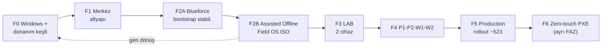

# 25 — Uygulama Yol Haritası (Implementation Roadmap)

> Kısa özet: Blueforce 700 cihaz projesinin FAZ'lı yol haritası: F0 Windows + donanım keşfi → F1 merkez altyapı → F2A Blueforce bootstrap stabilizasyon → F2B Assisted Offline Field ISO → F3 LAB (2 cihaz) → F4 P1-P2-W1-W2 dalgaları → F5 production rollout → F6 gerçek zero-touch PXE. Katılımsız/PXE otomasyonu YALNIZ F6'dır; F2B assisted (operatör disk onaylı) tek-USB medyadır ve erken fazların hiçbirinde otomatik disk silme yoktur.

- Dosya: `docs/25-IMPLEMENTATION-ROADMAP.md`
- İlgili kararlar: `24-DECISION-LOG.md#K-01`…`#K-24`; özellikle `#K-09` (golden image), `#K-11` (dalgalar), `#K-15`/`#K-20` (medya stratejisi), `#K-16`/`#K-17`/`#K-21` (offline + durum modeli), `#K-18`/`#K-24` (release + sürüm kimliği)
- Durum: [ ] Taslak

---

## 1. Amaç

Projeyi "ne, hangi sırada, hangi kapıdan geçerek" sorusuyla yönetmek. Her FAZ'ın girişi, çıkışı ve sahibi bellidir; bir FAZ kapanmadan sonrakine iş taşınmaz. F2A/F2B ayrımı, "kurucu ve bootstrap çalışıyor" ile "tek USB'lik Field OS medyası üretildi" işlerinin farklı risk sınıfları olduğunu görünür kılar.

## 2. Kapsam

- Kapsam içi: FAZ tanımı, sıra ve bağımlılıklar, her FAZ'ın çıkış kriteri, assisted (F2B) ile zero-touch (F6) provisioning'in yeri, doküman-faz eşleşmesi.
- Kapsam dışı: dalga cihaz sayıları detayı (18), update onay akışı (10), komut-seviyesi kurulum (03/04/05).

## 3. Kararlar

```text
KARAR:    Yol haritası 8 adımdır (7 FAZ + F2 ikiye ayrılır): F0 Windows + donanım keşfi → F1 Merkez altyapı → F2A Blueforce bootstrap stabilizasyon → F2B Assisted Offline Field ISO → F3 LAB (2 cihaz, uçtan uca) → F4 P1-P2-W1-W2 dalgaları → F5 Production rollout (~523) + işletme/release yönetimi → F6 Gerçek zero-touch PXE. F6 YALNIZ PXE / tam unattended / uzaktan (remote) provisioning içindir; assisted kurulum F2B'de biter ve otomatik disk silme hiçbir fazda yoktur.
GEREKÇE:  Sıra bağımlılıkları zorlar: Windows/donanım keşfi olmadan imaj (K-09), merkez altyapı olmadan enrollment/WG (K-05/K-17), bootstrap stabil olmadan medya (F2A→F2B), medya kanıtlanmadan LAB kabulü (F2B→F3), LAB kabulü olmadan dalga (K-11) olmaz. F2A/F2B ayrımı riskleri ayırır: F2A "kurucu idempotent ve kapıları çalışıyor" iddiasıdır (upstream ISO + NoCloud seed ile sınanır), F2B ise "tek USB Field OS ISO assisted kurar" iddiasıdır (remaster boot zinciri riski buradadır). F6'nın ayrı ve son FAZ olması, zero-touch/PXE'nin iptal edilebilir (proje yine de biter) ama atlanamaz (sırası gelmeden yapılmaz) olduğunu söyler.
ALTERNATİF: Zero-touch PXE'i en başa koymak — kanıtlanmamış akışın otomasyonu hata çarpanı üretir, üstelik otomatik disk silme veri kaybı riski taşır → elendi (F6'ya taşındı). Tek-faz "hepsini yap" planı — kapısız ilerleme, filo-çapı risk → elendi. F2A/F2B'yi birleştirmek — medya riski ile kurucu riski aynı kapıya sıkışır ve hangi iddianın kanıtlandığı belirsizleşir → elendi.
RİSK:     FAZ atlama baskısı (takvim); azaltma: her FAZ çıkışı 21'deki onay yetkilisinin imzasına bağlıdır.
MALİYET:  Ücretsiz (işgücü planlaması; VDS kira hariç).
LİSANS:   Yok.
```

## 4. Neden Bu Karar?

Klasik hata sırası tersine çevirmektir: önce otomasyon, sonra temel. Bu harita bilerek "sıkıcı" sırayı seçer — önce elle çalışan, sonra kendiliğinden çalışan. F6'nın ayrı FAZ olması zero-touch'un iptal edilebilir ama atlanamaz olduğunu söyler. F2A/F2B ayrımı ise aynı mantığı içeride uygular: **assisted** medya (teknisyen disk onayı verir, `interactive-sections: [storage]`) ile **unattended** medya (F6, operatör girdisi yok) karıştırılmaz. F2B'nin assisted kalması prompt'un "otomatik disk silme yok" şartının faz seviyesindeki karşılığıdır (K-20). Her FAZ bir karar grubunu hayata geçirir; harita ile 24-DECISION-LOG arasındaki bağ tabloyla sabittir.

## 5. Alternatifler

| Alternatif | Artı | Eksi | Sonuç |
|---|---|---|---|
| Zero-touch/PXE ilk FAZ | Erken otomasyon | Kanıtlanmamış akışın otomasyonu + otomatik disk silme riski | Elendi (F6'ya taşındı) |
| Tek F2 (bootstrap + medya birlikte) | Daha az faz | Kurucu ve boot zinciri riski aynı kapıda karışır | Elendi (F2A/F2B) |
| Az FAZ (3 büyük) | Kısa plan | Kapılar seyrek, risk büyük | Elendi |
| Çok FAZ (12+) | Detaylı | Yönetim yükü, faz yorgunluğu | Elendi |

## 6. Avantajlar

- Her FAZ bağımsız kapanır; proje yarıda kalsa bile kazanım (örn. F1 merkezi, F2A stabil kurucu) kalır.
- F6 opsiyoneldir: assisted akışla (F2B→F5) filo kurulabilir, zero-touch sonradan eklenir.
- Assisted/unattended ayrımı sayesinde "otomatik disk silme yok" güvenlik şartı faz yapısında görünür kalır.

## 7. Dezavantajlar

- FAZ disiplini yavaş görünür; paydaşa "neden zero-touch en sonda" açıklaması gerekir (gerekçe §4'tür).
- FAZ'lar arası bekleme (gözetim süreleri) takvimi uzatır.
- F2A ve F2B iki ayrı kapı demektir; tek kapılı plana göre bir faz daha fazla onay toplantısı gerekir.

## 8. Riskler

| Risk | Olasılık | Etki | Azaltma |
|---|---|---|---|
| FAZ çıkışı atlanır, sonrakine geçilir | Orta | Yüksek | Onay yetkilisi imzası zorunlu (21) |
| Merkez VDS donanımı yetersiz çıkar (F1) | Orta | Orta | LAB yük testi; servisleri ikinci VDS'e bölme planı (01) |
| Windows keşfi eksik yapılır, geçişte sürpriz bağımlılık çıkar (F0→F3) | Orta | Yüksek | İş sahibi onayı + hash doğrulamalı geri dönüş imajı (28) |
| Donanım profili imajı kırar (F2B→F3) | Orta | Orta | F0 envanteri + F3 profil matrisi |
| Remaster Field OS ISO boot etmez (F2B) | Orta | Yüksek | UEFI/Legacy/Secure Boot matrisi; aksi halde F3 başlamaz ve upstream ISO + seed yolu sıcak tutulur (26) |
| F6'da otomatik provisioning veri siler | Düşük | Yüksek | F6 yalnız boş/teslim edilmiş disklere uygulanır; assisted (F2B) yol her zaman yedek |

## 9. Uygulama Planı

| FAZ | Ad | Kararlar | Çıkış kriteri | Dokümanlar |
|---|---|---|---|---|
| F0 | Windows + donanım keşfi | K-12 (kimlik), K-19 (Windows envanteri), K-09 (tarama-önce) | Her saha PC için envanter (üretici/model/CPU/RAM/disk/NIC/GPU/seri no/bayi no) + Windows iş yükü ve geri dönüş imajı listesi onaylı | 02, 18, 28 |
| F1 | Merkez altyapı | K-04, K-05, K-06, K-07, K-08 | WG hub + hbbs/hbbr + MeshCentral + Semaphore + Prometheus/Grafana/Kuma ayakta; L9 tatbikatı yapıldı | 06, 07, 08, 09, 14, 17-L9 |
| F2A | Blueforce bootstrap stabilizasyon | K-01, K-03, K-09, K-10, K-11, K-12, K-13, K-22 | `blueforce-install.sh` upstream ISO + NoCloud seed ile idempotent ve tekrar çalıştırılabilir; 18 modül ve `--check` kapıları yeşil; `bf-status`/`bf-enrollment-status` beklenen durumu yazıyor; xRDP kalıcı aktif (K-22) | 03, 04, 05, 06, 11, 12, 16 |
| F2B | Assisted Offline Field ISO | K-15, K-16, K-20, K-21, K-24 | Tek USB `Blueforce-Field-OS-<version>-amd64.iso` UEFI+Legacy'de boot ediyor; autoinstall çalışıyor; storage adımı operatör onayı bekliyor (otomatik silme yok); offline APT snapshot'tan kurulum bitiyor; firstboot bayi no alıp `PROVISIONED_OFFLINE` yazıyor; `bf-release` gerçek release kimliği döndürüyor | 05, 26, 27, 30 |
| F3 | LAB (2 cihaz) | K-11, K-14, K-05, K-17, K-18, K-19, K-21, K-23 | 2 LAB cihazında uçtan uca: erişim + boot + update + enrollment + Windows geçiş kabulü + rollback yeşil; teknisyen desteksiz kurulum yapabildi; GNOME vs XFCE A/B ölçüm tablosu dolduruldu | 18, 19, 20, 10, 28, 29, 30, 31 |
| F4 | Dalgalar P1-P2-W1-W2 | K-11, K-06, K-07, K-14 | P1(5) → P2(20) → W1(50) → W2(100): her dalga çıkış kriteri + halt kaydı; destek yükü hedefte | 18, 21, 14 |
| F5 | Production rollout (~523) + işletme/release yönetimi | Tümü | Filo READY; rutinler (günlük/haftalık), immutable release manifest ve rollback kanıtı devrede; `v1` doküman kesildi | 21, 22, 23, 30 |
| F6 | Gerçek zero-touch PXE | K-20 (unattended kolu), K-18 | YALNIZ PXE / tam unattended / uzaktan provisioning: ağ üzerinden operatör girdisi olmadan kurulum + otomatik disk yapılandırması; assisted (F2B) yolu geri dönüş olarak sıcak | 26, 30 |

Akış/bağımlılık notları:

- F2A → F2B kapısı: "kurucu stabil" kanıtı yoksa tek-USB medya üretimi başlamaz (medya, kurucunun test ortamıdır; tersi değil).
- F2B → F3 kapısı: assisted tek-USB medya iki LAB cihazında (UEFI + Legacy) kanıtlanmazsa LAB kabulü başlamaz.
- F6, F5'ten sonra başlar ve F5'in kapanmasına engel değildir; F6 başarısız olursa proje F5 haliyle tamam sayılır ve assisted akış yedek kalır.

```bash
# örnek: FAZ kapısı kontrolü (merkez)
# F2B/F3 çıkışı için LAB doğrulama seti
bf-release                                  # gerçek release kimliği (skeleton değil)
bf-enrollment-status                        # PROVISIONED_OFFLINE → ENROLLED → READY
ansible-playbook playbooks/verify-lab.yml --limit lab
bf-support-bundle --out /tmp/f3-gate-bundle.tar.gz
```

## 10. Test Planı

| Test | Beklenen sonuç | Ortam |
|---|---|---|
| F0 Windows/donanım keşfi ve imaj listesi | Her cihaz için profil + geri dönüş imajı kaydı var | Saha/LAB |
| F1 L9 tatbikatı (boş VDS'e kur) | Tüm merkez servisleri ayağa kalkar | İzole VDS |
| F2A kurucu idempotent çalışma | İkinci koşu hata üretmez, `--check` yeşil | LAB(2) |
| F2B tek-USB assisted kurulum | UEFI + Legacy boot; storage onayı beklenir; `PROVISIONED_OFFLINE` | LAB(2) |
| F2B offline kurulum (air-gapped) | Paketler yerel snapshot'tan kurulur, dış indirme yok | LAB(2) air-gapped |
| F3 3-akış + enrollment + rollback | Erişim/boot/update + ENROLLED/READY + geri alma yeşil | LAB(2) |
| F3 GNOME vs XFCE A/B | 8 metrik tablosu dolar (RAM/CPU/boot/RDP/RustDesk/login/dummy/24-72h) | LAB(2) |
| F6 zero-touch PXE prova | PXE ile operatör girdisi olmadan READY'ye kadar akış | F5 sonrası LAB |

## 11. Rollback

1. FAZ içi hata: ilgili dalga/iş 17-RECOVERY veya 10-UPDATE zinciriyle geri alınır; FAZ tekrarlanır.
2. FAZ kararı yanlışsa (örn. medya veya masaüstü yöntemi): 24-DECISION-LOG PR'ı + bağımlı FAZ'ların tekrarı.
3. F2B geri alınırsa upstream ISO + NoCloud seed yoluna dönülür (bu yol her zaman sıcak tutulur).
4. F6 geri alınırsa assisted (F2B) akışa dönülür; PXE'siz filo işletilmeye devam eder.

## 12. Kontrol Listesi

- [ ] Her FAZ'ın çıkış kriteri + sahibi yazılı ve onaylı.
- [ ] F2A/F2B ayrımı ve F2B'nin assisted (otomatik disk silme yok) olduğu paydaşça kabul edildi.
- [ ] F6'nın yalnız PXE / tam unattended / uzaktan provisioning olduğu ve F5 sonrası ayrı FAZ olduğu kabul edildi.
- [ ] Doküman-faz eşleşmesi (tablodaki son sütun) güncel.
- [ ] Onay yetkilisi (asıl+vekil) tanımlı (21).

## 13. Açık Sorular

- [ ] FAZ tarihleri ve teknisyen kapasite planı (sahibi: yönetim + 18).
- [ ] F1 VDS donanım siparişi için LAB yük ölçümü (sahibi: 14-MONITORING yazarı).
- [ ] F2B gerçek ISO build'i ve UEFI/Legacy/Secure Boot matrisi — `provisioning/iso/build-blueforce-iso.sh` bugün iskelet (sahibi: provisioning/release yöneticisi).
- [ ] F2B offline APT snapshot için somut paket pinleri (base-packages/remote-access/docker manifestleri) (sahibi: release yöneticisi).
- [ ] F0 Windows keşif kapsamı: hangi uygulama/veri sınıfları zorunlu (sahibi: iş sahibi + 28 yazarı).
- [ ] F6 kapsamı (PXE şart mı, USB-preseed yeter mi, otomatik disk yapılandırması hangi onayla) — F5 verisi sonrası (sahibi: 04 yazarı).

---

## Ek: Mermaid — FAZ akışı


