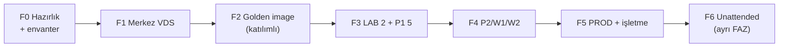

# 25 — Uygulama Yol Haritası (Implementation Roadmap)

> Kısa özet: Blueforce 700 cihaz projesinin FAZ'lı yol haritası: FAZ 0 hazırlık → FAZ 1 merkez → FAZ 2 imaj → FAZ 3 LAB/P1 → FAZ 4 dalgalar → FAZ 5 PROD + işletme. Katılımsız provisioning (unattended) ayrı FAZ'dır; temel akış çalışmadan otomasyona geçilmez.

- Dosya: `docs/25-IMPLEMENTATION-ROADMAP.md`
- İlgili kararlar: `24-DECISION-LOG.md#K-09` (imaj + unattended sırası), `#K-11` (dalgalar), tüm K-01…K-14 (fazlara dağılım)
- Durum: [ ] Taslak

---

## 1. Amaç

Projeyi "ne, hangi sırada, hangi kapıdan geçerek" sorusuyla yönetmek. Her FAZ'ın girişi, çıkışı ve sahibi bellidir; bir FAZ kapanmadan sonrakine iş taşınmaz.

## 2. Kapsam

- Kapsam içi: FAZ tanımı, sıra ve bağımlılıklar, her FAZ'ın çıkış kriteri, unattended provisioning FAZ'ının yeri, doküman-faz eşleşmesi.
- Kapsam dışı: dalga cihaz sayıları detayı (18), update onay akışı (10), komut-seviyesi kurulum (03/04/05).

## 3. Kararlar

```text
KARAR:    Yol haritası 7 FAZ'dır: F0 Hazırlık+Envanter → F1 Merkez VDS → F2 Golden image (katılımlı) → F3 LAB+P1 → F4 Dalgalar (P2/W1/W2) → F5 PROD+İşletme → F6 Katılımsız provisioning (unattended, ayrı FAZ).
GEREKÇE:  Sıra bağımlılıkları zorlar: envanter olmadan imaj (K-09), imaj olmadan LAB, LAB olmadan dalga (K-11) olmaz. Unattended provisioning ayrı FAZ'dır çünkü katılımlı akış (USB→script→bayi no) sahada kanıtlanmadan PXE/preseed otomasyonu ek yük ve ek arıza yüzeyi demektir.
ALTERNATİF: Unattended'i en başa koyma — temel akıştaki hata otomasyonla çarpılır; elendi. Tek-faz "hepsini yap" planı — kapısız ilerleme, filo-çapı risk; elendi.
RİSK:     FAZ atlama baskısı (takvim); azaltma: her FAZ çıkışı 21'deki onay yetkilisinin imzasına bağlıdır.
MALİYET:  Ücretsiz (işgücü planlaması; VDS kira hariç).
LİSANS:   Yok.
```

## 4. Neden Bu Karar?

Klasik hata sırası tersine çevirmektir: önce otomasyon, sonra temel. Bu harita bilerek "sıkıcı" sırayı seçer — önce elle çalışan, sonra kendiliğinden çalışan. F6'nın ayrı FAZ olması, unattended'in iptal edilebilir (proje yine de biter) ama atlanamaz (sırası gelmeden yapılmaz) olduğunu söyler. Her FAZ bir karar grubunu hayata geçirir; harita ile 24-DECISION-LOG arasındaki bağ tabloyla sabittir.

## 5. Alternatifler

| Alternatif | Artı | Eksi | Sonuç |
|---|---|---|---|
| Unattended ilk FAZ | Erken otomasyon | Kanıtlanmamış akışın otomasyonu | Elendi (F6'ya taşındı) |
| Az FAZ (3 büyük) | Kısa plan | Kapılar seyrek, risk büyük | Elendi |
| Çok FAZ (12+) | Detaylı | Yönetim yükü, faz yorgunluğu | Elendi |

## 6. Avantajlar

- Her FAZ bağımsız kapanır; proje yarıda kalsa bile kazanım (örn. F1 merkezi) kalır.
- F6 opsiyoneldir: katılımlı akışla PROD bitebilir, unattended sonradan eklenir.

## 7. Dezavantajlar

- FAZ disiplini yavaş görünür; paydaşa "neden F6 en sonda" açıklaması gerekir (gerekçe §4'tür).
- FAZ'lar arası bekleme (gözetim süreleri) takvimi uzatır.

## 8. Riskler

| Risk | Olasılık | Etki | Azaltma |
|---|---|---|---|
| FAZ çıkışı atlanır, sonrakine geçilir | Orta | Yüksek | Onay yetkilisi imzası zorunlu (21) |
| Merkez VDS donanımı yetersiz çıkar (F1) | Orta | Orta | LAB yük testi; servisleri ikinci VDS'e bölme planı (01) |
| Donanım profili imajı kırar (F2→F3) | Orta | Orta | F0 envanteri + F3 profil matrisi |

## 9. Uygulama Planı

| FAZ | Ad | Kararlar | Çıkış kriteri | Dokümanlar |
|---|---|---|---|---|
| F0 | Hazırlık + donanım envanteri | K-12 (kimlik), K-09 (tarama-önce) | Profil listesi + envanter şeması onaylı | 02, 18 (FAZ 0), 00 |
| F1 | Merkez VDS kurulumu | K-04, K-05, K-06, K-07, K-08 | WG hub + hbbs/hbbr + MeshCentral + Semaphore + Prometheus/Kuma ayakta; L9 tatbikatı yapıldı | 06, 07, 08, 09, 14, 17-L9 |
| F2 | Golden image (katılımlı) | K-01, K-02, K-03, K-09, K-10, K-11 | `blueforce-install.sh` USB→READY akışı LAB donanımında çalışıyor; `unattended-upgrades` kapalı; tag/`unless-stopped` denetli | 03, 04, 05, 12 |
| F3 | LAB(2) + P1(5) | K-11 (dalga), K-14 (bundle), K-05 (kopma sayacı) | 3 akış yeşil; teknisyen desteksiz kurulum yaptı; kopma sayacı toplandı | 18, 19, 20, 10 |
| F4 | Dalgalar P2/W1/W2 | K-11, K-06, K-07 | Her dalga çıkış kriteri + halt kaydı; destek yükü hedefte | 18, 21, 14 |
| F5 | PROD (~523) + işletmeye alma | Tümü | Filo READY; rutinler (günlük/haftalık) devrede; `v1` doküman kesildi | 21, 22, 23 |
| F6 | Katılımsız provisioning (unattended) | K-09 (hedef) | Teknisyen girdisiz (veya minimum-girdili) kurulum P2 ölçeğinde kanıtlı; katılımlı akış yedekte duruyor | 04 (F6 eki) |

F6 notu: F6, F5'ten sonra başlar; F5'in kapanmasına engel değildir. F6 kapsamı (PXE/preseed derinliği, ağ gereksinimleri) F3 verisine göre F4 içinde netleştirilir. F6 başarısız olursa proje F5 haliyle tamam sayılır.

```bash
# örnek: FAZ kapısı kontrolü (merkez)
# F3 çıkışı için LAB doğrulama seti
ansible-playbook playbooks/verify-lab.yml --limit lab
bf-support-bundle --out /tmp/f3-gate-bundle.tar.gz
```

## 10. Test Planı

| Test | Beklenen sonuç | Ortam |
|---|---|---|
| F1 L9 tatbikatı (boş VDS'e kur) | Tüm merkez servisleri ayağa kalkar | İzole VDS |
| F2 imaj denetim seti (K-10/K-11 kilitleri) | `latest` yok, timer'lar maskeli, politika `unless-stopped` | LAB(2) |
| F3 3-akış + rollback | Erişim/boot/update + geri alma yeşil | LAB(2)/P1(5) |
| F6 unattended prova | Minimum-girdi ile READY | P2 ölçeği |

## 11. Rollback

1. FAZ içi hata: ilgili dalga/iş 17-RECOVERY veya 10-UPDATE zinciriyle geri alınır; FAZ tekrarlanır.
2. FAZ kararı yanlışsa (örn. imaj yöntemi): 24-DECISION-LOG PR'ı + bağımlı FAZ'ların tekrarı.
3. F6 geri alınırsa katılımlı akışa dönülür (yedek her zaman sıcak tutulur).

## 12. Kontrol Listesi

- [ ] Her FAZ'ın çıkış kriteri + sahibi yazılı ve onaylı.
- [ ] F6'nın F5 sonrası ayrı FAZ olduğu paydaşça kabul edildi.
- [ ] Doküman-faz eşleşmesi (tablodaki son sütun) güncel.
- [ ] Onay yetkilisi (asıl+vekil) tanımlı (21).

## 13. Açık Sorular

- [ ] FAZ tarihleri ve teknisyen kapasite planı (sahibi: yönetim + 18).
- [ ] F1 VDS donanım siparişi için LAB yük ölçümü (sahibi: 14-MONITORING yazarı).
- [ ] F6 kapsamı (PXE şart mı, USB-preseed yeter mi) — F3 verisi sonrası (sahibi: 04 yazarı).

---

## Ek: Mermaid — FAZ akışı


