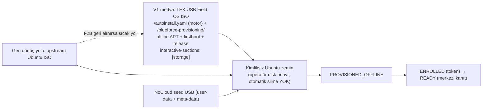

# 26 — Blueforce Field OS ISO

> Kısa özet: Blueforce Field OS, Ubuntu LTS tabanında GNOME katmanı olan saha standardıdır. **Autoinstall kurulum motorudur; Blueforce Field OS ISO ise paketleme/dağıtım yöntemidir** — ikisi rakip değil, birlikte kullanılır (K-20). **V1 kurulum medyası TEK USB Field OS ISO'dur** (medya kökünde `autoinstall.yaml` + offline APT repo + firstboot; `interactive-sections: [storage]` korunur, otomatik disk silme yoktur). Resmi upstream ISO + ayrı NoCloud seed USB, tek yol değil **geri dönüş/fallback yolu** olarak sıcak tutulur (K-15 yedek yol olarak korunur). ISO ilk kez gerçekten üretilmiştir: `dist/Blueforce-Field-OS-1.0.0-amd64.iso` (6 481 917 952 byte, ISO SHA256 `cb0cc56f…d431296`); boot kabulü (UEFI/Legacy/Secure Boot) ve air-gapped kurulum hâlâ LAB işidir.
>
> - Dosya: `docs/26-BLUEFORCE-FIELD-OS-ISO.md`
> - İlgili kararlar: `24-DECISION-LOG.md#K-20` (medya stratejisi), `#K-15` (yedek medya yolu), `#K-16`/`#K-21` (offline + durum modeli), `#K-01`, `#K-02`, `#K-03`, `#K-09`
> - Durum: [ ] Taslak — ISO artefaktı üretildi; boot ve air-gapped kurulum kabulü LAB ile yapılmalıdır

---

## 1. Amaç

Field OS'un ne olduğunu, hangi ISO'nun sahaya gideceğini ve ISO'nun hangi sınırlar içinde üretilebileceğini sabitlemek.

## 2. Kapsam

- Kapsam içi: V1 tek-USB Field OS ISO, autoinstall motoru, offline APT repo, firstboot, NoCloud seed (geri dönüş yolu), medya bütünlüğü, üretilen artefaktın doğrulama kaydı ve LAB kabulü.
- Kapsam dışı: cihaz kimliği/enrollment işlemi (29), offline paket seti içeriği (27), sürüm yayını (30), PXE/tam unattended provisioning (F6, 25).

## 3. Kararlar

```text
KARAR:    V1 kurulum medyası TEK USB Blueforce Field OS ISO'dur: `dist/Blueforce-Field-OS-<version>-amd64.iso`. ISO kökünde `/autoinstall.yaml` (kurulum motoru), `/blueforce-provisioning/` (autoinstall seed kopyası, firstboot, offline-repo araçları/pinleri, release) bulunur; boot konfigürasyonu her kernel satırında autoinstall ister. Autoinstall ile custom ISO birbirinin alternatifi DEĞİL tamamlayıcısıdır (K-20): ISO, autoinstall motorunu paketler. Güvenlik için `interactive-sections: [storage]` KORUNUR — kurulum katılımsız ilerler ama diski operatör seçip onaylar; otomatik disk silme YOKTUR. Resmi Ubuntu ISO + ayrı NoCloud seed USB, V1'in tek yolu değil geri dönüş/fallback yoludur ve her zaman sıcak tutulur (K-15 bu rolde korunur).
GEREKÇE:  Tek USB, saha teknisyeni için tek medya demektir (yanlış seed takma hatası ortadan kalkar) ve offline APT repo ile firstboot aynı medyada taşınır. Subiquity resmi referansı autoinstall yapılandırmasını `/autoinstall.yaml` yolundan okur ("irrespective of how it was provided") ve `interactive-sections`'ı resmi olarak destekler; `apt.fallback` varsayılanı `offline-install`'dır. Remaster boot zinciri ise LAB kabulüne bağlanmıştır: ISO üretilse bile UEFI/Legacy/Secure Boot ve air-gapped kurulum kanıtı gelmeden saha medyası ilan edilmez.
ALTERNATİF: Yalnız upstream ISO + NoCloud seed USB — tek-medya deneyimi yok; V1'in tek yolu olmaktan çıktı, geri dönüş yolu olarak kalır. Yalnız remaster ISO + LAB kanıtsız saha — boot zinciri kanıtlanmadan dağıtım riski nedeniyle reddedildi. Otomatik disk wipe'lı unattended ISO — veri kaybı riski nedeniyle yasak (F6 kapsamı, onay kapılı).
RİSK:     Remaster boot zinciri (UEFI/Legacy/Secure Boot) veya air-gapped kurulum kanıtlanmazsa medya sahaya çıkamaz; azaltma: F2B çıkış kapısı (iki LAB cihazında assisted kurulum kanıtı), aksi halde upstream ISO + seed yoluna dönülür. İkinci risk: ISO'ya secret/kimlik sızması; azaltma: builder'ın giriş taraması + artefakt secret/cihaz verisi taraması.
MALİYET:  Ücretsiz.
LİSANS:   Ubuntu resmi ISO — https://releases.ubuntu.com/26.04/ ; Subiquity autoinstall — https://canonical-subiquity.readthedocs-hosted.com/en/latest/reference/autoinstall-reference.html (doğrulama: 2026-09-16, HTTP 200); cloud-init NoCloud — https://cloudinit.readthedocs.io/en/latest/reference/datasources/nocloud.html (doğrulama: 2026-09-16); xorriso (El Torito recipe) — https://www.gnu.org/software/xorriso/ .
```

> **Güncelleme (2026-09-16, K-20/K-21):** Bu dosyanın eski §3/§5/§12 ifadeleri ("V1 kurulum medyası upstream ISO + ayrı seed USB'dir", "yalnız custom remaster ISO V1 için elendi") geçersizdir. Kanonik karar: **V1 = tek USB Field OS ISO (autoinstall motoru olarak kullanılır); upstream ISO + seed = yedek/geri dönüş yolu.** Ayrıca ISO artık **gerçekten üretilmiştir** (bkz. §9 "Üretilen artefakt"). Ayrıntı: `24-DECISION-LOG.md#K-20`.

## 4. Neden Bu Karar?

Autoinstall kurulum otomasyonudur; Field OS ISO ise dağıtım **paketleme** biçimidir — ISO, autoinstall'ın yerine geçmez, onu taşır. Tek medya saha değişkenlerini (offline repo, firstboot, release manifesti) tek taşıma noktasında birleştirir ve yanlış seed takma hatasını ortadan kaldırır; cihaz-spesifik veri (bayi no, key, token) yine medyada tutulmaz, firstboot'ta toplanır. Ayrı seed USB ise tamamen kaldırılmaz: ISO boot etmezse aynı sonucu veren sıcak geri dönüş yoludur.

## 5. Alternatifler

| Alternatif | Artı | Eksi | Sonuç |
|---|---|---|---|
| Tek USB Field OS ISO (remaster, autoinstall + offline repo + firstboot) | Tek medya; teknisyen hatası azalır; offline içerik yanında | UEFI/Legacy/Secure Boot LAB yükü | **V1 seçildi (F2B)** |
| Upstream ISO + NoCloud seed USB | En az özel build; imzalı upstream taban | İki medya taşınır | Geri dönüş/fallback yolu (sıcak) |
| Yalnız remaster ISO (LAB kanıtı olmadan) | — | Boot zinciri kanıtlanmamış medya sahaya çıkar | Reddedildi |
| Clonezilla | Hızlı | Donanım-fragil | Yedek yöntem |

## 6. Avantajlar

- İmzalı upstream taban; değişiklik alanı ISO kökü + `/blueforce-provisioning/` ile sınırlı, mevcut boot dosyaları (boot.catalog, eltorito.img, casper/*) bayt-özdeş bırakılır.
- Field OS sürümü, medya manifesti (`dist/<version>-manifest.yaml`), release manifesti ve kurucu sürümü ayrı izlenebilir.
- Offline APT repo + firstboot + release dosyaları aynı medyada; internet olmayan sahada tek USB yeter (K-16).

## 7. Dezavantajlar

- Remaster boot zinciri UEFI/Legacy/Secure Boot'ta kanıtlanmadan medya sahaya çıkamaz; bu, F2B çıkış kapısını bloke edebilir.
- Medya tek noktada tüm saha değişkenlerini taşır: bozuk/kopyalanmış ISO yanlış sürüm yayar → SHA256 doğrulaması ve sürüm etiketi zorunludur.
- LAB medyası şu an Ubuntu **Desktop** flavour'ıyla üretildi; baseline (Server) ile sapma manifestte açıkça kayıtlıdır (bkz. §9).

## 8. Riskler

| Risk | Olasılık | Etki | Azaltma |
|---|---|---|---|
| 26.04 autoinstall davranışı değişir | Orta | Yüksek | Her sürüm LAB kabulü |
| Remaster boot etmez (UEFI/Legacy/Secure Boot) | Orta | Yüksek | UEFI/Legacy/Secure Boot matrisi; aksi halde medya yayınlanmaz, upstream ISO + seed yoluna dönülür |
| ISO'ya secret/kimlik girer | Düşük | Yüksek | Builder giriş taraması + artefakt secret ve cihaz verisi taraması |
| Medya tabanı sapması (Desktop flavour) sahaya fark edilmeden çıkar | Orta | Orta | `manifest.yaml` içinde `base_flavor` + `baseline_deviation` bloğu, `media-info.yaml` ve `/etc/blueforce-release` aynasında; işletim öncesi Server ISO ile yeniden build kararı |
| Offline repo medyaya gömülmediği için kurulum `OFFLINE BLOCKED` ile durur | Yüksek (mevcut durum) | Orta | `offline_repo_status: not-included` açıkça raporlanır; `--require-offline-repo` release build'lerinde build'i durdurur |

## 9. Uygulama Planı

1. Base ISO'nun SHA256 bilgisini Canonical kaynak kaydından al ve yerel yayın kaydına yaz (`provisioning/iso/ubuntu-26.04.1-SHA256SUMS`).
2. Medyayı üret (`provisioning/iso/build-blueforce-iso.sh`); üretim sırasında girilen `autoinstall.yaml` + firstboot + offline-repo + release payload'ları medyaya yazılır, `interactive-sections: [storage]` ve `apt.fallback: offline-install` işaretleri korunur.
3. Medyaya bayi no, WireGuard private key, enrollment token veya SSH private key KOYMA; builder giriş taraması bunları bulursa durur.
4. Kurulumdan sonra cihaz `PROVISIONED_OFFLINE` olur; merkezi doğrulama tamamlanmadan `READY` olmaz (K-21).
5. Release yolunda medya manifesti + checksum + test raporu üretilir; cihaz verisi taşınmaz.

```bash
# medyayı üret (base ISO ve checksum kaydı yerelde olmalı; hiçbir şey indirilmez)
provisioning/iso/build-blueforce-iso.sh \
  --upstream-iso /media/ubuntu-26.04.1-desktop-amd64.iso \
  --checksum-file provisioning/iso/ubuntu-26.04.1-SHA256SUMS
# üretilen artefaktı YAZMADAN doğrula (checksum + El Torito metadata)
provisioning/iso/test-iso.sh dist/Blueforce-Field-OS-1.0.0-amd64.iso
sha256sum -c dist/Blueforce-Field-OS-1.0.0-amd64.iso.sha256
```

### Üretilen artefakt (2026-09-16 — gerçek üretim, mock değil)

| Alan | Değer |
|---|---|
| ISO | `dist/Blueforce-Field-OS-1.0.0-amd64.iso` |
| ISO boyutu | 6 481 917 952 byte (~6.48 GB, 6.04 GiB) |
| ISO SHA256 | `cb0cc56f0442fbd1418e0d0f35521522f4ec9aa3f203779a67e96d587d431296` |
| Checksum dosyası | `dist/Blueforce-Field-OS-1.0.0-amd64.iso.sha256` (aynı değer, yerelde `sha256sum -c` ile doğrulandı) |
| Manifest | `dist/1.0.0-manifest.yaml` (`release_status: lab-artifact`, `build_date: 2026-09-16T08:00:29Z`) |
| Base medya | Ubuntu 26.04.1 **desktop** amd64 (`ubuntu-26.04.1-desktop-amd64.iso`, SHA256 `601e30fbf5d97759367c632e2c33630665039b7e2158fd068403da3ccf1bda1f` — build host'ta yeniden hesaplanıp doğrulandı) |
| Boot | El Torito **BIOS + UEFI** girdileri base ISO'dan korunmuş (builder build sonrası xorriso ile yeniden doğrular; eksikse artefaktı siler) |
| Live içerik bütünlüğü | `casper/minimal.squashfs` 3 432 136 704 byte ve SHA256 `b5ec27b9570e77abb62831a8b652b50eaf089d537e62046189a52231a4fa9bec` — base ISO'daki dosyayla **birebir aynı** |
| Autoinstall | Medya kökünde `/autoinstall.yaml`; `interactive-sections: [storage]` aktif, `apt_fallback: offline-install` |
| Payload | `/blueforce-provisioning/{autoinstall,firstboot,offline-repo,release}` medyada mevcut |
| Secret durumu | `device_identity_embedded: false`, `automatic_disk_wipe: false`; kimlik firstboot'ta toplanır |
| Baseline sapması | Medya **Desktop** flavour ile üretildi (baseline Server). `manifest.yaml` → `baseline_deviation` bloğu: gerekçe (build host'ta checksum'ı doğrulanmış tek medya Desktop ISO'ydu, build indirme yapmaz), etki (GNOME zaten gelir), gereken karar (LAB için Desktop tabanını kabul et **veya** üretim öncesi Server ISO ile yeniden build) |
| Henüz yapılmayanlar | UEFI/Legacy/Secure Boot boot kabulü, Secure Boot imza davranışı, air-gapped tam kurulum, offline APT repo gömülmesi (`offline_repo_status: not-included`, pinler `UNPINNED`) — hepsi LAB/F2B işi |

## 10. Test Planı

| Test | Beklenen sonuç | Ortam |
|---|---|---|
| Base ISO checksum | Yayın kaydıyla eşleşir (`601e30fb…`) | LAB(2) |
| Üretilen ISO checksum | `sha256sum -c dist/*.iso.sha256` geçer | LAB(2)/CI |
| ISO içerik bütünlüğü | `casper/*` dosyaları base ISO ile bayt-özdeş; `boot.catalog`/`eltorito.img` korunmuş | CI (xorriso) + LAB |
| Tek-USB assisted kurulum | Kimliksiz sistem kurulur; storage adımı operatör onayı bekler, otomatik silme yok | LAB(2) UEFI+Legacy |
| Field OS ISO UEFI/Legacy/Secure Boot | Her desteklenen profil boot eder | Zorunlu LAB (F2B çıkış kapısı) |
| Air-gapped kurulum (offline repo gömülüyken) | Dış indirme yok; `PROVISIONED_OFFLINE` | LAB(2) air-gapped |
| Geri dönüş yolu (upstream ISO + seed) | Aynı sonucu verir, sıcak tutulur | LAB(2) |
| Artefact taraması | Cihaz kimliği/secret yok; `device_identity_embedded: false` | Build CI + LAB |

## 11. Rollback

1. Field OS ISO başarısızsa (boot etmez, autoinstall almaz) derhal upstream ISO + son onaylı seed USB yoluna dönülür; bu yol her zaman sıcak tutulur (K-20).
2. Hatalı ISO/seed geri çekilir, önceki onaylı medya sürümü (sürüm etiketli USB) kullanılır.
3. Cihaz kurulmuş fakat kabul edilmemişse 27/29 prosedürüyle yeniden provision edilir.

## 12. Kontrol Listesi

- [ ] Base ISO checksum ve kaynak URL kaydı var; üretilen ISO checksum'ı yayımlanmış.
- [ ] Medya genel yapılandırma dışında cihaz verisi/secret içermiyor (kimlik firstboot'ta).
- [ ] V1 etiketi **tek USB Field OS ISO** olarak basıldı; upstream ISO + seed geri dönüş yolu olarak hazır.
- [ ] Medyada `interactive-sections: [storage]` aktif, otomatik disk silme yok.
- [ ] UEFI/Legacy/Secure Boot LAB kabulü tamam (F2B çıkış kapısı) — tamamlanmadan saha dağıtımı yok.
- [ ] Medya tabanı sapması (Desktop flavour) kayıtlı ve işletim öncesi karar verilmiş.
- [ ] Offline APT repo gömülü (yoksa `OFFLINE BLOCKED` davranışı bilerek kabul edilmiş ve release build'i bloke ediyor).

## 13. Açık Sorular

- [ ] Ubuntu 26.04.1'in kesin autoinstall/subiquity davranışı ve Desktop flavour'da autoinstall yolu — LAB (sahibi: platform ekibi) [K-20].
- [ ] Desteklenecek Legacy BIOS donanım profilleri — sahibi: envanter ekibi.
- [ ] UEFI/Legacy/Secure Boot boot kabul matrisi ve Secure Boot imza davranışı — F2B (sahibi: provisioning/release yöneticisi) [K-20].
- [ ] Medya tabanı: Desktop flavour kabul mü, Server ISO ile yeniden build mi — F2B çıkış kapısı (sahibi: release yöneticisi) [K-01/K-20].
- [ ] Offline APT repo'nun medyaya gömülmesi (bugün `offline_repo_status: not-included`) — F2B (sahibi: release yöneticisi) [K-16/K-20].

---

## Ek: Medya ilişkisi (K-20)

