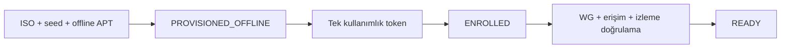

# 27 — Offline Provisioning

> Kısa özet: İnternet yokken Field OS kurulumu ve yerel paket yüklemesi yapılabilir. Bu yol yalnız `PROVISIONED_OFFLINE` durumuna getirir; cihaz, tek kullanımlık enrollment token ve merkezi kanallar doğrulanmadan `ENROLLED` veya `READY` olmaz.
>
> - Dosya: `docs/27-OFFLINE-PROVISIONING.md`
>
> **Uygulama sözleşmesi:** `--offline`, varsayılan `/opt/blueforce/offline-repo` içindeki yalnız yerel `file:` APT kaynağını kullanır; uzak APT source, curl, wget, key download veya `apt download` çağrısı yapmaz. `Packages`, `Packages.gz`, `SHA256SUMS`, `packages.lock.tsv` ve her manifest için somut `package=version` pinleri eksikse paket modüllerinden önce `OFFLINE BLOCKED` ile durur. Bu repoda gerçek paket/pin bulunmadığından üretilen ISO LAB-only'dir ve provision edilmiş olarak temsil edilmez.
> - İlgili kararlar: `24-DECISION-LOG.md#K-16`, `#K-09`, `#K-11`, `#K-12`
> - Durum: [ ] Taslak

---

## 1. Amaç

Saha interneti kesik veya güvenilmezken tekrarlanabilir, denetlenebilir ve secretsiz ilk kurulumu tanımlamak.

## 2. Kapsam

- Kapsam içi: seed USB, offline APT repository/snapshot, kurucu, durum damgası ve sonradan enrollment.
- Kapsam dışı: merkezi peer atama ve token doğrulama (29), release imzalama (30).

## 3. Kararlar

```text
KARAR:    Offline kurulum, imzalı/sürümlü medya ve ayrı offline APT kaynağıyla yapılır; sonuç durumu yalnızca PROVISIONED_OFFLINE'dır.
GEREKÇE:  Paket indirme veya merkezi API'ye erişim yokken cihaz standarda getirilebilir; fakat merkezde doğrulanmamış kimlik ve kanallar READY iddiası yapamaz.
ALTERNATİF: İnternet gelene kadar kurulum yapmama — saha ziyareti ve bekleme maliyeti nedeniyle elendi.
RİSK:     Eski veya karışık paket snapshot'ı; manifest, checksum ve release kimliği ile azaltılır.
MALİYET:  Ücretsiz.
LİSANS:   APT — https://manpages.ubuntu.com/manpages/noble/en/man8/apt.8.html ; dpkg — https://manpages.ubuntu.com/manpages/noble/en/man1/dpkg.1.html ; Ubuntu offline kurulum ayrıntısı 26.04 için LAB doğrulamalıdır.
```

## 4. Neden Bu Karar?

Offline medya, işletim sistemi ve zorunlu paketleri taşır; merkezi sırları taşımamalıdır. Durum makinesi, "kuruldu" ile "merkezce güvenildi" arasındaki farkı görünür yapar.

## 5. Alternatifler

| Alternatif | Artı | Eksi | Sonuç |
|---|---|---|---|
| Sürümlü offline APT repo | Tekrarlanabilir | Medya yönetimi | **Seçildi** |
| Rastgele `.deb` dosyaları | İlk anda kolay | Bağımlılık/sürüm belirsiz | Elendi |
| İnternet bekleme | Basit | Saha blokajı | Elendi |

## 6. Avantajlar

- Bağlantısız sahada standarda yakın kurulum.
- Paket manifesti ile hangi sürümün yüklendiği kanıtlanır.

## 7. Dezavantajlar

- Medya sürümü ve paket snapshot'ı düzenli yenilenmelidir.
- Offline cihaz merkezi izleme ve erişim kanalları doğrulanana kadar operasyonel olarak hazır değildir.

## 8. Riskler

| Risk | Olasılık | Etki | Azaltma |
|---|---|---|---|
| Eski güvenlik paketi | Orta | Orta | Süre sonu olan release medyası, hızlı enrollment kuyruğu |
| Secret USB'ye yazılır | Düşük | Yüksek | Secret taraması; token yalnız bir kez ve cihazda girilir |
| Yarım paket işlemi | Orta | Orta | `dpkg --configure -a`, idempotent kurucu |

## 9. Uygulama Planı

1. Medya manifesti: Field OS release, ISO checksum, seed checksum, APT snapshot kimliği, kurucu commit'i.
2. Kurulumda yalnız genel paketler ve `blueforce-install.sh --offline` kullanılır.
3. Kurucu yerel durum dosyasına `PROVISIONED_OFFLINE` yazar; `READY` yazması yasaktır.
4. İnternet geldiğinde 29'daki tek-kullanımlık token ile enrollment başlatılır; sonra merkezi kanallar test edilir.

```bash
sudo mount /dev/sdX1 /mnt/blueforce-repo
sudo apt -o Dir::Etc::sourcelist=/mnt/blueforce-repo/sources.list update
sudo dpkg --configure -a
sudo ./blueforce-install.sh --offline --dealer-id 12010193
bf-status  # PROVISIONED_OFFLINE beklenir
```

## 10. Test Planı

| Test | Beklenen sonuç | Ortam |
|---|---|---|
| İnternetsiz kurulum | Paketler manifestten kurulur | LAB(2) air-gapped |
| DNS/WAN kesik | Kurucu dış indirme istemez | LAB(2) |
| `bf-status` | `PROVISIONED_OFFLINE`; READY değil | LAB(2) |
| Bağlantı sonrası enrollment | ENROLLED → READY kapıları çalışır | LAB(2) |

## 11. Rollback

1. Paket işlemi bozuksa aynı onaylı snapshot ile `dpkg --configure -a` ve kurucu yeniden çalıştırılır.
2. Yanlış medya sürümü geri çekilir; önceki onaylı medya manifestiyle yeniden kurulur.
3. Kimlik/token hatasında cihaz resetlenmez; 29'daki token iptal/yenileme prosedürü uygulanır.

## 12. Kontrol Listesi

- [ ] Offline medya manifesti ve checksum'ları var.
- [ ] Medyada cihaz kimliği, private key veya kalıcı token yok.
- [ ] `PROVISIONED_OFFLINE` görünür ve READY kapısı kapalı.
- [ ] Sonradan enrollment sahibi/kuyruğu kayıtlı.

## 13. Açık Sorular

- [ ] Offline APT snapshot yenileme sıklığı — sahibi: release yöneticisi.
- [ ] Medyanın fiziksel zimmet ve imha süreci — sahibi: saha operasyonu.

---

## Ek: Durum akışı

