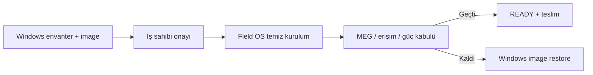

# 28 — Windows'tan Linux'e Geçiş

> Kısa özet: Windows saha cihazının Blueforce Field OS'a kontrollü dönüşümü: envanter, uygulama/veri kabulü, geri dönüş noktası, temiz kurulum ve teslim doğrulaması. Windows image'ı geri dönüş kanıtıdır; Linux kurulumu onu otomatik silmez.
>
> - Dosya: `docs/28-WINDOWS-TO-LINUX-MIGRATION.md`
> - İlgili kararlar: `24-DECISION-LOG.md#K-19`, `#K-01`, `#K-09`, `#K-11`
> - Durum: [ ] Taslak

---

## 1. Amaç

Windows'tan geçişte veri, uygulama bağımlılığı veya geri dönüş kanıtını kaybetmeden saha cihazını Field OS standardına almak.

## 2. Kapsam

- Kapsam içi: ön envanter (araçlar: `scripts/migration/windows/`), kabul kaydı, Windows geri dönüş imajı, Field OS kurulumu, fonksiyonel kabul, araç adı/konum eşlemesi.
- Kapsam dışı: Windows uygulamasını Wine/VM ile çalıştırma kararı; bu ancak ayrı kabul sonrası ele alınır.

## 3. Kararlar

```text
KARAR:    Her Windows cihazı önce envanter ve geri dönüş kanıtı alır, sonra temiz Field OS kurulumu yapılır; Windows üzerinde yerinde yükseltme veya çift-boot V1 standardı değildir.
GEREKÇE:  Temiz kurulum, taşınan Windows drift'ini ve lisans/driver belirsizliğini azaltır. Geri dönüş imajı kabul başarısızlığında hızlı geri sağlar.
ALTERNATİF: Yerinde dönüşüm/dual-boot — disk bölümü, bootloader ve işletim sorumluluğunu büyüttüğü için elendi.
RİSK:     Gizli uygulama/veri bağımlılığı; saha kabul listesi ve imaj alma kapısıyla azaltılır.
MALİYET:  Ücretsiz araçlar kullanılabilir; yedek disk/depoya altyapı maliyeti uygulanabilir.
LİSANS:   Microsoft Windows geçiş lisans durumu kurum tarafından doğrulanır; Ubuntu — https://ubuntu.com/download/server ; Clonezilla — https://clonezilla.org/ (LAB gerekli).
```

## 4. Neden Bu Karar?

İşletim sistemi dönüşümü yalnız disk yazma işlemi değildir. Önce çalışan iş akışı ve geri dönüş seçeneği belirlenir; Field OS ancak kabul senaryosu geçince kalıcı teslim sayılır.

## 5. Alternatifler

| Alternatif | Artı | Eksi | Sonuç |
|---|---|---|---|
| Envanter + image + temiz kurulum | Deterministik | İlk adım daha uzun | **Seçildi** |
| Yerinde yükseltme | Az ilk iş | Desteklenmeyen drift | Elendi |
| Dual-boot | Anında geri dönüş | Boot/disk karmaşıklığı | Elendi |

## 6. Avantajlar

- Her geçiş denetlenebilir ve geri alınabilir.
- Linux kabulü gerçek saha işi üzerinden ölçülür.

## 7. Dezavantajlar

- Image depolama ve saklama süresi gerekir.
- Uygulama sahibi kabul vermeden cihaz üretime çıkamaz.

## 8. Riskler

| Risk | Olasılık | Etki | Azaltma |
|---|---|---|---|
| Veri kaybı | Düşük | Yüksek | İmaj hash + restore prova |
| MEG/çevre birimi uyumsuzluğu | Orta | Yüksek | 13 kabul testi + LAB profil matrisi |
| Yanlış cihaz silinir | Düşük | Yüksek | `BF-<no>` ve seri no çift doğrulama |

## 9. Uygulama Planı

1. Windows cihaz seri no, bayi no, disk durumu, çevre birimi ve kritik iş akışını kaydet.
2. Onaylı araçla geri dönüş imajı al, hash doğrula, saklama kaydı oluştur.
3. İş sahibi kesinti penceresini onaylar; ardından Field OS temiz kurulumu ve 27/29 akışı uygulanır.
4. 13-MEG kabulü, remote erişim, güç dönüşü ve monitoring doğrulanır; yalnız `READY` sonrası teslim yapılır.

```bash
# Linux kurulum USB'sinden önce: imaj aracının kendi hash doğrulaması kayıt altına alınır.
# Kurulumdan sonra:
bf-status
systemctl is-active docker wg-quick@wg0
```

### 9.1 Araç konumu (gerçek durum)

Windows ön-geçiş araçları repo kökündeki `migration/` altında DEĞİL, **`scripts/migration/windows/`** altındadır (operasyonel scriptlerin tamamı `scripts/{install,maintenance,diagnostics,recovery,migration}` düzeninde tutulur):

| İstenen ad/yol (brief) | Depodaki gerçek ad/yol | Not |
|---|---|---|
| `migration/windows/` | `scripts/migration/windows/` | Kökteki `migration/README.md` yalnız **işaret dosyasıdır** (pointer); aynı aracın iki gerçek kopyası drift üretir ve `tests/check-migration-static.sh` tek kanonik dizini zorunlu tutar |
| `bf-win-inventory.ps1` | `scripts/migration/windows/BF-WindowsPreMigrationInventory.ps1` | Kimlik/donanım/OS/disk blokları |
| `bf-win-network-export.ps1` | aynı script (`network` + `serial_ports` + `usb` bölümleri) | Ayrı dosya değil, birleştirildi |
| `bf-win-software-export.ps1` | aynı script (`installed_software`/`services`/`scheduled_tasks`/`drivers`/`docker`/`vpn`/`remote_access`/`meg`; `-NoSoftware` ile atlanabilir) | Ayrı dosya değil, birleştirildi |
| `bf-win-device-export.ps1` | `scripts/migration/windows/BF-WindowsDataExport.ps1` | `BF-<no>-windows-inventory-export.json/.md` üretir; hiçbir veri kopyalamaz (metadata-only) |

Kanonik eşleme/ayrıntı: `scripts/migration/windows/README.md` (yetkili ad sapma kaydı), konum denetim kaydı: `docs/32-REPOSITORY-AUDIT-AND-CONFLICTS.md` §B-6. **Dosyalar yeniden adlandırılmaz**; eşleme tablosu tek doğruluk kaynağıdır.

```powershell
# LAB/atölye: araçları bu yoldan çalıştır (yönetici PowerShell)
powershell.exe -NoProfile -ExecutionPolicy Bypass -File .\scripts\migration\windows\BF-WindowsPreMigrationInventory.ps1 -DealerId 12010193 -OutputDirectory C:\Blueforce\migration
powershell.exe -NoProfile -ExecutionPolicy Bypass -File .\scripts\migration\windows\BF-WindowsDataExport.ps1 -DealerId 12010193 -OutputDirectory C:\Blueforce\migration
```

### 9.2 Araçların sınırları

- İki araç da **okuma-only**'dir: veri kopyalamaz, disk bölmez, Windows ayarı değiştirmez, credential toplamaz (`tests/check-migration-static.sh` mutasyon/credential yasağını denetler).
- Çıktı `BF-<no>` etiketiyle dosyalanır ve iş sahibi onayına eklenir; çıktıda private key/token/parola bulunmaz.
- Linux tarafındaki karşılığı `scripts/diagnostics/bf-live-hw-check` (kurulum sonrası salt-okuma donanım kapısı) ve `bf-hardware-inventory.sh`'tir.

## 10. Test Planı

| Test | Beklenen sonuç | Ortam |
|---|---|---|
| Windows image restore provası | Kaynak iş akışı geri gelir | LAB temsilci cihaz |
| Field OS temiz kurulum | PROVISIONED_OFFLINE veya ENROLLED | LAB(2) |
| Ön-geçiş araçları (okuma-only) | Envanter + veri manifesti üretilir; mutasyon/credential yok | LAB temsilci cihaz |
| Araç yolu denetimi | Araçlar `scripts/migration/windows/` altından koşar; kökteki `migration/` yalnız pointer | CI (`check-migration-static`) |
| MEG/periferik kabul | 13 kriterleri geçer | Pilot |
| Geri dönüş kararı | Tanımlı RTO içinde uygulanır | Pilot tatbikat |

## 11. Rollback

1. Field OS kabulü başarısızsa cihaz üretime verilmez.
2. Onaylı Windows image geri yüklenir, hash ve iş akışı doğrulanır.
3. Hata kaydı cihaz profiline eklenir; düzeltilmiş Field OS release'i LAB'dan tekrar geçmeden yeni deneme yapılmaz.

## 12. Kontrol Listesi

- [ ] Windows envanteri ve iş sahibi onayı var.
- [ ] Geri dönüş image'ı hash ile doğrulandı.
- [ ] Cihaz/seri no iki kişi veya iki kayıtla eşleştirildi.
- [ ] Field OS yalnız kabul + READY sonrası teslim edildi.
- [ ] Envanter/veri manifesti `scripts/migration/windows/` araçlarıyla üretildi (ad eşlemesi §9.1'e göre doğrulandı).

## 13. Açık Sorular

- [ ] Windows image saklama süresi ve erişim yetkisi — sahibi: güvenlik/operasyon.
- [ ] Her periferik için Linux sürücü kabul matrisi — sahibi: MEG sahibi.
- [ ] Ön-geçiş araçlarının ad sapması (`bf-win-*` → `BF-Windows*`) `docs/32` §B-6 kaydıyla kapanmış sayılır mı, yoksa brief adlarıyla uyumluluk için sarmalayıcı mı gerekir — karar sahibi: 32 yazarı + operasyon.

> **Güncelleme (2026-09-16):** §9.1/§9.2 eklendi. Eski metin araç adlarını/konumlarını belirtmiyordu; bu turda **gerçek durum** yazıldı: araçlar `scripts/migration/windows/BF-WindowsPreMigrationInventory.ps1` ve `BF-WindowsDataExport.ps1`, kökteki `migration/` yalnız işaret dosyasıdır. Brief'te geçen `bf-win-inventory.ps1`, `bf-win-network-export.ps1`, `bf-win-software-export.ps1`, `bf-win-device-export.ps1` adları **eşleme tablosuyla** karşılandı; dosyalar yeniden adlandırılmadı (tek kanonik dizin kuralı).

---

## Ek: Geçiş kapısı

