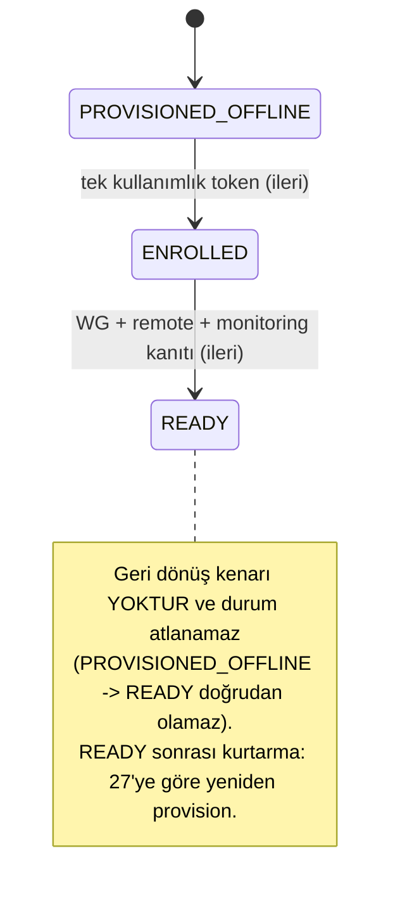
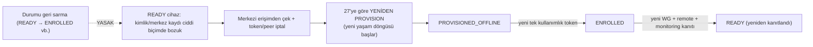

# 29 — Cihaz Enrollment

> Kısa özet: Device enrollment, offline provision edilmiş cihazın merkezi envantere bir kez bağlanması ve merkezi kanallarca doğrulanmasıdır. Durum modeli **tek yönlüdür**: `PROVISIONED_OFFLINE → ENROLLED → READY`; geri dönüş kenarı ve durum atlama yoktur (`PROVISIONED_OFFLINE → READY` doğrudan olamaz). Tek kullanımlık token `ENROLLED` verir; yalnız WireGuard, erişim ve monitoring doğrulanınca `READY` verilir. `READY` sonrası kurtarma yolu **yeniden provision**'dır (27), durumu geri sarmak değil.
>
> - Dosya: `docs/29-DEVICE-ENROLLMENT.md`
> - İlgili kararlar: `24-DECISION-LOG.md#K-17` (enrollment), `#K-21` (tek durum kaynağı ve ileri-yönlü geçişler), `#K-12`, `#K-05`, `#K-07`
> - Durum: [ ] Taslak

---

## 1. Amaç

Cihaz kimliğinin, ağ kaydının ve merkezi gözlemin sahada güvenli sırayla birleştirilmesini tanımlamak.

## 2. Kapsam

- Kapsam içi: durum makinesi, token özellikleri, merkezi kayıt, WG/remote/monitoring kapıları, token iptal kaydı.
- Kapsam dışı: offline işletim sistemi kurulumu (27), SSH anahtar yaşam döngüsü (06), release seçimi (30).

## 3. Kararlar

```text
KARAR:    Enrollment bir kez kullanılan, süreli ve cihaz kimliğine bağlı token ile yapılır. Durum modeli üç durumdur ve TEK YÖNLÜDÜR: PROVISIONED_OFFLINE → ENROLLED → READY. Geçişler ileri yönlüdür; **geri dönüş kenarı yoktur ve durum atlanamaz** (PROVISIONED_OFFLINE → READY doğrudan olamaz, READY → ENROLLED geri alınmaz). READY sonrası kurtarma yolu durumu geri sarmak değil, cihazı 27'ye göre YENİDEN PROVISION etmektir (yeni yaşam döngüsü: PROVISIONED_OFFLINE'dan başlar). Tek kaynak `/var/lib/blueforce/state.json` + `bf-enrollment-status` çıktısıdır.
GEREKÇE:  Offline medya secret taşımaz; token yalnız bağlantı oluştuğunda kullanılır. READY, token kullanımından değil merkezi erişim ve health kanallarının gerçek doğrulamasından doğar. Geçmişi geri sarma kenarları "hangi cihaz ne zaman READY oldu" denetimini bulanıklaştırır ve yanlış teslim üretir; kurtarmayı yeniden provision'a bağlamak denetim izini tek yönlü ve kanıtlı tutar. Uygulanan kod bu sözleşmeyi zorlar: `bf-enrollment-status` yalnız üç durumu geçerli sayar, `bf-enroll` yalnız PROVISIONED_OFFLINE/ENROLLED fazından enrollment kabul eder.
ALTERNATİF: Kalıcı ortak bootstrap token — sızıntıda tüm filoyu etkiler; elendi. Geri alınabilir durum geçişleri (READY → ENROLLED) — denetim izini belirsizleştirir ve "READY gerçekten alındı mı" sorusunu cevapsız bırakır; reddedildi. Ayrı bir RETIRED/REVOKED durumu eklemek — açık soru olarak §13'te (bugünkü sözleşme `INVALID`/`PENDING` + exit≠0 ile fail-closed davranır).
RİSK:     Token çalınması veya yanlış cihazda kullanılması; kısa TTL, tek kullanım, `BF-<no>` bağlama ve anlık iptal ile azaltılır. READY sonrası kurtarmanın yeniden provision gerektirmesi saha süresi maliyeti doğurur; azaltma: 17-RECOVERY kademeleri (L1→L9) önce denenir, yeniden provision son çare.
MALİYET:  Ücretsiz.
LİSANS:   OpenSSH — https://www.openssh.com/ ; WireGuard — https://www.wireguard.com/ ; token API davranışı kurum içi uygulama ve LAB doğrulamasıdır.
```

> **Güncelleme (2026-09-16, K-21):** Bu dosyanın ek diyagramındaki iki geri dönüş kenarı (`ENROLLED → PROVISIONED_OFFLINE`, `READY → ENROLLED`) uygulanan kuralla çelişiyordu ve kaldırılmıştır. Uygulanan kural: **geçişler ileri yönlüdür; geri dönüş ve atlama yoktur.** READY sonrası kurtarma yolu yeniden provision'dır (27) — ayrıntı §11 ve Ek'teki ikinci diyagram.

## 4. Neden Bu Karar?

İlk kurulumdaki cihaz, merkez açısından henüz bilinmeyen bir uçtur. Token yalnız kimlik bağlama yetkisi verir; merkezi kanalların gerçekten çalıştığını ispatlamaz. Bu ayrım yanlış READY teslimini engeller. Durumun tek yönlü olması da aynı amaca hizmet eder: "kuruldu → bağlandı → doğrulandı" sırası kanıt zinciridir; geri sarmalı kenarlar bu zinciri koparır ve denetimde hangi durumun ne zaman gerçek olduğunu belirsizleştirir. Bir cihaz READY'den düşürülmesi gerekiyorsa yapılan iş **yeni bir provision + enrollment + READY kanıtı** üretmektir (27), eski durumu geri yazmak değil.

## 5. Alternatifler

| Alternatif | Artı | Eksi | Sonuç |
|---|---|---|---|
| Tek-kullanımlık, TTL'li token | Küçük sızıntı alanı | Token üretim hizmeti gerekir | **Seçildi** |
| Ortak kalıcı token | Basit | Filo çapı sızıntı | Elendi |
| Manuel merkezi kayıt | Ek sistem yok | Hata/audit zayıf | Elendi |

## 6. Avantajlar

- Her kayıt hangi cihaz, kim ve ne zaman ile ilişkilidir.
- READY bağımsız sağlık kanıtına bağlıdır.

## 7. Dezavantajlar

- Cihazın internete kavuşması gerekir.
- Token hizmeti ve iptal kaydı işletilir.

## 8. Riskler

| Risk | Olasılık | Etki | Azaltma |
|---|---|---|---|
| Token tekrar kullanımı | Düşük | Yüksek | Atomik tüketim + audit |
| Kimlik çakışması | Düşük | Yüksek | Envanter benzersizlik kapısı |
| WG var ama health yok | Orta | Orta | READY için üç kanal şartı |
| READY sonrası kurtarma yolu yanlış modellenir (durum geri sarma denemesi) | Orta | Orta | Geçişler ileri yönlü; kurtarma = 27 yeniden provision; `bf-enrollment-status` yalnız üç durumu geçerli sayar, aksi halde `INVALID`/`PENDING` + exit≠0 |
| `central_verification` alanları `pending` kalır, cihaz ENROLLED'da bekler | Orta | Orta | Fail-closed READY kapısı + enrollment yanıt sözleşmesinin zorunlu alanları |

## 9. Uygulama Planı

1. Merkezi admin, doğrulanmış bayi no için `BF-<no>` bağlı, kısa ömürlü token üretir ve kayda açar.
2. Teknisyen tokenı yalnız cihaz ekranına girer; USB'ye, loga veya support bundle'a yazmaz.
3. Başarılı yanıtın tamamı doğrulanır; yalnız bundan sonra WireGuard yapılandırması atomik kurulur ve servis etkin/aktif ise durum `ENROLLED` olur.
4. `bf-check-ready`, kalıcı `READY` değerini okumaz: güncel WG handshake, etkin xRDP, RustDesk yapılandırması, isteğe bağlı Mesh ajanı ve merkezden gelen doğrulama kanıtını bağımsız denetler. Tümü geçerse `18-final-check` `READY` yazar.
5. **İleri-yönlü geçiş kuralı (uygulanan sözleşme):** durumlar yalnız `PROVISIONED_OFFLINE → ENROLLED → READY` sırasıyla ilerler. `PROVISIONED_OFFLINE → READY` doğrudan geçiş yoktur (merkezi kanal kanıtı token olmadan üretilemez); `ENROLLED → PROVISIONED_OFFLINE` veya `READY → ENROLLED` geri dönüş kenarı yoktur. Bir cihaz READY'den çıkarılması gerekiyorsa:
   - önce 17-RECOVERY kademeleri (L1 servis restart → … → L8 USB ile sıfırdan imaj) denenir,
   - kimlik/merkez kaydı ciddi biçimde bozuksa cihaz merkezi erişimden çekilir, token/peer iptal edilir ve **27'ye göre yeniden provision edilir**; yeniden provision yeni bir yaşam döngüsü başlatır (`PROVISIONED_OFFLINE` → yeni token → `ENROLLED` → yeni READY kanıtı).
   - Yani kurtarma "durumu geri sarmak" değil, "kanıtı yeniden üretmek"tir.

```bash
# BF_ENROLLMENT_ENDPOINT is supplied by the approved central control plane configuration.
printf '%s\n' '<tek-kullanimlik-token>' | sudo -E bf-enroll --token-stdin
bf-enrollment-status     # yalnız PROVISIONED_OFFLINE | ENROLLED | READY; aksi halde INVALID/PENDING + exit≠0
bf-check-ready
```

## 10. Test Planı

| Test | Beklenen sonuç | Ortam |
|---|---|---|
| Geçerli token | PROVISIONED_OFFLINE → ENROLLED | LAB(2) |
| Aynı token ikinci kez | Reddedilir, audit kaydı | LAB(2) |
| Süresi geçmiş/yanlış cihaz tokenı | Reddedilir | LAB(2) |
| Merkezi kanallar eksik | ENROLLED kalır, READY olmaz | LAB(2) |
| Token olmadan READY denemesi | READY yazılmaz (atlama yok) | LAB(2) |
| READY sonrası kurtarma provası | Durum geri sarmak yerine 27 yeniden provision yolu çalışır | LAB(2) |

## 11. Rollback

1. Token yanlış kullanılırsa merkezi admin tokenı iptal eder ve geçici kayıtları kapatır (cihaz ENROLLED'da kalır; READY'ye ilerlemez).
2. Yanlış WireGuard peer/etiket, `ENROLLED` durumunda düzeltilir ve yeniden doğrulanır.
3. READY sonrası ciddi kimlik sorunu varsa cihaz merkezi erişimden çekilir, token/peer iptal edilir ve **27'den yeniden provision edilir**. Bu "rollback" bir durum geri alma değildir: yeni yaşam döngüsü PROVISIONED_OFFLINE'dan başlar ve READY yeniden kanıtlanır (geçişler ileri yönlüdür).

## 12. Kontrol Listesi

- [ ] Token tek kullanımlık, TTL'li ve `BF-<no>` bağlı.
- [ ] Token hiçbir medya/log/support bundle içinde yok.
- [ ] ENROLLED ve READY farklı, görünür durumlar.
- [ ] WG + remote + monitoring doğrulaması kayda bağlı.
- [ ] Merkez yanıtındaki `central_verification` kanıtı olmayan veya `pending` olan cihaz READY olmaz.
- [ ] Diyagramda/metinde geri dönüş kenarı ve durum atlama yok; READY sonrası kurtarma 27 yeniden provision olarak yazılı.

## 13. Açık Sorular

- [ ] Token TTL süresi ve yetkili üretici rolleri — sahibi: güvenlik yöneticisi.
- [ ] Enrollment API audit saklama süresi — sahibi: merkezi admin.
- [ ] Geri dönüşsüz modelde "cihaz işletmeden çekildi" durumu için ayrı bir kalıcı damga (ör. `retired`) gerekir mi — karar sahibi: platform ekibi + 27 yazarı [K-21].

---

## Ek: Merkezi doğrulama yanıt sözleşmesi ve güven sınırı

Enrollment yanıtı `central_verification` alanını **zorunlu** taşır. Alan secret, URL, erişim tokenı, RustDesk parolası veya WireGuard private key taşımaz; yalnız merkezde denetlenebilen referansları taşır:

```json
{
  "central_verification": {
    "status": "pending | verified",
    "verification_id": "merkez-kayit-referansi",
    "monitoring": {"status": "pending | verified", "verification_id": "izleme-referansi"},
    "remote": {"status": "pending | verified", "verification_id": "uzak-erisim-referansi"},
    "management": {"status": "pending | verified", "verification_id": "yonetim-referansi"}
  }
}
```

İstemci merkez URL'si veya kanıt uydurmaz. `bf-remote-status` yalnız imzalanmış/kimliği doğrulanmış enrollment yanıtından kalıcılaştırılan bu referansların tümü `verified` olduğunda merkezi kanıtı geçer; alan eksik, biçimsiz veya `pending` ise `PENDING` ile fail-closed olur. Yerel xRDP, RustDesk, isteğe bağlı Mesh ve güncel WG handshake bu merkez kanıtından ayrı olarak kontrol edilir.

## Ek: Durum makinesi (tek yönlü — geri dönüş kenarı yok)



## Ek: READY sonrası kurtarma yolu (yeni yaşam döngüsü)

