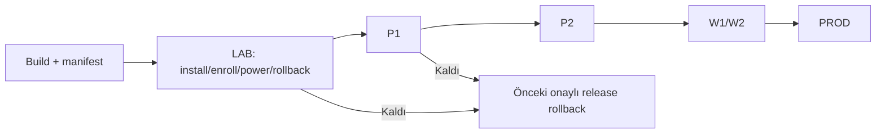

# 30 — Field OS Release Yönetimi

> Kısa özet: Field OS release'i ISO/seed, offline APT snapshot, kurucu, Ansible içerikleri ve manifestten oluşan değişmez bir sette yönetilir. Her release LAB→P1→P2→W1→W2→PROD kapılarından geçer; rollback önceki onaylı release'e döner.
>
> - Dosya: `docs/30-FIELD-OS-RELEASE-MANAGEMENT.md`
> - İlgili kararlar: `24-DECISION-LOG.md#K-18`, `#K-11`, `#K-15`, `#K-16`
> - Durum: [ ] Taslak

---

## 1. Amaç

Field OS değişikliklerini reproducible, onaylı ve geri alınabilir release'lere dönüştürmek.

## 2. Kapsam

- Kapsam içi: release bileşenleri, sürüm/manifest, imza-checksum, dalga kapıları, support penceresi ve rollback.
- Kapsam dışı: tek paketin teknik upgrade komutları (10), cihaz enrollment (29).

## 3. Kararlar

```text
KARAR:    Field OS release'i değişmez manifestli artefact setidir: upstream ISO referansı, seed, offline APT snapshot, kurucu/Ansible commit'i, paket sürümleri ve checksum'lar birlikte sürümlenir.
GEREKÇE:  "26.04.1" tek başına çalışır sistemi anlatmaz; seed ve installer değişirse davranış değişir. Manifest, aynı release'in yeniden kurulmasını ve kanıtlanmasını sağlar.
ALTERNATİF: Yalnız Git branch veya latest ISO etiketi — hangi bileşenin sahaya gittiği belirsiz kalır; elendi.
RİSK:     Artefact uyumsuzluğu veya imzasız medya; build kapısı, checksum ve LAB kabulü ile azaltılır.
MALİYET:  Ücretsiz.
LİSANS:   Git — https://git-scm.com/doc ; Ubuntu releases — https://releases.ubuntu.com/ ; Docker image tag ilkeleri — https://docs.docker.com/reference/cli/docker/image/pull/ (26.04 davranışı LAB gerektirir).
```

## 4. Neden Bu Karar?

Release, bir kurulum medyası değil çalışan sistem sözleşmesidir. İmaj, seed, paket snapshot'ı ve kurucu farklı tarihlerden seçilirse hata tekrar üretilemez ve rollback güvenilmez olur.

## 5. Alternatifler

| Alternatif | Artı | Eksi | Sonuç |
|---|---|---|---|
| Immutable manifest release | İzlenebilir/rollbackli | Release disiplini | **Seçildi** |
| `latest`/hareketli medya | Kolay görünür | Determinizm yok | Elendi |
| Sadece cihazda sürüm notu | Az merkez işi | Filo görünürlüğü yok | Elendi |

## 6. Avantajlar

- Bir cihazın hangi release ile kurulduğu kesin olarak bulunur.
- Önceki onaylı release, gerçek rollback hedefidir.

## 7. Dezavantajlar

- Artefact deposu ve release kaydı işletilir.
- Küçük değişiklik bile manifest/review gerektirir.

## 8. Riskler

| Risk | Olasılık | Etki | Azaltma |
|---|---|---|---|
| Artefact eksikliği | Orta | Yüksek | Release gate: manifest + checksum zorunlu |
| Rollback test edilmez | Orta | Yüksek | LAB restore/rollback kanıtı |
| Eski release güvenlik riski | Orta | Orta | Support penceresi, hızlandırılmış dalga |

## 9. Uygulama Planı

1. Release adı örneği: `field-os-26.04.1-r001`; manifestte ISO/seed/APT/installer/Ansible/MEG sürümlerini açık yaz.
2. Her artefact için SHA256 ve kaynak/oluşturma kaydı üret; secret manifestte bulunmaz.
3. LAB'da fresh install, offline install, enrollment, erişim, power-loss ve rollback kanıtı üret.
4. Merkezi admin 10'daki dalga kapılarıyla yayını onaylar; başarısızlıkta yeni dalga açılmaz.

```bash
sha256sum field-os-26.04.1-r001-manifest.json
# Manifest içerikleri release imzası/checksum süreciyle doğrulanır.
git tag -v field-os-26.04.1-r001  # imzalı tag kullanılıyorsa
```

## 10. Test Planı

| Test | Beklenen sonuç | Ortam |
|---|---|---|
| Manifest bütünlüğü | Tüm artefact hash'leri eşleşir | Build/LAB |
| Fresh + offline install | Aynı release kimliği görünür | LAB(2) |
| Rollback | Önceki onaylı release'e döner | LAB(2) |
| P1 gözlem | 24–48 saat sağlık kapısı temiz | P1(5) |

## 11. Rollback

1. Yayılım durdurulur; etkilenen dalga önceki onaylı manifestteki paket/config/artefact sürümüne döner.
2. `bf-status`, merkezi metrikler ve cihaz release kimliği doğrulanır.
3. İmaj seviyesinde sorun varsa 26'daki upstream ISO + önceki onaylı seed ile yeniden kurulum son çaredir.

## 12. Kontrol Listesi

- [ ] Release ID ve immutable manifest var.
- [ ] ISO, seed, APT snapshot, installer ve uygulama sürümleri kaydedildi.
- [ ] Checksums/imza ve LAB kanıtı var.
- [ ] Dalga onayı ve rollback kanıtı kaydedildi.

## 13. Açık Sorular

- [ ] Artefact depolama/retention ve imza anahtarı sahibi — sahibi: release yöneticisi.
- [ ] Release cadence ve EOL politikası — sahibi: merkezi admin.

---

## Ek: Release kapısı

