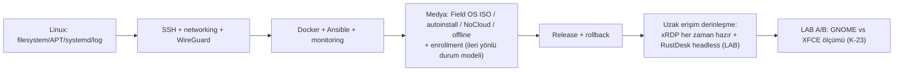

# 31 — Blueforce Field OS Öğrenme Rehberi

> Kısa özet: Bu rehber, Field OS'u güvenle işletmek için gereken Linux, ağ, otomasyon ve release kavramlarını öğretir. Her konu **Nedir / Neden / Nerede / Arıza belirtisi / Komutlar** biçimindedir; üretimde değişiklik yapmadan önce LAB'da uygulanır.
>
> - Dosya: `docs/31-LEARNING-GUIDE.md`
> - İlgili kararlar: `24-DECISION-LOG.md#K-01…K-24` (özellikle medya için `#K-20`, durum modeli için `#K-21`, RDP/yerel GUI için `#K-22`, GNOME vs XFCE ölçümü için `#K-23`)
> - Durum: [ ] Taslak — komutlar örnektir; 26.04 ve RustDesk headless ayrıntıları LAB'da doğrulanmalıdır

---

## 1. Amaç

Teknisyen ve merkezi operatörün, Field OS'un neden böyle tasarlandığını ve temel kontrolleri hangi sırayla yapacağını öğrenmesini sağlamak.

## 2. Kapsam

- Kapsam içi: filesystem, paket yönetimi, servis/log, Git/Bash, SSH/ağ, WireGuard, Docker/Ansible/Semaphore/Prometheus, uzak erişim, autoinstall/NoCloud/ISO/offline APT, enrollment, golden image, release ve rollback.
- Kapsam dışı: gizli anahtar üretimi, prod değişikliği veya 13/20/21 yerine geçecek işletim yetkisi.

## 3. Kararlar

```text
KARAR:    Eğitim, komut ezberi yerine Nedir/Neden/Nerede/Arıza belirtisi/Komutlar çerçevesiyle ve yalnız LAB pratiğiyle verilir.
GEREKÇE:  700 cihazda yanlış komutun etkisi büyüktür; kavramı bilen operatör belirtileri doğru runbook'a yönlendirir ve onaysız değişiklik yapmaz.
ALTERNATİF: Sadece kısa komut listesi — bağlam olmadan yanlış kullanım riski yüksek olduğu için elendi.
RİSK:     Doküman, sürüme özgü davranışı kesinmiş gibi gösterebilir; Ubuntu 26.04 ve RustDesk headless ayrıntıları açık LAB etiketiyle tutulur.
MALİYET:  Ücretsiz.
LİSANS:   Resmi kaynak URL'leri her konu altında verilmiştir; kurum içi runbook'lar kendi lisansına tabidir.
```

> **Güncelleme (2026-09-16, K-20/K-21/K-22/K-23):** Bu rehberdeki medya, RDP ve durum modeli anlatımları ikinci tur kararlarla hizalandı: (1) V1 medyası **tek USB Field OS ISO**, upstream ISO + seed **geri dönüş yolu**; (2) **xRDP her zaman hazır**, `bf-gui-*` yalnız yerel fiziksel GUI; (3) durum geçişleri **ileri yönlü**, READY sonrası kurtarma 27'ye göre yeniden provision; (4) LAB'da **GNOME vs XFCE A/B ölçümü** yapılır (XFCE saha standardı değil).

## 4. Neden Bu Karar?

Field OS; standart Linux araçlarını, merkezi otomasyonu ve katmanlı güvenlik kapılarını birlikte kullanır. Bir katmanın anlamını bilmek, örneğin `READY` ile yalnızca çalışan bir servisi karıştırmayı önler.

## 5. Alternatifler

| Alternatif | Artı | Eksi | Sonuç |
|---|---|---|---|
| Kavram + güvenli komut + LAB | Kalıcı öğrenme | Başlangıçta daha uzun | **Seçildi** |
| Ezber komut kartı | Hızlı | Hata teşhisi zayıf | Elendi |
| Prod üzerinde deneme | Gerçek ortam | Filo riski | Yasak |

## 6. Avantajlar

- Runbook'ların ardındaki teknik bağ görünür olur.
- Her komutun beklenen sonucu ve arıza belirtisi vardır.

## 7. Dezavantajlar

- Rehber resmi ürün dokümanının yerine geçmez.
- Bazı davranışlar donanım ve Ubuntu nokta sürümüne bağlıdır.

## 8. Riskler

| Risk | Olasılık | Etki | Azaltma |
|---|---|---|---|
| Prod'da deney komutu | Orta | Yüksek | LAB-only etiketi, 20/21 yetki sınırı |
| Secret'ın komuta/loga girmesi | Orta | Yüksek | Placeholder kullan, secret yazma |
| Sürüm farkı | Orta | Orta | Resmi URL + LAB kayıtları |

## 9. Uygulama Planı

### 1. Filesystem ve Bash

**Nedir:** Linux filesystem; `/etc` yapılandırma, `/var` değişen veri/log, `/usr` programlar, `/home` kullanıcı verisidir. Bash kabuk ve komut dili olarak bunlarla çalışır.

**Neden:** Yanlış dosyayı düzenlemek veya alanı dolu diski kaçırmak servis arızası üretir.

**Nerede:** `/etc/wireguard/wg0.conf`, `/var/log/`, `/var/lib/blueforce/`, `/usr/local/bin/`.

**Arıza belirtisi:** `No space left on device`, izin reddi, servis config'i okumuyor.

**Komutlar (LAB):**
```bash
pwd; ls -lah /etc /var/lib/blueforce
df -h; df -i
findmnt /; stat /etc/hostname
```
Resmi kaynak: https://www.gnu.org/software/bash/manual/ ; https://www.freedesktop.org/software/systemd/man/latest/file-hierarchy.html

### 2. APT ve dpkg

**Nedir:** `apt` paket bağımlılıklarını çözen yüksek seviye araçtır; `dpkg` kurulu `.deb` paket veritabanını yönetir.

**Neden:** Offline medya veya yarım kurulumda paketin kurulu olup olmadığını ve yarım işlemi anlamak gerekir.

**Nerede:** `/etc/apt/`, `/var/lib/dpkg/`, offline APT snapshot (27).

**Arıza belirtisi:** `dpkg was interrupted`, bağımlılık hatası, yanlış paket sürümü.

**Komutlar (LAB):**
```bash
apt-cache policy xrdp
dpkg -l xrdp
dpkg -S /usr/sbin/xrdp
sudo dpkg --configure -a
```
Resmi kaynak: https://manpages.ubuntu.com/manpages/noble/en/man8/apt.8.html ; https://manpages.ubuntu.com/manpages/noble/en/man1/dpkg.1.html

### 3. systemd ve journalctl

**Nedir:** systemd servisleri ve boot hedeflerini yönetir; journald olay günlüklerini tutar, `journalctl` okur.

**Neden:** Field OS boot zinciri `multi-user.target` → network → WireGuard → Docker/ajanlar şeklindedir.

**Nerede:** `/etc/systemd/system/`, drop-in `*.service.d/`, journal.

**Arıza belirtisi:** `failed` servis, boot race, tekrar başlayan konteyner/ajan.

**Komutlar (LAB):**
```bash
systemctl get-default
systemctl status wg-quick@wg0 --no-pager
journalctl -u wg-quick@wg0 -b --no-pager
systemd-analyze critical-chain docker.service
```
Resmi kaynak: https://www.freedesktop.org/software/systemd/man/latest/systemctl.html ; https://www.freedesktop.org/software/systemd/man/latest/journalctl.html

### 4. Git ve Bash çalışma disiplini

**Nedir:** Git, doküman/config değişiklik geçmişidir; Bash scriptleri kurucu ve tanı komutlarını taşır.

**Neden:** Release manifesti, seed ve Ansible değişiklikleri review ve geri alma olmadan sahaya gitmez.

**Nerede:** Bu repo, `scripts/`, `ansible/`, release tag'leri.

**Arıza belirtisi:** yanlış branch, temiz olmayan worktree, aynı dosyada iki farklı değişiklik.

**Komutlar (LAB/yerel checkout):**
```bash
git status --short --branch
git log --oneline -5
git diff --check
bash -n scripts/install/blueforce-install.sh
```
Resmi kaynak: https://git-scm.com/docs ; https://www.gnu.org/software/bash/manual/

### 5. SSH ve anahtarlar

**Nedir:** SSH şifreli yönetim bağlantısıdır; public key cihazda, private key yalnız yetkili admindedir.

**Neden:** K-13'e göre parola/root SSH kapalı ve paylaşılan private key yasaktır.

**Nerede:** `~/.ssh/`, `/etc/ssh/sshd_config.d/`, `authorized_keys`.

**Arıza belirtisi:** `Permission denied (publickey)`, host key değişikliği, çok geniş yetki.

**Komutlar (LAB):**
```bash
ssh -vvv blueforce@bf-12010193
ssh-keygen -lf ~/.ssh/id_ed25519.pub
sudo sshd -T | grep -E 'passwordauthentication|permitrootlogin'
```
Resmi kaynak: https://www.openssh.com/manual.html ; https://man.openbsd.org/sshd_config

### 6. Networking ve WireGuard

**Nedir:** IP routing ağın yoludur; WireGuard, hub-spoke şifreli tüneldir. `PersistentKeepalive=25`, NAT arkasındaki spoke için varsayımdır.

**Neden:** SSH/xRDP yalnız WireGuard içinden; RustDesk/MeshCentral WG-dışı yedek kanaldır.

**Nerede:** `ip route`, `/etc/wireguard/wg0.conf`, hub peer envanteri.

**Arıza belirtisi:** eski handshake, route yok, DNS/WAN hatası.

**Komutlar (LAB):**
```bash
ip addr; ip route
sudo wg show wg0 latest-handshakes
ping -c 3 10.8.0.1
ss -tlnp
```
Resmi kaynak: https://www.wireguard.com/quickstart/ ; https://man7.org/linux/man-pages/man8/ip.8.html

### 7. Docker

**Nedir:** Docker uygulamaları container olarak paketler. Field OS'ta `unless-stopped`, sabit tag ve log rotasyonu zorunludur.

**Neden:** Güç dönüşünde MEG kalkmalı; `latest` veya otomatik updater determinizmi bozar.

**Nerede:** `/etc/docker/daemon.json`, compose dosyaları, Docker journal/logları.

**Arıza belirtisi:** restart loop, disk dolumu, dışa açık port.

**Komutlar (LAB):**
```bash
docker ps --format 'table {{.Names}}\t{{.Status}}\t{{.Image}}'
docker inspect --format '{{.HostConfig.RestartPolicy.Name}}' <container>
docker logs --tail 100 <container>
```
Resmi kaynak: https://docs.docker.com/engine/containers/start-containers-automatically/ ; https://docs.docker.com/engine/logging/configure/

### 8. Ansible ve Semaphore

**Nedir:** Ansible SSH üzerinden idempotent playbook çalıştırır; Semaphore bunun self-hosted operasyon arayüzüdür.

**Neden:** 700 cihazda aynı değişiklik kontrollü dalgalarla uygulanır; UI bozulsa Ansible CLI yedektir.

**Nerede:** `ansible/inventory/`, `ansible/playbooks/`, Semaphore projesi/key store.

**Arıza belirtisi:** unreachable host, playbook drift'i, onaysız prod run denemesi.

**Komutlar (LAB):**
```bash
ansible-inventory -i ansible/inventory/hosts.example.yml --graph
ansible-playbook -i ansible/inventory/hosts.example.yml ansible/playbooks/bf-ping.yml --check
```
Resmi kaynak: https://docs.ansible.com/ansible/latest/ ; https://docs.semaphoreui.com/

### 9. Prometheus ve sağlık

**Nedir:** Prometheus metrikleri scrape eder; Node Exporter host metriklerini verir; Grafana gösterir, Kuma last-seen sunar.

**Neden:** `READY`, yalnız kurulum bitişi değil merkezi metrik/erişim kanıtıdır.

**Nerede:** Node Exporter textfile dizini, Prometheus targets, Grafana/Kuma panoları.

**Arıza belirtisi:** `up=0`, stale WG handshake, disk/RAM trendi, missing scrape.

**Komutlar (LAB):**
```bash
systemctl is-active node_exporter
curl -fsS http://127.0.0.1:9100/metrics | grep '^node_boot_time_seconds'
ls -l /var/lib/node_exporter/textfile/
bf-status
```
Resmi kaynak: https://prometheus.io/docs/introduction/overview/ ; https://github.com/prometheus/node_exporter ; https://github.com/louislam/uptime-kuma

### 10. RustDesk ve xRDP

**Nedir:** xRDP GNOME'a WireGuard üzerinden RDP verir ve servisi **her zaman hazırdır** (`xrdp` + `xrdp-sesman` enable+active). `bf-gui-on` / `bf-gui-off` yalnız **yerel fiziksel** grafik katmanını (display-manager + default target) açar/kapatır; RDP'yi kontrol etmez. RustDesk, self-hosted `hbbs`/`hbbr` ile WireGuard'dan bağımsız grafik yedek erişimdir.

**Neden:** RDP internete açılmaz; WG arızasında RustDesk/MeshCentral kurtarma yolu olur. "GUI kapalı ≠ RDP kapalı" ayrımı, yerel GUI kapatılmış bir saha cihazında uzaktan grafik kurtarmayı korur (K-22).

**Nerede:** xRDP systemd birimleri (`xrdp`, `xrdp-sesman`), GNOME session ayarı, RustDesk client/server yapılandırması.

**Arıza belirtisi:** RDP oturumu açılmıyor ama `systemctl is-active xrdp` "inactive" diyor (servis kapatılmış = sözleşme ihlali), boş GNOME oturumu, xRDP service hatası, RustDesk'te katılımsız erişim yok.

**Komutlar (LAB):**
```bash
systemctl status xrdp xrdp-sesman --no-pager
sudo bf-gui-off; systemctl is-active xrdp xrdp-sesman   # ikisi de "active" kalmalı (K-22 kanıtı)
ss -tlnp | grep ':3389'
journalctl -u xrdp -b --no-pager
```
Resmi kaynak: https://github.com/neutrinolabs/xrdp ; https://rustdesk.com/docs/en/self-host/rustdesk-server-oss/ . **LAB gerekli:** Ubuntu 26.04.1 GNOME+xRDP ve RustDesk'in tam headless/katılımsız servis davranışı sürüm ve paketleme ile doğrulanmadan üretim sözü değildir. Aynı LAB'da **GNOME vs XFCE A/B ölçümü** yapılır: RAM, CPU, boot süresi, RDP güvenilirliği, RustDesk reboot sonrası davranışı, login screen erişimi, dummy display, 24/72 saat stabilite (K-23; XFCE saha standardı değildir, yalnız ölçüm koludur).

### 11. Autoinstall, cloud-init, NoCloud ve ISO

**Nedir:** Autoinstall Ubuntu kurulumunu otomatikleştiren **motordur**; cloud-init ilk boot yapılandırma çerçevesidir; NoCloud, `user-data`/`meta-data` sağlayan veri kaynağıdır. **Blueforce Field OS ISO ise paketleme/dağıtım yöntemidir**: autoinstall'ı, offline APT repo'yu ve firstboot'u tek medyada taşır — ikisi rakip değil, birlikte kullanılır (K-20).

**Neden:** V1 medyası **tek USB Field OS ISO**'dur; teknisyen tek medya takar, kurulum katılımsız ilerler ve **yalnız disk adımı operatör onayı bekler** (`interactive-sections: [storage]` → otomatik disk silme YOK). Upstream ISO + ayrı NoCloud seed USB yolu kaldırılmadı: ISO boot etmezse aynı sonucu veren sıcak geri dönüş yoludur.

**Nerede:** Medya kökü `/autoinstall.yaml`, `/blueforce-provisioning/{autoinstall,firstboot,offline-repo,release}`, seed USB kökü (`user-data`, `meta-data`), `/var/log/cloud-init*`.

**Arıza belirtisi:** interaktif kurulum ekranı, schema hatası, seed bulunamadı, yanlış boot modu, ISO checksum uyuşmazlığı, `OFFLINE BLOCKED` (medyaya gömülü offline repo/pin yok).

**Komutlar (LAB):**
```bash
provisioning/iso/test-iso.sh dist/Blueforce-Field-OS-1.0.0-amd64.iso   # checksum + El Torito metadata
sha256sum -c dist/Blueforce-Field-OS-1.0.0-amd64.iso.sha256
cloud-init status --long
cloud-init schema --config-file user-data
```
Resmi kaynak: https://canonical-subiquity.readthedocs-hosted.com/en/latest/reference/autoinstall-reference.html ; https://cloudinit.readthedocs.io/en/latest/reference/datasources/nocloud.html ; https://releases.ubuntu.com/ . **LAB gerekli:** 26.04.1'in kesin Subiquity/cloud-init söz dizimi, UEFI/Legacy/Secure Boot boot zinciri ve air-gapped kurulum. Not: LAB ISO'su Desktop flavour ile üretildi; baseline (Server) sapması `dist/1.0.0-manifest.yaml` → `baseline_deviation` bloğunda kayıtlıdır.

### 12. Offline APT ve offline provisioning

**Nedir:** Offline APT, sürümlü yerel repo/snapshot'tan paket kurmaktır; offline provisioning internetsiz cihazı `PROVISIONED_OFFLINE` durumuna getirir.

**Neden:** Saha bağlantısı yokken kurulum yapılır; fakat merkezi doğrulama olmadan READY verilmez.

**Nerede:** offline medya, `sources.list`, `/var/lib/dpkg/`, 27 prosedürü.

**Arıza belirtisi:** paket bulunamadı, bağımlılık eksik, dpkg yarım kaldı, cihaz yanlışlıkla READY gösteriyor.

**Komutlar (LAB):**
```bash
apt-cache policy <paket>
dpkg -l <paket>
sudo dpkg --configure -a
bf-status
```
Resmi kaynak: https://manpages.ubuntu.com/manpages/noble/en/man8/apt.8.html ; https://manpages.ubuntu.com/manpages/noble/en/man1/dpkg.1.html

### 13. Enrollment ve golden image

**Nedir:** Golden image kimliksiz tekrar kurulabilir zemin (V1'de tek USB Field OS ISO ile paketlenir); enrollment merkezi kimlik bağlama ve kanal doğrulamasıdır. Durum modeli **tek yönlüdür**: `PROVISIONED_OFFLINE → ENROLLED → READY`; geri dönüş kenarı ve durum atlama yoktur (K-21).

**Neden:** Seed/ISO, bayi no, private key veya kalıcı token taşımaz. `PROVISIONED_OFFLINE → ENROLLED → READY` birbirinden farklı güven durumlarıdır ve sıra kanıt zinciridir; `PROVISIONED_OFFLINE → READY` doğrudan geçiş (token atlama) yanlış teslim üretir. READY sonrası kurtarma durumu geri sarmak değil, 27'ye göre **yeniden provision** etmektir.

**Nerede:** 26–29 dokümanları, `/var/lib/blueforce/state.json`, merkezi envanter, WireGuard peer, monitoring/remote kayıtları.

**Arıza belirtisi:** token tekrar kullanımı, kimlik çakışması, WG çalışırken monitoring eksik ve yanlış READY, `bf-enrollment-status` çıktısında `INVALID`/`PENDING` (exit≠0).

**Komutlar (LAB):**
```bash
bf-status
bf-enrollment-status     # PROVISIONED_OFFLINE | ENROLLED | READY dışındaki her değer fail-closed
printf '%s\n' '<tek-kullanimlik-token>' | sudo -E bf-enroll --token-stdin
bf-check-ready
```
Resmi kaynak: https://cloudinit.readthedocs.io/ ; https://www.wireguard.com/ . Token API ve 26.04 kesin kurulum akışı kurum içi **LAB gerekli** konularıdır.

### 14. Releases ve rollback

**Nedir:** Release; ISO referansı, seed, offline APT snapshot, installer/Ansible commit'i ve checksum'ları içeren immutable manifesttir. Rollback önceki onaylı release'e dönüş kanıtıdır.

**Neden:** `latest` veya yalnız OS sürümü hangi sistemin sahada olduğunu açıklamaz. Her değişiklik 10'daki LAB→P1→P2→W1→W2→PROD kapılarından geçer. Medya seviyesinde geri dönüş yolu upstream ISO + son onaylı seed'dir (K-20).

**Nerede:** release manifest/tag, `dist/<version>-manifest.yaml`, artefact deposu, 30 yönetim kaydı, monitoring ve change kaydı.

**Arıza belirtisi:** hash uyuşmazlığı, rollback planı yok, dalga kapısı atlanmış, sürüm drift'i, `bf-release` çıktısında `UNAPPROVED_SKELETON`.

**Komutlar (LAB):**
```bash
bf-release
sha256sum -c dist/Blueforce-Field-OS-1.0.0-amd64.iso.sha256
git tag --list 'field-os-*'
bf-status
```
Resmi kaynak: https://git-scm.com/docs ; https://releases.ubuntu.com/ ; https://docs.docker.com/

## 10. Test Planı

| Test | Beklenen sonuç | Ortam |
|---|---|---|
| Her konu için komut pratiği | Beklenen durum/arıza farkı anlatılır | LAB |
| Air-gapped provisioning | `PROVISIONED_OFFLINE`, READY değil | LAB(2) |
| Enrollment kapısı | Tek kullanım + READY doğrulaması | LAB(2) |
| Durum modeli ileri yönlü | `PROVISIONED_OFFLINE → READY` atlaması reddedilir; READY sonrası kurtarma 27 yeniden provision | LAB(2) |
| Yerel GUI kapalıyken RDP | `xrdp`/`xrdp-sesman` active kalır (K-22) | LAB(2) |
| Medya doğrulama | `test-iso.sh` + `sha256sum -c` geçer | LAB/CI |
| Power/rollback tatbikatı | Önceki onaylı duruma dönüş | LAB/P1 |

## 11. Rollback

1. Eğitim sırasında yapılan LAB değişikliği snapshot veya yeniden kurulumla geri alınır.
2. Üretimde arıza görülürse bu rehber yerine 19, 20, 21, 10 ve 17 runbook'ları uygulanır.
3. Yanlış release/konfigürasyon 30'daki manifestli rollback ile geri alınır; medya seviyesinde geri dönüş upstream ISO + son onaylı seed yoludur (K-20).

## 12. Kontrol Listesi

- [ ] Katılımcı filesystem, paket, service ve log ayrımını gösterebiliyor.
- [ ] SSH private key/token'ın neden paylaşılmadığını açıklayabiliyor.
- [ ] `PROVISIONED_OFFLINE`, `ENROLLED`, `READY` farkını **ve geçişlerin ileri yönlü olduğunu** biliyor.
- [ ] "GUI kapalı ≠ RDP kapalı" ayrımını (K-22) ve `bf-gui-*` kapsamını açıklayabiliyor.
- [ ] Tek USB Field OS ISO ile upstream ISO + seed geri dönüş yolunu ayırt edebiliyor (K-20).
- [ ] Ubuntu 26.04/RustDesk headless maddelerinin LAB gerekli olduğunu işaretledi.
- [ ] Rollback ve onay kapısının prod değişiklikten önce zorunlu olduğunu biliyor.

## 13. Açık Sorular

- [ ] Rol bazlı eğitim süresi ve LAB cihaz sayısı — sahibi: merkezi admin.
- [ ] 26.04.1 autoinstall/xRDP/RustDesk headless LAB sonuçları — sahibi: platform ekibi.
- [ ] Release artefact imzalama standardı — sahibi: release yöneticisi.
- [ ] GNOME vs XFCE A/B ölçüm sonuçlarının eğitim materyaline işlenmesi (K-23) — sahibi: platform ekibi + bu rehberin yazarı.

---

## Ek: Öğrenme sırası

