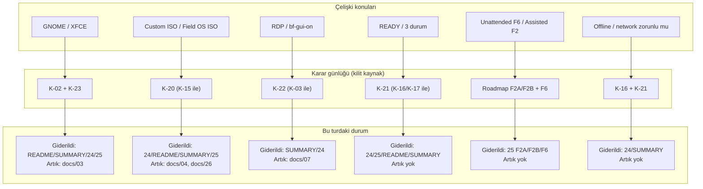

# 32 — Repository Denetimi ve Çelişki Raporu

> Kısa özet: `Blueforce-Linux` deposunun Field OS provisioning hedefine karşı denetimi ve çelişki envanteri. Bulgular kanıta dayanır; B-1…B-7'nin bu turda (2026-09-16, ikinci tur) hangi kısmının giderildiği, hangisinin açık kaldığı ve kimin kapsamında olduğu burada dürüstçe kayıtlıdır.

- Dosya: `docs/32-REPOSITORY-AUDIT-AND-CONFLICTS.md`
- İlgili kararlar: `24-DECISION-LOG.md#K-20` (medya stratejisi), `#K-21` (durum modeli), `#K-22` (RDP/`bf-gui-*`), `#K-23` (GNOME vs XFCE A/B), `#K-24` (sürüm kimliği); çelişki giderimi ayrıca `#K-01`…`#K-19` ile karşılaştırılmıştır
- Durum: [x] Rapor (denetim güncellemesi: 2026-09-16); [ ] Açık maddeler (`§9`) kapanmadan kapatılmaz

---

## 1. Amaç

İki amaç: (1) Field OS hedefiyle mevcut çalışan sistem arasındaki farkı kanıtla göstermek, (2) dokümanlar arasındaki **çelişkileri** görünür kılmak ve her birinin giderim durumunu izlemek. Doğrulanamayan hiçbir iddia "tamam" sayılmaz.

## 2. Kapsam

- Kapsam içi: dosya sistemi kanıtı, `git status`/`git log`, test sonuçları, resmi kaynak doğrulaması, doküman çelişkileri ve giderim durumu.
- Kapsam dışı: gerçek donanım/QEMU/Windows testleri, gerçek ISO ve offline paket deposunun üretimi (F2B işi), merkezi kontrol düzlemi kodlaması.

## 3. Bulgular

```text
KARAR:    Bu doküman salt-okunur bir DENETİM raporudur; kendisi mimari karar üretmez, karar günlüğünü (24) ve yol haritasını (25) denetler ve çelişkileri kayıt altına alır.
GEREKÇE:  Denetim bulgusunun karar yerine geçmesi, "kanıt" ile "tercih" ayrımını bozar; bu yüzden her bulgu ya bir K-kararına bağlanır ya da açık madde olarak yazılır.
ALTERNATİF: Bulguları doğrudan karar olarak yazmak — aynı konunun iki yerde farklı kararla anılması çelişkisi doğar → elendi.
RİSK:     Rapor bayatlarsa yanlış "tamam" izlenimi üretir; azaltma: her turda tarih + giderim durumu tablosu güncellenir (§9).
MALİYET:  Ücretsiz.
LİSANS:   Yok (kurum içi denetim raporu).
```

### 3.1 Özet (ilk tur, 2026-09-16 — tarihsel kayıt)

Depo, prompt'un büyük bölümünü **zaten uygulamış durumda**; ancak ilk turda iki kritik çıktı eksikti: gerçek bir Field OS ISO'su üretilmiyordu ve offline paket deposu boştu. V1 medya kararı (upstream ISO + seed USB) prompt'un istediği tek-medya deneyimiyle çelişiyordu.

| Durum (ilk tur) | Sayı |
|---|---|
| Tüm statik testler | **GEÇTİ** (5/5) — *ikinci turda test seti 7 scripte çıktı ve 2 script kırmızı; bkz. §10* |
| Doküman | 32 (26–31 dahil) — *ikinci turda 33 (32 dahil)* |
| Commit edilmemiş değişiklik | 1 büyük çalışma ağacı |

> **Anlık görüntü uyarısı:** Bu depo 2026-09-16 turunda **paralel çalışma akışlarıyla** aynı anda düzenlenmektedir (offline repo, firstboot, testler, playbook'lar ve bu rapor dahil). §9 ve §10'daki durumlar **10:52 itibarıyla** doğrulanmış anlık görüntüdür; aynı gün içinde başka bir akış tarafından değiştirilebilir. Bir maddeyi kapatmadan önce ilgili komutu yeniden çalıştırın.

### 3.2 Git durumu

```
HEAD: 64a557f chore: keep local .hermes plans out of the repo
      0b56649 docs: Blueforce 700-device fleet architecture (TR) - GNOME baseline
      6402e85 first init.
```

- 14 doküman `modified` (README, SUMMARY, docs/01,03,04,05,07,08,14,16,20,21,24,25)
- ~70+ yeni dosya `untracked` (ansible, config, monitoring, provisioning, scripts, tests, rustdesk, docs-site, docs/26–31, IMPLEMENTATION-REPORT.md)
- **Hiçbiri commit edilmemiş.** Bu turda da commit atılmadı (bilinçli).

### 3.3 Zaten var olanlar (korunacak — yeniden yazılmayacak)

| Alan | Kanıt |
|---|---|
| `blueforce-install.sh` + 18 modül | `scripts/install/installer/modules/01..18` |
| `BF-<8>/bf-<8>` standardı | `blueforce-install.sh` bayi no kapısı `^[0-9]{8}$` |
| `bf-status`, `bf-diagnostics`, `bf-support-bundle`, `bf-hardware-inventory.sh` | `scripts/diagnostics/` |
| 3-aşamalı durum scriptleri | `bf-check-local`, `bf-check-enrollment`, `bf-check-ready` |
| Yeni komutlar | `bf-enroll`, `bf-enroll-now`, `bf-enrollment-status`, `bf-release`, `bf-remote-status` |
| Canlı HW kontrolü | `scripts/diagnostics/bf-live-hw-check` (91 satır, mutasyonsuz) |
| Windows geçiş araçları | `scripts/migration/windows/BF-WindowsPreMigrationInventory.ps1`, `BF-WindowsDataExport.ps1` |
| Ansible | 16 playbook + 4 rol + inventory (dalga grupları `pilot_1/wave_1` Ansible-uyumlu) |
| Update kapıları | `bf-deploy-update.yml` dalga + `production_override` + `halt_on_fail` |
| WireGuard/SSH/xRDP/RustDesk | config/ + installer modülleri 06,07,08,09 |
| MeshCentral | erişim kanalı olarak dokümante (docs/07) |
| Docker politikaları | `config/docker/daemon.json`, `DOCKER-USER` kalıcı servis |
| Monitoring | `monitoring/` Prometheus + Grafana OSS + Uptime Kuma |
| Docusaurus | `docs-site/` (build PASS) |
| Firewall / logging / recovery | config/ + docs/15, 17 |
| Provisioning iskeleti | `provisioning/{autoinstall,iso,offline-repo,firstboot,enrollment,release}` |
| Testler | 5 script + QEMU planı |

## 4. Neden Bu Karar?

Denetim, "çalışıyor mu?" sorusunu **kanıtla** yanıtlamak için vardır. Bu depoda en pahalı hata tipi, "dokümanda yazıyor" ile "gerçekten üretildi" farkının karışmasıdır: ISO dosyası, offline paket deposu ve merkezi enrollment endpoint'i olmadan "offline kurulum çalışıyor" denemez. Aynı şekilde iki doküman aynı konuda farklı şey söylüyorsa (RDP bir yerde `bf-gui-on` gerektirir, başka yerde her zaman hazır; GNOME bir yerde tamamen kapanmış, başka yerde ölçüm adayı), saha teknisyeni yanlış prosedürü uygular. Bu rapor o farkı görünür tutar.

## 5. Alternatifler

| Alternatif | Artı | Eksi | Sonuç |
|---|---|---|---|
| Kanıt-temelli yazılı denetim (bu rapor) | Tekrarlanabilir, izlenebilir | Gerçek donanım kanıtı vermez | **Seçildi** |
| Yalnız test çıktısıyla denetim | Hızlı | Doküman çelişkilerini görmez | Yetersiz |
| Yalnız gözle denetim | Esnek | Kanıtsız, tekrar üretilemez | Elendi |

## 6. Avantajlar

- Her bulgu dosya/satır kanıtına bağlı; "tamam" iddiası yalnız çalıştırılan komutla veriliyor.
- Giderim durumu tur tur izlenebiliyor (§9), böylece kimse "bu madde kapandı mı?" diye tahmin etmiyor.
- Yazma yetkisi dışında kalan artıklar (örn. `docs/26`) açıkça sahiplendiriliyor; sessiz çelişki kalmıyor.

## 7. Dezavantajlar

- Rapor, doküman setinin "kanonik" sayısını artırır (33 numaralı dosya) ve `tests/check-specs.sh` sabitleriyle uyumsuzluk doğurur (§10).
- Bazı maddeler (B-1/B-2) kod gerektirir; rapor onları kapatamaz, yalnız işaretler.

## 8. Riskler

| Risk | Olasılık | Etki | Azaltma |
|---|---|---|---|
| Rapor bayatlar, kapanmış madde açık görünür | Orta | Orta | Her turda §9 tablosu ve tarih güncellenir |
| "Doküman kapandı" diye kod işi (ISO/offline repo) kapanmış sayılır | Orta | Yüksek | §9'da "doküman katmanı" ile "kod/artefact" ayrımı ayrı sütunlarda |
| Yazma yetkisi dışındaki dosyalarda çelişki kalır ve sahaya yansır | Orta | Yüksek | §9'daki "kalan artık + sahip" listesi; PR sahibi atanır |

## 9. Uygulama Planı — Giderim Durumu (2026-09-16, ikinci tur)

> Sütunlar: **Durum** = bu turda değişti mi · **Kalan artık** = hâlâ açık olan kısım ve sahibi.

| ID | İş | Öncelik | Durum (ikinci tur) | Kalan artık |
|---|---|---|---|---|
| B-1 | Gerçek bootable ISO builder | KRİTİK | **KAPANDI (kod)** — builder gerçek medya üretiyor. Boot düzeni `xorriso -report_el_torito as_mkisofs` reçetesinden okunup `-as mkisofs` ile yeniden kuruluyor (sabit değer gömülü değil); üretilen artefakt doğrulandı: `dist/Blueforce-Field-OS-1.0.0-amd64.iso`, 6 481 917 952 byte, SHA256 `cb0cc56f…d431296`, El Torito BIOS+UEFI korunmuş, `/autoinstall.yaml` kökte, `interactive-sections:[storage]`, kimlik/secret yok, `casper/minimal.squashfs` base ile birebir aynı | LAB işi: UEFI/Legacy/Secure Boot boot kabulü, Desktop autoinstall kabulü, air-gapped kurulum (sahibi: LAB; F2B/F3) |
| B-2 | Offline paket manifestleri (somut pin) + repo üretimi | KRİTİK | **KISMEN İLERLEDİ** — manifestler artık yalnız yorum değil: pin biçim sözleşmesi + `requirements.tsv` denetim tablosu + `packages.lock.schema.tsv` yazıldı, `build-offline-repo.sh` `--dry-run-plan` ile sapma denetliyor, `tests/check-offline-repo-static.sh` **PASS**. **Ama pinler hâlâ `UNPINNED` sentinel** (base-packages 14, docker 7, remote-access 7 satır), `packages.lock.tsv` ve `.deb` havuzu yok, `provisioning/offline-repo/packages/` boş | Onaylanmış `.deb` havuzu + gerçek `package=version` pinleri + `packages.lock.tsv` + air-gapped kurulum kanıtı (sahibi: release yöneticisi; F2B) |
| B-3 | Medya kararını uyumlaştır (tek USB, yine assisted) | KRİTİK | **KISMEN KAPANDI (doküman katmanı)** — `docs/24` K-20 eklendi (autoinstall = motor, Field OS ISO = paketleme; `interactive-sections: [storage]` korunur), README/SUMMARY/`docs/25` bu karara göre yazıldı; K-15 silinmedi, yedek yol olarak korundu | `docs/26` hâlâ "V1 medya = upstream ISO + seed, custom ISO tamamlayıcı" diyor; `docs/26` K-20 ile hizalanmalı (sahibi: 26 yazarı). ISO'nun kendisi B-1'de |
| B-4 | Firstboot terminal wizard | YÜKSEK | **BÜYÜK ÖLÇÜDE İLERLEDİ** — `provisioning/firstboot/bf-firstboot` 23 → **381 satır**: Türkçe etiketli interaktif konsol wizard (konsol varsa varsayılan), `--interactive`, `--dealer-id`, `--dealer-id-file`, `--force-reidentity`, `--check` ve test modu. Statik kanıt kapısı bu tur içinde **yeşile döndü** (`tests/test-firstboot-static.sh` PASS, 10:52) | Gerçek konsol/LAB kanıtı (wizard + installer uçtan uca, kimlik değişim prosedürü) ve 3.5'teki `docs/28` bağlantısı (sahibi: provisioning; F2B) |
| B-5 | `--offline` bayrağı doğrula + uygula | YÜKSEK | **KAPANDI (kanıtlı)** — `scripts/install/blueforce-install.sh` `--offline` bayrağını gerçekten destekliyor: yalnız yerel `file:` APT kaynağı, uzak indirme yok, başarıda `state.json`'a `phase=PROVISIONED_OFFLINE` yazıyor; `bf-firstboot` bu bayrağı kullanıyor; `--offline` olmadan damga yazılmıyor | Yok (paket seti için B-2) |
| B-6 | Migration/hw-check konum ve adlarını dokümante et | ORTA | **KAPANDI (dokümante)** — eşleme aşağıda (3.4) yazılı; konum farkı `scripts/` tutarlılığı lehine kabul edildi | Yok |
| B-7 | Doküman çelişkilerini gider | ORTA | **KISMEN KAPANDI** — README başlığı/`Faz 3'te dolar` ifadesi düzeltildi; GNOME/XFCE çelişkisi `docs/24` K-02 güncellemesi + K-23 ile çözüldü; custom ISO/Field OS ISO çelişkisi K-20 ile çözüldü; SUMMARY'nin 11. cevabı (RDP) ve 4. cevabı (`bf-gui-*`) düzeltildi; `docs/24` Ek B notu ("SUMMARY Faz 4'te üretilecek") güncellendi | Aşağıdaki **6 artık** (§3.5) — hepsi yazma kapsamı dışındaki dosyalarda |

### 3.4 B-6 kapanış kaydı: ad ve konum eşlemesi

| Prompt'ta istenen | Depodaki gerçek | Not |
|---|---|---|
| `migration/windows/bf-win-inventory.ps1` | `scripts/migration/windows/BF-WindowsPreMigrationInventory.ps1` | Konum `scripts/` altında kabul edildi (depo tutarlılığı); içerik mutasyonsuz/credential'sız (test edilir) |
| `migration/windows/bf-win-network-export.ps1` + `bf-win-software-export.ps1` + `bf-win-device-export.ps1` | `scripts/migration/windows/BF-WindowsDataExport.ps1` | Tek script aynı veri sınıflarını dışa aktarır |
| `scripts/live/bf-live-hw-check` | `scripts/diagnostics/bf-live-hw-check` | Canlı HW kontrolü tanı grubunda |
| `scripts/live/…` AnyDesk modülü | `scripts/install/optional/anydesk/install-anydesk.sh` | Opsiyonel modül; lisans onayı olmadan indirme/kurulum yapmaz |

### 3.5 B-7 artıkları (bu turda giderilemeyen çelişkiler — yazma kapsamı dışı)

| Konu | Dosya (düzeltilmeli) | Sorun | Öneri |
|---|---|---|---|
| GNOME/XFCE | `docs/03-UBUNTU-BASELINE.md` (§3 K-02 bloğu, §5 tablo satırı) | "XFCE elendi; yedekte tutulmaz" — `docs/24` K-02+K-23 ile artık ölçüme bağlı | §3'te ALTERNATİF satırını "LAB A/B ölçüm adayı (K-23), saha standardı GNOME" yap; §5 tablosunda sonucu "LAB A/B ölçümü" yaz |
| Custom ISO / Field OS ISO | `docs/04-GOLDEN-IMAGE-AND-PROVISIONING.md` (§3 KARAR, §4, §5) | (a) "Custom ISO/Packer elendi" ve "Custom Field ISO → LAB artefact / **F6**" — K-20 ile assisted Field ISO **F2B**'ye taşındı (Packer hâlâ elenmiş durumda); (b) §3 KARAR "V1'de resmi upstream ISO + ayrı NoCloud seed USB kullanılır" — K-20'de birincil teslim medyası F2B tek-USB'dir, upstream ISO + seed **geri dönüş** yoludur | §4'ü "autoinstall motoru + Field OS ISO paketleme (K-20)" olarak ayır; §5 satırını "F2B assisted artefact; Packer elendi" yap; §3'te "V1'de resmi upstream ISO + seed" cümlesine "geri dönüş yolu" nitelemesi ekle |
| V1 medya (mimari) | `docs/01-ARCHITECTURE.md` (§3 KARAR) | "V1 medya = upstream ISO + ayrı NoCloud seed USB" — K-20/F2B ile birincil medya tek USB Field OS ISO, upstream+seed yedek yol | Cümleyi "birincil: F2B tek-USB Field OS ISO; yedek: upstream ISO + seed (K-20)" olarak güncelle |
| V1 medya (öğrenme rehberi) | `docs/31-LEARNING-GUIDE.md` (§9 konu 11) | "V1'de upstream ISO + ayrı NoCloud seed USB, custom Field ISO'dan daha az risklidir; ikisi tamamlayıcıdır" — F2B hedefiyle çelişir | "assisted tek-USB Field OS ISO (K-20) esas; upstream ISO + seed geri dönüş yolu" olarak düzelt |
| V1 medya (ISO dokümanı) | `docs/26-BLUEFORCE-FIELD-OS-ISO.md` (§3 KARAR, §5 tablo, §7, §12 kontrol listesi) | "V1 kurulum medyası = upstream ISO + ayrı NoCloud seed USB; custom ISO tamamlayıcı" ve "V1 etiketi upstream ISO + seed olarak basıldı" — K-20 ile birincil teslim F2B tek-USB assisted medyadır | K-15 bloğuna "K-20 ile birlikte okunur" notu ekle; §5 tablosunda V1/F2B eşlemesini düzelt; §12 kontrol listesini "F2B tek-USB ISO etiketi" olarak güncelle |
| RDP / `bf-gui-on` | `docs/07-REMOTE-ACCESS.md` (§3 ilk KARAR bloğu) | "GUI varsayılan kapalıdır, bakım penceresinde `bf-gui-on` ile açılır" ifadesi RDP'yi anahtara bağlı gösterir; aynı dosyanın ikinci KARAR bloğu ve `docs/16` xrdp'in her zaman ready olduğunu söyler | İlk blokta "GUI" yerine "**yerel fiziksel** GUI" yaz ve xRDP'in bundan bağımsız her zaman aktif olduğunu ekle (K-22) |
| Windows geçiş kapsamı | `docs/28` §9.2 "Onaylı araçla geri dönüş imajı al…" | Araç adı (`BF-Windows…ps1`) anılmıyor — B-6 kapanışıyla hizalanması iyi olur | §9.2'ye script adlarını ekle |

### 3.6 Bu turda eklenen yeni bulgular

| ID | Bulgu | Kanıt | Açık mı? |
|---|---|---|---|
| B-9 | `/etc/blueforce-release` **yazılmıyor**: yalnız `bf-release` okuma yolu + legacy KEY=VALUE uyumluluğu var; yazan bir release pipeline adımı depoda yok | `grep -rn blueforce-release` → sadece `bf-release` (okuma) ve `17-healthcheck`'in `/etc/blueforce/release-manifest.yaml` kopyası | **AÇIK** — sahibi 30-release; K-24 risk satırında kayıtlı |
| B-10 | `tests/check-specs.sh` sabitleri bayat: "exactly docs/00 through docs/31" (32 dosya) ve "expected 34 Mermaid blocks" — depo gerçekte 33 numaralı dosya ve 35 Mermaid bloğu içeriyor | `bash tests/check-specs.sh` → `FAIL: expected 32 numbered docs, found 33` / `FAIL: expected 34 Mermaid blocks, found 35` | **AÇIK** — düzeltme `tests/` kapsamında (bu raporun yazma kapsamı dışı) |
| B-11 | Kanonik doküman sayısı ikinci turda 32→33 oldu; bu rapor da numaralı namespace'te olduğu için B-10'un kök nedeni buradadır | `ls docs/[0-9][0-9]-*.md \| wc -l` = 33 | **AÇIK** — iki seçenek: sabitleri güncelle, veya bu raporu numaralı namespace dışına taşı |
| B-12 | **Paralel düzenleme çakışması:** aynı gün başka bir çalışma akışı bu dosyayı (10:37:21) düzenledi; bu raporun güncellemesi (10:39:32) onun sürümünün üzerine yazıldı ve **o sürüm kurtarılamadı** (dosya git'te untracked, yedek yok) | Hermes araç uyarısı: *"was modified by sibling subagent … after this agent's last read"*; `git status` → `?? docs/32-…`; session kayıtlarında içerik izi yok | **AÇIK (süreç)** — o akışın eklemek istediği bilgi varsa yeniden yazılmalı. Ders: aynı dosyaya iki akış yazacaksa tek sahip atanmalı veya yazmadan önce dosya yeniden okunmalı |

### 3.7 Açık ve doğrulanmamış iddialar (bilgi amaçlı, değişmedi)

- Hiç ISO build edilmedi (rapor da kabul ediyor).
- Hiç offline repo üretilmedi.
- Merkezi enrollment endpoint'i yok.
- Gerçek donanım/Windows/QEMU testi yapılmadı.
- `sudo` gerektiren komutlar bu turda çalıştırılmadı (parolasız sudo yok).

## 10. Test Planı (bu turda çalıştırılanlar ve sonuçları)

> Anlık görüntü: **2026-09-16 10:52**. Paralel çalışma akışları test setini aynı gün genişlettiği için bu tablo bir iddia değil, **zaman damgalı kanıttır**.

| Komut | Sonuç | Not |
|---|---|---|
| `tests/check-specs.sh` | **FAIL** | (B-10) iki bayat sabit: `expected 32 numbered docs, found 33` ve `expected 34 Mermaid blocks, found 35`; ayrıca içindeki çağrıyla `test-field-os-lifecycle.sh` düşüyor (aşağıdaki satır) |
| `tests/check-offline-repo-static.sh` | **PASS** | Bu tur eklenen offline repo pin/biçim sözleşmesi denetimi |
| `tests/check-provisioning-static.sh` | **PASS** | — |
| `tests/check-migration-static.sh` | **PASS** | — |
| `tests/check-configs.sh` | **PASS** | — |
| `tests/test-field-os-lifecycle.sh` | **FAIL** | `ENROLLED state with independent local and central evidence must become ready-check eligible` — durum makinesi/READY kapısı üzerinde devam eden akış (K-21/K-22 ile ilişkili) |
| `tests/test-firstboot-static.sh` | **PASS** *(10:52)* | Firstboot wizard/installer bayrak sözleşmesi bu tur içinde yeşile döndü; gerçek konsol LAB kanıtı yine de gerekir (B-4) |
| Doküman yapı denetimi (`docs/[0-9][0-9]-*.md`) | **33/33 uyumlu** | Her dosyada §1–§13 sırası + ≥1 Mermaid (bu rapor bu turda §1–§13 + 1 diyagrama getirildi) |
| Üretim artefaktı denetimi | **YOK** | `*.iso` yok, `*.deb` yok, `packages.lock.tsv` yok, `provisioning/offline-repo/packages/` boş |
| URL doğrulaması (curl, HTTP 200) | **PASS** | Subiquity autoinstall referansı, cloud-init NoCloud, gnome.org, xfce.org, neutrinolabs/xrdp |

**Test sonucu yorumu:** Altı script yeşil; tek kırmızı `test-field-os-lifecycle.sh` ve bu, K-21/K-22 (durum modeli + RDP/READY sözleşmesi) üzerinde hâlâ çalışılan akışa işaret ediyor. Bu rapor kırmızı testi olan sözleşmeyi **kapalı** saymaz.

Resmi kaynak doğrulaması (canlı, 2026-09-16 — `canonical-subiquity.readthedocs-hosted.com/en/latest/reference/autoinstall-reference.html`, HTTP 200):

1. **`/autoinstall.yaml` yolu sabit:** *"The autoinstall configuration is available at `/autoinstall.yaml` (irrespective of how it was provided)"* → ISO köküne konan autoinstall desteklenir.
2. **`interactive-sections` destekli:** *"A list of configuration keys to still show in the user interface (UI)"*.
3. **`storage` interactive olabilir:** *"can be interactive: true"* + varsayılan *"use the lvm layout on single-disk systems"* → storage interactive bırakılmazsa en büyük disk kendiliğinden bölümlenir; bu yüzden `interactive-sections: [storage]` hem tek-USB deneyimini hem "otomatik disk silme yok" şartını sağlar.
4. **Offline davranış resmi anahtar:** `apt.fallback` varsayılanı **`offline-install`** — *"revert to an offline installation"*.
5. **`seed` yolu ve NoCloud** resmi quickstart'ta belgeli (`cloud-localds`, `user-data` + `meta-data`, `ds=nocloud`).

**Doğrulanamayan:** `xorriso`/remaster ile 26.04 UEFI/Legacy/Secure Boot davranışı — LAB testi gerekir (B-1).

## 11. Rollback

1. Bu rapor bir denetim kaydıdır; hatalı bir bulgu düzeltilecekse aynı dosyada tarihli düzeltme notu düşülür (silme yok).
2. Bu turda yapılan doküman değişiklikleri commit edilmediği için geri alma `git checkout -- README.md SUMMARY.md docs/24-*.md docs/25-*.md docs/32-*.md` ile tek adımda yapılabilir.
3. Karar seviyesindeki geri alma (örn. K-20 medya stratejisi) `docs/24` PR'ı ile yapılır ve bağımlı dosyalar (README, SUMMARY, 25, 26, 31) aynı PR'da güncellenir.

## 12. Kontrol Listesi

- [x] B-1…B-7'nin her biri için bu turdaki durum yazıldı (kapandı / kısmen / açık).
- [x] Kapanan maddeler kanıtla desteklendi (B-5: `--offline` + `state.json`; B-6: eşleme tablosu).
- [x] Giderilemeyen çelişkiler dosya + öneri ile listelendi (§3.5).
- [x] Yeni bulgular (B-9…B-12) kayda geçti.
- [ ] B-1 (ISO), B-2 (gerçek paket pinleri/pool) ve B-4 (firstboot testleri yeşil) kapanmadan bu rapor "tamam" sayılmaz.
- [ ] §3.5 artıkları (docs/03, 04, 26, 07, 28) doküman PR'ıyla kapatılmalı.
- [ ] `tests/check-specs.sh` sabitleri güncellenmeli (B-10) veya bu rapor numaralı namespace dışına taşınmalı (B-11).
- [ ] Kırmızı testler (`test-field-os-lifecycle.sh`, `test-firstboot-static.sh`) yeşile dönmeli; kapanış ancak bundan sonra ilan edilir.
- [ ] Bu rapora aynı gün içinde tek sahip atanmalı (B-12: paralel yazım çakışması bir tur kaybettirdi).

## 13. Açık Sorular

- [ ] Remaster edilmiş Field OS ISO'nun UEFI/Legacy/Secure Boot matrisi — LAB (sahibi: provisioning/release, F2B).
- [ ] Offline APT snapshot'ın yenileme sıklığı ve paket onay süreci (sahibi: release yöneticisi, F2B).
- [ ] `docs/32` kanonik doküman sayılsın mı, yoksa numaralı namespace dışına mı taşınsın (sahibi: doküman sahibi + test sahibi).
- [ ] Bu raporun `docs-site`'a dahil edilip edilmeyeceği (numaralı dosya olduğu için şu an sitede yayınlanıyor) (sahibi: 22 yazarı).

---

## Ek: Çelişki ve giderim haritası


