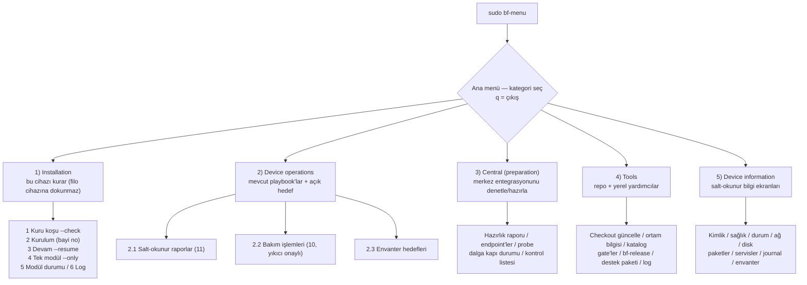
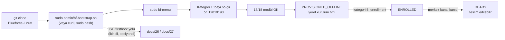

# 33 — Operatör Konsolu Rehberi (`bf-menu`)

> Kısa özet: Bu rehber, Linux/DevOps'a yeni başlayan bir operatörün Blueforce cihazını **git deposundan** kurmasını ve tek giriş noktası olan `sudo bf-menu` **kategori menüsü** ile cihazı işletmesini adım adım anlatır. Kurulum, filo işlemleri, merkez hazırlığı, araçlar ve cihaz bilgisi ekranlarının tamamı bu menüden açılır; komut ezberlemek gerekmez.

- Dosya: `docs/33-OPERATOR-CONSOLE.md`
- İlgili kararlar: `24-DECISION-LOG.md#K-09` (golden image + kurucu), `#K-12` (kimlik formatı `^[0-9]{8}$`), `#K-13` (SSH anahtar zorunlu), `#K-11` (onaysız update yasağı), `#K-21` (durum modeli), `#K-22` (RDP her zaman hazır / `bf-gui-*` yalnız yerel GUI)
- Uygulama: `admin/bf-menu` (+ `admin/lib/tui.sh`, `admin/lib/targets.sh`), `admin/bf-bootstrap.sh`, `admin/bf-creds`
- Durum: [ ] Taslak — ekran çıktıları **örnektir (taklit)** ve LAB'da alınan gerçek çıktıyla güncellenir

> **Dürüstlük notu (bu reponun kuralı):** Aşağıdaki menü ekranları ve çıktılar, tasarımı anlatmak için yazılmış **örnek ekranlardır**; terminal genişliğine, renklerin kapalı olmasına ve envanter içeriğine göre birebir farklı görünebilir. Gerçek çıktılar ilk LAB koşusunda bu dosyaya işlenir (§10, §13).

---

## 1. Amaç

**Bu araç nedir?** `bf-menu`, cihaza `sudo bf-menu` yazınca açılan, numaralarla gezilen bir **operatör konsoludur**. Ekranda 5 kategori çıkar (Kurulum, Cihaz işlemleri, Merkez hazırlığı, Araçlar, Cihaz bilgisi); bir numara yazıp Enter'a basarsın, konsol senin adına doğru komutu çalıştırır ve ne yaptığını Türkçe/İngilizce satırlarla gösterir.

**Neyi kolaylaştırır?** Normalde cihazı kurmak, durumunu okumak, teşhis paketi almak veya bir filo işlemi başlatmak için onlarca komutu ve doğru sırasını bilmek gerekir. `bf-menu` bunları numaralı başlıklar altında toplar, **çalıştırmadan önce komutu ekranda gösterip onay ister**, tehlikeli işlemlerde iki kez sorar ve her işlemi bir denetim log'una (`/var/log/blueforce-console.log`, mod `600`) yazar. Kısacası: ezberleyeceğin tek şey `sudo bf-menu` komutudur.

## 2. Kapsam

- Kapsam içi: Ubuntu'da ilk kurulum (git'ten indir + bootstrap), ana menü ve 5 kategori, tek cihaz/grup/tüm filo hedef seçimi, uçtan uca örnek seans, şifre dosyası (`bf-creds`) davranışı, en sık 5 hata ve güvenlik kuralları.
- Kapsam dışı: ISO/firstboot/offline provisioning yolu (26, 27 — artık **ikincil/opsiyonel**), merkez sunucularının kurulumu (07, 09 — konsol yalnız **hazırlar ve denetler**, kurmaz), update onay zincirinin merkez tarafı (10, 21), rol bazlı eğitim müfredatı (31).

## 3. Kararlar

```text
KARAR:    Cihaz ve filo işlemlerinin tek operatör giriş noktası `sudo bf-menu` kategori menüsüdür; operatör komut ezberlemez, numaralı kategoriden seçer.
GEREKÇE:  Operatör profili Linux/DevOps'a yeni başlayan kişidir; serbest komut yazımı 700 cihazda yazım hatasını filo arızasına çevirir (K-11 blast-radius). Konsol her komutu çalıştırmadan önce gösterir ve onay ister; dalga kapılı playbook'lara bayrak sessizce geçirilmez, operatör kapıyı ayrıca onaylar.
ALTERNATİF: Operatörün dokümandan komut kopyalaması — sıra atlama ve yanlış hedef seçme riski yüksek; elendi. Yalnız merkez Semaphore UI — saha cihazında çevrimdışıyken erişilemez; merkez tarafı için korunur (09).
RİSK:     Konsolun tablosu, altındaki playbook'tan ayrışır ve yanlış kapıyla çalıştırır; azaltma: konsol her playbook'un kapsamını (simple/wave/release) playbook'un kendisinden okuyup karşılaştırır, uyuşmazlıkta **çalıştırmayı reddeder** (`admin/bf-menu` → `bf_playbook_check`).
MALİYET:  Ücretsiz.
LİSANS:   Yok (kurum içi operatör aracı).
```

```text
KARAR:    Kurulum git deposundan yapılır: depo klonlanır ve `sudo admin/bf-bootstrap.sh` (veya `curl -fsSL <repo>/admin/bf-bootstrap.sh | sudo bash`) çalıştırılır. ISO/firstboot yolu (26, 27) silinmez, ikincil/opsiyonel yol olarak korunur.
GEREKÇE:  Dağıtım imajı/ISO üretimi bu fazda yapılmayacaktır; en hızlı doğrulanabilir yol, sürümü Git geçmişiyle izlenebilen tek bir bootstrap scriptidir. Bootstrap repoyu `/opt/blueforce-linux` (veya bulunduğu checkout) altına alır, ön koşulları (git, curl, ansible-core) kurar ve `bf-*` araçlarını `/usr/local/bin`'e bağlar; cihaz kimliği (bayi no) hiçbir zaman bir imaja gömülmez (K-09/K-12).
ALTERNATİF: Tek USB Field OS ISO (K-20) — üretim/doğrulama maliyeti yüksek olduğu için bu fazda birincil yol değil; yedek olarak korunur. USB'ye elle kopyalama — sürüm izi ve güncellenebilirlik yok; elendi.
RİSK:     `curl | bash` deseni kötüye kullanıma açıktır; azaltma: script yalnız resmi depo adresinden çalıştırılır, `git clone` ile içeriği önce incelenebilir, secret yazmaz, `git reset`/`stash` yapmaz ve yerel değişiklikleri asla silmez.
MALİYET:  Ücretsiz.
LİSANS:   Yok (kurum içi script).
```

```text
KARAR:    Şifre/kimlik bilgisi üretimi OPSİYONELDİR ve VARSAYILAN OLARAK KAPALIDIR; yalnız `bf-creds --generate` açıkça istendiğinde üretilir ve parola hiçbir zaman ekrana/loga/komut satırına yazılmaz.
GEREKÇE:  SSH zaten anahtar zorunludur (parola girişi kapalı, `blueforce` hesabı kilitli — K-13); kullanılmayan bir parola üretmek sızma yüzeyini büyütür. Varsayılan kapalı olması secret'ın git'e/medyaya/support bundle'a kaçmasını da baştan engeller.
ALTERNATİF: Kurulumda otomatik parola üretimi — hiçbir kanal bu parolayı kullanmadığı için gereksiz secret üretir; elendi. Parolayı repoya/ISO'ya gömmek — secret yasağına aykırı; yasak.
RİSK:     Kayıt dosyası yanlış yere kopyalanıp paylaşılır; azaltma: dosya `/root` altında mod `600`, `--fetch` hedefi `admin/secrets/` git-ignore'lu (dizin `700`), parola yalnız dosyaya yazılır.
MALİYET:  Ücretsiz.
LİSANS:   Yok.
```

## 4. Neden Bu Karar?

700 cihazlık bir filoda en pahalı hata, teknisyenin yanlış komutu yanlış cihazda çalıştırmasıdır. Konsol bu riski üç yerden küçültür: (1) operatör komut yazmaz, doğru işlemi seçer; (2) her komut **çalıştırılmadan önce ekranda** görünür ve onay ister — "ne çalışacak?" sorusu asla cevapsız kalmaz; (3) filo işlemleri hedefi (`--limit`) açıkça seçtirir ve dalga kapılarını (production için `production`, release kapısı için `GATE` yazma) operatöre ayrıca onaylatır. Git tabanlı kurulum ise "hangi sürüm sahada?" sorusunu `git log` ile yanıtlanabilir kılar. Şifre üretiminin varsayılan kapalı olması aynı felsefenin devamıdır: anahtar zaten var, ikinci bir gizli bilgi üretmenin faydası yok.

## 5. Alternatifler

| Alternatif | Artı | Eksi | Sonuç |
|---|---|---|---|
| Numaralı kategori konsolu (`bf-menu`) | Keşfedilebilir, komutu gösterip onay ister, çevrimdışı çalışır, denetim log'u tutar | Konsol tablosu playbook'la senkron tutulmalı | **Seçildi** |
| Dokümandan komut kopyalama | Araç gerektirmez | Sıra atlama + yanlış hedef riski | Elendi |
| Yalnız Semaphore UI (web) | Güzel arayüz, merkezden yönetim | Saha cihazında çevrimdışı erişilemez; cihaz-kurulumunu kapsamaz | Merkez için korunur (09) |
| Grafik masaüstü aracı (GUI uygulaması) | Görsel | Cihazlar terminale boot eder (K-03), ek bağımlılık ister | Elendi |
| Tek düz komut scripti (`bf-do`) | Basit | Keşfedilebilirlik ve hedef seçimi yok, acemi için anlaşılmaz | Elendi |

## 6. Avantajlar

- Öğrenme maliyeti tek satır: `sudo bf-menu`.
- Her komut çalıştırılmadan önce gösterilir; tehlikeli işlemler iki kez onaylanır — yanlış komut/yanlış sıra riski ortadan kalkar.
- Filo işlemleri yalnız mevcut playbook'larla ve açık `--limit` ile çalışır; konsol **yeni playbook üretmez** ve envanter dışı bir cihaza dokunmaz.
- Çevrimdışı çalışır — ISO/firstboot yoluna bağımlı değildir.
- Denetim log'u (`/var/log/blueforce-console.log`, mod `600`) komutu, hedefi ve çıkış kodunu kaydeder; **secret ve ham playbook çıktısı log'a yazılmaz**.

## 7. Dezavantajlar

- Konsol tablosu ile playbook'lar arasında kapsam (scope) uyuşmazlığı olursa konsol çalıştırmayı reddeder; bu, playbook güncellemesiyle konsolun birlikte güncellenmesini zorunlu kılar (`admin/bf-menu` → `bf_playbook_check`).
- Kategoriler 2, 3 ve 5-filo için makinede `ansible-playbook` gerekir; yoksa konsol açıklama verir ama işlemi çalıştırmaz.
- Çok özel/tek seferlik işler konsol kataloğunda yoksa operatör kabuğa döner (kataloğa ekleme PR ile yapılır).
- TUI çıktısı log'a birebir kopyalanmaz; her seçim ayrı bir denetim satırı üretir (K-14).

## 8. Riskler

| Risk | Olasılık | Etki | Azaltma |
|---|---|---|---|
| Konsol bayatlar, yanlış kapıyla çalıştırır | Orta | Yüksek | `bf_playbook_check` kapsam karşılaştırması uyuşmazlıkta reddeder; §10 testi her sürümde koşar |
| Operatör "tüm filo" hedefini yanlışlıkla seçer | Orta | Yüksek | Wave-scoped playbook'larda filo dalga dalga ilerler, her dalga **ayrı onaylanır**; production için `production` yazma zorunlu (09/10) |
| `curl | bash` ile sahte script çalıştırma | Düşük | Yüksek | Yalnız resmi depo adresi; `git clone` + gözden geçirme önerilir |
| Şifre kaydı yanlışlıkla paylaşılır | Düşük | Yüksek | Varsayılan kapalı; `/root/blueforce-credentials.txt` mod `600`; `admin/secrets/` git-ignore'lu (§9.5) |
| İşlem yarıda kalkar (elektrik) | Orta | Orta | Kurulum idempotent; menü "Resume after a failed run" sunar (§9.6) |
| Konsol, envanter dışı cihaza dokunur | Düşük | Yüksek | Hedefler envanterden çözülür; cihaz/grup bulunamazsa işlem reddedilir |

## 9. Uygulama Planı

Bu bölüm sıfırdan başlayan içindir. Her adımda **hangi komutu nereye yazacağın** ve **ekranda ne göreceğin** yazılıdır.

### 9.1 Ubuntu'da ilk kurulum — adım adım

**Ön koşullar (elinde olması gerekenler):**

- Ubuntu Server tabanlı bir makine (desteklenen baseline `24.04` / `26.04`).
- `sudo` yetkisi olan bir kullanıcı.
- Kurulum sırasında **internet** (repoyu git'ten indirmek için). Cihaz kurulduktan sonra çalışması için internet gerekmez.

**Adım 1 — Terminali aç.** Ekranda şöyle bir satır görürsün:

```text
emirhan@makine:~$
```

`$` işareti "senin yazacağın yer" demektir; **`$` işaretini sen yazmazsın.** Aşağıdaki komutları bu satıra yazıp Enter'a bas.

**Adım 2 — Git kurulu mu?**

```bash
git --version
```

Beklenen çıktı: `git version 2.x.y`. `command not found` yazarsa kur:

```bash
sudo apt update && sudo apt install -y git
```

`[sudo] password for emirhan:` yazınca **klavyeden parolanı yaz** — ekranda hiçbir karakter görünmez, bu normaldir — sonra Enter.

**Adım 3 — Depoyu indir (klonla).**

```bash
git clone https://github.com/emirhanmamak-blueforce/Blueforce-Linux.git
cd Blueforce-Linux
```

Ekranda `Cloning into 'Blueforce-Linux'...` görürsün ve komut `$` satırına döner.

**Adım 4 — Bootstrap'ı çalıştır.** İki yol var, ikisi de aynı sonucu verir.

*Yol A — depo içinden (önerilen; önce içeriği inceleyebilirsin):*

```bash
sudo admin/bf-bootstrap.sh
```

*Yol B — tek satırla (depoyu klonlamadan; repoyu `/opt/blueforce-linux` altına klonlar):*

```bash
curl -fsSL https://raw.githubusercontent.com/emirhanmamak-blueforce/Blueforce-Linux/main/admin/bf-bootstrap.sh | sudo bash
```

Bootstrap ne yapar (kendi özet çıktısı, örnek):

```text
bf-bootstrap: ubuntu 26.04 is a supported baseline
bf-bootstrap: dependency check
bf-bootstrap: dependencies present: git curl ansible-playbook
bf-bootstrap: cloning https://github.com/emirhanmamak-blueforce/Blueforce-Linux.git (branch main) into /opt/blueforce-linux
bf-bootstrap: linked 26 tools into /usr/local/bin
bf-bootstrap: bf-menu ready: /usr/local/bin/bf-menu

bf-bootstrap: summary
  repository  : /opt/blueforce-linux
  branch      : main
  revision    : <git hash>
  tools       : 26 linked into /usr/local/bin
  bf-menu     : /usr/local/bin/bf-menu
  next        : sudo bf-menu

Installation complete. To get started: sudo bf-menu
Kurulum tamam. Başlamak için: sudo bf-menu
```

| Bootstrap ne yapar | Ne yapmaz |
|---|---|
| Ön koşulları kurar (`git`, `curl`, `ansible-core`) | Cihaz kimliği (bayi no) atamaz |
| Repoyu klonlar veya mevcut checkout'u **fast-forward** eder | `git reset` / `git stash` yapmaz; yerel değişikliği **silmez** |
| `admin/bf-*`, `scripts/diagnostics/bf-*`, `scripts/maintenance/bf-*` araçlarını `/usr/local/bin`'e bağlar | Parola/secret üretmez veya indirmez |
| `admin/bf-menu`'yü çalıştırılabilir yapıp `sudo bf-menu`'yü hazırlar | Disk bölmez, servis silmez, onaysız paket güncellemez |

> `sudo admin/bf-bootstrap.sh --check` **hiçbir şeyi değiştirmeden** ne yapılacağını raporlar (root bile gerekmez). Önce bunu çalıştırmak iyi alışkanlıktır.

**Adım 5 — Menüyü aç ve doğrula.**

```bash
sudo bf-menu
```

Menü açılıyorsa kurulum tamam. Bundan sonra her iş için aynı komut:

```bash
sudo bf-menu
```

> **Bundan sonra ezberleyeceğin tek şey bu komuttur.** Menüden çıkmak için ana ekranda `q`; alt menülerde önce `0` (geri), sonra `q` (çıkış).

### 9.2 Menüyü kullanma — kategori kategori

`sudo bf-menu` çalıştırınca **ana menü** açılır. Bir numara yazıp Enter'a bas.

**Ana menü (örnek ekran):**

```text
==============================================================================
  Blueforce operator console 1.0.0
  repo: /opt/blueforce-linux
==============================================================================

   Categories

    1) Installation                                    this device, local one-click installer
    2) Device operations                               fleet playbooks, explicit target
    3) Central (preparation)                           verify and prepare central integration
    4) Tools                                           repository and local helpers
    5) Device information                              read-only information screens

------------------------------------------------------------------------------
    q) Quit the console
    Log: /var/log/blueforce-console.log
------------------------------------------------------------------------------
Choice >
```

Kategori kategori ne yapar ve hangi soruları sorar:

**1) Installation (bu cihaz)** — yalnız **senin oturduğun makineyi** kurar; hiçbir filo cihazına dokunmaz.

```text
    1) Pre-flight check                                 installer --check, writes nothing
    2) Install this device                              full run, asks dealer number
    3) Resume after a failed run                        installer --resume
    4) Run a single module                              installer --only
    5) Show module state                                /var/lib/blueforce/install-state
    6) Show the installer log                           tail of /var/log/blueforce-install.log
```
Sorduğu sorular: **`Dealer number (8 digits) >`**; 2. ve 3. seçenekte ayrıca "offline repo'dan mı kurulsun?" ve "zaten OK olan modüller atlansın mı?" onayları; son olarak **`Run this command? [y=run / c=run with --check / N=cancel]`**. 2, 3 ve 4 numaralı seçenekler `root` ister (konsolu `sudo` ile açtıysan hazırdır). Format yanlışsa (`^[0-9]{8}$` uymuyorsa) konsol kurulumu başlatmaz.

**2) Device operations (filo)** — yalnız repodaki **mevcut** playbook'ları, açık bir hedefle çalıştırır.

```text
    1) Read-only reports                                11 operations, no change on any device
    2) Maintenance actions                              10 operations, some destructive
    3) Show inventory targets                           groups, hosts and counts
```

*2.1 Read-only fleet reports (11 işlem, hiçbiri cihazı değiştirmez):*

| # | İşlem | Ne yapar |
|---|---|---|
| 1 | Ping / reachability | SSH erişilebilirliği (salt-okunur) |
| 2 | Uptime | Çalışma süresi ve yük |
| 3 | Disk usage | Disk kullanımı; eşik üstünde uyarır (eşik sorulur) |
| 4 | Docker status | Docker servisi ve konteynerler |
| 5 | Package versions | Pinlenmiş paketlerin kurulu sürümleri |
| 6 | Pending security updates | **Yalnız rapor**; asla kurmaz |
| 7 | Provisioning phase report | Cihaz başına `state.json` fazı |
| 8 | Enrollment + central evidence | ENROLLED/READY iddialarını merkezi kanıta karşı denetler |
| 9 | Field OS version report | Sürüm; istenirse drift kontrolü (beklenen sürüm sorulur) |
| 10 | Remote access channels | SSH/xRDP/RustDesk/WireGuard hazırlığı |
| 11 | Offline readiness report | Offline provisioning yerel ön koşulları |

*2.2 Fleet maintenance (10 işlem, bir kısmı yıkıcı):*

| # | İşlem | Not |
|---|---|---|
| 1–3 | Restart RDP / RustDesk / WireGuard | Servis yeniden başlatma |
| 4 | Restart an allowlisted service | Yalnız izinli servis adları (`blueforce-agent`, `docker`, `ssh`, `sshd`, `systemd-journald`, `cron`) |
| 5 | GUI off (headless) | Dalgayı `multi-user.target`'e alır |
| 6 | GUI on (maintenance) | Grafik oturumu geri açar |
| 7 | Collect logs / support bundle | Zaman damgalı journal + snapshot paketi (satır sayısı sorulur) |
| 8 | Run an approved script | Yalnız `/opt/blueforce/bin` ve `/usr/local/sbin` |
| 9 | Controlled reboot | Seri yeniden başlatma + sağlık kapısı (bekleme süresi sorulur) |
| 10 | Deploy approved package update | `package=version` pinleri + sağlık kapısı |

> **`bf-gui-off` xRDP'i durdurmaz.** `xrdp`/`xrdp-sesman` her zaman enable+active kalır; `bf-gui-*` yalnız **yerel fiziksel** grafik katmanını kontrol eder (K-22). "GUI kapalı ≠ RDP kapalı."

**3) Central (preparation)** — merkez entegrasyonunu **denetler/hazırlar**; merkez sunucusunu **kurmaz**.

```text
    1) Central readiness report                         inventory, placeholders, admin key
    2) Show configured central endpoints                WireGuard hub, monitoring, mirror
    3) Probe central endpoints                          DNS + TCP, read-only
    4) Wave rollout gate state                          per-wave device counts and gate rules
    5) Central preparation checklist                    what must exist before enrollment
```

**4) Tools** — repo ve yerel yardımcılar.

```text
    1) Update this checkout                             git pull --ff-only
    2) Environment and reference info                   paths, versions, resolved settings
    3) Show the operation catalogue                     --list output
    4) Local offline gate                               bf-check-local
    5) Enrollment gate                                  bf-check-enrollment
    6) Ready gate                                       bf-check-ready
    7) Deep diagnostics                                 bf-diagnostics (or bf-status)
    8) Field OS release identity                        bf-release
    9) Hardware inventory                               bf-hardware-inventory.sh
   10) Support bundle                                   bf-support-bundle --out-dir
   11) Show the console log                             last 40 lines of the audit log
```

**5) Device information** — salt-okunur bilgi ekranları.

```text
    1) Identity                                         hostname, device id, dealer number
    2) Health summary                                   bf-status
    3) Provisioning and enrollment state                state.json whitelist + bf-enrollment-status
    4) Network                                          addresses, route, DNS, WireGuard peers
    5) Disk, memory, CPU                                df, free, load
    6) Installed pinned packages                        dpkg-query
    7) Service status                                   ssh, xrdp, rustdesk, docker, wg, meshagent
    8) Recent journal errors                            journalctl -p err
    9) Inventory summary                                waves, groups, counts
   10) Resolve a target                                 check a dealer number or group
```

> **Not (WireGuard):** Konsol WireGuard private/preshared key'lerini **hiçbir zaman istemez, göstermez veya loglamaz**; yalnız peer durumunu okur.

### 9.3 Cihaz seçimi: tek cihaz mı grup mu

Kategori **2**'de bir işlem seçtiğinde konsol önce **hedefi** sorar:

```text
   Target selection (mode: wave)
    1) Single device by dealer number                  8 digits, e.g. 12010101
    2) Group / wave                                    lab, pilot_1, pilot_2, wave_1, wave_2, production
    3) All devices in the fleet                        asks per wave for wave-scoped playbooks
    9) Type the target directly                        dealer number, group or 'all'
Target >
```

| Hedef türü | Menüde ne yazarsın | Örnek | Boyut | Tipik kullanım |
|---|---|---|---|---|
| Tek cihaz | bayi no (8 hane) | `12010101` | 1 | Arıza teşhisi, tek cihaz bakımı |
| Grup / dalga | grup adı | `lab` | 2 | Yeni playbook denemesi (önce LAB kuralı) |
| Grup / dalga | grup adı | `pilot_1` / `pilot_2` / `wave_1` / `wave_2` | 5 / 20 / 50 / 100 | Kademeli yayılım (K-11) |
| Tüm filo | `3` (veya doğrudan `all`) | — | kalan | Yalnız onaylı; dalga dalga ilerler |

Kurallar (konsolun kendi davranışı):

- **Tek cihaz** normalde en güvenli seçenektir; cihaz envanterde yoksa konsol **reddeder** (`is not in the inventory`).
- **Grup / dalga** seçiminde liste, her grubun cihaz sayısıyla ve onaylı dalga olup olmadığıyla gösterilir.
- **Wave-scoped** bir playbook'ta tüm filo seçilirse konsol, dalgaları **sırayla** (`lab → pilot_1 → pilot_2 → wave_1 → wave_2 → production`) işler ve **her dalga için ayrı ayrı** onay ister; bir dalga başarısız olursa sonraki dalgaya **geçmez**.
- **Release-gated** playbook'lar (reboot, deploy-update) tek cihaz veya tüm filo kabul etmez; **tek onaylı dalga** ister.
- **production** dalgası ayrıca `production` yazdırılarak, release kapısı ise `GATE` yazdırılarak onaylanır. Hiçbir kapı sessizce geçilmez.

### 9.4 Uçtan uca örnek seans (örnek ekran çıktısı)

Aşağıdaki iki kısa seans, kurulumdan günlük işletime tipik akışı gösterir. (Çıktılar **örnektir**.)

**Seans A — Yeni cihazın kurulumu (bayi no girme)**

```text
emirhan@makine:~$ sudo bf-menu

==============================================================================
  Blueforce operator console 1.0.0
  repo: /opt/blueforce-linux
==============================================================================

   Categories
    1) Installation   2) Device operations   3) Central (preparation)
    4) Tools          5) Device information

------------------------------------------------------------------------------
    q) Quit the console
    Log: /var/log/blueforce-console.log
------------------------------------------------------------------------------
Choice > 1

==============================================================================
  1) Installation (this device)
  Local install only -- no fleet device is touched here
==============================================================================

    1) Pre-flight check                                 installer --check, writes nothing
    2) Install this device                              full run, asks dealer number
    3) Resume after a failed run                        installer --resume
    4) Run a single module                              installer --only
    5) Show module state                                /var/lib/blueforce/install-state
    6) Show the installer log                           tail of /var/log/blueforce-install.log

------------------------------------------------------------------------------
    0) Back                                              q) Quit the console
------------------------------------------------------------------------------
Choice > 1
Read-only pre-flight: the installer creates no log, state or directory in --check mode.
Dealer number (8 digits) > 12010193

   Pre-flight check for BF-12010193

   bash /opt/blueforce-linux/scripts/install/blueforce-install.sh --dealer-id 12010193 --check

[1/18]  precheck ........ OK   [2/18]  system ........ OK
...                             [18/18] final-check ... OK

Press Enter to continue
```

Şimdi gerçek kurulum (aynı menüden **2**):

```text
Choice > 2
Dealer number (8 digits) > 12010193
Install from the local offline repository (--offline)? [y/N] n

[i] Target device: BF-12010193 (bf-12010193)

   Command
   bash /opt/blueforce-linux/scripts/install/blueforce-install.sh --dealer-id 12010193

[WARN] This is a DESTRUCTIVE operation: install on BF-12010193
Proceed? [y=run / c=run with --check / N=cancel] y

[1/18]  precheck ..................... OK
[2/18]  system ....................... OK
...
[18/18] final-check .................. OK

[OK] Command finished successfully (exit 0).
Press Enter to continue
```

Kurulum sonunda cihaz `PROVISIONED_OFFLINE` olur; **`READY` değildir** — merkeze kayıt (enrollment) ve merkezi kanal kanıtı gerekir (K-21). Bunu görmek için kategori **5 → 3** (Provisioning and enrollment state) açılır.

**Seans B — Günlük kontrol (salt-okunur rapor) ve teşhis paketi**

```text
Choice > 2

==============================================================================
  2) Device operations
  Existing playbooks only, always with an explicit target
==============================================================================

    1) Read-only reports                                11 operations, no change on any device
    2) Maintenance actions                              10 operations, some destructive
    3) Show inventory targets                           groups, hosts and counts

------------------------------------------------------------------------------
    0) Back                                              q) Quit the console
------------------------------------------------------------------------------
Choice > 1

    ... 1) Ping / reachability   2) Uptime   3) Disk usage   4) Docker status ...

Choice > 1

   Target selection (mode: any)
    1) Single device by dealer number                  8 digits, e.g. 12010101
    2) Group / wave                                    lab, pilot_1, pilot_2, wave_1, wave_2, production
    3) All devices in the fleet
    9) Type the target directly                        dealer number, group or 'all'
Target > 1
Dealer number (8 digits) > 12010193

   Command
   ansible-playbook -i ansible/inventory/hosts.yml ansible/playbooks/bf-ping.yml --limit bf-12010193

Run this command? [y=run / c=run with --check / N=cancel] y

PLAY [Ping / reachability] ...
bf-12010193 | SUCCESS => {"changed": false, "ping": "pong"}

[OK] Command finished successfully (exit 0).
```

Teşhis paketi için kategori **4 → 10** (Support bundle); paket yolu ekranda yazılır ve paket **parola, private key veya token içermez** (K-14).

### 9.5 Kimlik bilgileri / şifre dosyası (opsiyonel — varsayılan KAPALI)

**Önce şunu bil:** SSH bu cihazda **anahtar zorunludur**; parola girişi kapalıdır ve `blueforce` bakım hesabı kilitlidir (K-13). Yani günlük yönetim için parolaya ihtiyaç yoktur. Bu yüzden şifre üretimi **varsayılan olarak kapalıdır** ve yalnız açıkça istenirse yapılır.

| Konu | Davranış (`admin/bf-creds`) |
|---|---|
| Varsayılan | **Kapalı.** `sudo bf-creds` hiçbir parola üretmez; yalnız cihazda **zaten var olan** gizlileri raporlar. |
| Üretme | `sudo bf-creds --generate` — cihaz kaydını yazar (ayrıca `BF_GENERATE_CREDENTIALS=1`) |
| Kayıt dosyası | `/root/blueforce-credentials.txt` (mod `0600`) — cihaz kimliği (`BF-<no>`), hostname, oluşturma zamanı, WireGuard **public** anahtarı + private anahtarın **yolu** (içeriği değil), varsa RustDesk ID ve yerel **yönetici parolası** |
| Çekme (merkeze/kasaya) | `sudo bf-creds --fetch` — `<repo>/admin/secrets/<bayi-no>.txt` (dizin `0700`, dosya `0600`, **git-ignore'lu**) |
| Parola ekranda görünür mü? | **Hayır.** Parola yalnızca dosyaya yazılır; stdout/stderr'e, log'a veya komut satırına asla konmaz. |
| Git'e / ISO'ya / destek paketine girer mi? | **Hayır.** Secret hiçbir zaman depoya, medyaya veya support bundle'a konmaz. |
| SSH'ı değiştirir mi? | **Hayır.** `bf-creds` `sshd_config`'i düzenlemez, hesap açmaz/kilit açmaz, parola girişi yolunu açmaz. |

**Neden varsayılan kapalı?** Kullanılmayan her secret fazladan bir sızma yüzeyidir. Anahtar tabanlı erişim varken ikinci bir parola üretmek, sadece "git'e kaçabilecek yeni bir dosya" yaratır. İstisna (ör. yerel konsolda geçici bir parola isteyen bir ekip) `--generate` ile karşılanır ve kayıt dosyasının varlığı kayda geçer. **Varsayılanı değiştirmek bir karar gerektirir; sessizce açılmaz.**

### 9.6 Bir şey ters giderse — en sık 5 hata

| # | Belirti (ekranda ne görürsün) | Neden | Çözüm |
|---|---|---|---|
| 1 | `bf-menu: command not found` | Bootstrap çalışmamış veya araçlar bağlanmamış | Bootstrap'ı tekrar koş: `sudo admin/bf-bootstrap.sh`; sonra `sudo /usr/local/bin/bf-menu` ile tam yoldan dene |
| 2 | `[ERROR] This operation needs root on THIS device.` | Kurulum seçenekleri root ister; konsolu `sudo`'suz açtın | Konsolu `sudo bf-menu` ile aç (kural: bu işlem için konsol `Re-run the console with sudo: sudo admin/bf-menu` der) |
| 3 | `[ERROR] Invalid dealer number '1201019': it must match ^[0-9]{8}$ (8 digits, no spaces).` | Bayi no 8 haneli ve yalnız rakam olmalı | Tam 8 hane, sadece rakam gir; baştaki sıfırı silme. Örnek: `12010193` |
| 4 | `[WARN] ansible-playbook not found ... fleet operations cannot run.` veya `[WARN] ... is not available` | Makinede Ansible yok ya da araç PATH'te değil | `sudo apt install ansible` (reponun kurulumu `ansible-core`'u zaten kurar) ve araçları bağla: `sudo admin/bf-bootstrap.sh` |
| 5 | `[ERROR] Playbook not found: ansible/playbooks/...` / `Refusing to run ... the console expects scope 'X' but the playbook declares 'Y'.` | Konsol ile repo checkout'u uyuşmuyor (eski checkout veya `--repo` yanlış) | Kategori **4 → 1** ile checkout'u güncelle (`git pull --ff-only`) veya doğru repoyu ver: `sudo bf-menu --repo /opt/blueforce-linux` |

Ek olarak sık görülen iki durum:

- **`git clone` internet/DNS hatası** (`Could not resolve host`): İnternet/DNS'i kontrol et; kurulum için internet yalnız bu adımda gerekir.
- **`[ERROR] ... is not in the inventory`**: Cihaz veya grup `ansible/inventory`'de yok; hedefi envanterle eşle (02) veya `bf-bootstrap` ile checkout'u güncelle.

### 9.7 Güvenlik kuralları

1. **Secret git'e, ISO'ya veya destek paketine girmez.** Parola, private key ve token repoda/medyada bulunmaz; `bf-support-bundle` çıktısı secret sızdırmaz (K-14).
2. **Onaysız update yoktur.** Güncelleme yalnız kategori 2 → "Deploy approved package update" ile, `package=version` pinleri + dalga kapısı + sağlık kapısı altında yapılır (K-11). Serbest `apt upgrade`, `latest` imaj veya otomatik güncelleyici mimaride yoktur (kategori 2'de "Pending security updates" **yalnız rapor**tur).
3. **Yıkıcı işlemler onaylıdır.** Her komut çalıştırılmadan önce ekranda gösterilir, onay istenir; yıkıcı işlemler ayrıca ikinci kez sorulur; production dalgası için `production` ve release kapısı için `GATE` yazılması zorunludur. Disk bölme/silme konsolda otomatikleştirilmemiştir.
4. **SSH yalnız anahtarla.** Parola girişi kapalı, `blueforce` hesabı kilitli; paylaşılan private key yasaktır (K-13).
5. **Tek kullanımlık enrollment token loglanmaz.** Token konsol dışında bir kez girilir; denetim log'u ham çıktıyı ve secret'ı yazmaz (K-17).
6. **Cihaz kimliği imajda taşınmaz.** Bayi no yalnız ilk kurulum seansında girilir (K-09/K-12).

## 10. Test Planı

| Test | Beklenen sonuç | Ortam |
|---|---|---|
| `sudo admin/bf-bootstrap.sh` iki kez koşulur | İkinci koşu hata üretmez (idempotent), araçlar yerinde | LAB(2) |
| `sudo bf-menu --list` / `--list-targets` | İşlem kataloğu ve envanter hedefleri hatasız listelenir | LAB(2) |
| `sudo bf-menu` açılır, `q` ile çıkılır | Konsol hiçbir değişiklik yapmaz | LAB(2) |
| Kategori 1 → 1 kuru koşu (`--check`) | Değişiklik yok, rapor üretir | LAB(2) |
| Kategori 1 → 2 kurulum, bayi no `12010193` | `PROVISIONED_OFFLINE`; hostname `bf-12010193` | LAB(2) |
| Geçersiz bayi no (7/9 hane, harf) | Konsol kurulumu başlatmaz | LAB(2) |
| Kategori 2 → 2 → 9 reboot, tek cihaz | Onay istenir; cihaz yeniden başlar; log satırı yazılır | LAB(2) |
| Kategori 2 wave-scoped playbook, hedef "all" | Dalga dalga; her dalga ayrı onaylanır; hata sonraki dalgayı durdurur | LAB(2) |
| production dalgası denemesi | `production` yazılmadan çalışmaz | LAB(2) |
| Kategori 4 → 11 konsol log'u | Mod `600`; secret ve ham playbook çıktısı yok | LAB(2) |
| `sudo bf-creds` (bayraksız) | Hiçbir parola üretilmez, açıkça söyler | LAB(2) |
| `sudo bf-creds --generate` | Kayıt dosyası `0600`; parola ekranda görünmez | LAB(2) |

## 11. Rollback

1. Kurulum yarıda kaldıysa: kategori **1 → 3 "Resume after a failed run"** (`--resume`); modüller idempotenttir.
2. Yanlış bayi no girildiyse: doğru no ile tam yeniden koşu; kimlik modülü hostname'i üzerine yazar (K-12).
3. Bootstrap yanlış kurulduysa: repoyu güncelleyip (`git pull --ff-only`) yeniden koş; bootstrap **hiçbir şeyi silmez, `git reset`/`stash` yapmaz**, yerel çalışmanı korur.
4. Filo işlemi başarısız dalga bıraktıysa: "Deploy approved package update" geri alma zinciri önceki onaylı release manifestine döner (10, 30).
5. Çözülmeyen cihaz: 17-RECOVERY seviye merdiveni (L8 = temiz yeniden kurulum) uygulanır.

## 12. Kontrol Listesi

- [x] `admin/bf-bootstrap.sh`, `admin/bf-menu` ve `admin/bf-creds` repoda mevcut; `sudo bf-menu` tek giriş noktası.
- [x] Kurulum git tabanlı (clone + bootstrap); ISO yolu ikincil/opsiyonel olarak korunuyor (26 silinmedi).
- [x] Her komut çalıştırılmadan önce gösterilip onaylanıyor; yıkıcı işlemler iki kez soruyor.
- [x] Bayi no kapısı `^[0-9]{8}$`; geçersiz girişte kurulum başlamıyor.
- [x] Filo işlemleri açık `--limit` ile; wave-scoped `all` dalga dalga ilerliyor; production için `production` yazma zorunlu.
- [x] Konsol, playbook kapsamıyla uyuşmazsa çalıştırmayı reddediyor.
- [x] Şifre üretimi varsayılan **kapalı**; yalnız `bf-creds --generate` ile üretiliyor; parola ekrana/loga gitmiyor.
- [x] Kategori 2'de onaysız güncelleme seçeneği **yok**; "Pending security updates" yalnız rapor.
- [x] Denetim log'u mod `600`; secret ve ham playbook çıktısı yazılmıyor.
- [ ] Örnek ekran çıktıları gerçek LAB çıktısıyla değiştirildi.

## 13. Açık Sorular

- [ ] Konsol işlem kataloğunun playbook kümesiyle tam eşleşmesi: `bf-service-restart`/`bf-run-script` gibi yeni playbook'lar kataloğa nasıl eklenecek (süreç/PR şablonu) (sahibi: 09 + konsol sahibi).
- [ ] Merkez hazırlığı ekranlarının (kategori 3) gerçek merkez endpoint'leri geldiğinde hangi kanıtı "hazır" sayacağı (sahibi: 29/21 yazarları).
- [ ] `bf-creds --fetch` hedefinin (`admin/secrets/`) kurumsal kasa (vault) akışına bağlanması (sahibi: 06-ssh + merkezi admin).
- [ ] Konsol işlem geçmişinin merkezi log toplamaya (Loki/ELK, Faz-sonrası) dahil edilip edilmeyeceği (sahibi: 15-LOGGING yazarı).
- [ ] Git kurulumu ile ISO/firstboot yolunun uzun vadeli rolü: ISO tamamen arşiv mi, yedek yol mu kalır (sahibi: yönetim + 26 yazarı).
- [ ] Kurumsal proxy/air-gapped sahalarda `git clone` yerine iç ayna (mirror) deposu kullanılacak mı; bootstrap `--repo`/`BF_REPO_URL` ile buna hazır mı (sahibi: merkezi admin).

---

## Ek: Menü haritası



## Ek: İlk kurulum ve durum akışı



## Ek: Hızlı referans (menü ↔ komut)

| Menüde | Altında çalışan komut / playbook |
|---|---|
| 1 → 1 Kuru koşu | `blueforce-install.sh --dealer-id <8hane> --check` |
| 1 → 2 Kurulum | `blueforce-install.sh --dealer-id <8hane>` (`--offline`, `--resume` opsiyonel) |
| 1 → 4 Tek modül | `blueforce-install.sh --dealer-id <8hane> --only <modül>` |
| 1 → 5 / 6 Modül durumu / log | `/var/lib/blueforce/install-state`, `/var/log/blueforce-install.log` |
| 2.1 → 1 Ping | `bf-ping.yml` |
| 2.1 → 9 Field OS sürümü | `bf-fieldos-version.yml` |
| 2.2 → 7 Log topla | `bf-collect-logs.yml` |
| 2.2 → 9 Kontrollü reboot | `bf-reboot.yml` (release-gated, seri + sağlık kapısı) |
| 2.2 → 10 Onaylı güncelleme | `bf-deploy-update.yml` (`package=version` pinleri) |
| 3 → 1..5 Merkez hazırlığı | `ansible/inventory/group_vars/all.yml` denetimi + DNS/TCP probe |
| 4 → 4/5/6 Kapılar | `bf-check-local`, `bf-check-enrollment`, `bf-check-ready` |
| 4 → 8 Sürüm kimliği | `bf-release` |
| 4 → 10 Destek paketi | `bf-support-bundle --out-dir` |
| 5 → 2/3 Sağlık ve durum | `bf-status`, `/var/lib/blueforce/state.json`, `bf-enrollment-status` |
| Konsol dışı (opsiyonel) | `sudo bf-creds --generate` / `--fetch` |
| Denetim log'u | `/var/log/blueforce-console.log` (mod `600`) |
