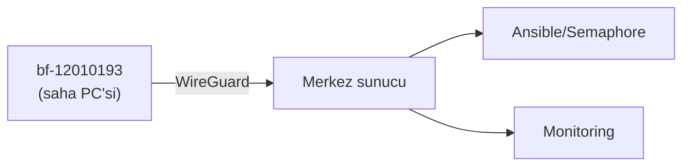

# <DOKÜMAN BAŞLIĞI>

> Kısa özet: bu doküman neyi kapsar, kimin içindir, hangi kararı verir. (2–3 cümle)

- Dosya: `docs/NN-KONU.md`
- İlgili kararlar: `24-DECISION-LOG.md#<başlık>`
- Durum: [ ] Taslak / [ ] İncelemede / [ ] Onaylı

---

## 1. Amaç

Bu dokümanın neden var olduğu, hangi sorunu çözdüğü.

## 2. Kapsam

Kapsam içi ve kapsam dışı maddeler:

- Kapsam içi: ...
- Kapsam dışı: ...

## 3. Kararlar

Her teknik karar için aşağıdaki karar bloğunu kullan:

```text
KARAR:    <alınan karar, tek cümle>
GEREKÇE:  <neden bu karar — teknik dayanak, 1–3 cümle>
ALTERNATİF: <değerlendirilen en güçlü alternatif + neden elendi>
RİSK:     <kararın getirdiği en büyük risk + azaltma notu>
MALİYET:  <Ücretsiz / Ücretli (işaretli) + not>
LİSANS:   <lisans adı + kaynak URL + sürüm + doğrulama tarihi>
```

Örnek:

```text
KARAR:    Filo yönetiminde Ansible + Semaphore UI Community kullanılır.
GEREKÇE:  Agent gerektirmez, SSH tabanlıdır, 700 cihaz ölçeğinde yeterlidir.
ALTERNATİF: SaltStack — daha karmaşık kurulum nedeniyle elendi.
RİSK:     Playbook hatası filoya yayılabilir; önce LAB(2) grubunda çalıştırılır.
MALİYET:  Ücretsiz (self-hosted).
LİSANS:   Semaphore Community (kaynak doğrulanacak) — URL + sürüm + tarih eklenecek.
```

## 4. Neden Bu Karar?

Kararların arkasındaki teknik ve operasyonel gerekçeler. Sadelik kuralı burada denetlenir: Kubernetes, microservice, gereksiz agent/DB/cloud öneriliyorsa neden reddedildiği yazılır.

## 5. Alternatifler

| Alternatif | Artı | Eksi | Sonuç |
|---|---|---|---|
| ... | ... | ... | Elendi / Yedek |

## 6. Avantajlar

- ...

## 7. Dezavantajlar

- ...

## 8. Riskler

| Risk | Olasılık | Etki | Azaltma |
|---|---|---|---|
| ... | Düşük/Orta/Yüksek | ... | ... |

## 9. Uygulama Planı

Numaralı adımlar; komutlar İngilizce orijinal adıyla, açıklamalar Türkçe:

1. ...
2. ...

```bash
# örnek komut bloğu
hostnamectl set-hostname bf-12010193
```

## 10. Test Planı

| Test | Beklenen sonuç | Ortam |
|---|---|---|
| ... | ... | LAB(2) |

## 11. Rollback

Başarısızlıkta önceki duruma dönüş adımları:

1. ...
2. ...

## 12. Kontrol Listesi

- [ ] ...
- [ ] ...

## 13. Açık Sorular

- [ ] ... (sahibi + tarih ile)

---

## Ek: Mermaid Örneği


